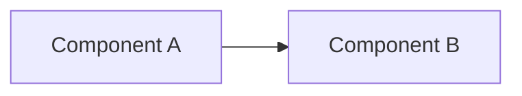

# Format Guardrail Contract & Documentation Templates

This document specifies the mandatory formatting guardrails, link conventions, diagram rules, and templates enforced when updating files in `docs/architectures/current-architectures/`.

---

## 1. Prompt Guardrail Rules

### Rule 1: Header Metadata Block
Every sub-module document MUST begin with this exact 4-key metadata block:

```markdown
# [Module Name] (Level 1 Architecture)

**Architecture level:** Level 1 — High-Level Component & Data Flow  
**Status:** Live / Implemented  
**Primary Owner:** `src/cowork_agent/path/to/module`  
**Target Alignment:** Fully Aligned with [TARGET-ARCHITECTURE.md §N](file:///e:/VIN-INTERNSHIP/EMAIL-AGENT-v1/docs/architectures/TARGET-ARCHITECTURE.md)
```

### Rule 2: Mermaid Diagrams
- Use `flowchart TB` or `flowchart LR`.
- Quote all node labels containing special characters, line breaks (`<br/>`), or parentheses.  
  *Correct:* `API["Chat API / SSE Stream<br/>(/v1/cowork/chat)"]`  
  *Incorrect:* `API[Chat API / SSE Stream]`
- Keep node count under 12 nodes per Level 1 diagram for minimum complexity.

### Rule 3: Clickable Links
- All file and directory references MUST use clickable markdown links with the `file:///` scheme.  
  *Correct:* `[workflow.py](file:///e:/VIN-INTERNSHIP/EMAIL-AGENT-v1/src/cowork_agent/features/email_action_plan/workflow.py)`  
  *Incorrect:* `workflow.py` or [`workflow.py`](path/to/workflow.py)

### Rule 4: GitHub Alert Callouts
Use standard alert blocks for historical notices, warnings, or architectural constraints:
- `> [!NOTE]` for helpful context or storage fallback notes.
- `> [!WARNING]` for superseded / historical documentation notices.
- `> [!IMPORTANT]` for security or architectural boundary constraints.

### Rule 5: Architecture Decoupling Rule
- Never describe Email Action Plan as an in-chat `@Email` tool.
- Adhere strictly to ADR-004: Email Agent is a standalone PRD-v1 product flow.

---

## 2. Standardized Table Schemas

### Sub-Module Component Table
```markdown
| Component | Path / Implementation | Level 1 Responsibility |
|---|---|---|
| **Component Name** | `src/cowork_agent/path/file.py` | Brief description of Level 1 responsibility. |
```

### Dashboard Module Status Matrix (`README.md`)
```markdown
| Module / Component | Implemented Scope | Status | Target Architecture Alignment | Authoritative Code Location |
|---|---|---|---|---|
| **Module Name** | Brief scope description | **Live / Implemented** | Fully Aligned | [folder](file:///e:/VIN-INTERNSHIP/EMAIL-AGENT-v1/src/cowork_agent/path) |
```

### Dashboard Architecture Diff Matrix (`README.md`)
```markdown
| System Aspect | Target Specification ([TARGET-ARCHITECTURE.md](file:///e:/VIN-INTERNSHIP/EMAIL-AGENT-v1/docs/architectures/TARGET-ARCHITECTURE.md)) | Current Live Implementation | Diff / Variance Status |
|---|---|---|---|
| **Aspect Name** | Target capability | Actual live implementation | **0 Diff — 100% Aligned** |
```

---

## 3. Sub-Module Document Template

```markdown
# [Module Name] (Level 1 Architecture)

**Architecture level:** Level 1 — High-Level Component & Data Flow  
**Status:** Live / Implemented  
**Primary Owner:** `src/cowork_agent/features/module_name`  
**Target Alignment:** Fully Aligned with [TARGET-ARCHITECTURE.md](file:///e:/VIN-INTERNSHIP/EMAIL-AGENT-v1/docs/architectures/TARGET-ARCHITECTURE.md)

---

## 1. Subsystem Overview

[Brief 2-3 sentence overview]



---

## 2. Key Components & Responsibilities

| Component | Path / Implementation | Level 1 Responsibility |
|---|---|---|
| **[Name]** | `src/cowork_agent/...` | [Responsibility] |

---

## 3. Storage & Memory Boundaries

1. **[Boundary 1]:** [Description]
2. **[Boundary 2]:** [Description]

---

## 4. Alignment & Diff vs Target Architecture

- **Alignment:** [Target alignment details]
- **Architecture Diff:** [0 Diff or detailed drift description]
```
