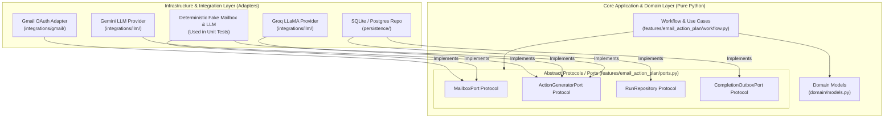

# Phase 3: Hexagonal Architecture (Ports & Adapters)

## Overview & Architecture Diagram

## Key Architectural Takeaways

1. **Dependency Inversion Principle (DIP)**:
   High-level workflow logic ([workflow.py](file:///e:/VIN-INTERNSHIP/EMAIL-AGENT-v1/src/cowork_agent/features/email_action_plan/workflow.py)) depends only on abstract interfaces ([ports.py](file:///e:/VIN-INTERNSHIP/EMAIL-AGENT-v1/src/cowork_agent/features/email_action_plan/ports.py)), never on concrete external SDKs (like Google API client or Groq SDK).

2. **Ports using Python Protocols**:
   In Python, `typing.Protocol` is used to define compile-time and runtime duck-typing contracts for ports (e.g. `MailboxPort`, `RunRepository`).

3. **Seamless Provider Swapping & Testability**:
   Because LLMs and Mailboxes are hidden behind Ports, unit tests run against `FakeMailbox` and `FakeLLM` without calling external APIs or burning token credits.
