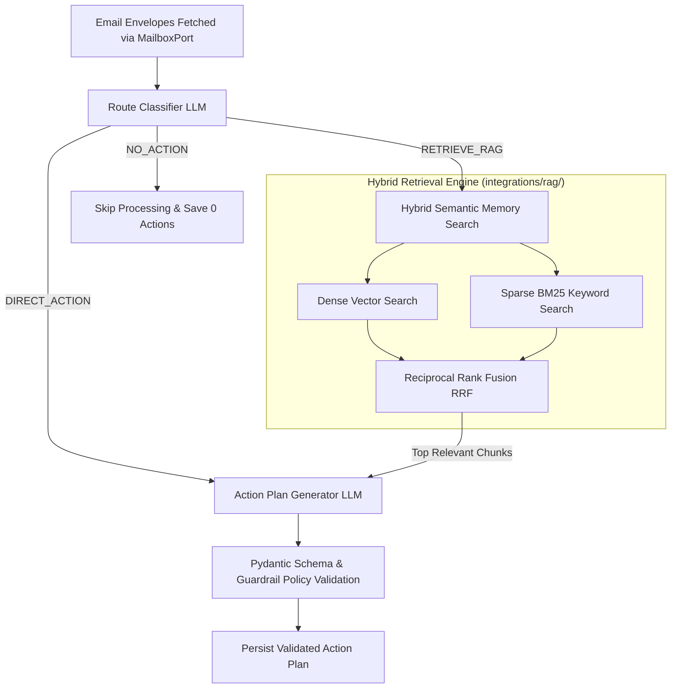

# Phase 4: AI & RAG Pipeline Engineering

## AI Processing Pipeline Diagram

## Key Architectural Principles

1. **Routing Strategy**: Not every email needs full RAG context. The `RouteClassifier` decides if an email contains explicit actions, needs company context (RAG), or requires no action. This saves token cost and latency!
2. **Hybrid Semantic Memory**: Combines dense vector semantics with sparse BM25 keyword matching fused via Reciprocal Rank Fusion (RRF).
3. **Guardrails & Schema Validation**: Raw LLM output is never trusted directly. It is parsed through Pydantic schemas and business policies before database insertion.
