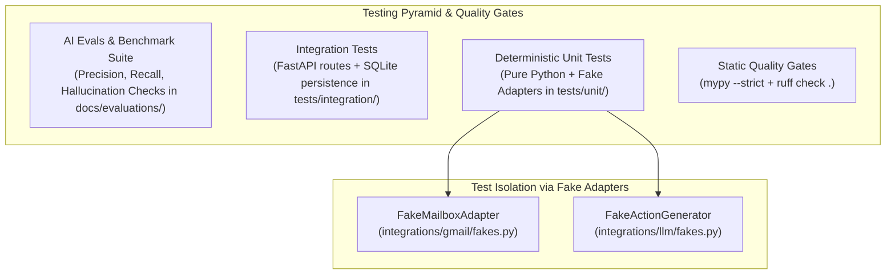

# Phase 5: Testing Strategy, Fake Adapters & AI Evals

## Testing Pyramid for AI Systems Diagram

## Key Architectural Takeaways

1. **Why Fake Adapters over Mocking (`unittest.mock`)**:
   Instead of mocking internal function calls, we build real, lightweight in-memory implementations (`FakeMailboxAdapter`, `FakeActionGenerator`) that implement the exact `Protocol` ports. This makes unit tests fast (<100ms), 100% deterministic, and free of external API fees.

2. **Static Quality Gates**:
   Strict type hinting (`mypy`) prevents `NoneType` attribute errors or missing arguments at compile time before running code.

3. **AI Evals vs Unit Tests**:
   Unit tests check if code executes correctly. **AI Evals** check if the LLM's output quality, faithfulness, and citation accuracy meet quality benchmarks.
