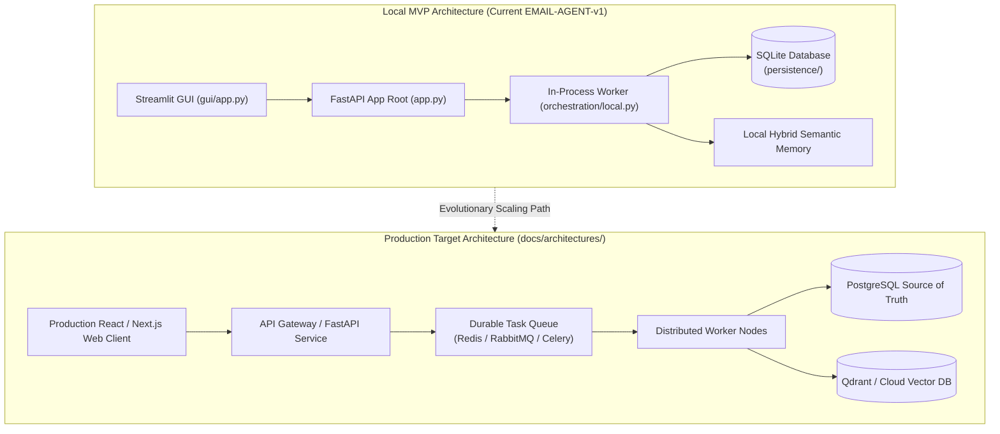

# Phase 6: Deployment, APIs & System Evolution

## Modular Monolith to Scaled Architecture Diagram

## Key Architectural Principles

1. **Start as a Modular Monolith**: Begin with a clean, single-process app (FastAPI + SQLite + In-Process Worker). Don't over-engineer microservices on Day 1!
2. **Clean Boundaries Enable Easy Scaling**: Because Phase 3 used Ports & Adapters, migrating from SQLite to PostgreSQL or from In-Process Worker to Celery/Redis requires swapping adapters in `persistence/` without rewriting core domain workflows.
3. **Observability & Outbox Pattern**: Production AI jobs track status (`QUEUED`, `RUNNING`, `SUCCEEDED`, `FAILED`) and publish events via a Transactional Outbox to handle failures gracefully.
