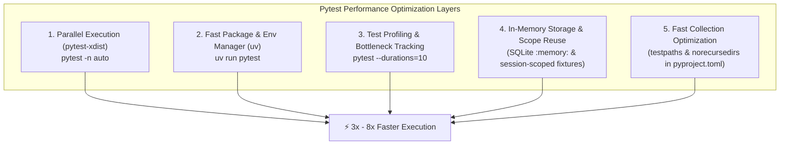

# Pytest Performance Optimization Strategy

## Test Suite Acceleration Architecture

## Key Optimization Tools Summary

| Tool / Strategy | Type | Speed Impact | Purpose |
| :--- | :--- | :---: | :--- |
| **`pytest-xdist`** | Pytest Plugin | 🚀 **High (3x - 8x)** | Spreads test execution across all available CPU cores (`pytest -n auto`). |
| **`uv` (`uv run pytest`)** | Package Manager | ⚡ **Medium** | Rust-based venv & package runner; eliminates Python startup overhead. |
| **`pytest --durations=10`** | CLI Flag | 🔍 **Diagnostic** | Instantly surfaces the top 10 slowest tests in your codebase. |
| **SQLite `:memory:` DB** | Architecture | ⚡ **High** | Runs DB integration tests entirely in RAM instead of reading/writing to disk. |
| **`pyproject.toml` configuration** | Configuration | ⚡ **Medium** | Restricts `testpaths = ["tests"]` to skip scanning non-test directories. |
