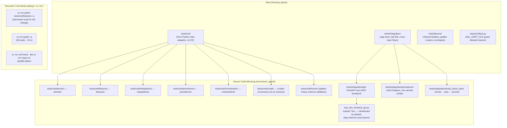

# Test Suite Structure & Execution Workflow

> **The authoritative route index is [`tests/README.md`](../../tests/README.md).**
> This page is the picture only. It deliberately carries no route timings, no
> invariant list, and no command defaults — those live in one place so they
> cannot drift apart.

## Testing Architecture & Directory Mapping Diagram

## Key Test Workflow & Folder Concepts

1. **Mirroring structure**: `tests/unit/` mirrors `src/cowork_agent/` 1-to-1, so
   the test file for any module is findable by path. `tests/README.md` §1 turns
   that mapping into named routes with measured costs.
2. **One invariant, one owner**: before writing a test, look up its invariant in
   `tests/README.md` §3. A second assertion of the same fact at another layer is
   a deletion candidate, not coverage.
3. **Verification rule** (see `AGENTS.md`):
   - Run the narrowest route while editing; widen only when it is green.
   - Run `ruff check` and `mypy` whenever `src/` changes.
   - Run the full suite before committing, or immediately when a shared contract
     (ports, schemas, migrations) changes.
4. **Never `python -m pytest`** — it picks up the Anaconda interpreter on this
   machine and fails with unrelated `ssl` errors.
