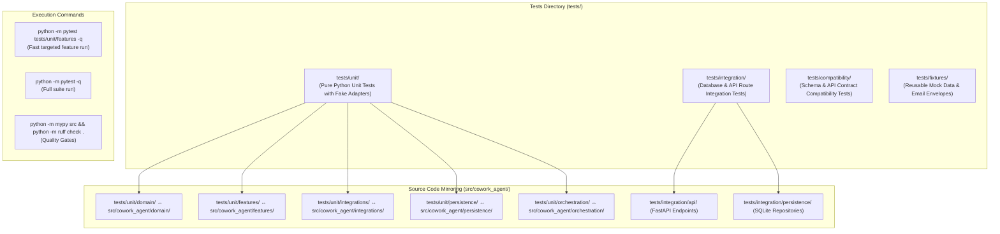

# Test Suite Structure & Execution Workflow

## Testing Architecture & Directory Mapping Diagram

## Key Test Workflow & Folder Concepts

1. **Mirroring Structure**: The unit test directory (`tests/unit/`) mirrors `src/cowork_agent/` 1-to-1, making it effortless to locate the test file for any target module.
2. **Verification Rule (from AGENTS.md)**:
   - Run small targeted pytest scope during active edits (e.g. `python -m pytest tests/unit/features -q`).
   - Run `ruff check` and `mypy` whenever `src/` changes.
   - Run full test suite (`python -m pytest -q`) before committing or when changing shared contracts (ports/schemas/migrations).
