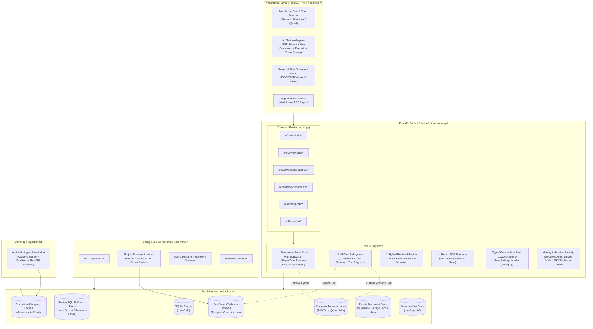

# Cowork Agent (Email-to-Action-Plan & Grounded AI Assistant)

FastAPI service that turns unread Gmail and Outlook mail into structured, body-free action plans,
and sustains grounded multi-turn AI Chat over a 4-tier typed memory gateway and enterprise knowledge.

---

## 1. Core Architecture & System Overview

The system is architected around **two strictly decoupled product flows** operating over a unified
typed control plane, background orchestration engine, and dual/triple persistence backends
([`docs/architectures/c1-system-context.md`](docs/architectures/c1-system-context.md),
[`docs/architectures/c2-containers.md`](docs/architectures/c2-containers.md)):



### 1.1 Multi-Turn AI Chat Assistant & 4-Tier Memory Subsystem

Governed by the **Chat Controller** (`ChatController.stream_message`, [ADR-014](tasks/adr/ADR-014-turn-pipeline-stays-one-function.md))
and the **Memory Gateway** across 4 isolated memory tiers ([`docs/architectures/c3-api-ai-chat.md`](docs/architectures/c3-api-ai-chat.md)):

```text
User Message (React 19 SPA)
└── Chat Controller (Session Management, Live Reasoning & SSE Streaming)
    └── Memory Gateway (workspace_id / user_id / session_id / feature: ai_chat)
        ├── 1. Short-Term Working Memory (In-process session buffer - Ephemeral TTL)
        ├── 2. Long-Term Declarative Memory (User Persona, Timezone, Tone Preferences)
        ├── 3. Episodic Memory (Validated Task Episodes with supersedes & Chat Summaries)
        └── 4. Semantic Memory (Two strictly unmerged knowledge planes):
            ├── Plane A: Enterprise Knowledge Corpus (Committed data/extracted/*.md, flag-gated)
            └── Plane B: User Project Documents (Classifier-gated user uploads, per-project .tvim)
                └── LLM Invocation -> SSE Stream (Deltas, Reasoning, Memory Citations, Activities)
```

- **Short-Term Working Memory**: In-process bounded session buffer (`InMemoryChatSessionBuffer`). Never persisted to durable storage.
- **Long-Term Declarative Memory**: Explicit user persona, formatting, and tone preferences stored in `chat_profiles` (written only with explicit user configuration provenance).
- **Episodic Memory**: Validated task episodes & summaries. Chat-proposed tasks start with `retrieval_eligible=false` until explicitly approved on the UI ([ADR-004](tasks/adr/ADR-004-chat-native-task-episodes.md)) and support `supersedes` version linking.
- **Semantic Memory (Two Unmerged Planes)**:
  - *Company Knowledge Plane*: Grounded enterprise search via Turbovec hybrid retrieval (Dense + BM25 + RRF), flag-gated in chat by `CHAT_COMPANY_RAG_ENABLED`.
  - *User Project Documents Plane*: Isolated project-scoped retrieval over uploaded PDFs/DOCXs ([ADR-007](tasks/adr/ADR-007-project-scoped-classifier-gated-user-documents.md), [ADR-008](tasks/adr/ADR-008-turbovec-project-document-plane.md)). Never falls back to the company index.
- **Chat Tool Registry**: One typed `specs()` / `run()` boundary. Server-routed (`TOOL` / `RAG_TOOL`), never client-chosen. Integrates Google Calendar under a separate per-user OAuth grant ([ADR-019](tasks/adr/ADR-019-executable-chat-tools-run-under-a-per-user-grant.md), [ADR-020](tasks/adr/ADR-020-google-grants-stay-separate.md)).
- **Mail-Scan Turn Reconciliation**: Accepts aggregate `MailScanSummary` cards submitted from the frontend mail scan protocol and reconciles them into turn history without touching mail APIs ([`docs/architectures/c3-api-ai-chat.md`](docs/architectures/c3-api-ai-chat.md)).

---

### 1.2 Standalone Email Action Plan Subsystem (Single-Turn, Stateless)

Runs single-turn, memory-free execution strictly isolated from chat context for privacy
([`docs/architectures/c3-api-email-action-plan.md`](docs/architectures/c3-api-email-action-plan.md)):

```text
Trigger (Frontend Mail Scan Protocol / API Request: @email, @outlook, @mail)
└── Provider Mailbox Fetch (Gmail `gmail.readonly` / Outlook `Mail.Read`) -> Ephemeral Envelope
    └── Reply-Chain Context Aggregation (Up to 5 messages, ADR-011)
        └── Intent & Actionability Classification
            └── Route Resolver: [NO_ACTION | DIRECT_PLAN | RETRIEVE_RAG]
                ├── (If RETRIEVE_RAG) Hybrid Search (Dense + BM25 + RRF) + Evidence Gate
                └── Action Plan Generation & Body-Leak Validation
                    └── Persist Structured Task DTO & Immediately Purge Raw Email Body
```

- **Strict Privacy Invariant**: Raw email bodies and attachments are transient ephemeral memory only (`EphemeralEmailEnvelope`), purged immediately upon plan generation. Never stored in long-term databases or indexed into vector stores ([ADR-003](tasks/adr/ADR-003-defer-attachment-processing.md)).
- **No Chat `@Email` Tool**: Email RAG and Chat remain strictly decoupled. There is no executable email tool in chat ([ADR-004](tasks/adr/ADR-004-chat-native-task-episodes.md)).
- **Security Screening**: Attachment presence is recorded; links and attachments pass security inspection (ClamAV / VirusTotal / Google Web Risk).

---

### 1.3 Out-of-Process Background Worker (`mail-todo-worker`)

Runs asynchronous tasks outside the request path ([`docs/architectures/c3-worker.md`](docs/architectures/c3-worker.md)):
- **Mail Digest Poller**: Claims queued mail digest runs via database leases and executes the email action plan workflow.
- **Project Document Worker**: Performs text extraction, adaptive OCR escalation (Mistral OCR for image-only pages), page-aware chunking (`page_start`/`page_end`), and per-project Turbovec index compilation. Publishes a liveness heartbeat checked by `/v1/cowork/chat/document-health`.
- **Run & Document Recovery**: Automatically re-queues runs and documents left in-flight by crashed worker processes.
- **Retention Sweeper**: Automatically purges expired documents, chunks, and index entries past the retention window.

---

### 1.4 Report Artifacts & PDF Export Subsystem

- **Report Artifact Store**: Shared `data/reports/` storage accessible only via the validated `ReportFilename` domain value rule ([ADR-016](tasks/adr/ADR-016-report-artifacts-are-validated-domain-values.md)).
- **PDF Renderer**: Standalone `fpdf2` rendering pipeline with 4 bundled Noto Sans styles, providing full Vietnamese Unicode support without external runtime font lookups or OS dependencies ([ADR-018](tasks/adr/ADR-018-report-pdfs-use-fpdf2-and-bundled-noto-sans.md)).

---

## 2. Knowledge Ingestion CLI (`mail-todo-ingest-knowledge`)

Converts approved company documents from `data/raw/` into committed Markdown in `data/extracted/`
([`docs/architectures/c3-ingestion-cli.md`](docs/architectures/c3-ingestion-cli.md)).

```powershell
# Prerequisites: Rust toolchain for native PDF inspector (optional)
cargo install pdf-inspector

# Dry-run inspection (validates sources without modifying output)
uv run mail-todo-ingest-knowledge --source data/raw --output data/extracted --dry-run

# Convert changed files (skips unchanged via SHA-256 manifest hash)
uv run mail-todo-ingest-knowledge --source data/raw --output data/extracted

# Force re-extraction of all files
uv run mail-todo-ingest-knowledge --source data/raw --output data/extracted --force
```

- **Supported Source Formats**: `.pdf`, `.docx`, `.txt`, `.md`.
- **Adaptive Extraction**: Local OpenXML AST and native PDF text extraction, escalating to Mistral OCR (`mistral-ocr-latest`) for scanned pages.
- **Output Contract**: NFC-sanitized Markdown with closed 6-field YAML frontmatter and `ingestion-manifest.json`.

---

## 3. Project Structure

```text
src/cowork_agent/
├── app.py                      # FastAPI composition root & /health entry point (mail-todo-api)
├── composition.py              # Single typed composition root assembling CoworkRuntime (ADR-013)
├── config.py                   # Pure settings loader & runtime environment loader (ADR-017)
├── identity.py                 # VerifiedPrincipal, session cookies & Fernet token cipher
├── ingestion_cli.py            # Knowledge ingestion CLI entry point (mail-todo-ingest-knowledge)
├── observability.py            # Langfuse SDK @observe metadata-only tracing (ADR-013)
├── prompting.py                # Shared block delimiters preventing prompt injections
├── api/                        # Transport-isolated routers (create_*_router, ADR-015)
│   ├── calendars.py            # /v1/calendar/* Google Calendar OAuth & connections
│   ├── chat.py                 # /v1/cowork/chat/* SSE turns, sessions, mail-scans, profiles
│   ├── dependencies.py         # Principal resolution & runtime accessor dependencies
│   ├── digest_runs.py          # /v1/mail-todo/* digest run lifecycle & unread preview
│   ├── evaluation_jobs.py      # /v1/evaluation-jobs/* batch evaluation queue
│   ├── knowledge.py            # /api/v1/raw-documents/* editable raw document surface
│   ├── mailboxes.py            # /v1/mail-todo/oauth/* Gmail & Outlook connections
│   ├── projects.py             # /v1/cowork/chat/projects/* project & document management
│   └── reports.py              # /api/v1/reports/* report artifact CRUD & PDF export
├── domain/                     # Pure domain models (frozen dataclasses, zero framework imports)
│   ├── chat_contracts.py       # Chat turns, sessions, proposals, citations, memory scopes
│   ├── models.py               # Email tasks, action plans, envelopes, digest runs
│   ├── project_documents.py    # Project documents, chunks, and extraction status
│   └── report_artifacts.py     # ReportFilename domain validation & report models (ADR-016)
├── features/                   # Core business logic & workflows
│   ├── ai_chat/                # Controller, Memory Gateway, Intent Router, Tool Registry
│   ├── batch_evaluation/       # Evaluation runners, credential leases, and plugins
│   ├── email_action_plan/      # Email digest workflow, route policies, schemas, validator
│   └── user_documents/         # Ingestion state machine and extraction pipelines
├── integrations/               # External adapters & service implementations
│   ├── gmail/                  # Google OAuth & Gmail API adapters (gmail.readonly)
│   ├── google_calendar/        # Google Calendar tool adapter & OAuth connection store (ADR-019)
│   ├── knowledge_ingestion/    # DOCX extractor, PDF inspector, Mistral OCR, text sanitizer
│   ├── llm/                    # Provider factory (Gemini, OpenRouter, Mimo, Mistral)
│   ├── mailbox/                # Provider-routing mailbox adapter
│   ├── outlook/                # Microsoft Graph OAuth & Mail.Read adapter (SQLite mode)
│   ├── rag/                    # Hybrid Turbovec, BM25, RRF fusion, Jina embeddings & reranker
│   ├── report_pdf/             # fpdf2 PDF export renderer with bundled Noto Sans (ADR-018)
│   ├── security/               # Magic-byte scanner, ClamAV, VirusTotal, Google Web Risk
│   └── storage/                # Supabase Storage & local private file storage
├── orchestration/              # Out-of-process workers & dispatchers
│   ├── dev.py                  # Concurrent API + Worker dev server (mail-todo-dev)
│   ├── project_document_worker.py # Document worker with liveness heartbeat
│   ├── recovery.py             # Run & document crash recovery sweeper
│   └── worker.py               # Background digest poller entry point (mail-todo-worker)
└── persistence/                # Storage repositories & SQL migrations (001–017)
    ├── migrations/             # Idempotent SQL migrations (001_mail_todo ... 017_calendar)
    └── repositories/           # PostgreSQL & SQLite repository implementations

frontend/                       # React 19 + Vite + Tailwind 4 web application
tests/                          # Offline-by-construction unit & integration test suite
evaluations/                    # 5 Offline evaluation suites (Retrieval, RAGAS, Memories, Email, Chat)
docs/architectures/             # C4 Architecture Model (workspace.dsl, c1, c2, c3, deployment)
tasks/                          # PRDs (tasks/prds/), Specs (tasks/specs/), ADRs (tasks/adr/)
```

---

## 4. Getting Started

### 4.1 Installation & Environment Setup

Always use `uv` for Python environment management:

```powershell
# Install dependencies into virtual environment
uv sync --extra dev --extra postgres

# Copy configuration templates
Copy-Item .env.example .env
Copy-Item config.example config
```

### 4.2 Key Environment Variables (`.env`)

```env
# Persistence Mode: "off" (SQLite under .data/), "local" (Docker Postgres), "cloud" (Supabase)
POSTGRES_MODE=off

# Semantic Memory Store (Email RAG and Chat Type 4)
RAG_STORE_PROVIDER=turbovec

# Feature Flags
USER_DOCUMENTS_ENABLED="true"
CHAT_COMPANY_RAG_ENABLED="false"
GOOGLE_CALENDAR_ENABLED="false"
CHAT_TOOL_AXIS_ENABLED="false"

# LLM Providers (Key Rotation & Fallback)
GEMINI_API_KEY_1="your_key_1"
GEMINI_API_KEY_2="your_key_2"
OPENROUTER_API_KEY="your_openrouter_key"

# Embeddings & Reranking (Jina AI & Cohere)
JINA_API_KEY="your_jina_api_key"
COHERE_API_KEY="your_cohere_api_key"

# OCR Provider (Adaptive Document Extraction)
MISTRAL_API_KEY="your_mistral_api_key"

# Observability & Tracing (Langfuse)
LANGFUSE_PUBLIC_KEY="your_langfuse_public_key"
LANGFUSE_SECRET_KEY="your_langfuse_secret_key"
LANGFUSE_HOST="https://cloud.langfuse.com"

# Gmail OAuth Credentials & Token Encryption
GMAIL_CLIENT_ID="your_gmail_client_id"
GMAIL_CLIENT_SECRET="your_gmail_client_secret"
TOKEN_ENCRYPTION_KEY="your_fernet_key"
OAUTH_STATE_SECRET="your_oauth_state_secret"

# Microsoft Delegated OAuth (POSTGRES_MODE=off only)
MICROSOFT_CLIENT_ID="your_microsoft_client_id"
MICROSOFT_CLIENT_SECRET="your_microsoft_client_secret"
MICROSOFT_TENANT="common"
MICROSOFT_REDIRECT_URI="http://localhost:8000/v1/mail-todo/oauth/outlook/callback"
```

### 4.3 Running Services

```powershell
# Option A: Start both API and Background Worker concurrently (Recommended Dev Mode)
uv run mail-todo-dev

# Option B: Run services separately:
uv run mail-todo-api        # FastAPI Control Plane Server (http://127.0.0.1:8000)
uv run mail-todo-worker     # Document & Digest Queue Worker

# Start Frontend Application (http://localhost:5173)
cd frontend
pnpm install
pnpm dev
```

---

## 5. Quality Assurance & Verification

The repository enforces strict, offline-by-construction verification:

```powershell
# 1. Backend CI Quality Gate
uv run ruff check . ; uv run mypy src ; uv run pytest -q

# 2. Frontend CI Quality Gate
cd frontend
pnpm lint
pnpm check-types
pnpm test
pnpm build

# 3. Playwright End-to-End Test Suite
pnpm run test:e2e

# 4. Architecture Model Consistency Check
uv run python docs/architectures/check_docs.py
```

---

## 6. Authoritative References & Documentation

- **C4 Architecture Model & Specifications:**
  - [Architecture Harness & Index](docs/architectures/README.md)
  - [Level 1: System Context](docs/architectures/c1-system-context.md)
  - [Level 2: Containers & Dynamic Product Flows](docs/architectures/c2-containers.md)
  - [Level 2: Deployment Topologies](docs/architectures/deployment.md)
  - [Level 3: Email Action Plan Subsystem](docs/architectures/c3-api-email-action-plan.md)
  - [Level 3: AI Chat & Typed Memory](docs/architectures/c3-api-ai-chat.md)
  - [Level 3: Hybrid Retrieval Engine](docs/architectures/c3-api-retrieval.md)
  - [Level 3: Platform, Composition & Persistence](docs/architectures/c3-api-platform.md)
  - [Level 3: Background Worker](docs/architectures/c3-worker.md)
  - [Level 3: Knowledge Ingestion CLI](docs/architectures/c3-ingestion-cli.md)
  - [C4 Model Definition (`workspace.dsl`)](docs/architectures/workspace.dsl)
- **Engineering Lifecycle & Standards:**
  - [Software Development Life Cycle Guide](docs/guides/SOFTWARE-DEVELOPMENT-CYCLE.md)
  - [Test Routing Index & Invariant Ownership](tests/README.md)
  - [Agent Experience Registry](docs/references/agent-experience-registry.md)
  - [Tool Registry Architecture Guide](docs/guides/tool-registry-from-first-principles.md)
- **Evaluation Framework:**
  - [Evaluation Harness Guide](evaluations/HARNESS-GUIDE.md) & [Overview](evaluations/README.md)
  - [RAGAS & Grounding Spec](docs/evaluations/RAGAS.md)
  - [Email RAG Retrieval Status](evaluations/RETRIEVAL/EMAIL-RAG-STATUS.md)
- **Product Requirements & Architecture Decision Records:**
  - PRDs: [`tasks/prds/PRD-v1-Core-Email-and-RAG.md`](tasks/prds/PRD-v1-Core-Email-and-RAG.md) · [`tasks/prds/PRD-v2-Memory-Extension.md`](tasks/prds/PRD-v2-Memory-Extension.md) · [`tasks/prds/PRD-v3-chat-with-user-documents.md`](tasks/prds/PRD-v3-chat-with-user-documents.md)
  - ADRs: [`tasks/adr/`](tasks/adr/) (ADR-001 through ADR-020)
