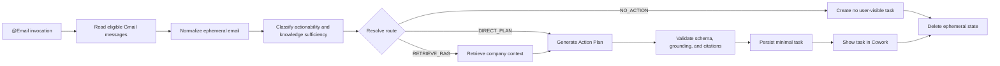

# Product Requirements Document

## Cowork Agent — Core Email to Action Plan with Conditional RAG

| Field | Value |
|---|---|
| Product | Cowork Agent — Email to Action Plan |
| Document status | MVP Core Scope |
| Version | 1.0 |
| Date | 2026-08-07 |
| Primary entry path | Manual `@Email` invocation |
| Agent pattern | Deterministic single-agent workflow with conditional retrieval |
| Memory included | Short-term ephemeral context and semantic company knowledge through RAG |
| Memory deferred | Long-term declarative and episodic memory |
| Reflexion | Out of scope |
| Scheduling | Out of scope |

---

## 1. Executive Summary

Cowork Agent converts selected Gmail messages into structured Action Items and Action Plans.

For each email, the system determines:

1. whether the message requires or suggests user action; and
2. whether the message contains enough information to produce a trustworthy Action Plan.

When an email is self-contained, the system generates the Action Plan directly. When company-specific knowledge is required, the system performs one retrieval from the company RAG system and generates a cited Action Plan from the email plus retrieved context.

The MVP is manually invoked through `@Email`. Scheduling and recurring automatic processing are explicitly outside this version.

The core execution shape is:

```text
Manual @Email invocation
→ read selected Gmail messages
→ classify actionability and knowledge sufficiency
→ resolve NO_ACTION, DIRECT_PLAN, or RETRIEVE_RAG
→ perform zero or one RAG retrieval
→ generate one Action Plan
→ validate and persist minimal task output
→ delete ephemeral email context
```

The raw email body is temporary run context. It must not be silently persisted into task storage, long-term memory, episodic memory, or the semantic RAG corpus.

---

## 2. Product Hypothesis

> A Cowork Agent can use a one-time Gmail read plus company knowledge retrieval to create a useful Action Plan without requiring the email itself to become durable memory or semantic company knowledge.

The product transformation is:

```text
Ephemeral Gmail message
        +
Optional company knowledge
        ↓
Actionability and knowledge-sufficiency routing
        ↓
Direct or RAG-supported Action Plan
        ↓
Minimal persisted task artifact
```

---

## 3. Problem Statement

Knowledge workers receive emails ranging from informational notices to requests that require concrete action.

A simple extraction workflow often fails in three ways:

- it creates tasks from messages that do not require action;
- it retrieves company documents for messages that are already self-contained; or
- it invents company-specific procedures when an email references internal policies, forms, templates, terminology, or processes.

The MVP must create useful Action Plans while preserving a deterministic, one-shot workflow and a strict privacy boundary around raw email content.

---

## 4. MVP Goal

The MVP must prove this end-to-end user experience:

> A user manually invokes `@Email`, Cowork reads eligible Gmail messages, ignores non-actionable messages, creates direct plans for self-contained requests, retrieves company knowledge only when needed, and shows trustworthy tasks with Gmail pointers, citations, or missing-context warnings.

---

## 5. Goals

1. Support manual `@Email` invocation.
2. Read selected Gmail messages through a read-only integration.
3. Classify each message for actionability and knowledge sufficiency.
4. Resolve every processed message to:
   - `NO_ACTION`
   - `DIRECT_PLAN`
   - `RETRIEVE_RAG`
5. Retrieve company knowledge only when a likely company-knowledge gap exists.
6. Generate one structured Action Plan after route resolution and optional retrieval.
7. Attach valid citations to company-grounded steps.
8. Show missing information rather than inventing unsupported company procedures.
9. Persist a minimal task artifact and Gmail pointer without the raw email body.
10. Delete raw email and temporary retrieval context after processing.
11. Provide basic route, retrieval, validation, latency, and error telemetry.
12. Preserve tenant and user isolation for all Gmail, RAG, and task operations.

---

## 6. Non-Goals

The following are outside PRD-v1:

- scheduled or recurring email processing;
- background daily runs;
- long-term declarative user memory;
- episodic task memory;
- similar-task retrieval;
- approval, rejection, or completion transitions;
- Memory Gateway or unified four-memory platform;
- Reflexion or self-critique loops;
- multi-agent orchestration;
- autonomous ReAct-style tool loops;
- automatic email replies;
- sending, deleting, moving, or modifying Gmail messages;
- external task execution;
- attachment processing;
- automatic extraction of user preferences from emails;
- automatic ingestion of emails into the RAG corpus;
- RAG-owned final Action Plan generation;
- corpus-management administration UI;
- high-impact writes such as purchasing, scheduling, deleting, or changing company systems.

---

## 7. Target Users

### Primary user

A knowledge worker who wants Cowork to convert selected unread inbox messages into concise, grounded Action Plans.

### Supporting stakeholders

- company or workspace administrators responsible for company knowledge sources;
- engineering teams responsible for Gmail, Agent Core, RAG, persistence, and telemetry;
- product and operations teams evaluating routing and output quality.

---

## 8. Core User Stories

### US-01 — Manual processing

As a user, I want to invoke `@Email` so that Cowork processes eligible Gmail messages when I request it.

### US-02 — Ignore non-actionable messages

As a user, I want informational, irrelevant, and automated messages to produce no task so that my Cowork view is not filled with noise.

### US-03 — Direct Action Plan

As a user, I want a self-contained actionable email to produce a clear Action Item and Action Plan without unnecessary document retrieval.

### US-04 — Company-grounded Action Plan

As a user, I want requests that depend on company policy, procedures, templates, governance, or internal terminology to produce an Action Plan grounded in company documents.

### US-05 — Transparent missing context

As a user, I want missing information to be shown when the email or RAG system cannot provide enough context, rather than receiving invented steps.

### US-06 — Traceable source

As a user, I want each task to include a Gmail pointer and supporting company citations when retrieval was used.

### US-07 — Privacy-preserving processing

As a user, I want the raw email body to be used only for the current run and not silently stored as memory or company knowledge.

---

## 9. End-to-End User Experience



### 9.1 `NO_ACTION`

Use when the message is informational, irrelevant, automated, or otherwise does not require or suggest user action.

Expected behavior:

- no user-visible task is created;
- minimal run metadata may be recorded;
- temporary email content is deleted.

### 9.2 `DIRECT_PLAN`

Use when the message is actionable and contains enough information to produce the plan.

Expected behavior:

- no RAG retrieval occurs;
- the generator is called once;
- the task is validated and persisted.

### 9.3 `RETRIEVE_RAG`

Use when:

```text
the message is actionable
AND the email is insufficient
AND the missing knowledge is likely available in company documents
```

Expected behavior:

- one logical RAG retrieval is performed;
- one bounded technical retry may occur;
- RAG returns chunks, citations, provenance, and scores;
- Agent Core generates the final plan once;
- company-grounded steps reference current-retrieval citations.

---

## 10. Product Principles

1. Agent Core owns orchestration and final Action Plan generation.
2. Gmail fetches and normalizes email; it does not generate or persist tasks.
3. RAG retrieves company knowledge; it does not own final task generation.
4. The route is resolved before final generation.
5. Retrieval occurs only when needed.
6. Raw email and derived task output are different data classes.
7. Company-specific procedures must never be invented.
8. Classifier, retrieval, generation, and task contracts must be machine-validatable.
9. Retries are infrastructure behavior, not reasoning loops.
10. Optional RAG context must fail safely.
11. Every request is tenant- and user-scoped.

---

## 11. Functional Requirements

### FR-01 — Manual run creation

The system shall support manual invocation through `@Email`.

The invocation shall create a run containing at least:

```yaml
run_id: string
tenant_id: string
user_id: string
```

No scheduler, recurrence configuration, or automatic run trigger is included.

### FR-02 — Execution and idempotency

The system shall execute each run through an Agent Worker or Run Coordinator.

The execution path may use the existing application runtime for the MVP, provided:

- duplicate requests do not create duplicate tasks;
- only one logical execution processes a run;
- failures produce a visible run status;
- raw email content is not placed in dead-letter or retry payloads.

A production-grade distributed queue and DLQ may be implemented as engineering hardening but are not required to prove the initial product experience.

### FR-03 — Gmail access

The Email Module shall:

- use read-only Gmail access;
- manage OAuth credentials and refresh;
- process the guarded MVP scope `is:unread in:inbox`;
- allow a caller query to narrow but not broaden that scope;
- page and batch message reads;
- normalize body, sender, recipients, subject, date, labels, message ID, thread ID, and Gmail URL;
- report complete or partial fetch status.

The Email Module shall not own:

- Action Plan generation;
- task persistence;
- memory persistence;
- RAG ingestion.

### FR-04 — Ephemeral email contract

For each processed message, the system shall create an ephemeral envelope:

```yaml
run_id: string
tenant_id: string
user_id: string

gmail_message_id: string
gmail_thread_id: string
gmail_url: string

sender:
  name: string
  email: string

recipients:
  - string

subject: string
received_at: datetime
labels:
  - string

normalized_body: string
body_format: text | html_converted

attachments_present: boolean
attachments_processed: false

fetch_status: complete | partial
```

The normalized body must remain temporary run context.

### FR-05 — Actionability and sufficiency classifier

The system shall perform one structured classifier decision per selected email.

The classifier shall return:

```yaml
actionability:
  enum:
    - action_required
    - action_suggested
    - informational
    - unclear
    - irrelevant

candidate_action_item: string | null
email_is_sufficient: boolean

knowledge_gaps:
  - string

retrieval_query: string | null

reason_codes:
  - no_action
  - email_self_contained
  - company_procedure_required
  - governance_required
  - policy_required
  - template_required
  - internal_term_unresolved
  - domain_knowledge_required

confidence: number
```

The classifier may identify evidence and possible gaps, but it does not own the final route or Action Plan.

### FR-06 — Deterministic route resolver

Agent Core shall resolve the final route using deterministic rules and classifier output.

```text
if actionability is informational or irrelevant:
    NO_ACTION

else if email_is_sufficient is true:
    DIRECT_PLAN

else if the knowledge gap is likely answerable from company documents:
    RETRIEVE_RAG

else:
    DIRECT_PLAN in partial mode with missing-information warning
```

### FR-07 — Minimal policy guards

The system shall include a small deterministic rule set that forces or strongly biases retrieval for actionable requests involving:

- company policy;
- governance;
- internal procedures;
- forms;
- templates;
- tax or regulatory guidance;
- unresolved company-specific terminology.

A generalized policy-management platform is not required in v1.

### FR-08 — Semantic retrieval

For `RETRIEVE_RAG`, Agent Core shall call a retrieval-only semantic interface.

Request:

```yaml
run_id: string
tenant_id: string
user_id: string

query: string
knowledge_gaps:
  - string

filters:
  tenant_scope: string
  document_status:
    - ready

limits:
  top_k: integer
  min_score: number
  timeout_ms: integer
```

Response:

```yaml
query_id: string
tenant_id: string

chunks:
  - chunk_id: string
    document_id: string
    document_title: string
    section: string | null
    text: string
    source_url: string
    document_version: string | null
    relevance_score: number
    rerank_score: number | null

retrieval_status:
  enum:
    - success
    - no_results
    - timeout
    - authorization_denied
    - partial

latency_ms: integer
```

The Cowork workflow shall not call a `retrieve_and_answer(email)` operation.

### FR-09 — Action Plan generation

After route resolution and optional retrieval, Agent Core shall perform one structured Action Plan generation call per actionable task candidate.

Inputs may include:

- ephemeral email context;
- route decision;
- retrieved RAG context;
- system defaults.

Long-term and episodic memory are not included in v1 generation context.

### FR-10 — Output validation

Before persistence, the system shall validate:

- schema correctness;
- required fields;
- route and retrieval consistency;
- citation identifiers;
- company-grounded step support;
- absence of the full raw email body in output.

Any company-specific instruction must reference a citation from the current retrieval response.

### FR-11 — Partial-plan fallback

When RAG returns no useful result or fails after its bounded retry:

- generation may continue in partial mode;
- missing information must be explicitly listed;
- unsupported company procedures must not be generated;
- the task must be visibly distinguishable as incomplete.

### FR-12 — Minimal task persistence

For an actionable result, the system shall persist:

```yaml
task_id: string
run_id: string

gmail_message_id: string
gmail_url: string
source_message_ids:
  - string

title: string
request_summary: string

actionability: action_required | action_suggested | informational
route: no_action | direct_plan | retrieve_rag

priority: low | medium | high | urgent | null
deadline: datetime | null

action_plan:
  - step: integer
    instruction: string
    supporting_citation_ids:
      - string

supporting_documents:
  - citation_id: string
    document_id: string
    title: string
    section: string | null
    url: string
    relevance_score: number

missing_information:
  - string

classifier_confidence: number
generation_confidence: number | null

validation_status: system_generated
created_at: datetime
```

The task row must not contain the full email body or full thread.

### FR-13 — Product presentation

Generated tasks shall be visible in Cowork with:

- title;
- concise request summary;
- ordered Action Plan;
- priority and deadline when available;
- Gmail source pointer;
- supporting company citations when present;
- missing-information warning when partial.

Detailed visual design is outside this PRD.

### FR-14 — Cleanup

At run completion, the system shall delete temporary:

- raw email body;
- classifier input containing raw content;
- retrieved context;
- generated candidate state not required for the task artifact.

A safety TTL or equivalent finalizer shall protect against incomplete cleanup.

### FR-15 — Development trace

During development only, a controlled trace may contain full email input and model output.

It must be labeled:

> **ALLOW ONLY FOR CURRENT DEVELOPMENT STAGE**

Required controls:

- development environment only;
- encrypted at rest;
- restricted access;
- automatic TTL;
- hard production guard;
- no RAG indexing;
- no memory consolidation;
- no training export by default.

### FR-16 — Basic telemetry

The MVP shall record metadata such as:

- run status;
- Gmail message identifier;
- route and reason codes;
- classifier confidence;
- retrieval status and result count;
- validation status;
- stage latency;
- errors and fallback use.

Production telemetry must not contain the raw email body.

---

## 12. Failure and Fallback Requirements

### 12.1 Gmail failures

- `429` or `5xx`: bounded exponential backoff.
- Expired token: refresh once and retry.
- Revoked permission: fail the run and require reconnection.
- Partial fetch: continue with available messages and mark the run incomplete.

### 12.2 Classifier failure

```text
Invalid schema or timeout
→ retry once
→ if still invalid, route conservatively to RETRIEVE_RAG
```

### 12.3 RAG failure

```text
Timeout or module failure
→ retry once
→ return structured empty result
→ generate a partial plan
→ expose missing context
→ do not invent company procedure
```

### 12.4 Generation failure

Retry once with a schema-repair prompt. If still invalid, mark the item or run failed according to the user-facing error policy.

### 12.5 Persistence failure

Task persistence shall be idempotent and retry-safe.

Recommended key:

```text
tenant_id:user_id:gmail_message_id:pipeline_version
```

---

## 13. Security and Privacy Requirements

- Gmail access remains read-only.
- OAuth credentials are encrypted.
- Tenant and user authorization is verified before Gmail, RAG, or task access.
- Raw email content does not enter task storage, long-term memory, episodic memory, or the RAG index.
- Production traces are metadata-only.
- Development full-content tracing cannot be enabled in production.
- RAG applies tenant and document authorization filters before returning context.
- High-impact external actions remain outside the product.

---

## 14. Success Metrics

### Product quality

- actionable-email precision and recall;
- RAG-route precision and recall;
- unnecessary retrieval rate;
- missed retrieval rate;
- citation coverage;
- partial-plan rate;
- unsupported-procedure validation failures.

### Reliability and performance

- Gmail fetch success rate;
- run completion rate;
- output-schema success rate;
- RAG no-result rate;
- classifier latency;
- RAG latency;
- generation latency;
- end-to-end latency;
- cost per processed email.

### Highest-risk error

```text
The email requires company knowledge,
but the system routes directly to generation.
```

This false-negative retrieval case must be measured separately.

---

## 15. MVP Acceptance Criteria

PRD-v1 is accepted when:

1. A manual `@Email` invocation creates an idempotent run.
2. Gmail is accessed with read-only scope.
3. The MVP selection scope cannot be broadened beyond unread inbox mail.
4. Selected messages are normalized into ephemeral envelopes.
5. Attachments are reported but not processed.
6. Every message receives a valid classifier decision or documented fallback.
7. Every message resolves to `NO_ACTION`, `DIRECT_PLAN`, or `RETRIEVE_RAG`.
8. `DIRECT_PLAN` performs no RAG retrieval.
9. `RETRIEVE_RAG` uses the retrieval-only semantic interface.
10. Agent Core performs one final generation call per actionable task candidate.
11. Company-grounded steps require valid current-retrieval citations.
12. RAG failure produces a partial plan with missing information.
13. Actionable outputs are persisted with Gmail pointers and without raw email bodies.
14. Tasks are visible in Cowork.
15. Temporary email and retrieval content is deleted after processing or by safety TTL.
16. Production telemetry is metadata-only.
17. Development traces are environment-guarded and TTL-limited.
18. Basic routing, retrieval, validation, latency, and error metrics are emitted.
19. No scheduler, schedule configuration, or recurring processing is present.

---

## 16. Delivery Milestones

### Milestone 1 — Core contracts and Gmail entry

- define run, email envelope, classifier, retrieval, and task contracts;
- implement manual `@Email` invocation;
- preserve guarded unread-inbox Gmail scope;
- normalize ephemeral email;
- implement cleanup and safety TTL.

### Milestone 2 — Classification and routing

- implement structured classifier;
- implement deterministic route resolver;
- implement minimal force-retrieval guards;
- add classifier fallback;
- add a small labeled routing fixture set.

### Milestone 3 — RAG, generation, and validation

- connect the existing RAG capability through a retrieval-only port;
- implement direct and RAG-supported generation;
- implement schema and citation validation;
- implement partial-plan fallback.

### Milestone 4 — Persistence and product presentation

- persist tasks idempotently;
- expose Gmail pointers and citations;
- show tasks and missing-context warnings in Cowork;
- add basic run status and metadata telemetry.

### Future engineering hardening

- distributed queue and worker;
- DLQ;
- transactional outbox;
- advanced observability and alerts;
- numeric launch gates;
- large-scale evaluation harness.

These hardening items do not reintroduce scheduling.

---

## 17. Dependencies

- read-only Gmail OAuth and Gmail API integration;
- verified tenant and user identity;
- LLM provider with structured output;
- existing or separately specified RAG ingestion and retrieval capability;
- task persistence;
- Cowork task or Daily Brief presentation surface;
- metadata logging and tracing;
- short-term state cleanup mechanism.

---

## 18. Risks and Mitigations

| Risk | Impact | Mitigation |
|---|---|---|
| False-negative retrieval | Unsupported direct plan | Policy guards, labeled tests, conservative fallback |
| Irrelevant RAG results | Low-quality plan | Thresholds, reranking, citation validation |
| Cross-tenant leakage | Severe privacy incident | Verified identity, mandatory scope, ACL-first retrieval |
| Raw email persistence | Privacy violation | Typed contracts, output validation, cleanup, trace guards |
| Duplicate task creation | User confusion | Idempotency keys and retry-safe persistence |
| Classifier schema drift | Routing failure | Strict schemas and one repair retry |
| RAG outage | Missing company context | Partial plan and explicit warning |
| Excessive latency or cost | Poor user experience | One retrieval maximum and one generator call |

---

## 19. Product Decisions

### Resolved

- Manual `@Email` is the only product entry path in v1.
- Scheduling is not part of the product scope.
- Gmail remains read-only.
- The MVP scope is guarded to unread inbox mail.
- Agent Core owns final Action Plan generation.
- RAG is retrieval-only.
- Attachments are not processed.
- Raw emails are not durable product memory.
- Long-term and episodic memory are deferred to PRD-v2.
- Reflexion and multi-agent orchestration remain out of scope.

### Remaining

- user-visible treatment of `NO_ACTION`;
- detailed task visual design;
- exact behavior after unrecoverable generation failure;
- numeric launch thresholds;
- initial company knowledge corpus and ACL ownership;
- production retention periods for tasks, traces, and telemetry.

---

## 20. Baseline Summary

```text
@Email
→ create run
→ read eligible Gmail messages
→ normalize ephemeral email
→ classify actionability and knowledge sufficiency
→ resolve NO_ACTION, DIRECT_PLAN, or RETRIEVE_RAG
→ optionally retrieve company knowledge
→ generate one structured Action Plan
→ validate grounding and citations
→ persist minimal task output
→ show task in Cowork
→ clear ephemeral email state
→ emit metadata telemetry
```
