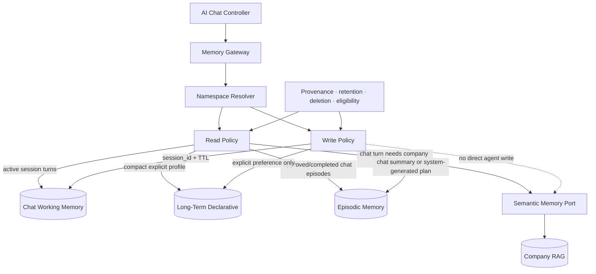

# Product Requirements Document

## Cowork Agent — Memory Extension for AI Chat Assistant

| Field | Value |
|---|---|
| Product | Cowork Agent — Multi-Turn AI Chat Assistant |
| Document status | Post-MVP Chat Memory Extension |
| Version | 2.2 |
| Date | 2026-08-11 |
| Depends on | Completed PRD-v1 stateless Email RAG pipeline |
| Primary memory owner | AI Chat Controller (`feature: ai_chat`) |
| Tool integration | None in the current AI Chat baseline |
| Memory types | Chat working, declarative profile, episodic, semantic RAG |
| Reflexion | Out of scope |
| Scheduling | Out of scope |

---

## 1. Executive Summary

PRD-v2 assigns safe, typed memory to the multi-turn AI Chat Assistant. It
explicitly decouples the four-type memory system from the completed,
standalone Email RAG pipeline. The standalone PRD-v1 Email Agent remains
stateless and is not exposed as an AI Chat tool.

PRD-v1 already provides:

- manual `@Email` invocation;
- read-only Gmail processing;
- actionability and knowledge-sufficiency routing;
- direct Action Plans;
- conditional company RAG retrieval;
- cited output validation;
- minimal task persistence;
- ephemeral raw-email handling.

PRD-v2 combines four memory capabilities for chat:

1. **Working memory** for bounded turns in one `session_id`.
2. **Long-term declarative memory** for explicit persona, preferences, and configuration.
3. **Episodic memory** for conversation summaries and validated chat-native tasks.
4. **Semantic memory** for selectively retrieved enterprise knowledge.

The extension must improve conversational continuity without allowing the
model to treat its own unverified chat output as trusted memory. Raw email
bodies remain confined to the standalone PRD-v1 Email Agent.

The memory lifecycle is:

```text
User chat message
→ assemble profile + eligible episodes + semantic RAG + session working memory
→ stream an assistant response
→ when explicitly requested, render a chat-native task proposal
→ record the turn and a system-generated, retrieval-ineligible TaskEpisode
→ approval/completion may make the episode eligible for later chat retrieval
```

Scheduling and recurring processing remain outside the product scope.

---

## 2. Product Hypothesis

> Explicit preferences, bounded session history, validated episodes, and
> enterprise knowledge improve multi-turn AI Chat continuity, while
> unvalidated system-generated output must not be treated as trusted evidence.

PRD-v2 tests whether memory improves:

- continuity within and across chat sessions;
- persona, language, tone, and formatting adherence;
- recall of prior user decisions and validated task outcomes;
- grounded answers from enterprise knowledge;
- relevant reuse of approved chat-native tasks.

The extension must preserve the v1 privacy rule:

> Raw email content is temporary source context, not long-term, episodic, or semantic memory.

---

## 3. Problem Statement

The completed PRD-v1 Email Agent remains a separate product flow. The remaining
PRD-v2 problem is that a stateless chat assistant forgets context between turns
and sessions.

This causes limitations:

- the assistant cannot remember explicit persona and output preferences;
- it loses earlier decisions and active conversational context;
- it cannot safely recall approved or completed task patterns;
- it cannot connect enterprise knowledge with the current conversation;
- past explicitly requested chat tasks are not available as validated context.

Naively storing and retrieving all generated output would create a self-reinforcing error loop. The system therefore needs typed memory, explicit provenance, and strict retrieval eligibility.

---

## 4. V2 Goal

The v2 end-to-end value loop is:

```text
Open or resume an AI Chat session
→ send a user message
→ assemble bounded working memory, profile, eligible episodes, and RAG context
→ stream the assistant response
→ on an explicit user request, render a bounded task proposal
→ record the chat turn and system-generated, retrieval-ineligible TaskEpisode
→ approve, complete, or reject the task in chat to update episode eligibility
```

---

## 5. Goals

1. Add a unified logical Memory Gateway for the Chat Controller.
2. Enforce tenant, user, `session_id`, `feature: ai_chat`, and memory-type namespaces.
3. Maintain bounded multi-turn working memory for each active chat session.
4. Store explicit chat persona and user preferences as long-term declarative memory.
5. Store chat summaries and explicitly requested chat-native tasks as distinct episodic records.
6. Mark new episodes as:
   - `validation_status = system_generated`
   - `retrieval_eligible = false`
7. Support approval, completion, and rejection directly on in-chat task proposals.
8. Make only approved or completed episodes retrievable.
9. Retrieve episodic and semantic context selectively for chat turns.
10. Preserve provenance, confidence, version, retention, and deletion metadata.
11. Prevent raw email, attachment content, and full chat transcripts from entering TaskEpisodes.
12. Stream assistant events through an SSE-capable Chat API.
13. Evaluate whether memory materially improves chat continuity and grounded task assistance.

---

## 6. Non-Goals

The following remain outside PRD-v2:

- scheduled or recurring email processing;
- background daily processing;
- Reflexion or self-critique loops;
- autonomous learning from model failures;
- automatic preference extraction from email bodies;
- automatic promotion of system-generated episodes;
- retrieval of unvalidated episodes;
- raw email storage in long-term or episodic memory;
- raw email ingestion into semantic company knowledge;
- multi-agent orchestration;
- automatic email replies;
- executable in-chat `@Email` or any other AI Chat tool;
- standalone Email pipeline memory integration;
- background ingestion of Gmail messages into any memory type;
- high-impact external actions;
- attachment processing;
- model fine-tuning from user memories;
- cross-feature memory sharing without explicit policy;
- a general-purpose autonomous memory consolidation system.

---

## 7. Memory Types

| Memory type | Purpose | V2 status |
|---|---|---|
| Short-term / working | Bounded active-chat turn history keyed by `session_id` | Added for AI Chat |
| Long-term declarative | Explicit persona, language, tone, output preferences, and user configuration | Added in v2 |
| Episodic | Chat summaries plus explicitly requested chat-native tasks with validation state | Added in v2 |
| Semantic | Enterprise policies, procedures, templates, governance, and documentation available to chat through RAG | Retained from v1 RAG |

---

## 8. Core User Stories

### US-01 — Remember an explicit chat persona

As a user, I want Cowork to remember persona and response preferences I explicitly configure.

### US-02 — Continue across chat sessions

As a user, I want later chat sessions to follow my stored preferences and recall eligible prior decisions.

### US-03 — Create a task inside chat

As a user, I want to explicitly ask for a task or action plan and see a bounded
task proposal rendered in that thread.

### US-04 — Validate a chat-generated task

As a user, I want inline approval or completion to make a useful Action Plan eligible for future retrieval.

### US-05 — Exclude rejected or unverified chat output

As a user, I want rejected and unapproved plans excluded from later chat retrieval.

### US-06 — Recall relevant prior task outcomes

As a user, I want Cowork to use relevant approved chat decisions and tasks when
they improve a later answer.

### US-07 — Manage memory

As a user, I want explicit deletion paths for stored preferences and task episodes.

### US-08 — Preserve privacy

As a user, I want TaskEpisodes to exclude raw email, attachment content, full
chat transcripts, and copied company-document text.

---

## 9. Memory Architecture



---

## 10. Memory Principles

1. Memory writes are typed.
2. Memory reads are selective.
3. Explicit user input is different from inferred model output.
4. System-generated episodes are untrusted by default.
5. Retrieval eligibility is policy-enforced, not prompt-enforced.
6. TaskEpisodes contain compact derived fields, never raw source content.
7. Semantic company knowledge remains separate from user task history.
8. Every memory operation is scoped by tenant, user, `session_id`, and `feature: ai_chat`.
9. Provenance and lifecycle fields are mandatory.
10. Memory failure degrades chat context without changing the standalone PRD-v1 Email Agent.

---

## 11. Functional Requirements

### FR-01 — Memory Gateway

The system shall provide a logical Memory Gateway or facade used by the AI Chat Controller.

The gateway shall centralize:

- namespace resolution;
- read eligibility;
- write eligibility;
- provenance;
- retention;
- deletion;
- degraded responses;
- memory-type isolation.

The gateway may be implemented in-process. A separate memory microservice is not required.

### FR-02 — Memory namespace

Every memory operation shall include:

```yaml
tenant_id: string
user_id: string
session_id: string
feature: ai_chat
memory_type: short_term | long_term | episodic | semantic
source_id: string | null
```

Recommended key:

```text
tenant_id / user_id / session_id / feature: ai_chat / memory_type / record_id
```

The system must fail closed when required namespace fields are missing or inconsistent.

### FR-03 — Long-term declarative profile

The system shall support a compact long-term profile containing explicit preferences such as:

```yaml
profile_id: string
tenant_id: string
user_id: string

language: string | null
timezone: string | null
assistant_persona: string | null
response_tone: string | null
response_brevity: concise | standard | detailed | null
output_style: concise | standard | detailed | null
priority_rules:
  - string
important_people:
  - name: string
    relationship: string
    identifier: string | null
default_plan_preferences:
  - string

source_type: explicit_user_config
created_at: datetime
updated_at: datetime
```

The initial field list may be narrowed based on the product UI.

### FR-04 — Long-term write policy

Long-term memory writes are allowed only when:

- the user explicitly configures a preference;
- the user explicitly asks Cowork to remember a preference;
- a trusted administrative configuration supplies the value.

The system shall not automatically infer and store durable preferences from
raw emails or ordinary chat text. An explicit "remember this" instruction is
a user-authorized write; passive inference is not.

### FR-05 — Compact profile loading

Before each chat turn, the Chat Controller may request a compact profile.

The profile response shall:

- contain only fields relevant to the AI Chat response or explicit task request;
- remain bounded in size;
- exclude unrelated personal data;
- include a degraded indicator when the store is unavailable.

Failure behavior:

```text
profile read fails
→ use default chat persona
→ continue the chat turn with a degraded-memory indicator
→ preserve standalone PRD-v1 Email Agent availability
→ emit a metadata-only warning event
```

### FR-06 — Episodic task write

Every completed chat turn may create a bounded conversation summary. A
TaskEpisode may be created only after the user explicitly requests a task or
action plan. An assistant suggestion, ordinary conversation, classifier output,
or background process must not create one.

The Chat Controller writes the TaskEpisode after rendering the bounded task
proposal. Retries for the same tenant, user, originating session, and
originating turn update the same logical record.

```yaml
episode_id: string
record_id: string
tenant_id: string
user_id: string
chat_session_id: string
chat_turn_id: string

task_title: string
minimal_request_paraphrase: string

action_plan:
  - string

rag_citations:
  - document_id: string
    document_title: string
    section: string | null
    source_url: string

missing_information:
  - string

validation_status: system_generated
retrieval_eligible: false

source_type: system_generated_chat_task
creation_reason: explicit_user_task_request

created_at: datetime
updated_at: datetime

pipeline_version: string
model_id: string | null
prompt_version: string | null
confidence: number | null
```

`record_id` is an opaque deterministic idempotency key derived from tenant,
user, originating chat session, and originating chat turn. It must not contain
or encode user text. TaskEpisodes have no foreign key to PRD-v1 Email Agent
tasks.

The episode must not contain raw email, attachment content, a full chat
transcript, copied RAG chunks, tool payloads, or mailbox identifiers. Optional
citations identify company-RAG documents without copying their content.

### FR-07 — Episode lifecycle

Supported statuses:

```text
system_generated
user_approved
completed
rejected
```

Required transitions:

```text
system_generated → user_approved
system_generated → completed
system_generated → rejected
user_approved → completed
user_approved → rejected
```

These transitions shall be available as inline controls on the task proposal
in the originating chat thread. Transition and single-record deletion requests
must match that originating session.

### FR-08 — Retrieval eligibility

The following rule shall be enforced in storage and retrieval code:

```text
system_generated → retrieval_eligible = false
user_approved → retrieval_eligible = true
completed → retrieval_eligible = true
rejected → retrieval_eligible = false
```

The LLM must not be able to override this rule.
Storage must derive `retrieval_eligible` atomically from the resulting
`validation_status`; callers cannot supply an independent eligibility value.

### FR-09 — Selective episodic retrieval

Episodic retrieval shall be optional and selective.

The Chat Controller may request episodes when:

- the current chat intent resembles a prior task category;
- the user asks about previous related work;
- approved history could improve the plan;
- deterministic policy or classifier metadata indicates likely value.

The system shall not retrieve episodic history for every chat turn by default.
Eligible TaskEpisodes may cross chat sessions only within the same tenant,
user, and `feature: ai_chat` scope. Retrieval excludes expired records and
applies server-side result and timeout bounds before returning data.

### FR-10 — Episodic retrieval request

```yaml
tenant_id: string
user_id: string
session_id: string
feature: ai_chat

query:
  user_message: string
  candidate_action_item: string | null
  task_category: string | null
  participants:
    - string
  internal_terms:
    - string

filters:
  validation_status:
    - user_approved
    - completed
  retrieval_eligible: true

limits:
  max_items: integer
  min_score: number
  timeout_ms: integer
```

### FR-11 — Episodic retrieval response

```yaml
episodes:
  - episode_id: string
    task_title: string
    minimal_request_paraphrase: string
    action_plan:
      - string
    outcome_status: user_approved | completed
    rag_citations:
      - object
    relevance_score: number
    created_at: datetime

retrieval_status:
  enum:
    - success
    - no_results
    - timeout
    - authorization_denied
    - partial

degraded: boolean
```

The response shall exclude raw source content and unvalidated or expired tasks.

### FR-12 — Generation context integration

The Chat LLM context assembler may receive:

- system persona and current user message;
- compact long-term profile;
- selected validated episodes;
- current RAG context when chat intent requires enterprise knowledge;
- bounded working memory from the active `session_id`.

The context assembler shall clearly label each source type so the generator can distinguish:

- current user message and active session turns;
- explicit preference;
- validated prior episode;
- current company document evidence;
- current explicit task-creation request and any generated task proposal.

### FR-13 — Conflict handling

When sources conflict:

1. current explicit user instruction takes precedence;
2. current company policy evidence takes precedence over a prior episode;
3. explicit stored preference applies unless contradicted by the current request;
4. a prior episode is advisory, not authoritative;
5. missing or conflicting context must not be silently resolved through invention.

### FR-14 — Provenance

Durable memory records shall include, where applicable:

```yaml
record_id: string
tenant_id: string
user_id: string
memory_type: string

source_type:
  - explicit_user_config
  - system_generated_task
  - user_approved_task
  - completed_task
  - migration

source_id: string
source_url: string | null

created_at: datetime
updated_at: datetime
expires_at: datetime | null

model_id: string | null
prompt_version: string | null
pipeline_version: string

confidence: number | null
validation_status: string
retrieval_eligible: boolean
```

### FR-15 — Deletion

The system shall support explicit deletion paths for:

- a long-term preference;
- an entire long-term user profile;
- an individual episode;
- all episodes for a user;
- all memory for the AI Chat feature.

Deletion shall preserve only the minimum audit evidence required by policy.

### FR-16 — Retention

Retention periods shall be configurable by product or tenant policy.

The system shall support:

- expiration timestamps;
- background purge;
- legal or administrative deletion;
- prevention of retrieval after expiration;
- propagation of deletion to search indexes when applicable.

### FR-17 — Memory observability

The system shall emit metadata for:

- long-term profile read success or degradation;
- episodic write success;
- episode status transition;
- episode retrieval request and result count;
- filtered unvalidated episode count;
- memory latency;
- namespace or authorization denial;
- deletion and purge status.

Production telemetry must not contain raw email bodies or full preference payloads.

### FR-18 — Memory failure behavior

Long-term failure:

```text
use default profile
→ continue
→ emit warning
```

Working or episodic retrieval failure:

```text
skip episodes
→ continue
→ emit warning
```

Episodic write failure:

```text
preserve successfully streamed chat response
→ retry episode write safely
→ do not duplicate the task
```

Semantic RAG failure produces a grounded chat degradation indicator. It does
not alter the standalone PRD-v1 Email Agent.

---

## 12. User Approval and Completion

PRD-v2 requires a validation signal before episodes become retrievable.

The minimum supported product operations are:

- approve a generated task;
- mark a task completed;
- reject a generated task.

These operations are rendered directly on the chat-native task proposal inside
the originating chat thread and backed by idempotent transition APIs.

### Approval effects

```text
Approve
→ validation_status = user_approved
→ retrieval_eligible = true
```

### Completion effects

```text
Complete
→ validation_status = completed
→ retrieval_eligible = true
```

### Rejection effects

```text
Reject
→ validation_status = rejected
→ retrieval_eligible = false
```

Approval does not authorize high-impact external actions.

---

## 13. Security and Privacy

- Every memory request uses verified tenant and user identity.
- Cross-tenant and cross-user access fails closed.
- Long-term writes require explicit trusted sources.
- Raw email bodies are excluded from long-term and episodic storage.
- RAG company documents remain separate from user memories.
- Memory records include provenance and lifecycle metadata.
- Sensitive preference fields require explicit product review.
- Deletion and retention apply to primary storage and derived indexes.
- Development traces are not a memory source.
- Unvalidated episodes cannot be retrieved even if technically present in the database.

---

## 14. Non-Functional Requirements

### Reliability

| Operation | Baseline behavior | Blocking? |
|---|---|---|
| Long-term profile read | Short timeout; one fast retry | No |
| Episodic retrieval | Short timeout; optional fast retry | No |
| Episodic write | Retry-safe and idempotent | No for task visibility |
| Status transition | Transactional and idempotent | Yes for transition confirmation |
| Deletion | Repeatable until all stores confirm | No for unrelated runs |
| Purge | Scheduled infrastructure maintenance | No product scheduling feature |

The use of a purge job is an internal retention mechanism, not a user-facing Email processing schedule.

### Scalability

- long-term and episodic storage shall support tenant and user indexing;
- episodic search shall enforce eligibility before ranking or before returning results;
- retrieval result count remains bounded;
- profile and episode payloads remain compact.

### Maintainability

- memory contracts are versioned;
- policy is centralized in the Memory Gateway;
- storage adapters are replaceable;
- memory rules do not live inside vendor-specific LLM adapters.

---

## 15. Success Metrics

### Product impact

- percentage of users with at least one explicit stored preference;
- preference application accuracy;
- percentage of approved/completed episodes reused;
- user-rated improvement from episodic context;
- reduction in repeated corrections;
- plan consistency across related tasks.

### Safety and policy

- unvalidated-episode retrieval count: must be zero;
- cross-tenant retrieval incidents: must be zero;
- raw-email memory violations: must be zero;
- rejected-episode retrieval count: must be zero;
- memory deletion completion rate;
- expired-record retrieval count: must be zero.

### Reliability

- profile read success rate;
- episodic write success rate;
- episodic retrieval latency;
- memory degradation rate;
- status-transition success rate;
- deletion and purge completion rate.

### Evaluation question

> Does adding explicit profile context or validated episodic context improve Action Plan quality compared with the same v1 workflow without memory?

The evaluation must compare memory-enabled and memory-disabled outputs on a labeled set.

---

## 16. Acceptance Criteria

PRD-v2 is accepted when:

1. The Chat Controller reads all four memory types only through the Memory Gateway.
2. Every operation carries tenant, user, `session_id`, `feature: ai_chat`, and memory type.
3. A bounded working-memory buffer preserves active-session turns and expires by policy.
4. Explicit persona and response preferences can be written and loaded in later sessions.
5. Assistant deltas and completion events stream to the active session.
6. Only an explicit user task/action-plan request creates an idempotent chat-native TaskEpisode.
7. New TaskEpisodes are `system_generated` and retrieval-ineligible.
8. Inline approval or completion makes an episode retrieval-eligible.
9. Inline rejection keeps an episode retrieval-ineligible.
10. Episodic retrieval returns only approved or completed episodes.
11. Unvalidated episodes cannot be returned even when requested by the model.
12. Episodic and semantic retrieval are selective and bounded per chat turn.
13. Current company policy evidence takes precedence over prior episode guidance.
14. TaskEpisodes exclude raw email, attachment content, full chat transcripts, copied RAG chunks, and tool payloads.
15. Exact-scope deletion prevents later retrieval and does not delete semantic company RAG.
16. Production telemetry is metadata-only.
17. Memory outages degrade chat gracefully and preserve the standalone PRD-v1 Email Agent.
18. No in-chat tool, scheduler, recurring Email processing, or autonomous email action is introduced.

---

## 17. Delivery Milestones

### V2-M1 — Chat Memory Gateway and session working memory

- define chat session, profile, episode, retrieval, transition, and provenance contracts;
- implement the Memory Gateway and bounded Chat Session Buffer;
- enforce tenant/user/`session_id`/`feature: ai_chat` namespace;
- implement read and write policy rules.

### V2-M2 — AI Chat declarative profile

- implement profile storage;
- add explicit persona and preference write paths;
- implement compact per-turn profile loading;
- add default-profile fallback;
- add deletion and retention behavior.

### V2-M3 — Chat-native episodic persistence

- write bounded chat summaries and explicitly requested chat-native TaskEpisodes;
- enforce `system_generated`;
- enforce `retrieval_eligible = false`;
- implement idempotency and retry-safe writes;
- ensure raw-source exclusion.

### V2-M4 — SSE Chat Controller and task lifecycle

- implement Chat API sessions, turn orchestration, and SSE streaming;
- render chat-native task proposals only after explicit user requests;
- provide approve, complete, and reject controls in the originating chat session;
- enforce retrieval eligibility changes;
- record provenance and timestamps;

### V2-M5 — Selective chat retrieval

- implement episodic and semantic query generation from chat intent;
- apply eligibility filters;
- add relevance scoring and bounded results;
- integrate validated episodes and enterprise RAG into chat context;
- implement conflict rules.

### V2-M6 — Chat memory evaluation and governance

- compare memory-enabled and memory-disabled chat quality;
- define memory retention periods;
- add deletion audits and purge;
- add safety metrics and alerts;
- establish launch thresholds.

---

## 18. Dependencies

- stable PRD-v1 workflow;
- verified tenant and user identity;
- durable task persistence;
- PostgreSQL or equivalent long-term and episodic store;
- optional episodic retrieval index;
- product control or API for approval/completion/rejection;
- retention and deletion infrastructure;
- metadata telemetry;
- existing RAG semantic-memory interface.

---

## 19. Risks and Mitigations

| Risk | Impact | Mitigation |
|---|---|---|
| Unvalidated output becomes trusted memory | Compounding model errors | Default ineligible status and code-level filtering |
| Cross-user memory leakage | Severe privacy incident | Mandatory namespace and authorization |
| Preference inferred incorrectly | Persistent bad behavior | Explicit writes only |
| Stale episode conflicts with current policy | Incorrect plan | Current RAG evidence takes precedence |
| Too much memory context | Higher latency and confused generation | Compact profile, selective retrieval, bounded results |
| Episode retrieval adds little value | Complexity without benefit | A/B or offline comparison against v1 |
| Deletion misses an index | Privacy violation | Central deletion orchestration and audit |
| Memory outage blocks Email workflow | Reduced availability | Default profile and skip-episode fallbacks |
| Raw email enters episodic record | Privacy violation | Typed DTO, persistence validation, audits |

---

## 20. Product Decisions

### Resolved

- PRD-v2 adds long-term declarative and episodic memory.
- Short-term and semantic memory remain as defined in v1.
- Long-term writes are explicit.
- Chat-native tasks are created only after explicit user requests.
- Chat-native TaskEpisodes have no PRD-v1 task-row, Gmail, run, or tool ownership.
- TaskEpisode identity is scoped to tenant, user, originating session, and originating turn.
- System-generated episodes are not retrievable.
- Approved or completed episodes may be retrieved.
- Rejected episodes are never retrieval-eligible.
- Raw email bodies are excluded from durable memory.
- In-chat `@Email` is retired; the standalone PRD-v1 Email Agent remains separate.
- Memory failure does not block the standalone Email Agent.
- Scheduling remains out of scope.
- Reflexion remains out of scope.

### Remaining

- exact preference fields exposed to users;
- user interface for memory review and deletion;
- whether approval and completion are separate controls in the first v2 release;
- episodic relevance algorithm and thresholds;
- retention periods;
- numeric quality-improvement threshold required for launch;
- whether approved episodes may be shared at workspace level in a future version.

---

## 21. Baseline Summary

```text
User chat message
→ Chat Controller reads the active session buffer
→ assemble persona + compact profile + eligible episodes + semantic RAG
→ stream the assistant response
→ when explicitly requested, render one bounded chat-native task proposal
→ record the turn and a system-generated, retrieval-ineligible TaskEpisode
→ inline approval or completion enables safe later chat retrieval
```
