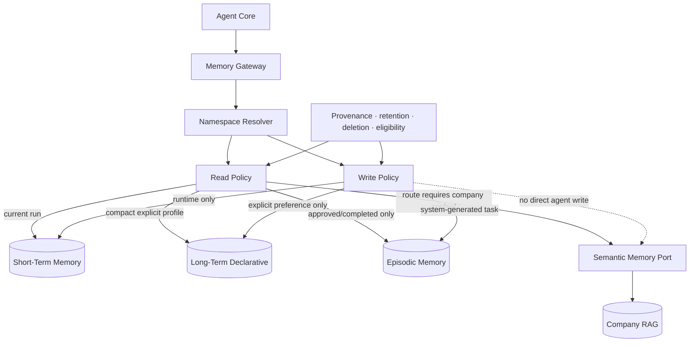

# Product Requirements Document

## Cowork Agent — Long-Term and Episodic Memory Extension

| Field | Value |
|---|---|
| Product | Cowork Agent — Email to Action Plan |
| Document status | Post-MVP Memory Extension |
| Version | 2.0 |
| Date | 2026-08-07 |
| Depends on | PRD-v1 Core Email and Conditional RAG |
| Memory added | Long-term declarative and episodic memory |
| Existing memory retained | Short-term ephemeral context and semantic RAG |
| Reflexion | Out of scope |
| Scheduling | Out of scope |

---

## 1. Executive Summary

PRD-v2 extends the deterministic Email-to-Action-Plan workflow with safe, typed memory.

PRD-v1 already provides:

- manual `@Email` invocation;
- read-only Gmail processing;
- actionability and knowledge-sufficiency routing;
- direct Action Plans;
- conditional company RAG retrieval;
- cited output validation;
- minimal task persistence;
- ephemeral raw-email handling.

PRD-v2 adds two durable memory capabilities:

1. **Long-term declarative memory** for explicit user preferences and configuration.
2. **Episodic memory** for derived task history and validated outcomes.

The extension must improve future Action Plans without allowing the model to treat its own unverified outputs as trusted memory.

The memory lifecycle is:

```text
Explicit user preference
→ write long-term declarative memory
→ load compact profile during later runs

Generated task
→ write system-generated episode
→ retrieval_eligible = false

Future approval or completion signal
→ validate episode
→ retrieval_eligible = true
→ optionally retrieve in a relevant later run
```

Scheduling and recurring processing remain outside the product scope.

---

## 2. Product Hypothesis

> Explicit user preferences and validated task history improve future Action Plans, while unvalidated system-generated output must not be treated as trusted evidence.

PRD-v2 tests whether memory improves:

- prioritization;
- language and formatting;
- role-aware interpretation;
- plan consistency;
- reuse of previously successful task patterns;
- continuity across related work.

The extension must preserve the v1 privacy rule:

> Raw email content is temporary source context, not long-term, episodic, or semantic memory.

---

## 3. Problem Statement

PRD-v1 can create a trustworthy Action Plan from the current email and optional company context, but every run begins without persistent knowledge of the user or validated prior work.

This causes limitations:

- the system cannot remember explicit output preferences;
- it cannot apply user-specific priority rules;
- it cannot recognize previously approved or completed task patterns;
- it cannot improve continuity across related tasks;
- generated task history exists as product output but not as safely retrievable memory.

Naively storing and retrieving all generated output would create a self-reinforcing error loop. The system therefore needs typed memory, explicit provenance, and strict retrieval eligibility.

---

## 4. V2 Goal

The v2 end-to-end value loop is:

```text
@Email invocation
→ process current email through the v1 workflow
→ load compact explicit user profile
→ optionally retrieve relevant validated episodes
→ classify and route
→ optionally retrieve semantic company knowledge
→ generate a personalized, grounded Action Plan
→ persist task
→ write a system-generated episode
→ keep episode ineligible until validated
→ delete raw email context
```

---

## 5. Goals

1. Add a unified logical Memory Gateway.
2. Add tenant-, user-, feature-, and memory-type namespaces.
3. Store explicit user preferences as long-term declarative memory.
4. Load a compact profile during relevant Email Action Plan runs.
5. Store every generated task as an episodic record.
6. Mark new episodes as:
   - `validation_status = system_generated`
   - `retrieval_eligible = false`
7. Support future approval, completion, and rejection signals.
8. Make only approved or completed episodes retrievable.
9. Retrieve episodic context selectively rather than on every run.
10. Preserve provenance, confidence, version, retention, and deletion metadata.
11. Prevent raw email content from entering durable memory.
12. Degrade gracefully when memory is unavailable.
13. Evaluate whether memory materially improves Action Plan quality.

---

## 6. Non-Goals

The following remain outside PRD-v2:

- scheduled or recurring email processing;
- background daily processing;
- Reflexion or self-critique loops;
- autonomous learning from model failures;
- automatic preference extraction from email bodies;
- automatic promotion of system-generated episodes;
- retrieval of unvalidated episodes;
- raw email storage in long-term or episodic memory;
- raw email ingestion into semantic company knowledge;
- multi-agent orchestration;
- automatic email replies;
- high-impact external actions;
- attachment processing;
- model fine-tuning from user memories;
- cross-feature memory sharing without explicit policy;
- a general-purpose autonomous memory consolidation system.

---

## 7. Memory Types

| Memory type | Purpose | V2 status |
|---|---|---|
| Short-term | Current run state, raw email, classifier result, retrieved context, generated candidate | Retained from v1 |
| Long-term declarative | Explicit stable user preferences and configuration | Added in v2 |
| Episodic | Derived task history and outcome status | Added in v2 |
| Semantic | Company policies, procedures, templates, governance, and documentation | Retained through RAG |

---

## 8. Core User Stories

### US-01 — Remember explicit preferences

As a user, I want Cowork to remember preferences I explicitly configure, such as language, output style, and priority rules.

### US-02 — Apply preferences to later plans

As a user, I want later Action Plans to follow my stored preferences without repeating them in every request.

### US-03 — Preserve task history safely

As a user, I want generated tasks to be retained as history without automatically being treated as trusted memory.

### US-04 — Validate useful episodes

As a user, I want approval or completion signals to make a prior task eligible for future retrieval.

### US-05 — Exclude rejected or unverified output

As a user, I want rejected and unapproved tasks excluded from memory retrieval.

### US-06 — Reuse relevant prior experience

As a user, I want Cowork to use relevant approved or completed task history when it improves a new Action Plan.

### US-07 — Manage memory

As a user, I want explicit deletion paths for stored preferences and task episodes.

### US-08 — Preserve privacy

As a user, I want durable memory to contain derived task information and references, not the full email body.

---

## 9. Memory Architecture



---

## 10. Memory Principles

1. Memory writes are typed.
2. Memory reads are selective.
3. Explicit user input is different from inferred model output.
4. System-generated episodes are untrusted by default.
5. Retrieval eligibility is policy-enforced, not prompt-enforced.
6. Raw emails are not durable memory.
7. Semantic company knowledge remains separate from user task history.
8. Every memory record is tenant- and user-scoped.
9. Provenance and lifecycle fields are mandatory.
10. Memory failure must not block the core v1 workflow.

---

## 11. Functional Requirements

### FR-01 — Memory Gateway

The system shall provide a logical Memory Gateway or facade used by Agent Core.

The gateway shall centralize:

- namespace resolution;
- read eligibility;
- write eligibility;
- provenance;
- retention;
- deletion;
- degraded responses;
- memory-type isolation.

The gateway may be implemented in-process. A separate memory microservice is not required.

### FR-02 — Memory namespace

Every memory operation shall include:

```yaml
tenant_id: string
user_id: string
feature: email_action_plan
memory_type: short_term | long_term | episodic | semantic
run_id: string | null
source_id: string | null
```

Recommended key:

```text
tenant_id / user_id / feature / memory_type / record_id
```

The system must fail closed when required namespace fields are missing or inconsistent.

### FR-03 — Long-term declarative profile

The system shall support a compact long-term profile containing explicit preferences such as:

```yaml
profile_id: string
tenant_id: string
user_id: string

language: string | null
timezone: string | null
output_style: concise | standard | detailed | null
priority_rules:
  - string
important_people:
  - name: string
    relationship: string
    identifier: string | null
default_plan_preferences:
  - string

source_type: explicit_user_config
created_at: datetime
updated_at: datetime
```

The initial field list may be narrowed based on the product UI.

### FR-04 — Long-term write policy

Long-term memory writes are allowed only when:

- the user explicitly configures a preference;
- the user explicitly asks Cowork to remember a preference;
- a trusted administrative configuration supplies the value.

The system shall not automatically infer and store durable preferences from raw emails.

### FR-05 — Compact profile loading

Before classification or generation, Agent Core may request a compact profile.

The profile response shall:

- contain only fields relevant to the Email Action Plan feature;
- remain bounded in size;
- exclude unrelated personal data;
- include a degraded indicator when the store is unavailable.

Failure behavior:

```text
profile read fails
→ use default profile
→ continue the v1 workflow
→ emit a warning event
```

### FR-06 — Episodic task write

Every successfully persisted generated task shall also create or update one episodic record.

```yaml
episode_id: string
record_id: string
tenant_id: string
user_id: string
run_id: string

gmail_message_id: string
gmail_url: string

task_title: string
minimal_request_paraphrase: string

action_plan:
  - string

rag_citations:
  - document_id: string
    document_title: string
    section: string | null
    source_url: string

missing_information:
  - string

validation_status: system_generated
retrieval_eligible: false

source_type: system_generated_task

created_at: datetime
updated_at: datetime

pipeline_version: string
model_id: string | null
prompt_version: string | null
confidence: number | null
```

The episode must not contain the raw email body.

### FR-07 — Episode lifecycle

Supported statuses:

```text
system_generated
user_approved
completed
rejected
```

Required transitions:

```text
system_generated → user_approved
system_generated → completed
system_generated → rejected
user_approved → completed
user_approved → rejected
```

The exact UI used to create these transitions may be specified separately.

### FR-08 — Retrieval eligibility

The following rule shall be enforced in storage and retrieval code:

```text
system_generated → retrieval_eligible = false
user_approved → retrieval_eligible = true
completed → retrieval_eligible = true
rejected → retrieval_eligible = false
```

The LLM must not be able to override this rule.

### FR-09 — Selective episodic retrieval

Episodic retrieval shall be optional and selective.

Agent Core may request episodes when:

- the new task resembles a prior task category;
- the user asks about previous related work;
- approved history could improve the plan;
- deterministic policy or classifier metadata indicates likely value.

The system shall not retrieve task history for every email by default.

### FR-10 — Episodic retrieval request

```yaml
run_id: string
tenant_id: string
user_id: string
feature: email_action_plan

query:
  candidate_action_item: string
  task_category: string | null
  participants:
    - string
  internal_terms:
    - string

filters:
  validation_status:
    - user_approved
    - completed
  retrieval_eligible: true

limits:
  max_items: integer
  min_score: number
  timeout_ms: integer
```

### FR-11 — Episodic retrieval response

```yaml
episodes:
  - episode_id: string
    task_title: string
    minimal_request_paraphrase: string
    action_plan:
      - string
    outcome_status: user_approved | completed
    rag_citations:
      - object
    relevance_score: number
    created_at: datetime

retrieval_status:
  enum:
    - success
    - no_results
    - timeout
    - authorization_denied
    - partial

degraded: boolean
```

The response shall exclude raw email content.

### FR-12 — Generation context integration

The Action Plan Generator may receive:

- current ephemeral email;
- compact long-term profile;
- selected validated episodes;
- current RAG context when the semantic route is used.

The context assembler shall clearly label each source type so the generator can distinguish:

- current email request;
- explicit preference;
- validated prior episode;
- current company document evidence.

### FR-13 — Conflict handling

When sources conflict:

1. current explicit user instruction takes precedence;
2. current company policy evidence takes precedence over a prior episode;
3. explicit stored preference applies unless contradicted by the current request;
4. a prior episode is advisory, not authoritative;
5. missing or conflicting context must not be silently resolved through invention.

### FR-14 — Provenance

Durable memory records shall include, where applicable:

```yaml
record_id: string
tenant_id: string
user_id: string
memory_type: string

source_type:
  - explicit_user_config
  - system_generated_task
  - user_approved_task
  - completed_task
  - migration

source_id: string
source_url: string | null

created_at: datetime
updated_at: datetime
expires_at: datetime | null

model_id: string | null
prompt_version: string | null
pipeline_version: string

confidence: number | null
validation_status: string
retrieval_eligible: boolean
```

### FR-15 — Deletion

The system shall support explicit deletion paths for:

- a long-term preference;
- an entire long-term user profile;
- an individual episode;
- all episodes for a user;
- all memory for the Email Action Plan feature.

Deletion shall preserve only the minimum audit evidence required by policy.

### FR-16 — Retention

Retention periods shall be configurable by product or tenant policy.

The system shall support:

- expiration timestamps;
- background purge;
- legal or administrative deletion;
- prevention of retrieval after expiration;
- propagation of deletion to search indexes when applicable.

### FR-17 — Memory observability

The system shall emit metadata for:

- long-term profile read success or degradation;
- episodic write success;
- episode status transition;
- episode retrieval request and result count;
- filtered unvalidated episode count;
- memory latency;
- namespace or authorization denial;
- deletion and purge status.

Production telemetry must not contain raw email bodies or full preference payloads.

### FR-18 — Memory failure behavior

Long-term failure:

```text
use default profile
→ continue
→ emit warning
```

Episodic retrieval failure:

```text
skip episodes
→ continue
→ emit warning
```

Episodic write failure:

```text
preserve successfully persisted task
→ retry episode write safely
→ do not duplicate the task
```

Semantic RAG failure continues to use the v1 partial-plan fallback.

---

## 12. User Approval and Completion

PRD-v2 requires a validation signal before episodes become retrievable.

The minimum supported product operations are:

- approve a generated task;
- mark a task completed;
- reject a generated task.

These operations may initially be exposed through an API or a simple Cowork task control rather than a full workflow-management interface.

### Approval effects

```text
Approve
→ validation_status = user_approved
→ retrieval_eligible = true
```

### Completion effects

```text
Complete
→ validation_status = completed
→ retrieval_eligible = true
```

### Rejection effects

```text
Reject
→ validation_status = rejected
→ retrieval_eligible = false
```

Approval does not authorize high-impact external actions.

---

## 13. Security and Privacy

- Every memory request uses verified tenant and user identity.
- Cross-tenant and cross-user access fails closed.
- Long-term writes require explicit trusted sources.
- Raw email bodies are excluded from long-term and episodic storage.
- RAG company documents remain separate from user memories.
- Memory records include provenance and lifecycle metadata.
- Sensitive preference fields require explicit product review.
- Deletion and retention apply to primary storage and derived indexes.
- Development traces are not a memory source.
- Unvalidated episodes cannot be retrieved even if technically present in the database.

---

## 14. Non-Functional Requirements

### Reliability

| Operation | Baseline behavior | Blocking? |
|---|---|---|
| Long-term profile read | Short timeout; one fast retry | No |
| Episodic retrieval | Short timeout; optional fast retry | No |
| Episodic write | Retry-safe and idempotent | No for task visibility |
| Status transition | Transactional and idempotent | Yes for transition confirmation |
| Deletion | Repeatable until all stores confirm | No for unrelated runs |
| Purge | Scheduled infrastructure maintenance | No product scheduling feature |

The use of a purge job is an internal retention mechanism, not a user-facing Email processing schedule.

### Scalability

- long-term and episodic storage shall support tenant and user indexing;
- episodic search shall enforce eligibility before ranking or before returning results;
- retrieval result count remains bounded;
- profile and episode payloads remain compact.

### Maintainability

- memory contracts are versioned;
- policy is centralized in the Memory Gateway;
- storage adapters are replaceable;
- memory rules do not live inside vendor-specific LLM adapters.

---

## 15. Success Metrics

### Product impact

- percentage of users with at least one explicit stored preference;
- preference application accuracy;
- percentage of approved/completed episodes reused;
- user-rated improvement from episodic context;
- reduction in repeated corrections;
- plan consistency across related tasks.

### Safety and policy

- unvalidated-episode retrieval count: must be zero;
- cross-tenant retrieval incidents: must be zero;
- raw-email memory violations: must be zero;
- rejected-episode retrieval count: must be zero;
- memory deletion completion rate;
- expired-record retrieval count: must be zero.

### Reliability

- profile read success rate;
- episodic write success rate;
- episodic retrieval latency;
- memory degradation rate;
- status-transition success rate;
- deletion and purge completion rate.

### Evaluation question

> Does adding explicit profile context or validated episodic context improve Action Plan quality compared with the same v1 workflow without memory?

The evaluation must compare memory-enabled and memory-disabled outputs on a labeled set.

---

## 16. Acceptance Criteria

PRD-v2 is accepted when:

1. Agent Core reads memory only through the Memory Gateway.
2. Every memory operation carries tenant, user, feature, and memory type.
3. Explicit preferences can be written to long-term declarative storage.
4. A compact profile can be loaded into a later Email Action Plan run.
5. Long-term read failure does not block the v1 workflow.
6. Every generated task writes an idempotent episodic record.
7. New episodes are stored as `system_generated`.
8. New episodes have `retrieval_eligible = false`.
9. Approval or completion can make an episode retrieval-eligible.
10. Rejection keeps an episode retrieval-ineligible.
11. Episodic retrieval returns only approved or completed episodes.
12. Unvalidated episodes cannot be returned even when directly requested by the model.
13. Episodic retrieval is selective and bounded.
14. Current company policy evidence takes precedence over prior episode guidance.
15. Raw email bodies are absent from long-term and episodic records.
16. Memory deletion paths exist and prevent later retrieval.
17. Memory production telemetry is metadata-only.
18. Profile, episode, and semantic-memory outages degrade gracefully.
19. Memory-enabled quality is evaluated against the v1 baseline.
20. No scheduler, schedule configuration, or recurring Email processing is introduced.

---

## 17. Delivery Milestones

### Milestone 1 — Memory contracts and namespace

- define long-term profile, episode, retrieval, transition, and provenance contracts;
- implement Memory Gateway;
- enforce tenant/user/feature namespace;
- implement read and write policy rules.

### Milestone 2 — Long-term declarative memory

- implement profile storage;
- add explicit preference write path;
- implement compact profile loading;
- add default-profile fallback;
- add deletion and retention behavior.

### Milestone 3 — Episodic persistence

- write task-derived episodes;
- enforce `system_generated`;
- enforce `retrieval_eligible = false`;
- implement idempotency and retry-safe writes;
- ensure raw email exclusion.

### Milestone 4 — Validation lifecycle

- support approve, complete, and reject transitions;
- enforce retrieval eligibility changes;
- record provenance and timestamps;
- add minimal product or API controls.

### Milestone 5 — Selective episodic retrieval

- implement episodic query generation;
- apply eligibility filters;
- add relevance scoring and bounded results;
- integrate validated episodes into generation context;
- implement conflict rules.

### Milestone 6 — Evaluation and governance

- compare v1 and v2 output quality;
- define memory retention periods;
- add deletion audits and purge;
- add safety metrics and alerts;
- establish launch thresholds.

---

## 18. Dependencies

- stable PRD-v1 workflow;
- verified tenant and user identity;
- durable task persistence;
- PostgreSQL or equivalent long-term and episodic store;
- optional episodic retrieval index;
- product control or API for approval/completion/rejection;
- retention and deletion infrastructure;
- metadata telemetry;
- existing RAG semantic-memory interface.

---

## 19. Risks and Mitigations

| Risk | Impact | Mitigation |
|---|---|---|
| Unvalidated output becomes trusted memory | Compounding model errors | Default ineligible status and code-level filtering |
| Cross-user memory leakage | Severe privacy incident | Mandatory namespace and authorization |
| Preference inferred incorrectly | Persistent bad behavior | Explicit writes only |
| Stale episode conflicts with current policy | Incorrect plan | Current RAG evidence takes precedence |
| Too much memory context | Higher latency and confused generation | Compact profile, selective retrieval, bounded results |
| Episode retrieval adds little value | Complexity without benefit | A/B or offline comparison against v1 |
| Deletion misses an index | Privacy violation | Central deletion orchestration and audit |
| Memory outage blocks Email workflow | Reduced availability | Default profile and skip-episode fallbacks |
| Raw email enters episodic record | Privacy violation | Typed DTO, persistence validation, audits |

---

## 20. Product Decisions

### Resolved

- PRD-v2 adds long-term declarative and episodic memory.
- Short-term and semantic memory remain as defined in v1.
- Long-term writes are explicit.
- Every generated task is recorded as an episode.
- System-generated episodes are not retrievable.
- Approved or completed episodes may be retrieved.
- Rejected episodes are never retrieval-eligible.
- Raw email bodies are excluded from durable memory.
- Memory failure does not block the core Email workflow.
- Scheduling remains out of scope.
- Reflexion remains out of scope.

### Remaining

- exact preference fields exposed to users;
- user interface for memory review and deletion;
- whether approval and completion are separate controls in the first v2 release;
- episodic relevance algorithm and thresholds;
- retention periods;
- numeric quality-improvement threshold required for launch;
- whether approved episodes may be shared at workspace level in a future version.

---

## 21. Baseline Summary

```text
@Email
→ read current email
→ create ephemeral run context
→ load compact explicit user profile
→ optionally retrieve validated prior episodes
→ classify and route
→ optionally retrieve company knowledge
→ generate one Action Plan
→ validate and persist task
→ write system-generated, retrieval-ineligible episode
→ show task in Cowork
→ clear ephemeral state
→ later approval or completion enables safe episodic retrieval
```
