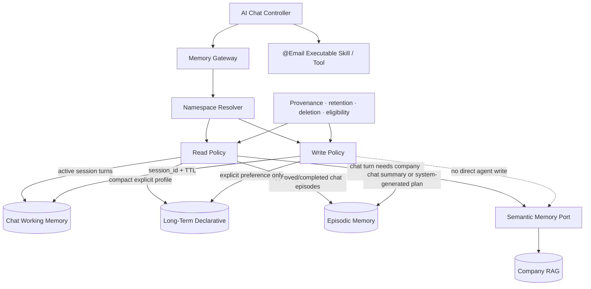

# Product Requirements Document

## Cowork Agent — Memory Extension for AI Chat Assistant & Executable `@Email` Tool

| Field | Value |
|---|---|
| Product | Cowork Agent — Multi-Turn AI Chat Assistant |
| Document status | Post-MVP Chat Memory Extension |
| Version | 2.1 |
| Date | 2026-08-09 |
| Depends on | Completed PRD-v1 stateless Email RAG pipeline |
| Primary memory owner | AI Chat Controller (`feature: ai_chat`) |
| Tool integration | Executable in-chat `@Email` skill |
| Memory types | Chat working, declarative profile, episodic, semantic RAG |
| Reflexion | Out of scope |
| Scheduling | Out of scope |

---

## 1. Executive Summary

PRD-v2 assigns safe, typed memory to the multi-turn AI Chat Assistant. It
explicitly decouples the four-type memory system from the completed,
standalone Email RAG pipeline. That pipeline remains stateless and is exposed
to the Chat Controller as the executable `@Email` skill.

PRD-v1 already provides:

- manual `@Email` invocation;
- read-only Gmail processing;
- actionability and knowledge-sufficiency routing;
- direct Action Plans;
- conditional company RAG retrieval;
- cited output validation;
- minimal task persistence;
- ephemeral raw-email handling.

PRD-v2 combines four memory capabilities for chat:

1. **Working memory** for bounded turns and transient tool state in one `session_id`.
2. **Long-term declarative memory** for explicit persona, preferences, and configuration.
3. **Episodic memory** for conversation summaries and validated `@Email` Action Plans.
4. **Semantic memory** for selectively retrieved enterprise knowledge.

The extension must improve conversational continuity without allowing the
model to treat its own unverified chat or tool output as trusted memory. Raw
email bodies fetched during `@Email` execution remain transient in-run data.

The memory lifecycle is:

```text
User chat message
→ assemble profile + eligible episodes + semantic RAG + session working memory
→ stream an assistant response or request a tool
→ execute @Email statelessly when invoked
→ render the Action Plan as a rich card in the chat thread
→ record the turn and a system-generated episode
→ purge raw email and transient tool payloads
→ approval/completion may make the episode eligible for later chat retrieval
```

Scheduling and recurring processing remain outside the product scope.

---

## 2. Product Hypothesis

> Explicit preferences, bounded session history, validated episodes, and
> enterprise knowledge improve multi-turn AI Chat continuity, while
> unvalidated system-generated output must not be treated as trusted evidence.

PRD-v2 tests whether memory improves:

- continuity within and across chat sessions;
- persona, language, tone, and formatting adherence;
- recall of prior user decisions and validated task outcomes;
- grounded answers from enterprise knowledge;
- relevant reuse of approved `@Email` Action Plans.

The extension must preserve the v1 privacy rule:

> Raw email content is temporary source context, not long-term, episodic, or semantic memory.

---

## 3. Problem Statement

The completed PRD-v1 pipeline can create a trustworthy Action Plan from
current email and optional company context. The remaining product problem is
that a stateless chat assistant forgets context between turns and sessions.

This causes limitations:

- the assistant cannot remember explicit persona and output preferences;
- it loses earlier decisions and active conversational context;
- it cannot safely recall approved or completed task patterns;
- it cannot connect enterprise knowledge with the current conversation;
- past `@Email` tool plans are not available as validated chat context.

Naively storing and retrieving all generated output would create a self-reinforcing error loop. The system therefore needs typed memory, explicit provenance, and strict retrieval eligibility.

---

## 4. V2 Goal

The v2 end-to-end value loop is:

```text
Open or resume an AI Chat session
→ send a user message
→ assemble bounded working memory, profile, eligible episodes, and RAG context
→ stream the assistant response
→ when requested, invoke @Email as a stateless tool
→ render its grounded Action Plan card in the active chat thread
→ approve, complete, or reject the plan in chat
→ record the chat turn and derived episode
→ delete raw email and transient tool context
```

---

## 5. Goals

1. Add a unified logical Memory Gateway for the Chat Controller.
2. Enforce tenant, user, `session_id`, `feature: ai_chat`, and memory-type namespaces.
3. Maintain bounded multi-turn working memory for each active chat session.
4. Store explicit chat persona and user preferences as long-term declarative memory.
5. Store chat summaries and every `@Email` Action Plan as episodic records.
6. Mark new episodes as:
   - `validation_status = system_generated`
   - `retrieval_eligible = false`
7. Support approval, completion, and rejection directly on in-chat Action Plan cards.
8. Make only approved or completed episodes retrievable.
9. Retrieve episodic and semantic context selectively for chat turns.
10. Preserve provenance, confidence, version, retention, and deletion metadata.
11. Prevent raw email content from entering durable memory.
12. Stream assistant and tool events through an SSE-capable Chat API.
13. Evaluate whether memory materially improves chat continuity and grounded task assistance.

---

## 6. Non-Goals

The following remain outside PRD-v2:

- scheduled or recurring email processing;
- background daily processing;
- Reflexion or self-critique loops;
- autonomous learning from model failures;
- automatic preference extraction from email bodies;
- automatic promotion of system-generated episodes;
- retrieval of unvalidated episodes;
- raw email storage in long-term or episodic memory;
- raw email ingestion into semantic company knowledge;
- multi-agent orchestration;
- automatic email replies;
- standalone Email pipeline memory integration;
- background ingestion of Gmail messages into any memory type;
- high-impact external actions;
- attachment processing;
- model fine-tuning from user memories;
- cross-feature memory sharing without explicit policy;
- a general-purpose autonomous memory consolidation system.

---

## 7. Memory Types

| Memory type | Purpose | V2 status |
|---|---|---|
| Short-term / working | Bounded active-chat turn history keyed by `session_id`, plus transient `@Email` execution state | Added for AI Chat |
| Long-term declarative | Explicit persona, language, tone, output preferences, and user configuration | Added in v2 |
| Episodic | Chat thread summaries and derived `@Email` Action Plans with validation state | Added in v2 |
| Semantic | Enterprise policies, procedures, templates, governance, and documentation available to chat through RAG | Retained from v1 RAG |

---

## 8. Core User Stories

### US-01 — Remember an explicit chat persona

As a user, I want Cowork to remember persona and response preferences I explicitly configure.

### US-02 — Continue across chat sessions

As a user, I want later chat sessions to follow my stored preferences and recall eligible prior decisions.

### US-03 — Execute `@Email` inside chat

As a user, I want to invoke `@Email` in a conversation and see its Action Plan rendered in that thread.

### US-04 — Validate a tool-generated plan in chat

As a user, I want inline approval or completion to make a useful Action Plan eligible for future retrieval.

### US-05 — Exclude rejected or unverified chat output

As a user, I want rejected and unapproved plans excluded from later chat retrieval.

### US-06 — Recall relevant prior tool outcomes

As a user, I want Cowork to use relevant approved chat decisions and `@Email` plans when they improve a later answer.

### US-07 — Manage memory

As a user, I want explicit deletion paths for stored preferences and task episodes.

### US-08 — Preserve privacy

As a user, I want raw email bodies used by `@Email` to remain ephemeral and excluded from every durable memory type.

---

## 9. Memory Architecture



---

## 10. Memory Principles

1. Memory writes are typed.
2. Memory reads are selective.
3. Explicit user input is different from inferred model output.
4. System-generated episodes are untrusted by default.
5. Retrieval eligibility is policy-enforced, not prompt-enforced.
6. Raw email content accessed by `@Email` is strictly transient tool data.
7. Semantic company knowledge remains separate from user task history.
8. Every memory operation is scoped by tenant, user, `session_id`, and `feature: ai_chat`.
9. Provenance and lifecycle fields are mandatory.
10. Memory failure degrades chat context but does not corrupt the stateless v1 tool workflow.

---

## 11. Functional Requirements

### FR-01 — Memory Gateway

The system shall provide a logical Memory Gateway or facade used by the AI Chat Controller.

The gateway shall centralize:

- namespace resolution;
- read eligibility;
- write eligibility;
- provenance;
- retention;
- deletion;
- degraded responses;
- memory-type isolation.

The gateway may be implemented in-process. A separate memory microservice is not required.

### FR-02 — Memory namespace

Every memory operation shall include:

```yaml
tenant_id: string
user_id: string
session_id: string
feature: ai_chat
memory_type: short_term | long_term | episodic | semantic
source_id: string | null
```

Recommended key:

```text
tenant_id / user_id / session_id / feature: ai_chat / memory_type / record_id
```

The system must fail closed when required namespace fields are missing or inconsistent.

### FR-03 — Long-term declarative profile

The system shall support a compact long-term profile containing explicit preferences such as:

```yaml
profile_id: string
tenant_id: string
user_id: string

language: string | null
timezone: string | null
assistant_persona: string | null
response_tone: string | null
response_brevity: concise | standard | detailed | null
output_style: concise | standard | detailed | null
default_tool_permissions:
  email: ask | allow | deny
priority_rules:
  - string
important_people:
  - name: string
    relationship: string
    identifier: string | null
default_plan_preferences:
  - string

source_type: explicit_user_config
created_at: datetime
updated_at: datetime
```

The initial field list may be narrowed based on the product UI.

### FR-04 — Long-term write policy

Long-term memory writes are allowed only when:

- the user explicitly configures a preference;
- the user explicitly asks Cowork to remember a preference;
- a trusted administrative configuration supplies the value.

The system shall not automatically infer and store durable preferences from
raw emails or ordinary chat text. An explicit "remember this" instruction is
a user-authorized write; passive inference is not.

### FR-05 — Compact profile loading

Before each chat turn, the Chat Controller may request a compact profile.

The profile response shall:

- contain only fields relevant to the AI Chat response or requested tool;
- remain bounded in size;
- exclude unrelated personal data;
- include a degraded indicator when the store is unavailable.

Failure behavior:

```text
profile read fails
→ use default chat persona
→ continue the chat turn with a degraded-memory indicator
→ preserve stateless @Email availability
→ emit a metadata-only warning event
```

### FR-06 — Episodic task write

Every completed chat turn may create a bounded conversation summary. Every
successfully rendered `@Email` Action Plan shall create or update one episodic
record after the task result is persisted.

```yaml
episode_id: string
record_id: string
tenant_id: string
user_id: string
run_id: string
chat_session_id: string
chat_turn_id: string
source_tool: "@Email"

gmail_message_id: string
gmail_url: string

task_title: string
minimal_request_paraphrase: string

action_plan:
  - string

rag_citations:
  - document_id: string
    document_title: string
    section: string | null
    source_url: string

missing_information:
  - string

validation_status: system_generated
retrieval_eligible: false

source_type: system_generated_chat_tool_output

created_at: datetime
updated_at: datetime

pipeline_version: string
model_id: string | null
prompt_version: string | null
confidence: number | null
```

The episode must not contain the raw email body.

### FR-07 — Episode lifecycle

Supported statuses:

```text
system_generated
user_approved
completed
rejected
```

Required transitions:

```text
system_generated → user_approved
system_generated → completed
system_generated → rejected
user_approved → completed
user_approved → rejected
```

These transitions shall be available as inline controls on the `@Email`
Action Plan card in the originating chat thread.

### FR-08 — Retrieval eligibility

The following rule shall be enforced in storage and retrieval code:

```text
system_generated → retrieval_eligible = false
user_approved → retrieval_eligible = true
completed → retrieval_eligible = true
rejected → retrieval_eligible = false
```

The LLM must not be able to override this rule.

### FR-09 — Selective episodic retrieval

Episodic retrieval shall be optional and selective.

The Chat Controller may request episodes when:

- the current chat intent resembles a prior task category;
- the user asks about previous related work;
- approved history could improve the plan;
- deterministic policy or classifier metadata indicates likely value.

The system shall not retrieve episodic history for every chat turn by default.

### FR-10 — Episodic retrieval request

```yaml
tenant_id: string
user_id: string
session_id: string
feature: ai_chat

query:
  user_message: string
  candidate_action_item: string | null
  task_category: string | null
  participants:
    - string
  internal_terms:
    - string

filters:
  validation_status:
    - user_approved
    - completed
  retrieval_eligible: true

limits:
  max_items: integer
  min_score: number
  timeout_ms: integer
```

### FR-11 — Episodic retrieval response

```yaml
episodes:
  - episode_id: string
    task_title: string
    minimal_request_paraphrase: string
    action_plan:
      - string
    outcome_status: user_approved | completed
    rag_citations:
      - object
    relevance_score: number
    created_at: datetime

retrieval_status:
  enum:
    - success
    - no_results
    - timeout
    - authorization_denied
    - partial

degraded: boolean
```

The response shall exclude raw email content.

### FR-12 — Generation context integration

The Chat LLM context assembler may receive:

- system persona and current user message;
- compact long-term profile;
- selected validated episodes;
- current RAG context when chat intent requires enterprise knowledge;
- bounded working memory from the active `session_id`.

When `@Email` is invoked, its standalone generator may additionally receive
the current ephemeral email and only the tool-specific context permitted by
the Chat Controller.

The context assembler shall clearly label each source type so the generator can distinguish:

- current user message and active session turns;
- explicit preference;
- validated prior episode;
- current company document evidence;
- transient `@Email` tool input and output.

### FR-13 — Conflict handling

When sources conflict:

1. current explicit user instruction takes precedence;
2. current company policy evidence takes precedence over a prior episode;
3. explicit stored preference applies unless contradicted by the current request;
4. a prior episode is advisory, not authoritative;
5. missing or conflicting context must not be silently resolved through invention.

### FR-14 — Provenance

Durable memory records shall include, where applicable:

```yaml
record_id: string
tenant_id: string
user_id: string
memory_type: string

source_type:
  - explicit_user_config
  - system_generated_task
  - user_approved_task
  - completed_task
  - migration

source_id: string
source_url: string | null

created_at: datetime
updated_at: datetime
expires_at: datetime | null

model_id: string | null
prompt_version: string | null
pipeline_version: string

confidence: number | null
validation_status: string
retrieval_eligible: boolean
```

### FR-15 — Deletion

The system shall support explicit deletion paths for:

- a long-term preference;
- an entire long-term user profile;
- an individual episode;
- all episodes for a user;
- all memory for the AI Chat feature.

Deletion shall preserve only the minimum audit evidence required by policy.

### FR-16 — Retention

Retention periods shall be configurable by product or tenant policy.

The system shall support:

- expiration timestamps;
- background purge;
- legal or administrative deletion;
- prevention of retrieval after expiration;
- propagation of deletion to search indexes when applicable.

### FR-17 — Memory observability

The system shall emit metadata for:

- long-term profile read success or degradation;
- episodic write success;
- episode status transition;
- episode retrieval request and result count;
- filtered unvalidated episode count;
- memory latency;
- namespace or authorization denial;
- deletion and purge status.

Production telemetry must not contain raw email bodies or full preference payloads.

### FR-18 — Memory failure behavior

Long-term failure:

```text
use default profile
→ continue
→ emit warning
```

Working or episodic retrieval failure:

```text
skip episodes
→ continue
→ emit warning
```

Episodic write failure:

```text
preserve successfully persisted task
→ retry episode write safely
→ do not duplicate the task
```

Semantic RAG failure produces a grounded chat degradation indicator. During
`@Email` execution it continues to use the v1 partial-plan fallback.

---

## 12. User Approval and Completion

PRD-v2 requires a validation signal before episodes become retrievable.

The minimum supported product operations are:

- approve a generated task;
- mark a task completed;
- reject a generated task.

These operations are rendered directly on the structured `@Email` Action
Plan card inside the chat thread and backed by idempotent transition APIs.

### Approval effects

```text
Approve
→ validation_status = user_approved
→ retrieval_eligible = true
```

### Completion effects

```text
Complete
→ validation_status = completed
→ retrieval_eligible = true
```

### Rejection effects

```text
Reject
→ validation_status = rejected
→ retrieval_eligible = false
```

Approval does not authorize high-impact external actions.

---

## 13. Security and Privacy

- Every memory request uses verified tenant and user identity.
- Cross-tenant and cross-user access fails closed.
- Long-term writes require explicit trusted sources.
- Raw email bodies are excluded from long-term and episodic storage.
- RAG company documents remain separate from user memories.
- Memory records include provenance and lifecycle metadata.
- Sensitive preference fields require explicit product review.
- Deletion and retention apply to primary storage and derived indexes.
- Development traces are not a memory source.
- Unvalidated episodes cannot be retrieved even if technically present in the database.

---

## 14. Non-Functional Requirements

### Reliability

| Operation | Baseline behavior | Blocking? |
|---|---|---|
| Long-term profile read | Short timeout; one fast retry | No |
| Episodic retrieval | Short timeout; optional fast retry | No |
| Episodic write | Retry-safe and idempotent | No for task visibility |
| Status transition | Transactional and idempotent | Yes for transition confirmation |
| Deletion | Repeatable until all stores confirm | No for unrelated runs |
| Purge | Scheduled infrastructure maintenance | No product scheduling feature |

The use of a purge job is an internal retention mechanism, not a user-facing Email processing schedule.

### Scalability

- long-term and episodic storage shall support tenant and user indexing;
- episodic search shall enforce eligibility before ranking or before returning results;
- retrieval result count remains bounded;
- profile and episode payloads remain compact.

### Maintainability

- memory contracts are versioned;
- policy is centralized in the Memory Gateway;
- storage adapters are replaceable;
- memory rules do not live inside vendor-specific LLM adapters.

---

## 15. Success Metrics

### Product impact

- percentage of users with at least one explicit stored preference;
- preference application accuracy;
- percentage of approved/completed episodes reused;
- user-rated improvement from episodic context;
- reduction in repeated corrections;
- plan consistency across related tasks.

### Safety and policy

- unvalidated-episode retrieval count: must be zero;
- cross-tenant retrieval incidents: must be zero;
- raw-email memory violations: must be zero;
- rejected-episode retrieval count: must be zero;
- memory deletion completion rate;
- expired-record retrieval count: must be zero.

### Reliability

- profile read success rate;
- episodic write success rate;
- episodic retrieval latency;
- memory degradation rate;
- status-transition success rate;
- deletion and purge completion rate.

### Evaluation question

> Does adding explicit profile context or validated episodic context improve Action Plan quality compared with the same v1 workflow without memory?

The evaluation must compare memory-enabled and memory-disabled outputs on a labeled set.

---

## 16. Acceptance Criteria

PRD-v2 is accepted when:

1. The Chat Controller reads all four memory types only through the Memory Gateway.
2. Every operation carries tenant, user, `session_id`, `feature: ai_chat`, and memory type.
3. A bounded working-memory buffer preserves active-session turns and expires by policy.
4. Explicit persona and response preferences can be written and loaded in later sessions.
5. A user can invoke `@Email` inside the chat thread.
6. `@Email` executes the completed Email RAG pipeline without giving it durable memory ownership.
7. Assistant deltas, tool events, and the Action Plan card stream to the active session.
8. Every rendered tool plan writes an idempotent `system_generated` episode.
9. New tool episodes have `retrieval_eligible = false`.
10. Inline approval or completion makes an episode retrieval-eligible.
11. Inline rejection keeps an episode retrieval-ineligible.
12. Episodic retrieval returns only approved or completed episodes.
13. Unvalidated episodes cannot be returned even when requested by the model.
14. Episodic and semantic retrieval are selective and bounded per chat turn.
15. Current company policy evidence takes precedence over prior episode guidance.
16. Raw email bodies are absent from chat history, durable memory, telemetry, and browser storage.
17. Memory deletion paths prevent later retrieval.
18. Production telemetry is metadata-only.
19. Memory outages degrade chat gracefully and do not corrupt `@Email` execution.
20. No scheduler, recurring Email processing, or autonomous email action is introduced.

---

## 17. Delivery Milestones

### V2-M1 — Chat Memory Gateway and session working memory

- define chat session, profile, episode, retrieval, transition, and provenance contracts;
- implement the Memory Gateway and bounded Chat Session Buffer;
- enforce tenant/user/`session_id`/`feature: ai_chat` namespace;
- implement read and write policy rules.

### V2-M2 — AI Chat declarative profile

- implement profile storage;
- add explicit persona and preference write paths;
- implement compact per-turn profile loading;
- add default-profile fallback;
- add deletion and retention behavior.

### V2-M3 — Chat and `@Email` episodic persistence

- write bounded chat summaries and task-derived tool episodes;
- enforce `system_generated`;
- enforce `retrieval_eligible = false`;
- implement idempotency and retry-safe writes;
- ensure raw email exclusion.

### V2-M4 — SSE Chat Controller and `@Email` tool lifecycle

- implement Chat API sessions, turn orchestration, and SSE streaming;
- wrap the standalone Email RAG pipeline as the `@Email` skill tool;
- render structured Action Plan cards with approve, complete, and reject controls;
- enforce retrieval eligibility changes;
- record provenance and timestamps;

### V2-M5 — Selective chat retrieval

- implement episodic and semantic query generation from chat intent;
- apply eligibility filters;
- add relevance scoring and bounded results;
- integrate validated episodes and enterprise RAG into chat context;
- implement conflict rules.

### V2-M6 — Chat memory evaluation and governance

- compare memory-enabled and memory-disabled chat quality;
- define memory retention periods;
- add deletion audits and purge;
- add safety metrics and alerts;
- establish launch thresholds.

---

## 18. Dependencies

- stable PRD-v1 workflow;
- verified tenant and user identity;
- durable task persistence;
- PostgreSQL or equivalent long-term and episodic store;
- optional episodic retrieval index;
- product control or API for approval/completion/rejection;
- retention and deletion infrastructure;
- metadata telemetry;
- existing RAG semantic-memory interface.

---

## 19. Risks and Mitigations

| Risk | Impact | Mitigation |
|---|---|---|
| Unvalidated output becomes trusted memory | Compounding model errors | Default ineligible status and code-level filtering |
| Cross-user memory leakage | Severe privacy incident | Mandatory namespace and authorization |
| Preference inferred incorrectly | Persistent bad behavior | Explicit writes only |
| Stale episode conflicts with current policy | Incorrect plan | Current RAG evidence takes precedence |
| Too much memory context | Higher latency and confused generation | Compact profile, selective retrieval, bounded results |
| Episode retrieval adds little value | Complexity without benefit | A/B or offline comparison against v1 |
| Deletion misses an index | Privacy violation | Central deletion orchestration and audit |
| Memory outage blocks Email workflow | Reduced availability | Default profile and skip-episode fallbacks |
| Raw email enters episodic record | Privacy violation | Typed DTO, persistence validation, audits |

---

## 20. Product Decisions

### Resolved

- PRD-v2 adds long-term declarative and episodic memory.
- Short-term and semantic memory remain as defined in v1.
- Long-term writes are explicit.
- Every generated task is recorded as an episode.
- System-generated episodes are not retrievable.
- Approved or completed episodes may be retrieved.
- Rejected episodes are never retrieval-eligible.
- Raw email bodies are excluded from durable memory.
- Memory failure does not block the core Email workflow.
- Scheduling remains out of scope.
- Reflexion remains out of scope.

### Remaining

- exact preference fields exposed to users;
- user interface for memory review and deletion;
- whether approval and completion are separate controls in the first v2 release;
- episodic relevance algorithm and thresholds;
- retention periods;
- numeric quality-improvement threshold required for launch;
- whether approved episodes may be shared at workspace level in a future version.

---

## 21. Baseline Summary

```text
User chat message
→ Chat Controller reads the active session buffer
→ assemble persona + compact profile + eligible episodes + semantic RAG
→ stream the assistant response
→ invoke @Email when requested
→ execute Email RAG in transient tool state
→ render one grounded Action Plan card in the chat thread
→ record the turn and a system-generated, retrieval-ineligible episode
→ purge raw email and tool payloads
→ inline approval or completion enables safe later chat retrieval
```
