# Product Requirements Document

## Cowork Agent — Email to Action Plan

| Field | Value |
|---|---|
| Product | Cowork Agent — Email to Action Plan |
| Document status | Baseline MVP PRD |
| Version | 1.0 |
| Date | 2026-08-07 |
| Authoritative architecture | `TARGET-ARCHITECTURE.md` |
| Current-to-target reference | `master-comparison-aligned.md` |
| Agent pattern | Deterministic single-agent workflow with conditional retrieval |
| Memory model | Short-term, Long-term Declarative, Episodic, Semantic |
| Reflexion | Out of scope |

---

## 1. Executive Summary

The Cowork Agent converts Gmail messages into structured Action Items and Action Plans for the Cowork Daily Brief.

For each email, the system must determine:

1. whether the email requires or suggests user action; and
2. whether the email contains enough information to generate a trustworthy Action Plan.

When the email is self-contained, the system generates the plan directly. When company-specific knowledge is required, the system performs one retrieval from the company RAG system and generates a cited Action Plan from the email plus retrieved context.

The workflow is deterministic and one-shot:

```text
One or more bounded classifier batch calls
→ one route decision per selected email
→ deterministic thread/incident correlation into task candidates
→ zero or one RAG retrieval per task candidate
→ one Action Plan generation call per task candidate
→ validate and persist output
→ write a system-generated episode
→ delete ephemeral email state
```

The product must not automatically convert raw email content into long-term, episodic, or semantic memory. Durable storage contains only the derived task artifact, citations, status, confidence, and a Gmail pointer.

---

## 2. Product Hypothesis

> A Cowork Agent can use a one-time email read plus persistent user and company context to create a useful Action Plan without requiring the email itself to become semantic company knowledge.

The product transformation is:

```text
Ephemeral email context
        +
Persistent user and company context
        ↓
Actionability and knowledge-sufficiency routing
        ↓
Direct Action Plan or RAG-supported Action Plan
        ↓
Persisted task output and system-generated episode
```

---

## 3. Problem Statement

Knowledge workers receive emails that range from informational notices to requests that require concrete action. Existing extraction-only workflows can identify tasks, but they often fail in two ways:

- they generate plans for messages that do not require action; or
- they generate unsupported company-specific steps when the email references internal procedures, policies, forms, templates, or terminology.

The current implementation already provides read-only Gmail access and Action Item extraction, but the reviewed codebase does not yet provide the full target workflow: a real scheduler and queue, a pre-generation route resolver, conditional company-knowledge retrieval, durable four-type memory, cited output validation, or production observability.

The product must close those gaps without introducing autonomous tool loops, Reflexion, multi-agent orchestration, or durable raw-email storage.

---

## 4. Goals

### 4.1 MVP goals

1. Read selected or daily Gmail messages through a read-only integration.
2. Classify each message for actionability and knowledge sufficiency.
3. Route each message to exactly one of three outcomes:
   - `NO_ACTION`
   - `DIRECT_PLAN`
   - `RETRIEVE_RAG`
4. Retrieve company knowledge only when the classifier identifies a likely knowledge gap.
5. Generate one structured Action Plan after routing and optional retrieval.
6. Attach citations to any steps grounded in company documents.
7. Persist a minimal task artifact and Gmail pointer, not the raw email body.
8. Persist every generated task as an episodic record with:
   - `validation_status = system_generated`
   - `retrieval_eligible = false`
9. Delete raw email and temporary context after the run.
10. Degrade safely when optional memory or RAG context is unavailable.
11. Provide sufficient telemetry to evaluate routing quality, retrieval quality, latency, cost, and failure behavior.

### 4.2 Product principles

- Agent Core owns orchestration and final Action Plan generation.
- Gmail and RAG remain external modules.
- RAG is semantic memory, not the Agent.
- Memory reads are selective and memory writes are typed.
- Raw email and derived task output are different data classes.
- Company-specific procedures must never be invented.
- Classifier, retrieval, memory, and output contracts must be machine-validated.
- Retries are infrastructure behavior, not reasoning loops.
- Every durable record is tenant- and user-scoped.
- Optional context must fail gracefully.

---

## 5. Non-Goals

The following are outside the MVP baseline:

- Reflexion or self-critique loops.
- Multi-agent orchestration.
- Autonomous ReAct-style tool loops.
- Automatic email replies.
- Sending, deleting, moving, or modifying email.
- External task execution.
- Email attachment processing; ADR-003 requires presence-only metadata for the baseline.
- Automatic extraction of long-term preferences from emails.
- Automatic ingestion of emails into semantic memory or the RAG index.
- Retrieval of unvalidated system-generated episodes.
- RAG-owned Action Plan generation for the Cowork workflow.
- User editing, approval, or rejection of generated tasks in the initial release.
- High-impact writes such as purchasing, scheduling, deleting, or changing company systems.

---

## 6. Target Users and Stakeholders

### 6.1 Primary user

A knowledge worker who connects Gmail to Cowork and wants a concise daily view of actionable requests, deadlines, and grounded next steps.

### 6.2 Supporting stakeholders

- Workspace or company administrators responsible for the company knowledge corpus and access policy.
- Product and operations teams monitoring quality and reliability.
- Engineering teams operating Gmail, Agent Core, memory, RAG, persistence, and observability components.

The source architecture does not define a dedicated administrator-facing product experience for corpus management; that interface remains outside this PRD unless added separately.

---

## 7. Core User Stories

### US-01 — Scheduled daily processing

As a user, I want Cowork to process my configured Gmail messages on a daily schedule so that actionable work appears in my Daily Brief without manual review of every email.

### US-02 — Manual processing

As a user, I want to invoke the feature through `@Email` so that I can generate Action Plans outside the scheduled run.

### US-03 — Ignore non-actionable email

As a user, I want informational or irrelevant messages to be classified as `NO_ACTION` so that my Daily Brief is not filled with false tasks.

### US-04 — Direct Action Plan

As a user, I want a self-contained actionable email to produce a clear Action Item and Action Plan without unnecessary company-document retrieval.

### US-05 — Company-grounded Action Plan

As a user, I want emails that depend on company policy, procedures, governance documents, guidelines, templates, or product documentation to produce a plan grounded in the relevant company sources.

### US-06 — Transparent missing context

As a user, I want the system to expose missing information when retrieval fails or useful company context cannot be found, rather than inventing steps.

### US-07 — Traceable source

As a user, I want each generated task to retain a Gmail pointer and any supporting company citations so that I can verify the original request and supporting documents.

### US-08 — Privacy-preserving processing

As a user, I want my raw email content to be used only for the current run and not automatically stored as company knowledge or durable memory.

---

## 8. End-to-End User Experience

```mermaid
flowchart LR
    A[Scheduled run or @Email] --> B[Read Gmail messages]
    B --> C[Normalize ephemeral email]
    C --> D[Load compact user profile]
    D --> E[Classify actionability and knowledge sufficiency]
    E --> F{Route}
    F -->|NO_ACTION| G[Record no task]
    F -->|DIRECT_PLAN| H[Generate Action Plan]
    F -->|RETRIEVE_RAG| I[Retrieve company context]
    I --> H
    H --> J[Validate schema, grounding, and citations]
    J --> K[Persist task and system-generated episode]
    K --> L[Show in Cowork Daily Brief]
    G --> M[Delete ephemeral state]
    L --> M
```



### 8.1 Route behavior

#### `NO_ACTION`

Use when the message is informational, irrelevant, or otherwise does not require or suggest user action.

Expected product behavior:

- no actionable task is created;
- the run remains observable through metadata;
- ephemeral content is deleted at run completion.

#### `DIRECT_PLAN`

Use when the message is actionable and contains enough information to construct the plan.

Expected product behavior:

- no semantic retrieval is performed;
- the Action Plan Generator is called once;
- the resulting task is validated and persisted.

#### `RETRIEVE_RAG`

Use when the message is actionable, the email is insufficient, and the missing knowledge is likely available in company documents.

Expected product behavior:

- exactly one RAG retrieval operation is performed per task candidate, with one bounded technical
  retry when required;
- RAG returns chunks, citations, and scores, not the final plan;
- the Action Plan Generator is called once for the task candidate using its source emails and
  retrieved context;
- company-grounded steps include valid citations.

---

## 9. Functional Requirements

### FR-01 — Run creation and entry paths

The system shall support:

- a configured daily scheduler; and
- manual `@Email` invocation.

Both entry paths shall create a run through the same Cowork Feature API and enqueue a job containing at least `run_id`, `tenant_id`, and `user_id`.

### FR-02 — Queue, worker, and dead-letter handling

The system shall use a real job queue consumed by an Agent Worker / Run Coordinator.

The worker shall:

- claim runs idempotently;
- own workflow lifecycle state;
- apply bounded infrastructure retries;
- send jobs that exhaust retry policy to a dead-letter queue without preserving raw email content by default.

### FR-03 — Gmail access

The Email Module shall:

- use read-only Gmail access;
- manage OAuth credentials and token refresh;
- page and batch message reads;
- normalize headers, sender, recipients, subject, date, labels, body, message ID, thread ID, and Gmail URL;
- report complete or partial fetch status.

The Email Module shall not own task persistence, memory, RAG ingestion, or Action Plan generation.

### FR-04 — Ephemeral email contract

For each processed message, the system shall create an `EphemeralEmailEnvelope` containing:

- run, tenant, and user identifiers;
- Gmail message and thread identifiers;
- Gmail URL;
- sender and recipient metadata;
- subject, received time, and labels;
- normalized body and body format;
- attachment-presence indicator;
- `attachments_processed = false`;
- fetch status.

The normalized body shall remain short-term context only, except for the explicitly controlled development trace path.

### FR-05 — Context loading

Before classification, Agent Core shall load:

- current short-term run state; and
- a compact long-term user profile.

Eligible episodic context may be loaded selectively. Unvalidated episodes must never be returned.

### FR-06 — Actionability and knowledge-sufficiency classifier

The system shall perform one structured classifier call per email or supported processing unit.

The classifier shall return:

- `actionability`;
- proposed `route`;
- `candidate_action_item`;
- `email_is_sufficient`;
- `knowledge_gaps`;
- `retrieval_query`;
- `expected_document_types`;
- `reason_codes`;
- numeric `confidence`.

Supported actionability values:

- `action_required`
- `action_suggested`
- `informational`
- `unclear`
- `irrelevant`

### FR-07 — Deterministic route resolver

Agent Core shall make the final route decision using deterministic rules, classifier output, policy guards, and confidence.

The retrieval rule is:

```text
RETRIEVE_RAG =
    actionability is actionable
    AND email_is_sufficient = false
    AND missing knowledge is likely available in company documents
```

The LLM may propose a route, but the deterministic resolver owns the final route.

### FR-08 — Policy guards

The system shall support deterministic policy rules that can force retrieval when the request depends on company-specific sources such as:

- policy;
- governance;
- procedure;
- forms;
- templates;
- unresolved internal terms.

The exact initial rule catalog is an implementation decision and must be evaluated against a labeled dataset.

### FR-09 — Semantic retrieval

For `RETRIEVE_RAG`, Agent Core shall call `SemanticMemoryPort` with:

- retrieval query;
- tenant scope;
- authorization and metadata filters;
- result limits and relevance threshold.

The RAG response shall contain:

- chunks;
- document and section metadata;
- source URLs;
- document version when available;
- relevance and rerank scores;
- retrieval status;
- latency.

The Cowork workflow shall not call a RAG `retrieve_and_answer` operation.

### FR-10 — Action Plan generation

After per-email route resolution, deterministic thread/incident correlation, and optional
retrieval, Agent Core shall perform one structured Action Plan generation call per resolved task
candidate.

Generation input may include:

- ephemeral email context;
- compact long-term profile;
- validated episodic context when selected;
- retrieved RAG context when required.

The final output must be owned by Agent Core, not the Gmail or RAG module.

### FR-11 — Output validation

Before persistence, the system shall validate:

- output schema;
- required fields;
- grounding of plan steps;
- citation references;
- route and retrieval consistency.

Any company-knowledge-based step must reference a citation returned by the current RAG response.

The system must not invent unsupported company procedures.

### FR-12 — Task persistence

For an actionable result, the system shall persist a minimal durable task artifact containing at least:

- task and run identifiers;
- Gmail message ID and URL;
- title and request summary;
- actionability and route;
- priority and deadline when available;
- ordered Action Plan steps;
- supporting document citations;
- missing information;
- classifier and generation confidence;
- `validation_status = system_generated`;
- creation timestamp.

Raw email bodies and full threads shall not be silently stored in task rows.

### FR-13 — Episodic write policy

Every generated task shall also be persisted as an episodic record with:

```text
validation_status = system_generated
retrieval_eligible = false
```

Only a future approval or completion signal may set an episode to `user_approved` or `completed` and make it retrieval-eligible.

### FR-14 — Cowork Daily Brief presentation

Generated tasks shall be visible in the Cowork Daily Brief.

The baseline task presentation shall make available:

- title;
- concise request summary;
- ordered Action Plan;
- priority and deadline when available;
- Gmail source pointer;
- supporting company sources when present;
- missing-information warning when the plan is partial.

Detailed visual design and interaction behavior are not defined by the source architecture and require a separate product-design specification.

### FR-15 — Cleanup

At run completion, the system shall delete:

- raw email body from short-term state;
- classifier input containing raw content;
- retrieved temporary context;
- generated candidate state not required for the durable task.

A safety TTL and repeated cleanup mechanism shall protect against incomplete finalization.

### FR-16 — Development tracing

During the current development stage only, a development trace may include full email input and generated output.

It must be labeled:

> **ALLOW ONLY FOR CURRENT DEVELOPMENT STAGE**

Required controls:

- development environment only;
- encryption at rest;
- restricted access;
- automatic TTL;
- hard environment guard;
- no memory consolidation;
- no semantic indexing;
- no training export by default.

### FR-17 — Production telemetry

Production telemetry shall contain metadata only, including:

- route and reason codes;
- confidence;
- retrieval status and result count;
- generation and validation status;
- per-stage latency;
- token usage;
- run, tenant, user, and Gmail message identifiers as allowed by policy.

### FR-18 — Deletion and retention

The system shall provide explicit deletion paths for short-term, long-term, and episodic records.

Every durable record shall include tenant/user namespace and provenance information. Retention periods that are not specified in the architecture remain product-policy decisions.

---

## 10. Memory Requirements

| Memory type | Product purpose | Read policy | Write policy | Baseline storage |
|---|---|---|---|---|
| Short-term | Current email and run context | Always active during current run | Runtime-only | Redis or in-process state with safety TTL |
| Long-term declarative | Stable preferences and configuration | Compact profile loaded every run | Manual configuration or explicit user preference | PostgreSQL |
| Episodic | Derived task history and outcome status | Validated episodes only | Every generated task written as `system_generated` | PostgreSQL |
| Semantic | Company policies, procedures, governance, templates, product documentation | Only when route requires retrieval | Document-ingestion pipeline only; no direct Agent write | External RAG module |

### 10.1 Namespace

Every memory operation shall carry:

```yaml
tenant_id: string
user_id: string
feature: email_action_plan
memory_type: short_term | long_term | episodic | semantic
run_id: string | null
source_id: string | null
```

### 10.2 Provenance

Durable memory records shall include, where applicable:

- source type and source ID;
- source URL;
- creation, update, and expiration timestamps;
- model, prompt, and pipeline versions;
- confidence;
- validation status;
- retrieval eligibility.

---

## 11. Failure and Fallback Requirements

### 11.1 Gmail failures

- `429` or `5xx`: exponential backoff, maximum three attempts.
- Expired token: refresh once, then retry.
- Revoked permission: fail the run and mark reauthorization required.
- Partial batch success: continue with available messages and mark the run incomplete.

### 11.2 Long-term memory failure

Use the default profile, continue the run, and emit a warning event.

### 11.3 Episodic memory failure

Skip episodic context and continue. Episodic context is optional and must not block the email workflow.

### 11.4 Classifier failure

```text
Invalid structured output or timeout
→ retry once
→ if still invalid, route conservatively to RAG
```

### 11.5 RAG failure

```text
RAG timeout or module failure
→ retry once
→ return structured empty result
→ generate a partial Action Plan
→ expose missing context
→ do not invent company procedure
```

### 11.6 Generation failure

Retry once with a schema-repair prompt. If the output remains invalid, fail the run or emit a degraded informational result according to the final product policy.

### 11.7 Persistence failure

Task persistence must support transactional writes, a transactional outbox, or an equivalent retry-safe mechanism. Episode persistence may retry asynchronously and must not duplicate tasks.

---

## 12. Non-Functional Requirements

### 12.1 Security and privacy

- Gmail access must remain read-only.
- OAuth credentials must be encrypted.
- Tenant and user authorization must be checked before email, memory, or RAG access.
- Raw email content must not enter long-term, episodic, or semantic memory.
- Production traces must remain metadata-only.
- Development full-content tracing must be impossible to enable accidentally in production.
- High-impact external actions require a future human approval gate.

### 12.2 Reliability

| Operation | Baseline timeout | Retry behavior | Blocking behavior |
|---|---:|---|---|
| Gmail fetch | 10 seconds | Up to 3 transient retries | Blocking |
| OAuth refresh | 5 seconds | One attempt | Blocking |
| Long-term profile read | 1 second | One fast retry | Non-blocking; default profile |
| Episodic retrieval | 1–2 seconds | None or one fast retry | Non-blocking; skip context |
| Intent classifier | 10 seconds | One retry | Blocking; conservative RAG fallback |
| RAG retrieval | 3–5 seconds | One retry | Non-blocking; partial-plan fallback |
| Action Plan generation | 20–30 seconds | One repair retry | Blocking |
| Task persistence | 3 seconds | Outbox or queue retry | Required for final success |
| Episode persistence | 3 seconds | Async retry allowed | Non-blocking |
| Cleanup | Finalizer plus TTL | Repeated until success | Non-blocking |

These are baseline engineering defaults and must be tuned through evaluation.

### 12.3 Idempotency

The system shall use operation-level idempotency keys.

Task writes should use:

```text
idempotency_key = tenant_id:user_id:gmail_message_id:pipeline_version
```

A repeated request with the same idempotency key must not create a duplicate task or episode.

### 12.4 Scalability and isolation

- Queue jobs, durable records, retrieval requests, and telemetry must carry tenant and user scope.
- Semantic retrieval must apply authorization and ACL filters before returning context.
- The initial target uses PostgreSQL for long-term and episodic memory.
- The RAG module remains independently pluggable and horizontally scalable.

### 12.5 Maintainability

- Shared data contracts must be versioned.
- Vendor-specific LLM adapters must not contain deterministic product policy.
- Agent Core must centralize routing, generation ownership, validation, and persistence sequencing.
- Email and RAG adapters must be replaceable behind ports.

---

## 13. Output Requirements

The durable task shall conform to the following product-level structure:

```yaml
task:
  task_id: string
  run_id: string
  gmail_message_id: string
  gmail_url: string
  source_message_ids: [string]
  incident_key: string | null

  title: string
  request_summary: string

  actionability: action_required | action_suggested | informational
  route: no_action | direct_plan | retrieve_rag

  priority: low | medium | high | urgent | null
  deadline: datetime | null

  action_plan:
    - step: integer
      instruction: string
      supporting_citation_ids: [string]

  supporting_documents:
    - citation_id: string
      document_id: string
      title: string
      section: string | null
      url: string
      relevance_score: number

  missing_information: [string]
  classifier_confidence: number
  generation_confidence: number | null
  validation_status: system_generated
  created_at: datetime
```

For `NO_ACTION`, the implementation may persist run metadata without creating a user-visible task. The exact durable representation of no-action outcomes remains an implementation choice.

---

## 14. Success Metrics

The MVP shall instrument the following metrics:

### 14.1 Product quality

- Actionable-email precision and recall.
- RAG-route precision and recall.
- Unnecessary retrieval rate.
- Missed retrieval rate.
- Citation coverage.
- Partial-plan rate.
- Episodic validation and retrieval-eligibility rate.

### 14.2 Reliability and performance

- Email fetch success rate.
- Run completion rate.
- No-result RAG rate.
- Output-schema success rate.
- Classifier latency.
- RAG latency.
- End-to-end latency.
- Cost per processed email.

### 14.3 Highest-risk error

The system shall measure false-negative retrieval separately:

```text
The email requires company knowledge,
but the classifier routes directly to generation.
```

### 14.4 Launch thresholds

Numeric MVP launch thresholds are **TBD**. The source architecture defines the required metrics but does not specify acceptable target values. Thresholds shall be set using a labeled routing evaluation dataset before production rollout.

---

## 15. MVP Acceptance Criteria

The MVP is accepted when all of the following are true:

1. A scheduled run and manual `@Email` invocation can create idempotent jobs.
2. The queue is consumed by a worker and failed jobs can enter a DLQ.
3. Gmail is accessed with read-only scope and selected messages are normalized into `EphemeralEmailEnvelope` objects.
4. Attachments are reported as present but are not processed.
5. Every processed email receives a valid classifier result or follows the documented classifier fallback.
6. Every email resolves deterministically to `NO_ACTION`, `DIRECT_PLAN`, or `RETRIEVE_RAG` before final generation.
7. `DIRECT_PLAN` performs no RAG retrieval.
8. `RETRIEVE_RAG` calls the semantic port and the RAG module returns context and citations rather than a final plan.
9. Agent Core performs one final Action Plan generation call per resolved task candidate after
   route resolution, deterministic correlation, and optional retrieval.
10. Company-knowledge-based plan steps cannot survive validation without a valid citation.
11. RAG failure results in a partial plan with exposed missing information and no invented company procedure.
12. Actionable outputs are persisted with a Gmail pointer and without the raw email body.
13. Each generated task writes an episode with `system_generated` status and `retrieval_eligible = false`.
14. Unvalidated episodes cannot be retrieved.
15. Raw email and temporary context are removed at run completion or by safety TTL.
16. Production telemetry is metadata-only.
17. Development full-content tracing is encrypted, TTL-limited, access-restricted, and guarded from production.
18. The required quality, failure, latency, and cost metrics are emitted.
19. A labeled routing evaluation dataset exists before production route tuning.

---

## 16. Delivery Plan

### Milestone 1 — Shared contracts and control plane

- Define classifier, email, memory, retrieval, task, episode, and trace contracts.
- Implement `EphemeralEmailEnvelope`.
- Implement run coordinator, real queue worker, DLQ, and idempotent run lifecycle.
- Add short-term state cleanup and safety TTL.

### Milestone 2 — Memory and routing

- Implement compact long-term profile loading from PostgreSQL.
- Implement Memory Gateway namespace and policy enforcement.
- Implement structured classifier.
- Implement deterministic policy guards and route resolver.
- Keep episodic retrieval disabled until validated records exist.

### Milestone 3 — RAG, generation, and validation

- Wrap the RAG module behind `SemanticMemoryPort`.
- Implement retrieval-only Cowork integration.
- Implement the final Action Plan Generator.
- Implement schema, grounding, and citation validators.
- Implement RAG partial-plan fallback.

### Milestone 4 — Persistence and episodic memory

- Persist task outputs idempotently.
- Write every generated task as a system-generated episode.
- Enforce `retrieval_eligible = false` for unvalidated episodes.
- Implement explicit deletion and retention paths.

### Milestone 5 — Observability and evaluation

- Emit lifecycle events.
- Add controlled development tracing.
- Add metadata-only production telemetry, metrics, and alerts.
- Build and run the labeled routing evaluation dataset.
- Establish numeric launch thresholds.

### Future milestone — Human approval

After the deterministic baseline is stable:

- allow approval, completion, or rejection transitions;
- make approved/completed episodes retrieval-eligible;
- consider controlled high-impact actions only behind explicit approval.

---

## 17. Dependencies

- Read-only Google OAuth and Gmail API integration.
- Scheduler and durable job-queue infrastructure.
- LLM providers capable of strict structured output.
- PostgreSQL for long-term and episodic memory and durable task output.
- Redis or equivalent short-term run-state storage, or an in-process implementation with safety TTL for the initial deployment.
- External RAG module with ingestion, authorization, hybrid retrieval, reranking, and citation packaging.
- Cowork Daily Brief UI.
- Event, trace, metrics, alerting, retention, and purge infrastructure.
- Verified tenant and user identity propagated to all modules.

---

## 18. Risks and Mitigations

| Risk | Impact | Mitigation |
|---|---|---|
| False-negative retrieval | Unsupported direct plans for emails requiring company knowledge | Measure separately, use policy guards, labeled dataset, conservative classifier failure path |
| Poor or irrelevant RAG results | Incorrect or low-value Action Plans | Relevance threshold, reranking, citation validation, no-result fallback, retrieval evaluation |
| Cross-tenant or cross-user leakage | Severe privacy and security incident | Verified principal, mandatory namespace, ACL filtering, authorization before retrieval and memory access |
| Raw email leaks into durable storage | Privacy and compliance violation | Typed write policies, separate dev trace path, production metadata-only guard, cleanup and audits |
| Duplicate task creation | User confusion and inconsistent episodes | Idempotency keys, transactional persistence, queue claim semantics |
| Optional memory outage blocks workflow | Reduced availability | Default profile and skip-episodic fallbacks |
| Classifier/generator schema drift | Runtime failures and invalid data | Versioned strict schemas, one repair retry, validation before persistence |
| Migration from combined extraction to separate calls increases cost and latency | Operational cost and user experience degradation | Instrument per-stage tokens and latency, tune prompts and batching, establish launch thresholds |
| Unvalidated episodes become self-reinforcing memory | Compounding model errors | Default ineligible status and policy-enforced validated-only retrieval |

---

## 19. Open Questions

These items are not resolved by the source architecture and require product or engineering decisions:

1. What exact Gmail selection rule defines a daily run: unread inbox only, labels, time window, user-selected query, or a combination?
2. What are the numeric confidence thresholds for route resolution?
3. Which policy categories must force RAG retrieval in the first release?
4. What is the initial knowledge-corpus scope: company-wide, workspace-level, or user-scoped?
5. Who owns corpus ingestion, document lifecycle, and ACL administration?
6. What are the retention periods for development traces, production telemetry, tasks, episodes, and long-term preferences?
7. What user-facing information should be shown for `NO_ACTION` results, if any?
8. How should the Daily Brief visually distinguish direct, RAG-supported, and partial plans?
9. What degraded informational output is acceptable after generation repair fails?
10. What authentication layer supplies the verified tenant and user principal?
11. What numeric launch thresholds define acceptable precision, recall, latency, cost, and citation coverage?
12. Does the external RAG module already exist outside the reviewed codebase, or must its ingestion and retrieval planes be delivered by this project?

---

## 20. Source-of-Truth Rules

- `TARGET-ARCHITECTURE.md` defines the authoritative product and architecture baseline.
- `master-comparison-aligned.md` defines the verified current-state gaps and the migration interpretation.
- Current-code observations must not be presented as already implemented target capabilities.
- Implementation simplifications are acceptable only when they preserve the target product behavior, contracts, privacy boundary, and ownership model.

---

## 21. Baseline Product Summary

```text
Scheduler or @Email
→ create queued run
→ read Gmail with read-only access
→ normalize ephemeral email
→ load compact long-term profile
→ classify actionability and knowledge sufficiency
→ resolve NO_ACTION, DIRECT_PLAN, or RETRIEVE_RAG
→ optionally retrieve company knowledge
→ generate one structured Action Plan
→ validate grounding and citations
→ persist minimal task output
→ persist system-generated, retrieval-ineligible episode
→ show task in Cowork Daily Brief
→ clear ephemeral email state
→ emit traces and metrics
```
