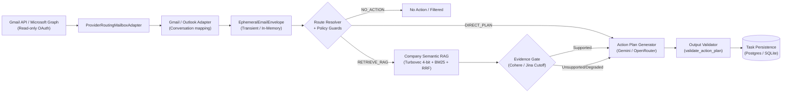

# Email Action Plan & RAG Subsystem (Level 1 Architecture)

**Architecture level:** Level 1 — High-Level Component & Data Flow  
**Status:** Live / Implemented  
**Primary Owner:** `src/cowork_agent/features/email_action_plan`  
**Target Alignment:** Fully Aligned with [TARGET-ARCHITECTURE.md §1 & §2](../TARGET-ARCHITECTURE.md) (with additive SQLite-only Outlook provider)

---

## 1. Subsystem Overview

The Email Action Plan & RAG Subsystem is a single-turn, memory-isolated pipeline that transforms unread Gmail or Outlook messages into structured, body-free action plans. A provider router dispatches mailbox reads to Gmail (`gmail.readonly`) or Microsoft Graph (`Mail.Read`); both adapters normalize mail into the same transient [`EphemeralEmailEnvelope`](../../../src/cowork_agent/domain/target_contracts.py). Gmail retains five-message reply-chain aggregation ([ADR-011](../../../tasks/adr/ADR-011-reply-chain-context-aggregation.md)); from the envelope boundary onward classifier, `NO_ACTION` / `DIRECT_PLAN` / `RETRIEVE_RAG` routing, prompts, RAG, validation, and persistence are provider-independent and unchanged. End-to-end execution metrics and provider generations are traced with Langfuse (`@observe`) without persisting raw email contents.

> [!NOTE]
> Company RAG is strictly retrieval-only for this workflow. Raw email bodies and attachments are never indexed into `data/extracted/` or the Turbovec semantic store.

---

## 2. Key Components & Responsibilities

| Component | Path / Implementation | Level 1 Responsibility |
|---|---|---|
| **Mailbox Router & Adapters** | [`mailbox/router.py`](../../../src/cowork_agent/integrations/mailbox/router.py), [`gmail/provider.py`](../../../src/cowork_agent/integrations/gmail/provider.py), [`outlook/provider.py`](../../../src/cowork_agent/integrations/outlook/provider.py) | Dispatches `search_unread` and `get_thread` by stored provider; Gmail and Graph conversations normalize into the same envelope. Outlook IDs are namespaced `outlook:` while compatible pointer fields remain unchanged. |
| **Shared Body & Link Normalization** | [`normalization.py`](../../../src/cowork_agent/integrations/mailbox/normalization.py) | Converts text/HTML and source links consistently across providers; Gmail regression coverage protects existing output. |
| **Attachment Scope Boundary** | Gmail and Outlook provider adapters | Implements [ADR-003](../../../tasks/adr/ADR-003-defer-attachment-processing.md): records `attachments_present` only and never downloads attachment content. |
| **Route Classifier & Intent Extraction** | [`base.py`](../../../src/cowork_agent/integrations/llm/providers/base.py) (`ConfiguredRouteClassifier`) plus Gemini/Vyce/Mistral/OpenRouter transports | Evaluates truncated email bodies to classify actionability, internal terms, and knowledge sufficiency. Shared prompts live in [`prompts.py`](../../../src/cowork_agent/integrations/llm/providers/prompts.py); parsing in [`parsers.py`](../../../src/cowork_agent/integrations/llm/providers/parsers.py). |
| **Deterministic Route Resolver** | [`routing.py`](../../../src/cowork_agent/features/email_action_plan/routing.py) | Applies policy guards and resolves candidates (`RETRIEVE_RAG` > `DIRECT_PLAN` > `NO_ACTION`). |
| **Deterministic Evidence Gate** | [`evidence.py`](../../../src/cowork_agent/features/email_action_plan/evidence.py) | Filters retrieval chunks and downgrades unsupported retrieval to partial direct plans. |
| **Company Semantic Memory** | [`bootstrap.py`](../../../src/cowork_agent/integrations/rag/bootstrap.py) | Turbovec, BM25, RRF, and reranking over committed `data/extracted/*.md`; gracefully degrades to null memory. |
| **Action Plan Workflow Orchestrator** | [`workflow.py`](../../../src/cowork_agent/features/email_action_plan/workflow.py) | Fetches threads, classifies, retrieves at most once, generates, validates, deduplicates, and persists with Langfuse tracing. |
| **Action Plan Generator & Resilient LLM** | [`base.py`](../../../src/cowork_agent/integrations/llm/providers/base.py) (`ConfiguredActionPlanGenerator`) plus provider transports; OpenRouter last-resort | Synthesizes bounded context and uses the configured fallback hierarchy. Composition root: [`provider_factory.py`](../../../src/cowork_agent/integrations/llm/provider_factory.py). |
| **Output Validator & Privacy Guard** | [`validation.py`](../../../src/cowork_agent/features/email_action_plan/validation.py) | Enforces output structure, citations, and body-leak protection. |

---

## 3. Storage & Memory Boundaries

1. **Transient In-Memory Envelopes:** Raw email text lives exclusively in `EphemeralEmailEnvelope` dataclasses and the in-process [`ShortTermStore`](../../../src/cowork_agent/features/email_action_plan/short_term.py). The store is purged in the `finally` block of `DigestWorker.execute` upon completion or failure. Raw email bodies never reach long-term storage.
2. **Company RAG Corpus:** Curated company documents committed under [`data/extracted/*.md`](../../../data/extracted), indexed at startup by `build_semantic_memory`. The corpus is read-only during execution; incoming emails or user uploads are never written to the company index.
3. **Durable Task Output:** Persisted records in [`TaskRepository`](../../../src/cowork_agent/features/email_action_plan/ports.py) store structured action steps, title, request summary, citation coordinates, and compatible message pointer IDs (`TaskPointer`). Outlook values are namespaced `outlook:` and point to Outlook; no raw email body text or attachment binaries are retained.

---

## 4. LLM Resilience & Multi-Provider Hierarchy

In accordance with [ADR-012](../../../tasks/adr/ADR-012-openrouter-gemini-last-resort.md):
- When `LLM_PROVIDER=openrouter`, requests dispatch with native `models[]` fallback lists configured via `OPENROUTER_ALLOWED_MODELS`.
- On `OpenRouterAPIError` (transport/network failure, 429 rate limit, 5xx upstream, or unparseable payload), the call automatically retries via [`last_resort.py`](../../../src/cowork_agent/integrations/llm/last_resort.py) on Google Gemini using key rotation.
- Schema repair loops run locally before triggering provider fallbacks.

---

## 5. Alignment & Diff vs Target Architecture

- **Target Alignment:** The email action-plan pipeline retains the target's privacy, stateless execution, presence-only attachment, prompt, routing, and evidence-gating boundaries.
- **Workflow Isolation:** Follows [ADR-004](../../../tasks/adr/ADR-004-chat-native-task-episodes.md), keeping email ingestion isolated from conversational memory buffers.
- **Implementation Residue:** Legacy `AttachmentExtractorPort` / `SafeTextAttachmentExtractor` definitions remain in codebase for compatibility/test harness purposes, but are discarded by `DigestWorker` at runtime.
- **Architecture Diff:** Microsoft Graph is an additive provider not named in the target document. It is intentionally available only when `POSTGRES_MODE=off`; no PostgreSQL migration or provider-specific prompt/pipeline branch was added.
