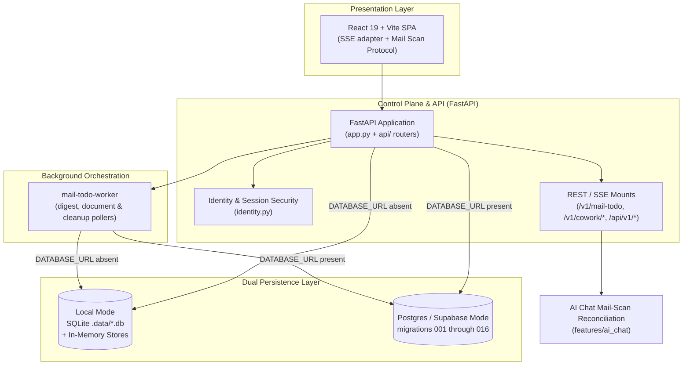

# Control Plane, Persistence & Presentation UIs (Level 1 Architecture)

**Architecture level:** Level 1 — High-Level Component & Data Flow  
**Status:** Live / Implemented  
**Last Updated:** 2026-08-26
**Primary Owner:** `src/cowork_agent/persistence` & `src/cowork_agent/api`  
**Target Alignment:** Core control plane is aligned with [TARGET-ARCHITECTURE.md §1 & §2](../TARGET-ARCHITECTURE.md); linked Outlook is an additive SQLite-only provider variance.

---

## 1. Subsystem Overview

The Control Plane orchestrates HTTP and SSE request routes, manages tenant/user identity and opaque session security, provides dual-mode data persistence (SQLite/Local vs Supabase Postgres), dispatches background digest and document workers, and serves the React 19 web application. Email operations are served on `/v1/mail-todo`; Gmail remains the identity owner and an optional Outlook mailbox is linked to that owner in SQLite mode. AI Chat and Project Document operations remain on `/v1/cowork/*`, accompanied by dedicated endpoints for saved report artifacts (`/api/v1/reports`) and editable raw documents (`/api/v1/raw-documents`).

---

## 2. Key Components & Responsibilities

| Component | Path / Implementation | Level 1 Responsibility |
|---|---|---|
| **FastAPI App** | [`app.py`](../../../src/cowork_agent/app.py) (`mail-todo-api`) | Composition root and Langfuse bootstrap only: `lifespan` assembles one runtime value, teardown reads its handles back from it, and `create_app` mounts the routers. It serves exactly one route of its own, `/health` — every other route lives in a `create_*_router()` module under [`api/`](../../../src/cowork_agent/api) ([ADR-015](../../../tasks/adr/ADR-015-routers-own-their-transport.md)). |
| **API Routers** | [`api/`](../../../src/cowork_agent/api) | One module per subject: `chat.py`, `projects.py`, `reports.py`, `evaluation_jobs.py`, `knowledge.py` (document health, corpus reads, raw documents), `digest_runs.py`, `mailboxes.py`. The mail-scan endpoint remains in `chat.py` with its chat principal, session, history, and buffer seams; it maps private Pydantic activity payloads once before calling feature policy. `dependencies.py` holds the request-scoped seams more than one router needs and admits a helper only once a second router needs it. |
| **Mail-Scan Reconciliation Policy** | [`features/ai_chat/mail_scan_reconciliation.py`](../../../src/cowork_agent/features/ai_chat/mail_scan_reconciliation.py) | Validates aggregate scan state and reconciles desired activity snapshots into durable or buffered `ChatTurn` values without importing from `api`. The route surface and route count are unchanged. |
| **Typed Composition Module** | [`composition.py`](../../../src/cowork_agent/composition.py) | Builds `CoworkRuntime` — one frozen, slotted value holding the report store, PDF renderer, and the `control_plane`, `mailbox`, `chat`, `email_rag`, and `evaluation` groups — once at startup via the group builders. The `chat` group carries an optional `chat_tool_runner` alongside `chat_reply` / `chat_intent_settings` / `chat_routing_service`: all four boot as placeholders and are set in one `replace` after the LLM provider block resolves, since filling a tool's arguments needs those providers. Its Google Calendar settings are read from the environment once in `create_app` and captured into `lifespan`, so no turn re-reads `.env`. It stays `None` unless credentials exist and `GOOGLE_CALENDAR_ENABLED` is true — which is every deployed environment today. Handlers read composed dependencies through the plain `runtime(request)` accessor; only the request-time chat controller cache and factory remain documented app-state exceptions ([ADR-013](../../../tasks/adr/ADR-013-composition-as-typed-value.md)). |
| **Runtime Configuration Boundary** | [`config.py`](../../../src/cowork_agent/config.py) | `load_runtime_environment()` is the single dotenv I/O seam and is called by executable entry points before composition. Settings parsers are pure over an explicit mapping or `os.environ`, so library reads cannot silently reload credentials ([ADR-017](../../../tasks/adr/ADR-017-settings-parsing-is-pure.md)). |
| **Identity & Security** | [`identity.py`](../../../src/cowork_agent/identity.py) & [`config.py`](../../../src/cowork_agent/config.py) | Resolves `VerifiedPrincipal`; opaque session cookies, guest principals, and central ownership guards enforce authorization. |
| **Mailbox OAuth & Availability** | [`api/mailboxes.py`](../../../src/cowork_agent/api/mailboxes.py), [`outlook/provider.py`](../../../src/cowork_agent/integrations/outlook/provider.py) | Gmail OAuth plus optional Microsoft OAuth with PKCE, signed one-time owner state, encrypted rotating refresh tokens, and `Mail.Read` only. `/connections` exposes stable availability; Outlook is `not_configured` or `sqlite_only` when unavailable and never creates a user/session or changes the login cookie. |
| **Persistence Repositories** | [`repositories`](../../../src/cowork_agent/persistence/repositories) | In-memory test fakes, SQLite adapters for local mode, and Postgres adapters for durable cloud/local control-plane mode. |
| **Orchestration Workers** | [`worker.py`](../../../src/cowork_agent/orchestration/worker.py) & [`project_document_worker.py`](../../../src/cowork_agent/orchestration/project_document_worker.py) | In-process digest worker and durable recovery, document ingestion, chunking, and cleanup workers. |
| **Reports & Raw Documents Subsystem** | [`api/reports.py`](../../../src/cowork_agent/api/reports.py), [`integrations/report_pdf`](../../../src/cowork_agent/integrations/report_pdf), [`api/knowledge.py`](../../../src/cowork_agent/api/knowledge.py), [`sqlite_raw_documents.py`](../../../src/cowork_agent/persistence/repositories/sqlite_raw_documents.py) | Manages saved report artifacts (`/api/v1/reports`) with deterministic Unicode PDF export and folder navigation, plus raw document upload/extraction/editing/viewing (`/api/v1/raw-documents`). |
| **React 19 Web SPA** | [`useStreamingChat.ts`](../../../frontend/src/dashboard/hooks/useStreamingChat.ts), [`mailScanProtocol.ts`](../../../frontend/src/dashboard/hooks/mailScanProtocol.ts), [`frontend/`](../../../frontend) | Manages multi-turn AI Chat, execution trace drawer, live reasoning UI, report artifact rendering, document viewing/editing, Gmail/Outlook connections, and project navigation. The hook is the React/SSE/persistence adapter; one deep protocol operation owns mail connection selection, digest polling, cancellation, and ordered snapshots without persisting raw mail into chat memory. |
| **LLM Tracing & Observability** | [`langfuse_bootstrap.py`](../../../src/cowork_agent/integrations/llm/langfuse_bootstrap.py) & [`tracing.py`](../../../src/cowork_agent/integrations/llm/providers/tracing.py) | Bootstraps and routes Langfuse tracing across provider adapters, chat turns, classifier runs, and background workers. |
| **Report Artifact Store** | [`domain/report_artifacts.py`](../../../src/cowork_agent/domain/report_artifacts.py), [`persistence/report_artifacts.py`](../../../src/cowork_agent/persistence/report_artifacts.py), [`api/reports.py`](../../../src/cowork_agent/api/reports.py) | Owns `data/reports/`. `ReportFilename` is the only way to name a report; `FileSystemReportArtifactStore` takes its root by injection and containment-checks every resolved target. `InMemoryReportArtifactStore` is the test double. |

### 2.1 Report Artifact Surface (`/api/v1/reports`)

`REPORTS_DIR` is a module-level constant in [`app.py`](../../../src/cowork_agent/app.py); the raw-document corpus locations it used to sit beside, `RAW_DOCS_DIR` and `EXTRACTED_DIR`, moved to [`api/knowledge.py`](../../../src/cowork_agent/api/knowledge.py) with the handlers that read them. The store and `Fpdf2ReportPdfRenderer` are composed **once** in `lifespan` as typed `CoworkRuntime` fields ([ADR-013](../../../tasks/adr/ADR-013-composition-as-typed-value.md), [ADR-018](../../../tasks/adr/ADR-018-report-pdfs-use-fpdf2-and-bundled-noto-sans.md)), and `create_report_router()` is mounted from `create_app()` alongside the chat, project, knowledge, digest, mailbox, and evaluation routers. Both writers read the one store instance: the HTTP handlers reach it through `runtime(request).reports`, and `_chat_controller_factory` passes it into `ChatController(reports=...)`, so the folder location and filename rule cannot diverge. The PDF route likewise reads only `runtime(request).report_pdf_renderer`; no report dependency uses its own app-state key. Handlers name every report through `ReportFilename.parse` and answer `400` on an unusable name.

| Route | Purpose |
|---|---|
| `GET /api/v1/reports` | Lists stored reports newest first, with content inline. |
| `POST /api/v1/reports` | Saves a report supplied by the artifacts view (`filename` + `content`). |
| `POST /api/v1/reports/open-folder` | Reveals the report folder in the host file manager (`reveal_directory`); failures return `500` with a Vietnamese message. |
| `GET /api/v1/reports/{filename}/download` | `FileResponse` as an attachment, media type derived from the suffix. |
| `GET /api/v1/reports/{filename}/pdf` | Renders the stored Markdown through typed `ReportPdfRenderer` ownership and returns an `application/pdf` attachment named from `ReportFilename`. Production uses fpdf2 with packaged Noto Sans; an injected runtime with no renderer retains `501 pdf_export_unavailable`. |
| `DELETE /api/v1/reports/{filename}` | Deletes one report. |

> [!NOTE]
> PDF export supports Vietnamese headings/body, paragraphs, lists, emphasis, readable links, and code blocks. Raw HTML is escaped and unsupported Markdown remains literal readable text; runtime rendering performs no network or operating-system font lookup.

---

## 3. Storage Mode Switching & Dual Persistence

The application dynamically selects storage backends based on `POSTGRES_MODE` and database configuration:

- **Local Fallback Mode (`POSTGRES_MODE=off` or absent `DATABASE_URL`):**
  Uses SQLite database files under `.data/`:
  - `mail_todo.db` (OAuth / mailbox connections, configured by `GMAIL_CONNECTION_DB_PATH`)
  - `runs.db` (digest run state, progress counters, error tracking)
  - `tasks.db` (synthesized action plans)
  - `chat.db` (chat session registry, turns with execution trace and artifact refs, turn lifecycle, declarative profiles, summaries, and TaskEpisodes with `supersedes`)
  - `chat_identity.db` (guest principal resolution and hashed opaque browser sessions)
  - `projects.db` (project metadata, document catalog, and ingestion/cleanup lease queues)
  - `project_chunks.db` (private document chunk text and full-text search index)
  - `raw_documents.db` (raw document metadata, versioning, and save history)
  - Local document files are saved in `.data/project-documents` via `LocalPrivateStorage` and report files in project report folders. Results, outbox events, and active working memory stay in-process (`InMemoryResultRepository`, `InMemoryOutbox`, `InMemoryChatSessionBuffer`).
  - Outlook connections share the mailbox-connection repository with their Gmail owner. This is the only mode in which the Outlook adapter and OAuth routes are enabled.

- **Cloud Mode (`POSTGRES_MODE=cloud`):**
  Uses `psycopg_pool.AsyncConnectionPool` to connect to hosted Supabase PostgreSQL via `DATABASE_URL_CLOUD` (session or direct `:5432`). Lifespan startup and `mail-todo-worker` boot run idempotent migrations in filename order from `001_mail_todo.sql` through `016_chat_turn_activity.sql` using PostgreSQL advisory locks (`pg_advisory_lock`). Source files and index snapshots are stored in private Supabase Storage buckets.

- **Durable Local MVP (`POSTGRES_MODE=local`, [ADR-010](../../../tasks/adr/ADR-010-local-postgres-control-plane-latency.md)):**
  Connects to a local Docker PostgreSQL container at `127.0.0.1:5432/cowork` via `DATABASE_URL_LOCAL`. Provides full multi-user Postgres schema fidelity and durable queue leasing on developer workstations.

---

## 4. Alignment & Diff vs Target Architecture

- **Clean API & Product Surfaces:** Presentation layers consume REST and SSE endpoints exclusively. Standalone Email digest workflow operates on `/v1/mail-todo`; AI Chat and Project Document features operate on `/v1/cowork/*` ([TARGET §1 & §2](../TARGET-ARCHITECTURE.md)); report artifacts and raw document editing operate on `/api/v1/*`.
- **Email & Chat Capabilities:** Email RAG remains a standalone pipeline while AI Chat streams and persists bounded semantic turn activity. `runMailScanProtocol` owns concurrent provider polling behind one snapshot interface; the React hook projects those snapshots into the shared user-facing timeline and stores only aggregate `mail_scan` metadata with the turn. Transport owns authentication and payload parsing; `features/ai_chat/mail_scan_reconciliation.py` owns the scan/turn consistency and transition rules shared by durable history and the in-process buffer.
- **Security & Identity Isolation:** OAuth tokens are stored encrypted using Fernet (`TokenCipher`). Session cookies are opaque, HttpOnly, and hashed at rest. Caller-supplied tenant/user identifiers are never trusted for authorization; all operations derive tenancy from `VerifiedPrincipal`.
- **Memory & Durability Alignment:** Bounded short-term chat context resides in-process (`InMemoryChatSessionBuffer`), while durable long-term declarative profiles, episodic TaskEpisodes (with `supersedes`), chat turns, and document chunks are persisted in PostgreSQL (or isolated local SQLite files).
- **Presentation Layer:** Production React 19 + Vite + Tailwind 4 web application is the authoritative user interface, including Execution Trace Drawer, Live Reasoning stream, Report Artifact Viewer, and Document Viewer/Editor. Legacy Streamlit developer GUI has been retired.
- **Provider Variance:** PostgreSQL modes remain Gmail-only because the existing SQL provider constraint was deliberately left unchanged. Outlook reports `sqlite_only`; this implementation contains no SQL migration.
- **Observability:** Centralized Langfuse tracing provides span-level and generation-level observability across chat controller, LLM provider calls, and memory retrieval without leaking raw email bodies.
