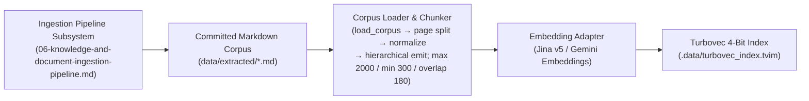
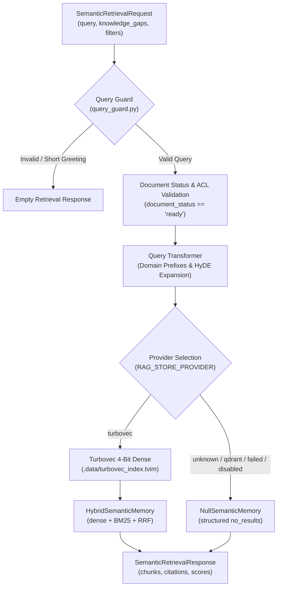

# Enterprise RAG & Vector Memory Subsystem (Level 1 Architecture)

**Architecture level:** Level 1 — Deep-Dive RAG & Vector Memory Subsystem  
**Status:** Live / Implemented  
**Primary Owner:** [`src/cowork_agent/integrations/rag`](../../../src/cowork_agent/integrations/rag)  
**Target Alignment:** Fully Aligned with [TARGET-ARCHITECTURE.md §1, §2 & §3](../TARGET-ARCHITECTURE.md), [ADR-004](../../../tasks/adr/ADR-004-chat-native-task-episodes.md), and [ADR-007](../../../tasks/adr/ADR-007-project-scoped-classifier-gated-user-documents.md)

---

## 1. Subsystem Purpose & Capabilities Matrix

The Enterprise RAG & Vector Memory Subsystem provides high-precision, low-latency semantic retrieval over committed enterprise knowledge documents (`data/extracted/*.md`) and classifier-gated user project documents.

| RAG Capability | Live Implementation | Authoritative Module Location |
|---|---|---|
| **Corpus Ingestion** | Offline CLI for Markdown, DOCX, and PDF extraction with SHA-256 hash manifest verification. | [`ingestion_cli.py`](../../../src/cowork_agent/ingestion_cli.py) & [`knowledge_base.py`](../../../src/cowork_agent/integrations/rag/knowledge_base.py) |
| **Parsing & Chunking** | Structure-aware hierarchical chunking shared by company knowledge and project documents: plain-text headings (`Điều 1. …`) promoted to ATX, tables / fenced code / list blocks kept atomic, heading breadcrumb repeated in every chunk's text, page coordinates (`page_start`, `page_end`) carried through. Size budget `max 2000 / min 300 / overlap 180` characters. | [`markdown_chunking.py`](../../../src/cowork_agent/integrations/rag/markdown_chunking.py), [`structure_normalizer.py`](../../../src/cowork_agent/integrations/rag/structure_normalizer.py) & [`structure_profile.py`](../../../src/cowork_agent/integrations/rag/structure_profile.py) |
| **Embedding Adapters** | Dual embedding support for Jina AI Embeddings (`v5`) and Gemini Embeddings API. | [`embeddings.py`](../../../src/cowork_agent/integrations/rag/embeddings.py) |
| **Primary Vector Store** | In-process 4-bit TurboQuant index (`.data/turbovec_index.tvim`) wrapped with BM25 + RRF. | [`turbovec_memory.py`](../../../src/cowork_agent/integrations/rag/turbovec_memory.py) |
| **Quantized Memory Store** | In-process 4-bit TurboQuant index (`.data/turbovec_index.tvim`) for low-footprint local vector search. | [`turbovec_memory.py`](../../../src/cowork_agent/integrations/rag/turbovec_memory.py) |
| **Hybrid & Lexical Search** | Dense matrix cosine search + Okapi BM25 lexical search adapter fused via Reciprocal Rank Fusion (`k=60`). | [`hybrid.py`](../../../src/cowork_agent/integrations/rag/hybrid.py) & [`bm25.py`](../../../src/cowork_agent/integrations/rag/bm25.py) |
| **Cross-Encoder Reranking** | Jina Cross-Encoder Reranker (`jina-reranker-v2-base-multilingual`) for precision candidate reranking. | [`jina_reranker.py`](../../../src/cowork_agent/integrations/rag/jina_reranker.py) |
| **Diversity & Query HyDE** | Query guard, domain prefix expansion, HyDE hypothetical document generation, and MMR diversification (`lambda=0.7`). | [`query_transform.py`](../../../src/cowork_agent/integrations/rag/query_transform.py) & [`mmr.py`](../../../src/cowork_agent/integrations/rag/mmr.py) |
| **User Project Docs RAG** | Dedicated vector store for uploaded user files with workspace/user/project isolation and classifier gating. | [`project_documents.py`](../../../src/cowork_agent/integrations/rag/project_documents.py) |

---

## 2. Corpus Ingestion Interface & Indexing Boundary

The document ingestion pipeline (DOCX/PDF conversion, SHA-256 manifest tracking, atomic Markdown generation) operates as a standalone subsystem. For the full ingestion pipeline architecture, see **[06-knowledge-and-document-ingestion-pipeline.md](06-knowledge-and-document-ingestion-pipeline.md)**.

1. **Corpus Interface (`knowledge_base.py`):** `load_corpus()` deterministically reads the committed Markdown documents from `data/extracted/*.md`, splits each on its `<!-- Page N -->` markers, and hands the page fragments to the shared chunker. Boundaries come from the document's own structure; size is only the constraint applied where structure runs out.
2. **Structure Recovery (`structure_normalizer.py` + `structure_profile.py`):** Normalization runs inside the chunker's block parser, not in each caller, so the company corpus and uploaded project documents get identical structure recovery. Standalone plain-text headings are promoted to ATX against one `StructureProfile` (`Phần` → `Chương` → `Mục` → `Điều` / `Bước`, levels 1–4, heading ceiling 350 characters), and a bare division such as `Chương I` adopts the uppercase title on the line beneath it. Promotion is idempotent.
3. **Chunk Shaping (`markdown_chunking.py`):** A typed block parser (`heading` / `table` / `code` / `list` / `boilerplate` / `paragraph`) keeps tables, fenced code, and list items atomic and drops page-marker comments. Emission always descends to the leaf heading and merges back up, so a chunk is labelled with the article rather than its chapter. Every chunk repeats its heading breadcrumb (nearest 3 ancestors, ≤240 characters) inside its own `text`, so a retrieved fragment names the article it came from for both dense and BM25 search — and `section` is fitted to the 300-character label limit every citation consumer enforces. A leaf that overflows is cut at the deepest boundary available — block, then clause, then sentence, then characters — carrying ~180 characters of overlap **within that leaf only**, never across an article boundary and never for tables or code. Undersized drafts merge only with siblings under the same heading, never up into the parent.
4. **Size Budget (`ChunkingPolicy`):** `max_chars=2000`, `min_chars=300`, `overlap_chars=180`; `ChunkingPolicy.scaled_to()` derives the whole policy for a caller that states only a ceiling. Chunks never exceed `max_chars` including the breadcrumb.
5. **Turbovec Quantized Indexing (`turbovec_memory.py`):** Pads embedding dimensions to multiples of 8 and builds a 4-bit TurboQuant quantized index saved to `.data/turbovec_index.tvim`.

---

## 3. Multi-Backend Retrieval Architecture

### Retrieval Execution Ladder:

1. **Status filter:** in-process retrievers honor `document_status` on the request before scoring.
2. **Query Transformation (`query_transform.py`):** Applies domain prefixes ("Quy trình thủ tục...", "Hướng dẫn quy định...") and generates hypothetical passages via HyDE.
3. **Hybrid wrapper (`hybrid.py`):**
   - Accepts an injected dense `SemanticMemoryPort` (Turbovec) from `build_semantic_memory()`.
   - Executes lexical keyword search via `BM25SearchAdapter` over the same company corpus.
   - Fuses dense and lexical ranks with Reciprocal Rank Fusion (`ReciprocalRankFusion`, `k=60`).
   - Optionally reranks with Jina and diversifies with MMR (eval / advanced path; factory wrap is dense + BM25 + RRF).
4. **Graceful Degrader (`null_memory.py`):** Returns `RetrievalStatus.NO_RESULTS` if stores or upstream embedding APIs are unavailable, ensuring digest runs and chat turns never crash.

---

## 4. User Project Documents Subsystem RAG Engine

In addition to enterprise company knowledge, the project provides a dedicated vector store for user-uploaded project documents ([ADR-007](../../../tasks/adr/ADR-007-project-scoped-classifier-gated-user-documents.md)):

| Aspect | Technical Implementation |
|---|---|
| **Authoritative File** | [`project_documents.py`](../../../src/cowork_agent/integrations/rag/project_documents.py) |
| **Storage & Extraction** | Private Supabase Storage bucket; `ProjectDocumentExtractor` runs the same structure-aware chunker as company knowledge, one `MarkdownPage` per source page, so every chunk carries `section` plus `page_start` / `page_end`. Extracted text is never persisted as Markdown, so the in-memory normalizer is the only structure recovery these documents get. |
| **Vector Isolation** | Per-project Turbovec `.tvim` plus a six-condition Postgres allowlist (`workspace_id`, `user_id`, `project_id`, selected ids, ready, unexpired). |
| **Classifier Gating** | Access is gated behind `USER_DOCUMENTS_ENABLED=true` and evaluated by `ChatRoutingService` intent classification prior to search execution. |

---

## 5. Caller Integrations

### 5.1 Email Action Plan Subsystem Integration

Every non-`NO_ACTION` email candidate invokes `SemanticMemoryPort.retrieve()` once before its final route is selected. The Email RAG evidence gate accepts only Cohere-scored chunks at or above `max(min_rerank_score, top_score × relative_cutoff_ratio)`; only accepted chunks are injected into the generator. A healthy no-match can produce a direct plan, while unavailable retrieval produces a degraded partial RAG plan without citations.

### 5.2 AI Chat Subsystem Integration

`SemanticChatMemoryAdapter` wraps `SemanticMemoryPort` for the 4-Type Memory Gateway. During chat turns, `read_semantic_context()` retrieves background facts and injects them as verified `current_company_evidence` into the system instructions for the LLM chat reply generator.

---

## 6. Vector Stores & Configuration Summary

| Store Engine | Provider Value | Index Location / Address | Primary Use Case |
|---|---|---|---|
| **Turbovec 4-bit** | `turbovec` (default) | `.data/turbovec_index.tvim` | Company RAG for Email + Chat Type 4 (Hybrid dense + BM25 + RRF). |
| **Project hybrid** | n/a ([ADR-008](../../../tasks/adr/ADR-008-turbovec-project-document-plane.md)) | Postgres `project_document_chunks` + `var/project-indexes/{id}.tvim` | User-uploaded project documents. |
| **Null Memory** | `none` / retired `qdrant` | N/A | Degraded state fallback preventing application crashes. |
