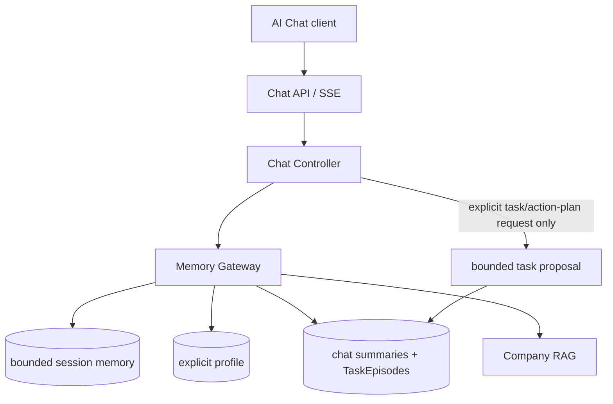
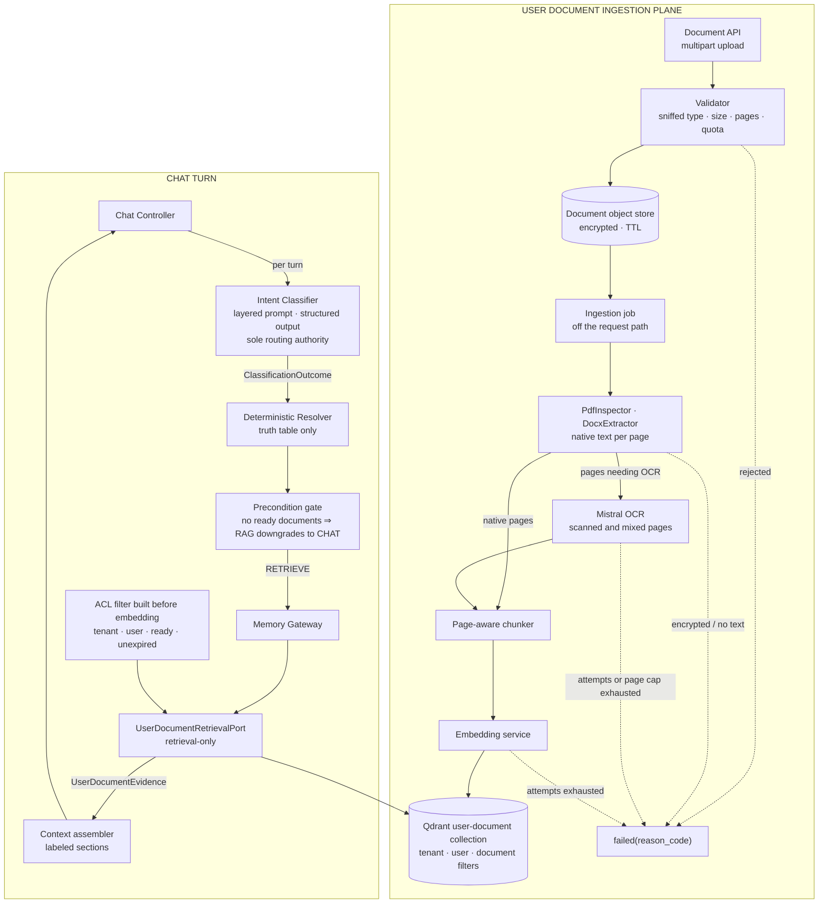

# TARGET ARCHITECTURE

## Cowork Agent — AI Chat Assistant with chat-native TaskEpisodes

**Architecture level:** Level 2 — Production Engineer<br>
**Status:** Baseline target architecture<br>
**Agent pattern:** Multi-turn Chat Controller with typed memory<br>
**Memory model:** Short-term, Long-term Declarative, Episodic, Semantic<br>
**Reflexion:** Not included in this baseline<br>
**Decision authority:** [ADR-004 — Chat-native TaskEpisodes](../../tasks/adr/ADR-004-chat-native-task-episodes.md), extended by [ADR-007 — Project-scoped classifier-gated user documents](../../tasks/adr/ADR-007-project-scoped-classifier-gated-user-documents.md) (§3)<br>
**Primary use case:** Sustain grounded multi-turn chat with safe, selectively retrieved memory. The standalone PRD-v1 Email Agent remains a separate, stateless, memory-free product flow.

---

## 1. Product and Architecture Hypothesis

> Can a multi-turn Cowork Chat Assistant combine typed memory and enterprise
> knowledge while retaining only user-authorized, body-free task records?

The primary transformation is:

```text
User chat message + active session buffer
        +
Explicit profile + eligible episodes + enterprise RAG
        ↓
Streamed chat response
        ↓
If and only if explicitly requested, bounded task proposal
        ↓
Persisted chat turn and system-generated, retrieval-ineligible TaskEpisode
```

### Current workflow characteristics

- The primary product entry is a multi-turn AI Chat session.
- The Chat Controller owns session orchestration, context assembly, task-proposal production, and SSE streaming.
- A TaskEpisode can be proposed and persisted only after an explicit user request for a task or action plan; ordinary chat, background processes, and model inference alone cannot create one.
- The RAG module is a company-knowledge provider. Its citations may be stored as coordinates, but copied chunks and source text may not.
- Gmail is accessed only by the separate, standalone PRD-v1 Email Agent. AI Chat has no executable Email tool, mailbox selector, or Gmail state.
- Reflexion and multi-agent orchestration are out of scope.
- Email attachments are out of scope under ADR-003; record presence only and do not process content.
- System-generated TaskEpisodes are persisted but are not eligible for retrieval until approved or completed in their originating chat session.

---

# 2. Accepted ADR-004 chat-native target

ADR-004 replaces superseded legacy chat designs. The target has no executable in-chat tool and does not turn a standalone PRD-v1 Email run into an episode. The standalone PRD-v1 Email Agent remains available through its own APIs, is memory-free, and is not callable from AI Chat.

This section is extended by §3, which adds the user-document retrieval plane and moves per-turn retrieval routing to an intent classifier. Where the two sections differ on retrieval routing, §3 governs.



## 2.1 Chat Controller and task creation

1. Validate tenant, user, and mandatory `session_id`.
2. Assemble bounded session context, explicit profile, eligible episodes, and selective company-RAG context through the Memory Gateway.
3. Stream the assistant response.
4. Only after an explicit user request to create a task or action plan, render one bounded proposal and persist a TaskEpisode.
5. Record the chat turn and update the session buffer.

Ordinary chat, assistant suggestions, classifier output, background work, and model-only inference must not create a TaskEpisode. The accepted request schema has no tool field: strict deserialization rejects retired `tool_choices` as an unexpected field, before it could select a mailbox, run Gmail work, or write a PRD-v1 task row.

## 2.2 TaskEpisode lifecycle and access policy

```text
explicit user task request
→ system_generated / retrieval_eligible=false
→ user_approved or completed / retrieval_eligible=true
→ rejected / retrieval_eligible=false
```

Allowed transitions are:

```text
system_generated → user_approved | completed | rejected
user_approved → completed | rejected
```

Storage derives `retrieval_eligible` atomically from the resulting `validation_status`; callers cannot supply it independently. Approval, completion, rejection, and single-record deletion require the originating chat session. Eligible retrieval may cross sessions only for the same tenant, user, and `feature: ai_chat` scope. User-wide deletion spans that user's AI Chat sessions and never deletes semantic company RAG.

## 2.3 TaskEpisode contract

```yaml
episode_id: string
record_id: string
tenant_id: string
user_id: string
chat_session_id: string
chat_turn_id: string

task_title: string
minimal_request_paraphrase: string
action_plan:
  - string
rag_citations:
  - document_id: string
    document_title: string
    section: string | null
    source_url: string
missing_information:
  - string

validation_status: system_generated | user_approved | completed | rejected
retrieval_eligible: boolean
source_type: system_generated_chat_task
creation_reason: explicit_user_task_request

created_at: datetime
updated_at: datetime
pipeline_version: string
model_id: string | null
prompt_version: string | null
confidence: number | null
```

`record_id` is an opaque, stable idempotency key derived deterministically from tenant, user, originating chat session, and originating chat turn. The derivation must not expose raw user text. The compact payload contains no raw email, attachment content, full chat transcript, copied RAG chunk, run field, tool field, Gmail field, mailbox identifier, or foreign key to a standalone PRD-v1 task row. Optional citations are company-RAG coordinates only.

## 2.4 Four-type memory policy

| Memory type | Read policy | Write policy | Initial storage |
|---|---|---|---|
| Short-term | Bounded active context for its `session_id` | Chat turns only | Redis or in-process state |
| Long-term declarative | Compact profile per relevant turn | Explicit preference or trusted configuration only | PostgreSQL |
| Episodic | Eligible summaries and TaskEpisodes for the same tenant, user, and `feature: ai_chat` | Summaries; TaskEpisodes after explicit user request only | PostgreSQL |
| Semantic | Selective company-knowledge retrieval | No direct Chat Controller write | Company RAG |

Every memory operation carries `tenant_id`, `user_id`, `session_id`, `feature: ai_chat`, `memory_type`, and `source_id`, and fails closed when the namespace is missing or inconsistent. The recommended logical key is `tenant_id / user_id / session_id / feature: ai_chat / memory_type / record_id`.

## 2.5 Privacy, observability, and implementation order

TaskEpisodes, logs, telemetry, fixtures, and semantic indexing must exclude raw email bodies, attachment content, full chat transcripts, copied RAG chunks, and full assembled prompts. Metadata-only safety counters for unvalidated retrieval, cross-tenant access, raw-email violations, rejected-episode retrieval, and expired-record retrieval must remain zero under test.

Implement the accepted target in this order:

1. Retain the completed standalone PRD-v1 Email Agent without memory changes.
2. Define Chat Controller, session, SSE, Memory Gateway, and TaskEpisode contracts against ADR-004.
3. Implement bounded session memory and explicit-only declarative profiles.
4. Implement body-free TaskEpisode persistence with deterministic `record_id` and atomic lifecycle-derived eligibility.
5. Implement originating-session mutation/deletion and same-tenant/user cross-session eligible retrieval.
6. Implement selective episodic and company-RAG retrieval, then evaluation, retention, deletion-audit, and governance gates.

---

# 3. Accepted extension — AI Chat with user documents ("chat with the PDF")

**Status:** Accepted<br>
**Decision authority:** [ADR-007 — Project-scoped classifier-gated user documents](../../tasks/adr/ADR-007-project-scoped-classifier-gated-user-documents.md)<br>
**Product authority:** [PRD-v3](../../tasks/prds/PRD-v3-chat-with-user-documents.md), [SPEC](../../tasks/specs/SPEC-chat-with-user-documents.md)<br>

> ADR-007 supersedes the user-wide/no-container baseline. The accepted hierarchy is `tenant → user → project → documents + chat sessions`; classifier-gated routing and the separate company/document planes remain unchanged.

**Extends:** §2, the accepted ADR-004 chat-native target<br>
**Replaces:** the withdrawn project-scoped document design (Project container, two coexisting document planes, always-on retrieval)<br>
**Does not change:** the standalone PRD-v1 Email Agent, the company RAG corpus, the declarative profile, or the TaskEpisode trust boundary

This extension lets a user upload documents, ask grounded questions about them in any of their chat sessions, and receive page-level citations. It adds one semantic retrieval **plane** — not a fifth memory type — and moves per-turn routing from cue phrases to a single intent classifier.

## 3.1 What this replaces

| Concern | Withdrawn design | Accepted here |
|---|---|---|
| Container | `Project`; every session bound to one | User documents with optional project scope: `tenant -> user -> project -> documents` |
| Document planes in chat | Two: company and project, split by `document_scope` | One: user documents. Company RAG serves the standalone Email Agent and is disabled in chat behind a flag |
| Retrieval trigger | Deterministic: retrieve on every turn when ready documents exist | The intent classifier decides per turn |
| Routing authority | Cue phrases in `retrieval_policy` | One structured LLM call per turn |

## 3.2 Source classes and the boundary between them

| Property | Company semantic corpus (existing) | User document (new) |
|---|---|---|
| Owner | Workspace administrator | The uploading user |
| Provenance | Curated, approved, `document_status: ready` | Self-service upload, unreviewed |
| Ingestion | Offline CLI into `data/extracted/` | Runtime ingestion job |
| Durability | Rebuildable from the repo corpus | User data; not rebuildable |
| Scope key | `tenant_id` | `tenant_id` + `user_id` + `document_id` |
| Store | Company Qdrant collection or in-repo hybrid index | Separate user-document Qdrant collection |
| Deletion | Corpus re-index | Explicit deletion plus 30-day TTL purge |
| Consumer | Standalone PRD-v1 Email Agent; AI Chat behind `CHAT_COMPANY_RAG_ENABLED` | AI Chat |

Both are `memory_type: semantic` and are read through retrieval-only ports. They are never merged: a user upload cannot enter the company corpus, and company documents are never re-scoped to a user. Raw email is excluded from both; a document enters this plane only through an explicit user upload, and Gmail attachment processing remains out of scope under ADR-003.

## 3.3 Architecture



## 3.4 Ingestion Pipeline

1. **Upload & Validation:** Sniffs file header (PDF, DOCX, TXT, MD), validates size limits, page counts, and user quota.
2. **Parsing & OCR:** Inspects native PDF text streams first. Uses Mistral OCR fallback for scanned or mixed pages.
3. **Chunking & Embedding:** Page-aware chunker emits chunks preserving page numbers and coordinates, embedded via Gemini/Jina embeddings into a dedicated Qdrant collection.
4. **ACL Filtering:** Enforces strict pre-search payload filters (`tenant_id`, `user_id`, `document_status == ready`, `unexpired`).

## 3.5 Intent Classifier & Routing Resolver

Per-turn classification uses a lightweight LLM call (`ChatRoutingService`) to decide whether a turn requires document retrieval:

| Classifier Decision | Action |
|---|---|
| `CHAT_ONLY` | Normal chat reply using session context and memory. |
| `RETRIEVE_USER_DOCS` | Retrieves relevant passages from ready user documents. |
| `RETRIEVE_COMPANY_RAG` | Retrieves relevant background from enterprise company corpus. |
| `PROPOSE_TASK` | Evaluates chat-native task proposal logic. |

If no ready documents exist for the user, document retrieval queries degrade gracefully without throwing errors.

## 3.6 Privacy, Security & Retention

- **Project Scope Isolation:** Documents belong to their tenant, user, and optional project scope. Cross-user sharing is prohibited.
- **Retention & TTL:** Deleted documents undergo immediate ACL revoking and asynchronous 30-day purge from storage and Qdrant collections.
- **No Email Contamination:** Raw email content is never ingested into user document vector stores.

## 3.7 Out of scope for this extension

- Sharing a document with another user or at workspace level;
- Promoting a user document into the company corpus;
- Image, chart, and table-structure understanding beyond OCR text;
- Document editing, annotation, or re-generation;
- Scheduled or automatic re-ingestion;
- Ingesting Gmail attachments, which remains out of scope under ADR-003;
- Document-scoped episodic retrieval;
- Any executable in-chat tool.
