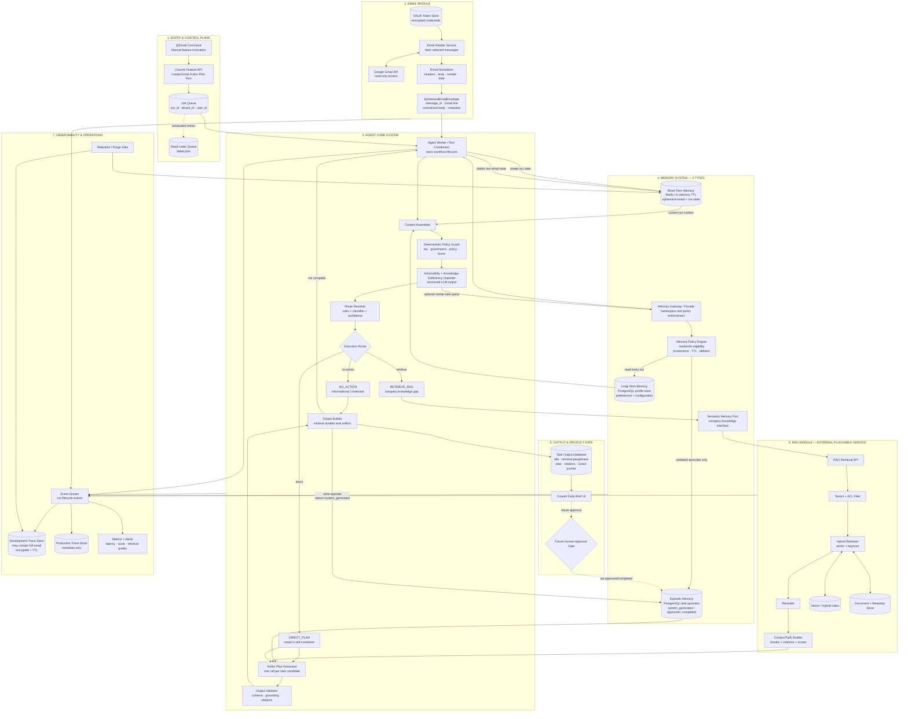
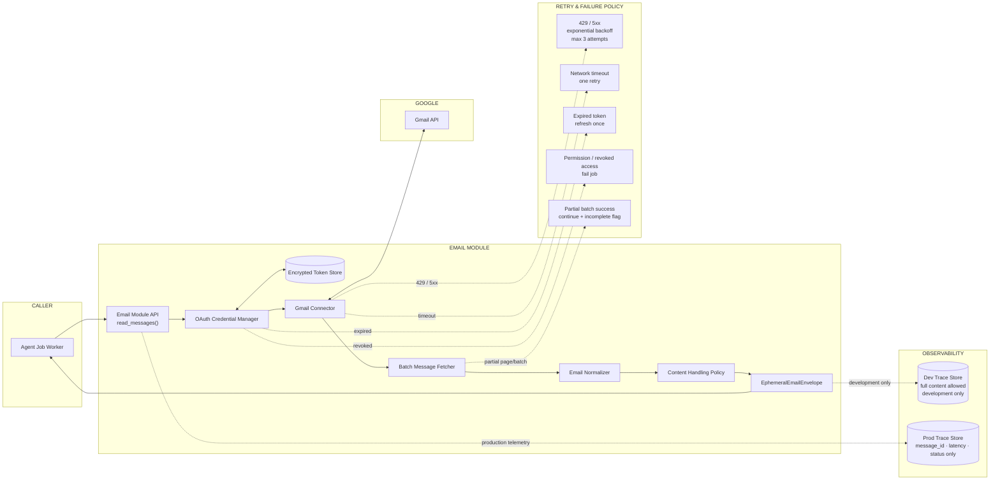
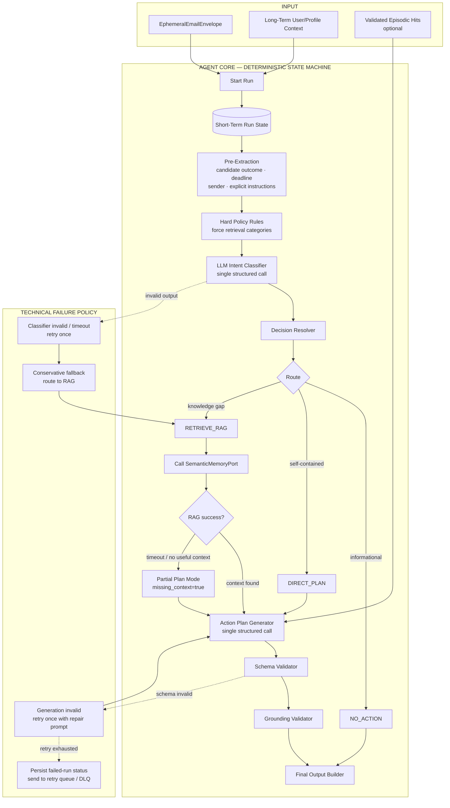
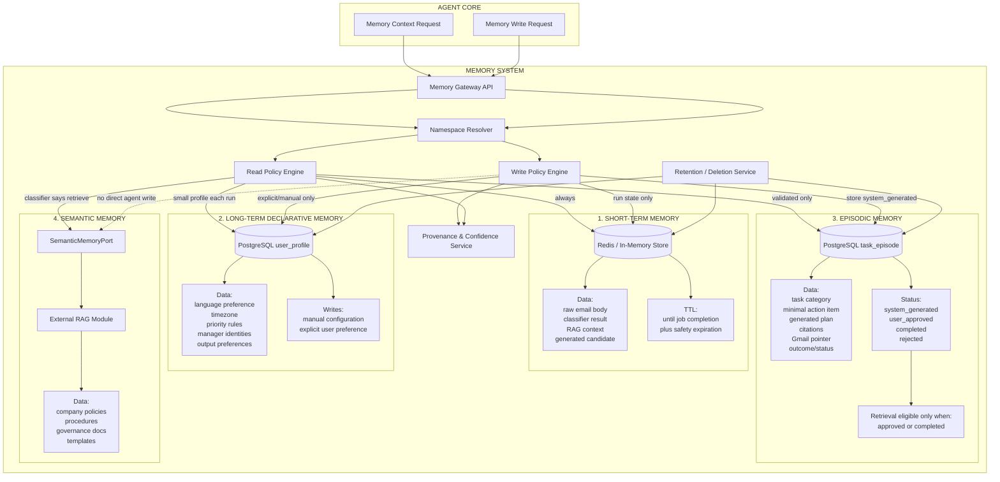
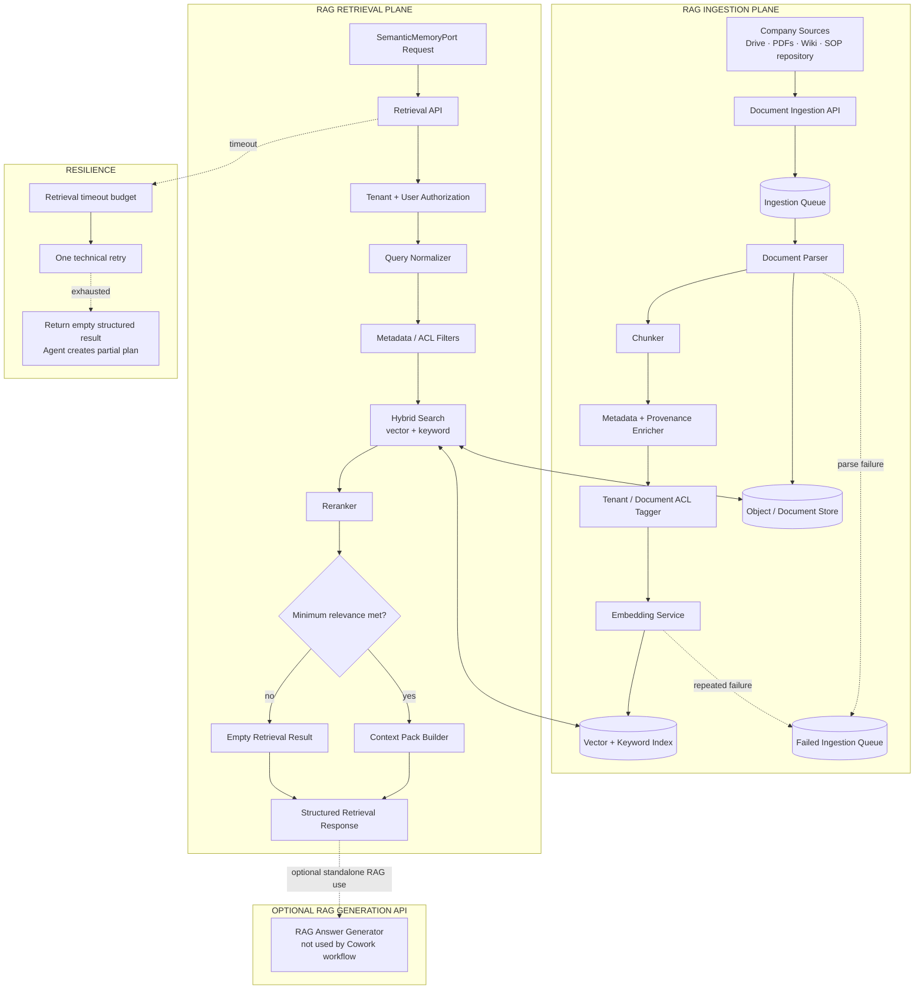
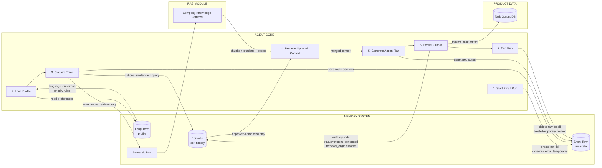

# TARGET ARCHITECTURE

## Cowork Agent — Email to Action Plan

**Architecture level:** Level 2 — Production Engineer<br>
**Status:** Baseline target architecture<br>
**Agent pattern:** Deterministic single-agent workflow with conditional retrieval<br>
**Memory model:** Short-term, Long-term Declarative, Episodic, Semantic<br>
**Reflexion:** Not included in this baseline<br>
**Primary use case:** Read selected Gmail messages, extract Action Items, optionally retrieve company knowledge, and generate cited Action Plans.

---

## 1. Product and Architecture Hypothesis

> Can a Cowork Agent use a one-time email read plus persistent company knowledge to create a useful Action Plan without requiring the email to become semantic company knowledge?

The primary transformation is:

```text
Ephemeral email context
        +
Persistent user and company context
        ↓
Actionability and knowledge-sufficiency routing
        ↓
Direct Action Plan or RAG-supported Action Plan
        ↓
Persisted task output and system-generated episode
```

### Current workflow characteristics

- Gmail is accessed through a read-only Google integration.
- The Cowork feature is invoked manually with `@Email`.
- The workflow is deterministic and one-shot.
- The LLM does not freely loop over arbitrary tools.
- The Agent Core owns orchestration and routing.
- The RAG module is an external, pluggable semantic-memory provider.
- Reflexion and multi-agent orchestration are out of scope.
- Email attachments are out of scope under ADR-003; record presence only and do not process
  content.
- Current outputs are system-generated; users cannot yet edit or approve them.
- System-generated episodes are persisted but are not eligible for retrieval until validated later.

---

# 2. Overall Production Architecture



## Primary execution shape

```text
One or more bounded classifier batch calls
→ one route decision per selected email
→ deterministic thread/incident correlation into task candidates
→ zero or one RAG retrieval per task candidate
→ one Action Plan generation call per task candidate
→ validate and persist output
→ write system-generated episode
→ delete ephemeral run state
```

There is no Reflexion loop. Retries are infrastructure retries, schema-repair retries, or module fallbacks—not autonomous reasoning retries.

---

# 3. Email Module Architecture



## Email module responsibilities

The Email Module owns:

- Google OAuth and credential refresh.
- Gmail API request construction.
- Paging and batch reads.
- Retry behavior for transient Google errors.
- Email-body normalization.
- Gmail message and thread identifiers.
- Gmail source links.
- Partial-success reporting.

The Email Module does not own:

- task persistence;
- long-term memory;
- episodic retrieval policy;
- semantic document ingestion;
- Action Plan generation.

## EphemeralEmailEnvelope contract

```yaml
run_id: string
tenant_id: string
user_id: string

gmail_message_id: string
gmail_thread_id: string
gmail_url: string

sender:
  name: string
  email: string

recipients:
  - string

subject: string
received_at: datetime
labels:
  - string

normalized_body: string
body_format: text | html_converted

attachments_present: boolean
attachments_processed: false

fetch_status: complete | partial
```

---

# 4. Agent Core and Intent Classifier Architecture



## Router purpose

The router answers two separate questions:

1. **Actionability:** Does the email require or suggest user action?
2. **Knowledge sufficiency:** Can the Action Plan be grounded in the email alone?

## Route decision formula

```text
RETRIEVE_RAG =
    actionability is actionable
    AND email_is_sufficient = false
    AND missing knowledge is likely available in company documents
```

## Route labels

```text
NO_ACTION
DIRECT_PLAN
RETRIEVE_RAG
```

## Classifier contract

```yaml
actionability:
  enum:
    - action_required
    - action_suggested
    - informational
    - unclear
    - irrelevant

route:
  enum:
    - no_action
    - direct_plan
    - retrieve_rag

candidate_action_item: string | null

email_is_sufficient: boolean

knowledge_gaps:
  - string

retrieval_query: string | null

expected_document_types:
  - company_policy
  - governance_document
  - procedure
  - guideline
  - template
  - product_documentation

reason_codes:
  - no_action
  - email_self_contained
  - company_procedure_required
  - governance_required
  - policy_required
  - template_required
  - internal_term_unresolved
  - domain_knowledge_required

confidence: number
```

## Conservative failure behavior

```text
Classifier timeout or invalid schema
→ retry classifier once
→ if still invalid, route conservatively to RAG
→ if RAG fails, generate a partial plan
→ expose missing context
→ never invent company procedure
```

---

# 5. Four-Type Memory System Architecture



## Memory read and write policy

| Memory type | Read policy | Write policy | Initial storage |
|---|---|---|---|
| Short-term | Always active during current run | Runtime-only writes | Redis or in-process state |
| Long-term declarative | Load compact profile every run | Manual config or explicit user preference | PostgreSQL |
| Episodic | Retrieve only validated episodes | Store every generated task as `system_generated` | PostgreSQL |
| Semantic | Retrieve only when classifier routes to RAG | No direct agent write | Existing RAG module |

## Episodic decision B

The selected policy is:

```text
Generated Action Plan
→ persist as task episode
→ validation_status = system_generated
→ retrieval_eligible = false
```

Future validation:

```text
User approval or completion signal
→ validation_status = user_approved or completed
→ retrieval_eligible = true
```

## Memory namespace

Every memory operation should carry:

```yaml
tenant_id: string
user_id: string
feature: email_action_plan
memory_type: short_term | long_term | episodic | semantic
run_id: string | null
source_id: string | null
```

Recommended logical key:

```text
tenant_id / user_id / feature / memory_type / record_id
```

## Provenance fields

```yaml
record_id: string
tenant_id: string
user_id: string

memory_type: string

source_type:
  - user_config
  - system_generated_task
  - user_approved_task
  - company_document
  - migration

source_id: string
source_url: string | null

created_at: datetime
updated_at: datetime
expires_at: datetime | null

model_id: string | null
prompt_version: string | null
pipeline_version: string

confidence: number | null
validation_status: string
retrieval_eligible: boolean
```

---

# 6. RAG Module Architecture



## Cowork Agent integration rule

The Cowork Agent calls:

```text
retrieve(query, tenant_scope, filters)
```

It should not call:

```text
retrieve_and_answer(email)
```

The Agent Core remains responsible for the final Action Item and Action Plan.

## Retrieval response contract

```yaml
query_id: string
tenant_id: string

chunks:
  - chunk_id: string
    document_id: string
    document_title: string
    section: string | null
    text: string
    source_url: string
    document_version: string | null
    relevance_score: number
    rerank_score: number | null

retrieval_status:
  enum:
    - success
    - no_results
    - timeout
    - authorization_denied
    - partial

latency_ms: integer
```

---

# 7. Agent and Memory Interaction Flow



---

# 8. State Ownership

| Component | Owns | Must not own |
|---|---|---|
| Job Queue | Run delivery | Email content |
| Email Module | OAuth, Gmail fetching, normalization | Tasks or durable memories |
| Agent Core | Workflow decisions and generation | Company document storage |
| Short-Term Memory | Current run state and temporary email context | Durable user facts |
| Long-Term Memory | Stable user and system configuration | Raw emails |
| Episodic Memory | Derived task history and outcome status | Raw email body |
| RAG Module | Company documents, chunks, embeddings, citations | User task history |
| Task Service | Task title, plan, citations, Gmail pointer | Full email body |
| Observability | Runtime traces and metrics | Product memory source of truth |

---

# 9. Email Content Database Trace

Email content can enter persistent infrastructure through two different paths.

## 9.1 Development observation path

```text
Gmail API
→ Email Module
→ Agent runtime
→ Development Trace Store
```

Possible fields:

```yaml
run_id: string
tenant_id: string
user_id: string
gmail_message_id: string

input_payload: full email content
normalized_email: object
classifier_input: object
classifier_output: object
retrieval_query: string | null
retrieved_context: object | null
generation_input: object
generation_output: object

created_at: datetime
expires_at: datetime
environment: development
```

Required note:

> **ALLOW ONLY FOR CURRENT DEVELOPMENT STAGE**

This trace must not feed:

- long-term memory extraction;
- episodic-memory learning;
- semantic-memory ingestion;
- RAG indexing;
- training datasets;
- analytics exports without separate policy.

## 9.2 Durable task-output path

```text
Email
→ Agent generation
→ Task Output Database
→ Episodic Task Store
```

Persisted task fields:

```yaml
gmail_message_id: string
gmail_url: string

task_title: string
minimal_request_paraphrase: string

action_plan:
  - string

priority: string | null
deadline: datetime | null

rag_citations:
  - document_id: string
    document_title: string
    section: string | null
    source_url: string

missing_information:
  - string

status: system_generated

classifier_confidence: number
generation_confidence: number | null
```

Raw email content may be added later at the database layer if product policy explicitly allows it. If that happens, it should be represented as a separate source record with its own provenance, retention, access policy, and deletion path—not silently embedded inside task or memory rows.

---

# 10. Suggested Internal Service APIs

```text
POST /v1/cowork/email-action-plan/runs
GET  /v1/cowork/email-action-plan/runs/{run_id}

POST /v1/email/messages/read
POST /v1/memory/context/read
POST /v1/memory/episodes/write
POST /v1/rag/retrieve
POST /v1/tasks
```

## Suggested internal events

```text
cowork.run.created
cowork.run.started

email.read.requested
email.read.completed
email.read.partial
email.read.failed

memory.context.requested
memory.context.loaded
memory.context.partial
memory.context.failed

route.decided
route.classifier_retried
route.fallback_to_rag

rag.retrieval.requested
rag.retrieval.completed
rag.retrieval.empty
rag.retrieval.failed

action_plan.generation.started
action_plan.generated
action_plan.validation_failed
action_plan.generation_failed

task.persisted
episode.system_generated

run.completed
run.failed
run.ephemeral_state_deleted
```

---

# 11. Failure and Fallback Paths

## Gmail failures

```text
429 or 5xx
→ exponential backoff
→ maximum three attempts
→ fail message or batch after exhaustion
```

```text
Expired token
→ refresh once
→ retry request
```

```text
Revoked permission
→ fail run
→ mark reauthorization required
```

```text
Partial batch read
→ continue with available emails
→ mark run incomplete
```

## Long-term memory failure

```text
Profile load failure
→ use default profile
→ continue run
→ emit warning event
```

## Episodic memory failure

```text
Episode retrieval failure
→ skip episodic context
→ continue generation
```

Episodic memory is optional context and should not block the core email workflow.

## RAG failure

```text
RAG timeout or module failure
→ retry once
→ return structured empty result
→ generate partial Action Plan
→ expose missing context
```

## Classifier failure

```text
Invalid structured output or timeout
→ retry once
→ if still invalid, route conservatively to RAG
```

## Generation failure

```text
Invalid Action Plan schema
→ repair prompt once
→ if still invalid, fail run or emit degraded informational output
```

## Persistence failure

Use one of:

- transactional write;
- transactional outbox;
- idempotency key based on `run_id + gmail_message_id`;
- retry queue for failed task or episode writes.

---

# 12. Retries, Timeouts, and Idempotency

These are baseline defaults to tune through testing.

| Operation | Baseline timeout | Retry behavior | Blocking? |
|---|---:|---|---|
| Gmail fetch | 10 seconds | Up to 3 retries for transient errors | Yes |
| OAuth refresh | 5 seconds | One attempt | Yes |
| Long-term profile read | 1 second | One fast retry | No |
| Episodic retrieval | 1–2 seconds | No retry or one fast retry | No |
| Intent classifier | 10 seconds | One retry for timeout or schema failure | Yes |
| RAG retrieval | 3–5 seconds | One retry | No; partial-plan fallback |
| Action Plan generation | 20–30 seconds | One repair retry | Yes |
| Task persistence | 3 seconds | Outbox or queue retry | Yes for final success |
| Episode persistence | 3 seconds | Async retry allowed | No |
| Cleanup | Background TTL plus finalizer | Repeated until success | No |

## Idempotency keys

```text
run_id
run_id + gmail_message_id
run_id + operation_name
```

Task writes should use:

```text
idempotency_key = tenant_id:user_id:gmail_message_id:pipeline_version
```

---

# 13. Human Approval

Human approval is not implemented in the current feature.

Current behavior:

```text
Generated task
→ status = system_generated
→ visible in Cowork Daily Brief
→ episodic retrieval disabled
```

Future behavior:

```text
User approves or completes task
→ status = user_approved or completed
→ episodic retrieval enabled
```

Potential future transitions:

```text
system_generated
→ user_approved
→ in_progress
→ completed
```

or:

```text
system_generated
→ rejected
```

High-impact external actions—sending email, changing company systems, purchasing, deleting, or creating calendar events on behalf of the user—must remain outside this baseline unless a human approval gate is added.

---

# 14. Observability and Evaluation

## Development tracing

May include full email and generated output during the current development stage.

Required controls:

- development environment only;
- encrypted storage;
- restricted access;
- automatic TTL;
- environment-level guard preventing accidental production enablement;
- no memory consolidation;
- no semantic indexing;
- no training export by default.

## Production tracing

Metadata only:

```yaml
run_id: string
tenant_id: string
user_id: string
gmail_message_id: string

route: no_action | direct_plan | retrieve_rag
reason_codes:
  - string

classifier_confidence: number
rag_result_count: integer
retrieval_status: string

generation_status: string
validation_status: string

latency_ms:
  email: integer
  memory: integer
  classifier: integer
  rag: integer
  generation: integer
  persistence: integer

token_usage:
  classifier_input: integer
  classifier_output: integer
  generation_input: integer
  generation_output: integer
```

## Metrics

- Email fetch success rate.
- Run completion rate.
- Actionable-email precision and recall.
- RAG-route precision and recall.
- Unnecessary retrieval rate.
- Missed retrieval rate.
- No-result RAG rate.
- Citation coverage.
- Output-schema success rate.
- Partial-plan rate.
- Classifier latency.
- RAG latency.
- End-to-end latency.
- Cost per processed email.
- Episodic validation and retrieval-eligibility rate.

## Highest-risk classifier error

```text
False negative retrieval:
The email requires company knowledge,
but the classifier routes directly to generation.
```

This should be measured separately.

---

# 15. Output Contract

```yaml
task:
  task_id: string
  run_id: string

  gmail_message_id: string
  gmail_url: string
  source_message_ids:
    - string
  incident_key: string | null

  title: string
  request_summary: string

  actionability: action_required | action_suggested | informational
  route: no_action | direct_plan | retrieve_rag

  priority: low | medium | high | urgent | null
  deadline: datetime | null

  action_plan:
    - step: integer
      instruction: string
      supporting_citation_ids:
        - string

  supporting_documents:
    - citation_id: string
      document_id: string
      title: string
      section: string | null
      url: string
      relevance_score: number

  missing_information:
    - string

  classifier_confidence: number
  generation_confidence: number | null

  validation_status: system_generated
  created_at: datetime
```

---

# 16. Architecture Principles

1. **Agent Core owns orchestration.**<br>
   Email and RAG remain external tools or modules.

2. **RAG is semantic memory, not the Agent itself.**<br>
   It retrieves company knowledge; it does not own the final task-generation policy.

3. **Memory reads are selective.**<br>
   Short-term and long-term are loaded by default; episodic and semantic context are conditional.

4. **Memory writes are typed and controlled.**<br>
   Long-term writes are explicit. Episodic writes are allowed as `system_generated`, but retrieval remains disabled until validation.

5. **Raw email and derived task output are different data classes.**<br>
   If raw email persistence is enabled later, it must have a separate schema and lifecycle.

6. **No unsupported company-specific steps.**<br>
   RAG failure produces a partial plan, not a hallucinated procedure.

7. **Use strict schemas.**<br>
   Classifier, RAG, memory, and task outputs must be machine-validated.

8. **Treat retries as infrastructure behavior.**<br>
   No Reflexion or autonomous reasoning loop is included.

9. **Namespacing and provenance are mandatory.**<br>
   Every durable memory record is tenant- and user-scoped.

10. **Optional context must degrade gracefully.**<br>
    Long-term, episodic, and RAG failures have explicit fallback paths.

---

# 17. Initial Implementation Order

1. Define shared data contracts.
2. Implement `EphemeralEmailEnvelope`.
3. Implement run coordinator and queue worker.
4. Implement short-term run-state storage and cleanup.
5. Implement compact long-term profile loading.
6. Implement structured Actionability and Knowledge-Sufficiency Classifier.
7. Implement route resolver with hard policy guards.
8. Wrap the existing RAG module behind `SemanticMemoryPort`.
9. Implement Action Plan Generator and validators.
10. Implement task persistence with idempotency.
11. Implement episodic writes as `system_generated`.
12. Enforce `retrieval_eligible = false` for unvalidated episodes.
13. Add event stream, development tracing, and production telemetry.
14. Build a labeled routing evaluation dataset.
15. Add future human-approval transitions only after the deterministic baseline is stable.

---

# 18. Out of Scope

- Reflexion.
- Multi-agent architecture.
- Autonomous ReAct tool loop.
- Automatic email replies.
- External task execution.
- Email attachment processing.
- Automatic long-term preference extraction from emails.
- Automatic semantic-memory ingestion from emails.
- Retrieval of unvalidated system-generated episodes.
- RAG-owned Action Plan generation.
- High-impact writes without approval.

---

# 19. Baseline Summary

```text
@Email
→ queue
→ Gmail read
→ normalize email
→ create ephemeral run state
→ load compact long-term profile
→ classify actionability and knowledge sufficiency
→ no action, direct generation, or one RAG retrieval
→ generate structured Action Plan
→ validate grounding and citations
→ persist task output
→ persist system-generated episode
→ disable episode retrieval
→ clear ephemeral state
→ emit traces and metrics
```

This document is the baseline target architecture for the first production-oriented implementation of the Cowork Email Action Plan Agent.
