# TARGET ARCHITECTURE

## Cowork Agent — AI Chat Assistant with chat-native TaskEpisodes

**Architecture level:** Level 2 — Production Engineer<br>
**Status:** Baseline target architecture<br>
**Agent pattern:** Multi-turn Chat Controller with typed memory<br>
**Memory model:** Short-term, Long-term Declarative, Episodic, Semantic<br>
**Reflexion:** Not included in this baseline<br>
**Decision authority:** [ADR-004 — Chat-native TaskEpisodes](../../tasks/adr/ADR-004-chat-native-task-episodes.md), extended by [ADR-006 — User-document plane and classifier-gated retrieval](../../tasks/adr/ADR-006-user-document-plane-and-classifier-routing.md) (§21)<br>
**Primary use case:** Sustain grounded multi-turn chat with safe, selectively retrieved memory. The standalone PRD-v1 Email Agent remains a separate, stateless, memory-free product flow.

---

## 1. Product and Architecture Hypothesis

> Can a multi-turn Cowork Chat Assistant combine typed memory and enterprise
> knowledge while retaining only user-authorized, body-free task records?

The primary transformation is:

```text
User chat message + active session buffer
        +
Explicit profile + eligible episodes + enterprise RAG
        ↓
Streamed chat response
        ↓
If and only if explicitly requested, bounded task proposal
        ↓
Persisted chat turn and system-generated, retrieval-ineligible TaskEpisode
```

### Current workflow characteristics

- The primary product entry is a multi-turn AI Chat session.
- The Chat Controller owns session orchestration, context assembly, task-proposal production, and SSE streaming.
- A TaskEpisode can be proposed and persisted only after an explicit user request for a task or action plan; ordinary chat, background processes, and model inference alone cannot create one.
- The RAG module is a company-knowledge provider. Its citations may be stored as coordinates, but copied chunks and source text may not.
- Gmail is accessed only by the separate, standalone PRD-v1 Email Agent. AI Chat has no executable Email tool, mailbox selector, or Gmail state.
- Reflexion and multi-agent orchestration are out of scope.
- Email attachments are out of scope under ADR-003; record presence only and do not process
  content.
- System-generated TaskEpisodes are persisted but are not eligible for retrieval until approved or completed in their originating chat session.

---

# 2. Superseded pre-ADR-004 architecture (historical; not the target)

The material in this historical section predates ADR-004. Its executable
in-chat `@Email` path, Email-derived episodes, Gmail/run/tool provenance, and
Action Plan card lifecycle are superseded and must not guide new work. The
accepted replacement begins in §20. The standalone PRD-v1 Email Agent remains
unchanged and memory-free; mentions of it in this historical record do not
make it an AI Chat capability.

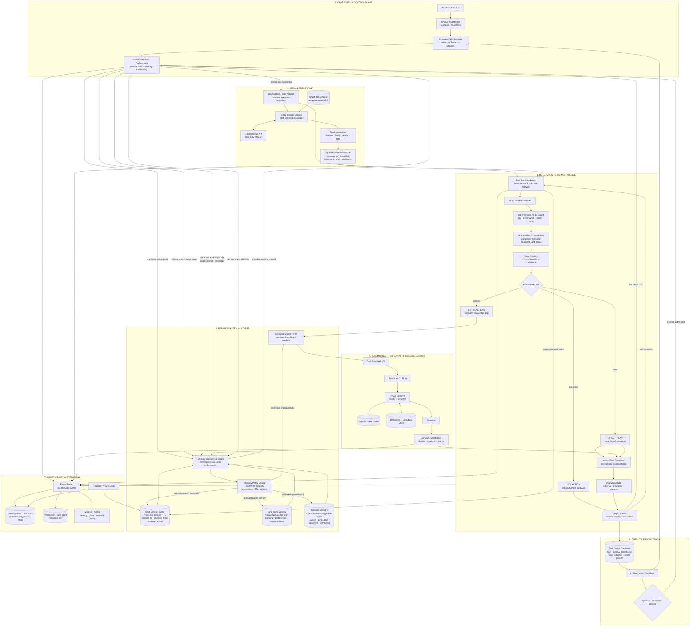

## Primary execution shape

```text
User message → assemble bounded chat memory → stream assistant deltas
→ optionally invoke @Email → one route decision per selected email
→ zero or one RAG retrieval per task candidate
→ one validated Action Plan per task candidate
→ render card and write system-generated episode
→ purge ephemeral email/tool state
```

There is no Reflexion loop. Retries are infrastructure retries, schema-repair retries, or module fallbacks—not autonomous reasoning retries.

---

# 3. Email Module Architecture

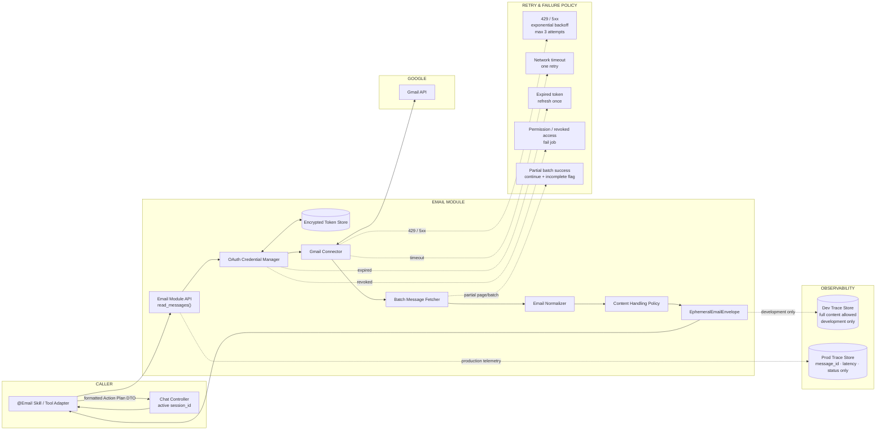

## Email module responsibilities

The Email Module owns:

- Google OAuth and credential refresh.
- Gmail API request construction.
- Paging and batch reads.
- Retry behavior for transient Google errors.
- Email-body normalization.
- Gmail message and thread identifiers.
- Gmail source links.
- Partial-success reporting.

The Email Module does not own:

- chat sessions or SSE connections;
- task persistence;
- long-term memory;
- episodic retrieval policy;
- semantic document ingestion;
- Action Plan generation.

## EphemeralEmailEnvelope contract

```yaml
run_id: string
tenant_id: string
user_id: string

gmail_message_id: string
gmail_thread_id: string
gmail_url: string

sender:
  name: string
  email: string

recipients:
  - string

subject: string
received_at: datetime
labels:
  - string

normalized_body: string
body_format: text | html_converted

attachments_present: boolean
attachments_processed: false

fetch_status: complete | partial
```

---

# 4. Agent Core and Intent Classifier Architecture

The target has two deliberately separate operational modes. The Chat
Controller runs the multi-turn event loop and may invoke allow-listed tools;
the `@Email` tool retains the bounded deterministic V1-M4 pipeline.

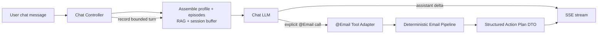

## Chat Controller event loop

1. Validate the user, tenant, and `session_id`.
2. Read bounded working memory, compact profile, eligible episodes, and any
   selectively requested enterprise RAG context through the Memory Gateway.
3. Stream assistant deltas and typed tool events over SSE.
4. Route an explicit `@Email` call through the tool adapter.
5. Render the returned Action Plan DTO in the originating chat thread.
6. Record the turn and derived episode, then purge transient tool data.

## Deterministic `@Email` tool pipeline

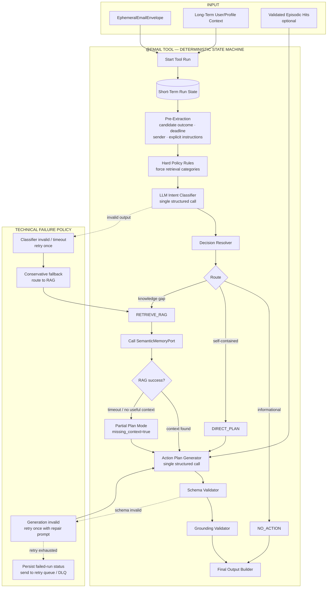

### Router purpose

The router answers two separate questions:

1. **Actionability:** Does the email require or suggest user action?
2. **Knowledge sufficiency:** Can the Action Plan be grounded in the email alone?

### Route decision formula

```text
RETRIEVE_RAG =
    actionability is actionable
    AND email_is_sufficient = false
    AND missing knowledge is likely available in company documents
```

### Route labels

```text
NO_ACTION
DIRECT_PLAN
RETRIEVE_RAG
```

### Classifier contract

```yaml
actionability:
  enum:
    - action_required
    - action_suggested
    - informational
    - unclear
    - irrelevant

route:
  enum:
    - no_action
    - direct_plan
    - retrieve_rag

candidate_action_item: string | null

email_is_sufficient: boolean

knowledge_gaps:
  - string

retrieval_query: string | null

expected_document_types:
  - company_policy
  - governance_document
  - procedure
  - guideline
  - template
  - product_documentation

reason_codes:
  - no_action
  - email_self_contained
  - company_procedure_required
  - governance_required
  - policy_required
  - template_required
  - internal_term_unresolved
  - domain_knowledge_required

confidence: number
```

### Conservative failure behavior

```text
Classifier timeout or invalid schema
→ retry classifier once
→ if still invalid, route conservatively to RAG
→ if RAG fails, generate a partial plan
→ expose missing context
→ never invent company procedure
```

---

# 5. Four-Type Memory System Architecture

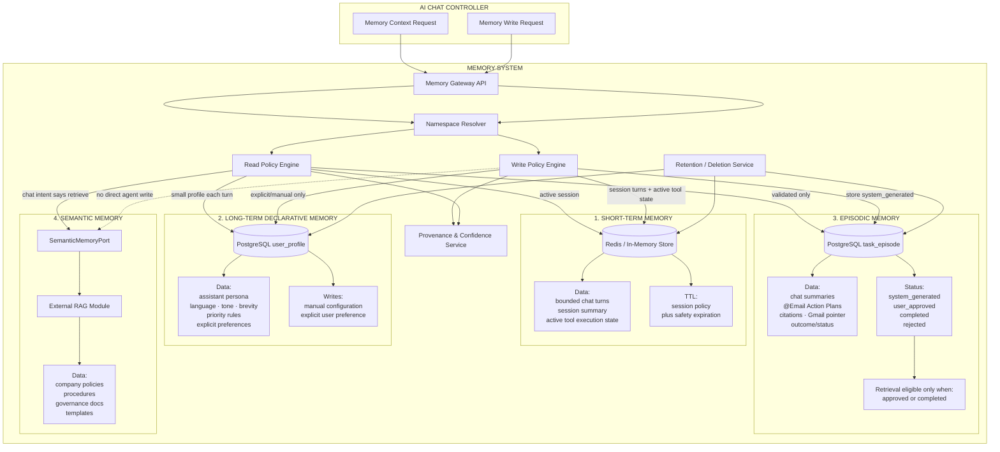

## Memory read and write policy

| Memory type | Read policy | Write policy | Initial storage |
|---|---|---|---|
| Short-term | Active for the current `session_id`; bounded by turn and TTL policy | Chat turns and transient tool-state writes | Redis or in-process state |
| Long-term declarative | Load a compact persona/profile per relevant turn | Manual config or explicit user preference | PostgreSQL |
| Episodic | Retrieve only eligible chat/tool episodes | Store summaries and `@Email` plans as `system_generated` | PostgreSQL |
| Semantic | Retrieve when chat or tool intent requires enterprise knowledge | No direct controller write | Existing RAG module |

## Episodic decision B

The selected policy is:

```text
Generated Action Plan
→ persist as task episode
→ validation_status = system_generated
→ retrieval_eligible = false
```

Future validation:

```text
User approval or completion signal
→ validation_status = user_approved or completed
→ retrieval_eligible = true
```

## Memory namespace

Every memory operation must carry:

```yaml
tenant_id: string
user_id: string
session_id: string
feature: ai_chat
memory_type: short_term | long_term | episodic | semantic
source_id: string | null
```

Recommended logical key:

```text
tenant_id / user_id / session_id / feature: ai_chat / memory_type / record_id
```

## Provenance fields

```yaml
record_id: string
tenant_id: string
user_id: string

memory_type: string

source_type:
  - user_config
  - system_generated_chat_task
  - user_approved_task
  - company_document
  - migration

source_id: string
source_url: string | null

created_at: datetime
updated_at: datetime
expires_at: datetime | null

model_id: string | null
prompt_version: string | null
pipeline_version: string

confidence: number | null
validation_status: string
retrieval_eligible: boolean
```

---

# 6. RAG Module Architecture

**Scope of this section:** the **company knowledge corpus** — administrator-owned,
curated, rebuildable, and read through `SemanticMemoryPort`. The user-document
plane ("chat with the PDF") is a separate plane with its own ingestion job,
collection, and ACL key; it is specified in §21 and is not described here.

The ingestion pipeline is drawn as its own flowchart, above the retrieval
runtime, for both the current and the target architecture. Ingestion and
retrieval are separate lifecycles: they share only the index and the document
registry, they fail independently, and an ingestion outage must never turn into a
retrieval outage.

## 6.1 CURRENT - RAG Module Architecture

### 6.1.1 Current corpus and ingestion pipeline

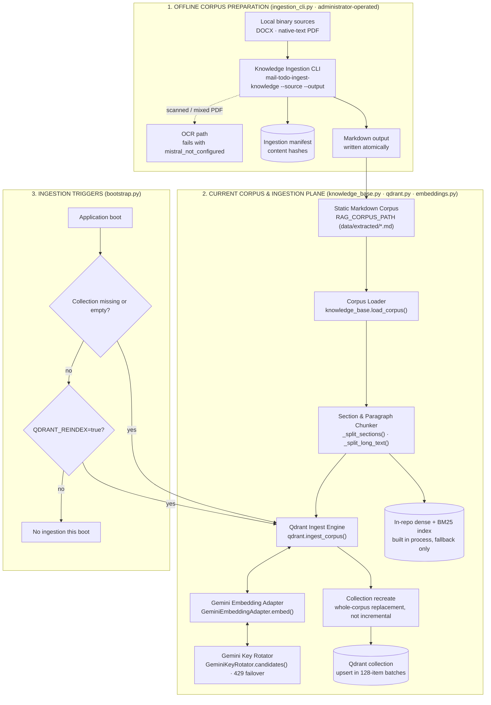

Current ingestion limits, stated plainly: no document registry, no version
history, no incremental document update, no upload API, no asynchronous job, and
no failed-ingestion record. Re-ingestion recreates the collection, so an
ingestion failure mid-run leaves the corpus replaced rather than merged. Scanned
and mixed PDFs stop at `mistral_not_configured` and produce no partial output.

### 6.1.2 Current retrieval runtime

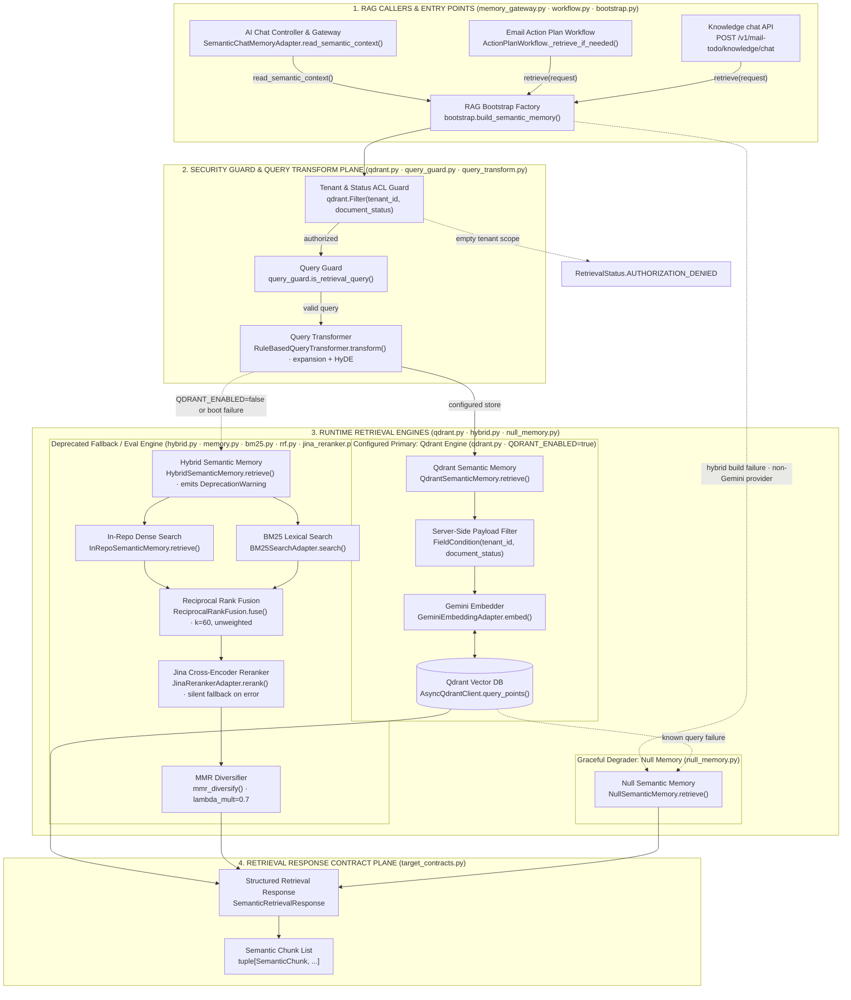

### Current RAG Component Verification Summary (V1-M3 Live Implementation)

| Layer / Component | File Source | Class / Function | Runtime Verification & State |
|---|---|---|---|
| **Entry Point Factory** | `src/cowork_agent/integrations/rag/bootstrap.py` | `build_semantic_memory()` | Async factory. Attempts Qdrant vector store initialization first; falls back to `HybridSemanticMemory`, then `NullSemanticMemory` on store/backend error. |
| **Workflow Callers** | `src/cowork_agent/features/email_action_plan/workflow.py`<br/>`src/cowork_agent/integrations/rag/chat_memory.py` | `SemanticMemoryPort`<br/>`SemanticChatMemoryAdapter` | Email Action Plan workflow triggers retrieval for `RETRIEVE_RAG` candidates. AI Chat Memory Gateway delegates to `SemanticChatMemoryAdapter` for `current_company_evidence`. |
| **Offline Ingestion CLI** | `src/cowork_agent/ingestion_cli.py` | `mail-todo-ingest-knowledge` | Administrator-operated. Discovers local DOCX/native-text PDF, writes Markdown atomically, records hashes in a manifest. Never writes to Qdrant and never downloads Gmail attachments. Scanned/mixed PDFs fail with `mistral_not_configured`. |
| **Corpus Loading & Chunker** | `src/cowork_agent/integrations/rag/knowledge_base.py` | `load_corpus()`, `_split_sections()`, `_split_long_text()` | Reads `data/extracted/*.md` corpus files deterministically. Extracts H1 titles, splits by heading structure, and splits paragraph text exceeding 1200 chars. |
| **Corpus Ingestion & Embeddings** | `src/cowork_agent/integrations/rag/qdrant.py`<br/>`src/cowork_agent/integrations/rag/embeddings.py` | `ingest_corpus()`, `GeminiEmbeddingAdapter` | Embeds chunks via `gemini-embedding-001` with `GeminiKeyRotator` (failover on 429). Recreates the collection, then upserts points with payload metadata in 128-item batches — a corpus replacement, not an incremental update. |
| **Security ACL & Query Guard** | `src/cowork_agent/integrations/rag/qdrant.py`<br/>`src/cowork_agent/integrations/rag/query_guard.py` | Server-side `Filter`<br/>`is_retrieval_query()` | Enforces `tenant_id == tenant_scope` and `document_status == ('ready',)` BEFORE vector query embedding or scoring. Filters out greeting/filler queries. Per-user, group, and document-level ACL are not implemented. |
| **Query Expansion & HyDE** | `src/cowork_agent/integrations/rag/query_transform.py` | `RuleBasedQueryTransformer` | Expands queries with domain prefixes ("Quy trình thủ tục...", "Hướng dẫn quy định...") and generates HyDE hypothetical documents. |
| **Primary Production Engine** | `src/cowork_agent/integrations/rag/qdrant.py` | `QdrantSemanticMemory` | Queries Qdrant vector collection (`Distance.COSINE`) with server-side payload filter and score threshold (`min_score`). Enabled by `QDRANT_ENABLED`; a URL alone does not enable it. |
| **In-Process Fallback Engine** | `src/cowork_agent/integrations/rag/hybrid.py`<br/>`memory.py`, `bm25.py`, `rrf.py`<br/>`jina_reranker.py`, `mmr.py` | `HybridSemanticMemory`, `InRepoSemanticMemory`, `BM25SearchAdapter`, `ReciprocalRankFusion`, `JinaRerankerAdapter`, `mmr_diversify` | Parallel dense (NumPy cosine matrix) and lexical (Okapi BM25) search. Fuses ranks via unweighted Reciprocal Rank Fusion (`k=60`). Reranks via Jina API (`jina-reranker-v2-base-multilingual`). Applies dynamic cutoff and MMR diversity (`lambda_mult=0.7`). Deprecated: fallback and evaluation only. |
| **Null Degrader** | `src/cowork_agent/integrations/rag/null_memory.py` | `NullSemanticMemory` | Safe fallback returning `RetrievalStatus.NO_RESULTS` when vector database or embedding API is unreachable. Also the store for non-Gemini providers. |
| **Response Contract** | `src/cowork_agent/domain/target_contracts.py` | `SemanticRetrievalResponse`, `SemanticChunk` | Immutable dataclasses carrying `query_id`, `tenant_id`, `chunks`, `retrieval_status`, and `latency_ms`. |

### 6.1.3 Measured behaviour the target must respect

These are evaluation results and incident findings, not design opinions. The
target architecture below is shaped by them.

| Finding | Evidence | Consequence for the target |
|---|---|---|
| Unweighted RRF over dense + BM25 **regresses** semantic recall against dense-only; only the cross-encoder reranker recovers it | retained real-embedding benchmark on the in-repo variants | The target must not draw "hybrid search" as an unconditional improvement. Lexical fusion is opt-in, weighted, and only valid with reranking on top |
| The Jina reranker returned Cloudflare `403` for the default `urllib` User-Agent, and the silent fallback hid a total reranker outage | reranker incident | The target reranker must report whether it ran. A silent bypass is a defect, not a graceful degradation |
| `RetrievalLimits.timeout_ms` is not enforced as one end-to-end deadline; each transport has its own timeout | EMAIL-RAG-STATUS known gaps | The target enforces a single retrieval deadline across embedding, search, and rerank |
| `no_results` is structurally supported, but no validated score or margin policy separates unrelated Vietnamese queries from relevant content | EMAIL-RAG-STATUS known gaps | The target makes abstention an explicit, calibrated stage rather than an accident of `min_score` |
| Qdrant adapter mechanics are tested, but retrieval quality is benchmarked only on the in-repo variants | EMAIL-RAG-STATUS known gaps | The target treats the Qdrant quality benchmark as a launch gate, not an optional extra |
| Ingestion is whole-corpus replacement with no registry or version history | `ingest_corpus()` recreates the collection | The target introduces a document registry with incremental, versioned upsert |

### 6.1.4 What the current module is missing for "chat with the PDF"

The company corpus described above cannot serve the user-document feature as
specified in [PRD-v4](../../tasks/prds/PRD-v4-chat-with-user-documents.md), the
[SPEC](../../tasks/specs/SPEC-chat-with-user-documents.md), and §21. The gap is
not tuning; the required scope key, lifecycle, and routing authority do not exist
in the current module.

| Required by SPEC / PRD-v4 | Current state | Blocking |
|---|---|---|
| Scope key `tenant_id` + `user_id` + `document_id` | The Qdrant filter carries `tenant_id` and `document_status` only. There is no `user_id` field to filter on | Yes — cross-user isolation is not expressible, so no user document can be indexed safely |
| A separate user-document collection | One company collection. Chunks would co-mingle with curated corpus content | Yes |
| Runtime upload path (`POST /v1/cowork/chat/documents`, `202`, off the request path) | Administrator CLI only; ingestion runs at application boot | Yes |
| Document status machine `received → extracting → indexing → ready → failed → deleted` with `reason_code` | No registry, no per-document status, no failure record | Yes — status polling and the failure table in §21.11 have nothing to read |
| Page-aware chunking with `page_start` / `page_end` | `_split_sections()` / `_split_long_text()` produce section and paragraph chunks with no page coordinates | Yes — page-level citation is impossible as chunked today |
| OCR for scanned and mixed PDFs | Fails with `mistral_not_configured`; no partial output | Yes for scanned uploads, which are an ordinary case |
| Validation and quota at upload: sniffed media type, byte size, page cap, per-user quota, with the §21.4 reason codes | The CLI validates local files it was pointed at; there is no untrusted-upload guard | Yes |
| Per-document deletion that purges index points, extracted text, and stored bytes | `ingest_corpus()` recreates the whole collection; there is no delete-by-`document_id` | Yes — deletion is a user-data obligation, not an optimisation |
| Retention with `expires_at` and purge of expired documents | No TTL concept; the corpus is permanent and rebuildable | Yes |
| Qdrant mandatory with announced degradation | Bootstrap silently falls back to the deprecated in-repo hybrid engine, then to `NullSemanticMemory` | Yes — for user documents that fallback would return an empty or company-only result while looking healthy |
| Classifier-gated retrieval (`IntentDecision`, `needs_rag`, truth table, fail-open) | `retrieval_policy` gates chat retrieval on hard-coded cue phrases; `query_guard.is_retrieval_query()` only filters greetings | Yes — this is the routing authority the SPEC moves to the classifier |
| Labeled fixture set and the §21.13 routing metrics (recall ≥ 0.95, missed-RAG ≤ 0.05) | No routing fixtures and no routing metrics exist | Yes — the launch gate has nothing to measure |
| `citation_scope` on citations and page fields on the chunk contract | `SemanticChunk` has `section` and `source_url`; no `page_start`, `page_end`, or scope discriminator | Yes |
| `user_document_evidence` labeled context section and its precedence | The assembler knows `current_company_evidence` only | Yes |
| Turn graph `classify → retrieve → assemble → generate → persist` with lean durable state | The chat turn is a straight-line controller call | No — behaviourally replaceable, but required for the routing and clarify branches |
| Telemetry: `user_document.*` and `chat.intent.*` metadata events | Neither vocabulary exists | No — not blocking correctness, blocking evaluation |

Two consequences worth stating explicitly:

- **The user-document plane is greenfield, not a configuration of the company
  corpus.** Everything reusable is at the port and contract level —
  `SemanticMemoryPort` shape, `RetrievalStatus`, the ACL-before-embedding
  discipline, the Gemini embedding adapter with key rotation, and the chunker's
  paragraph-splitting logic. The store, the scope key, the lifecycle, and the
  routing are new.
- **The silent fallback ladder is safe for the company corpus and unsafe here.**
  A curated corpus is rebuildable, so degrading to another engine is a quality
  event. A user's uploaded document exists in exactly one place, so the same
  fallback would answer from the wrong evidence set without saying so. §21
  therefore makes Qdrant mandatory for that plane and requires degradation to be
  announced.

## 6.2 TARGET - RAG Module Architecture

### 6.2.1 Target corpus and ingestion pipeline

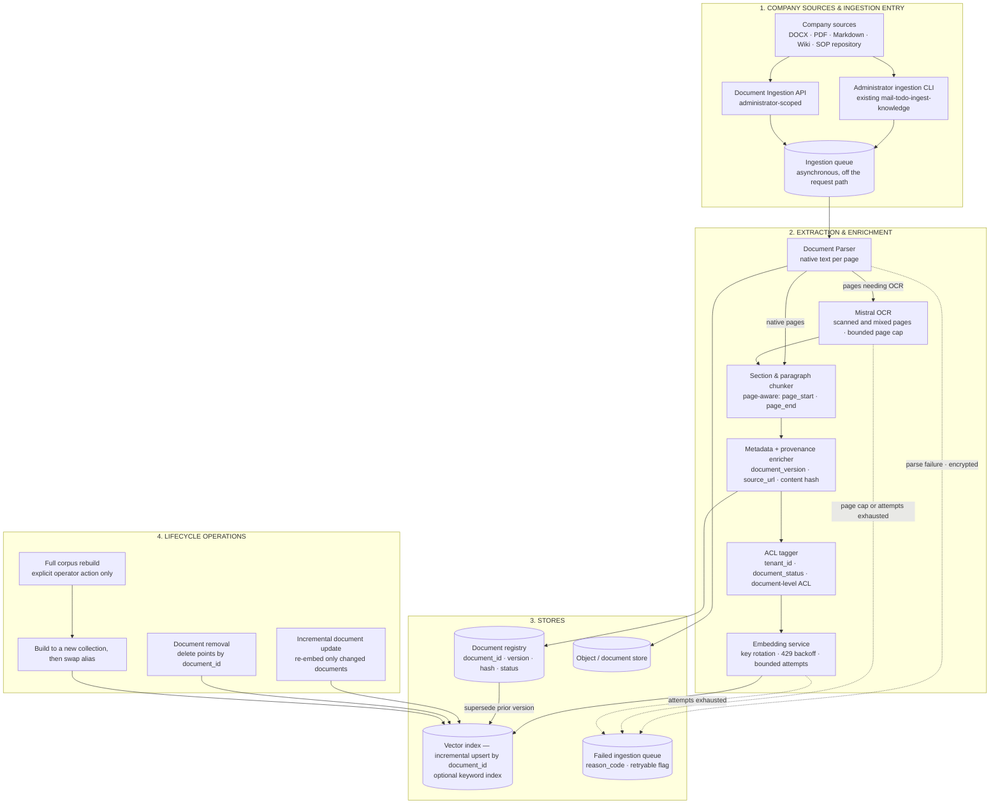

Target ingestion rules:

- **Incremental by default.** A changed document re-embeds that document only; a
  removed document deletes its points by `document_id`. Whole-corpus replacement
  becomes an explicit operator action, and it builds into a new collection and
  swaps an alias so a failed rebuild never leaves the corpus empty.
- **The registry is authoritative** for `document_id`, `document_version`,
  content hash, and `document_status`. Retrieval filters on registry-owned fields;
  nothing infers status from the filesystem.
- **OCR closes the current gap.** `mistral_not_configured` stops being a dead end
  for scanned and mixed PDFs, bounded by the existing page, timeout, and attempt
  caps. Partial or empty extraction is never indexed.
- **Failures are recorded, not lost.** Every failure lands in the failed queue
  with a `reason_code` and a retryable flag.
- **Ingestion never blocks retrieval.** The queue is off the request path, and an
  ingestion outage leaves the last good index serving.
- Raw email bodies and Gmail attachments remain excluded from this corpus.

### 6.2.2 Target retrieval runtime

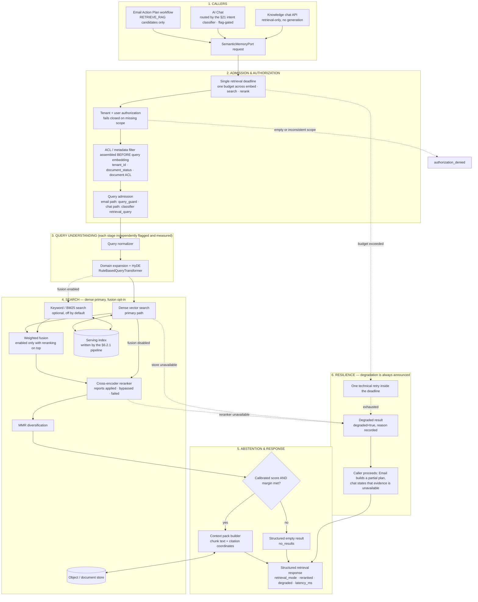

### 6.2.3 What the target changes, and why

| Area | Current (§6.1) | Target (§6.2) | Reason |
|---|---|---|---|
| Store strategy | Qdrant when `QDRANT_ENABLED`, deprecated in-repo hybrid as fallback, null as last resort | Qdrant is the single serving store; the in-repo stack is retained **only** as the offline evaluation harness | Two live retrieval implementations with different ranking behaviour cannot both be the thing measured. The fallback silently changes answer quality |
| Hybrid search | Unweighted RRF over dense + BM25, always on in the fallback engine | Dense primary; lexical fusion is opt-in, weighted, and only valid with reranking enabled | Measured: unweighted fusion regresses semantic recall against dense-only; only the reranker recovers it |
| Reranker | Silent fallback on error | Reports `applied`, `bypassed`, or `failed` in the response; a bypass sets `degraded` | A Cloudflare `403` disabled reranking entirely and the response looked healthy |
| Timeout | Per-transport timeouts | One end-to-end retrieval deadline covering embedding, search, and rerank | `RetrievalLimits.timeout_ms` is currently not enforced as a real budget |
| Abstention | `min_score` threshold only | Calibrated score **and** margin policy, evaluated on Vietnamese negatives | Unrelated queries currently pass the raw threshold too easily |
| ACL | `tenant_id` + `document_status` | Adds document-level ACL, still assembled before query embedding | Company-wide-within-tenant is not sufficient once documents have owners |
| Ingestion shape | Whole-corpus collection recreate, no registry | Registry-backed incremental upsert; rebuild via new collection plus alias swap | A failed rebuild currently leaves the corpus replaced |
| OCR | `mistral_not_configured` dead end | Mistral OCR in the pipeline, bounded and failure-recorded | Scanned PDFs are ordinary company documents |
| Query understanding | Expansion and HyDE always on in the hybrid path | Each stage independently flagged and measured | Expansion and HyDE are ranking changes and must be attributable |
| Failure records | None | Failed ingestion queue with `reason_code` | Operators currently cannot see what failed to ingest |
| Callers | Chat retrieval gated by cue phrases | Chat retrieval routed by the §21 intent classifier and flag-gated | Routing authority moved; see §21.5 |

### 6.2.4 Retrieval quality gates

The target is not "done" when the diagram is built. These gates apply to the
company corpus, measured on the live serving store, not the in-repo harness:

- a live Qdrant retrieval benchmark exists and is the reference for every ranking
  change;
- any fusion, expansion, HyDE, rerank, or threshold change reports its delta
  against dense-only on that benchmark before it is enabled by default;
- an abstention set of unrelated Vietnamese queries must return `no_results`;
- the response reports `retrieval_mode`, `reranked`, and `degraded` so quality
  regressions are attributable to a stage rather than to "RAG".

## Cowork Agent integration rule

The Cowork Agent calls:

```text
retrieve(query, tenant_scope, filters)
```

It should not call:

```text
retrieve_and_answer(email)
```

The `@Email` deterministic pipeline remains responsible for the final Action
Item and Action Plan; the Chat Controller owns only session orchestration and
tool invocation.

## Retrieval response contract

```yaml
query_id: string
tenant_id: string

chunks:
  - chunk_id: string
    document_id: string
    document_title: string
    section: string | null
    text: string
    source_url: string
    document_version: string | null
    relevance_score: number
    rerank_score: number | null

retrieval_status:
  enum:
    - success
    - no_results
    - timeout
    - authorization_denied
    - partial

retrieval_mode: dense | dense_reranked | fused_reranked
reranked:
  enum:
    - applied
    - bypassed
    - failed
degraded: boolean
degraded_reason: string | null

latency_ms: integer
```

`retrieval_mode`, `reranked`, and `degraded` are additions over the current
`SemanticRetrievalResponse`. They exist so a quality regression is attributable
to a stage instead of to "RAG", and so a bypassed reranker or an unavailable
store is visible to the caller rather than indistinguishable from a healthy
low-recall answer. The §21 user-document response extends the same chunk shape
with `page_start` and `page_end`, and its citations carry `citation_scope`.

---

# 7. Agent and Memory Interaction Flow

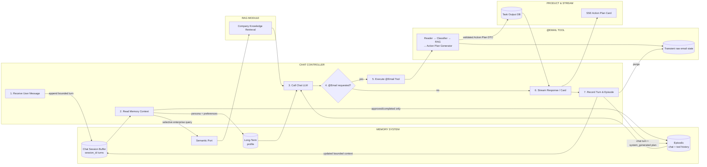

---

# 8. State Ownership

| Component | Owns | Must not own |
|---|---|---|
| Chat Controller | Chat turns, context assembly, tool routing, SSE connection | Raw email persistence or memory storage internals |
| Chat Session Buffer | Bounded short-term turn history for one `session_id` | Durable profile or episodes |
| `@Email` Tool | Transient Gmail fetch and deterministic pipeline state | Chat session history or durable raw email |
| Job Queue | Run delivery | Email content |
| Email Module | OAuth, Gmail fetching, normalization | Tasks or durable memories |
| Deterministic Email Pipeline | Email routing and Action Plan generation | Chat orchestration or company document storage |
| Short-Term Memory | Active chat turns and temporary tool state | Durable user facts or raw-email retention |
| Long-Term Memory | Stable user and system configuration | Raw emails |
| Episodic Memory | Derived task history and outcome status | Raw email body |
| RAG Module | Company documents, chunks, embeddings, citations | User task history |
| Task Service | Task title, plan, citations, Gmail pointer | Full email body |
| Observability | Runtime traces and metrics | Product memory source of truth |

---

# 9. Email Content Database Trace

Raw email content never enters persistent infrastructure. The only permitted
path is transient in-process or TTL-bound tool state that is purged when the
`@Email` invocation completes or fails.

## 9.1 Development observation path

```text
Gmail API
→ Email Module
→ Agent runtime
→ Transient tool state
→ purge on completion/failure
```

Possible fields:

```yaml
run_id: string
tenant_id: string
user_id: string
gmail_message_id: string

input_payload: prohibited
normalized_email: prohibited
classifier_input: metadata_only
classifier_output: metadata_only
retrieval_query: string | null
retrieved_context: citation_ids_only
generation_input: metadata_only
generation_output: derived_action_plan_only

created_at: datetime
expires_at: datetime
environment: development
```

This metadata trace must not feed:

- long-term memory extraction;
- episodic-memory learning;
- semantic-memory ingestion;
- RAG indexing;
- training datasets;
- analytics exports without separate policy.

## 9.2 Durable task-output path

```text
Email
→ Agent generation
→ Task Output Database
→ Episodic Task Store
```

Persisted task fields:

```yaml
gmail_message_id: string
gmail_url: string

task_title: string
minimal_request_paraphrase: string

action_plan:
  - string

priority: string | null
deadline: datetime | null

rag_citations:
  - document_id: string
    document_title: string
    section: string | null
    source_url: string

missing_information:
  - string

status: system_generated

classifier_confidence: number
generation_confidence: number | null
```

Raw email content is transient `@Email` tool-execution data. It must never be
added to task rows, chat history, traces, indexes, or any durable memory type.

---

# 10. Suggested Internal Service APIs

```text
POST   /v1/cowork/chat/sessions
POST   /v1/cowork/chat/sessions/{session_id}/messages  # SSE response
POST   /v1/cowork/chat/sessions/{session_id}/task-episodes/{episode_id}/approve
POST   /v1/cowork/chat/sessions/{session_id}/task-episodes/{episode_id}/complete
POST   /v1/cowork/chat/sessions/{session_id}/task-episodes/{episode_id}/reject
DELETE /v1/cowork/chat/sessions/{session_id}/task-episodes/{episode_id}

POST /v1/cowork/tools/email
POST /v1/cowork/email-action-plan/runs
GET  /v1/cowork/email-action-plan/runs/{run_id}

POST /v1/email/messages/read
POST /v1/memory/context/read
POST /v1/memory/episodes/write
POST /v1/memory/episodes/{episode_id}/transition
POST /v1/rag/retrieve
POST /v1/tasks
```

## Suggested internal events

```text
chat.message.received
chat.tool.invoked
chat.message.completed

cowork.run.created
cowork.run.started

email.read.requested
email.read.completed
email.read.partial
email.read.failed

memory.context.requested
memory.context.loaded
memory.context.partial
memory.context.failed

route.decided
route.classifier_retried
route.fallback_to_rag

rag.retrieval.requested
rag.retrieval.completed
rag.retrieval.empty
rag.retrieval.failed

action_plan.generation.started
action_plan.generated
action_plan.validation_failed
action_plan.generation_failed

task.persisted
episode.system_generated

run.completed
run.failed
run.ephemeral_state_deleted
```

---

# 11. Failure and Fallback Paths

## Gmail failures

```text
429 or 5xx
→ exponential backoff
→ maximum three attempts
→ fail message or batch after exhaustion
```

```text
Expired token
→ refresh once
→ retry request
```

```text
Revoked permission
→ fail run
→ mark reauthorization required
```

```text
Partial batch read
→ continue with available emails
→ mark run incomplete
```

## Long-term memory failure

```text
Profile load failure
→ use default profile
→ continue run
→ emit warning event
```

## Episodic memory failure

```text
Episode retrieval failure
→ skip episodic context
→ continue generation
```

Episodic memory is optional context and should not block the core email workflow.

## RAG failure

```text
RAG timeout or module failure
→ retry once
→ return structured empty result
→ generate partial Action Plan
→ expose missing context
```

## Classifier failure

```text
Invalid structured output or timeout
→ retry once
→ if still invalid, route conservatively to RAG
```

## Generation failure

```text
Invalid Action Plan schema
→ repair prompt once
→ if still invalid, fail run or emit degraded informational output
```

## Persistence failure

Use one of:

- transactional write;
- transactional outbox;
- idempotency key based on `run_id + gmail_message_id`;
- retry queue for failed task or episode writes.

---

# 12. Retries, Timeouts, and Idempotency

These are baseline defaults to tune through testing.

| Operation | Baseline timeout | Retry behavior | Blocking? |
|---|---:|---|---|
| Gmail fetch | 10 seconds | Up to 3 retries for transient errors | Yes |
| OAuth refresh | 5 seconds | One attempt | Yes |
| Long-term profile read | 1 second | One fast retry | No |
| Episodic retrieval | 1–2 seconds | No retry or one fast retry | No |
| Intent classifier | 10 seconds | One retry for timeout or schema failure | Yes |
| RAG retrieval | 3–5 seconds | One retry | No; partial-plan fallback |
| Action Plan generation | 20–30 seconds | One repair retry | Yes |
| Task persistence | 3 seconds | Outbox or queue retry | Yes for final success |
| Episode persistence | 3 seconds | Async retry allowed | No |
| Cleanup | Background TTL plus finalizer | Repeated until success | No |

## Idempotency keys

```text
run_id
run_id + gmail_message_id
run_id + operation_name
```

Task writes should use:

```text
idempotency_key = tenant_id:user_id:gmail_message_id:pipeline_version
```

---

# 13. Human Approval

Human approval is not implemented in the current feature.

Current behavior:

```text
Generated task
→ status = system_generated
→ visible in Cowork Daily Brief
→ episodic retrieval disabled
```

Future behavior:

```text
User approves or completes task
→ status = user_approved or completed
→ episodic retrieval enabled
```

Potential future transitions:

```text
system_generated
→ user_approved
→ in_progress
→ completed
```

or:

```text
system_generated
→ rejected
```

High-impact external actions—sending email, changing company systems, purchasing, deleting, or creating calendar events on behalf of the user—must remain outside this baseline unless a human approval gate is added.

---

# 14. Observability and Evaluation

## Development tracing

Development tracing is metadata-only. It may include identifiers, route
labels, latency, citations, and derived output status, but never raw email,
normalized bodies, or full prompts.

Required controls:

- development environment only;
- restricted access;
- automatic TTL;
- environment-level guard preventing accidental production enablement;
- no memory consolidation;
- no semantic indexing;
- no training export.

## Production tracing

Metadata only:

```yaml
run_id: string
tenant_id: string
user_id: string
gmail_message_id: string

route: no_action | direct_plan | retrieve_rag
reason_codes:
  - string

classifier_confidence: number
rag_result_count: integer
retrieval_status: string

generation_status: string
validation_status: string

latency_ms:
  email: integer
  memory: integer
  classifier: integer
  rag: integer
  generation: integer
  persistence: integer

token_usage:
  classifier_input: integer
  classifier_output: integer
  generation_input: integer
  generation_output: integer
```

## Metrics

- Email fetch success rate.
- Run completion rate.
- Actionable-email precision and recall.
- RAG-route precision and recall.
- Unnecessary retrieval rate.
- Missed retrieval rate.
- No-result RAG rate.
- Citation coverage.
- Output-schema success rate.
- Partial-plan rate.
- Classifier latency.
- RAG latency.
- End-to-end latency.
- Cost per processed email.
- Episodic validation and retrieval-eligibility rate.

## Highest-risk classifier error

```text
False negative retrieval:
The email requires company knowledge,
but the classifier routes directly to generation.
```

This should be measured separately.

---

# 15. Output Contract

```yaml
task:
  task_id: string
  run_id: string

  gmail_message_id: string
  gmail_url: string
  source_message_ids:
    - string
  incident_key: string | null

  title: string
  request_summary: string

  actionability: action_required | action_suggested | informational
  route: no_action | direct_plan | retrieve_rag

  priority: low | medium | high | urgent | null
  deadline: datetime | null

  action_plan:
    - step: integer
      instruction: string
      supporting_citation_ids:
        - string

  supporting_documents:
    - citation_id: string
      document_id: string
      title: string
      section: string | null
      url: string
      relevance_score: number

  missing_information:
    - string

  classifier_confidence: number
  generation_confidence: number | null

  validation_status: system_generated
  created_at: datetime
```

---

# 16. Architecture Principles

1. **The Chat Controller owns session orchestration.**<br>
   `@Email` is an executable skill backed by a deterministic tool pipeline;
   Email and RAG remain external modules.

2. **RAG is semantic memory, not the Agent itself.**<br>
   It retrieves company knowledge; it does not own the final task-generation policy.

3. **Memory reads are selective.**<br>
   The bounded session buffer and compact profile are loaded by default;
   episodic and semantic context are conditional on chat intent.

4. **Memory writes are typed and controlled.**<br>
   Long-term writes are explicit. Episodic writes are allowed as `system_generated`, but retrieval remains disabled until validation.

5. **Raw email is transient tool-execution data.**<br>
   It is never durable memory; only minimal derived task output and references may persist.

6. **No unsupported company-specific steps.**<br>
   RAG failure produces a partial plan, not a hallucinated procedure.

7. **Use strict schemas.**<br>
   Classifier, RAG, memory, and task outputs must be machine-validated.

8. **Treat retries as infrastructure behavior.**<br>
   No Reflexion or autonomous reasoning loop is included.

9. **Namespacing and provenance are mandatory.**<br>
   Every memory operation is scoped by tenant, user, mandatory `session_id`,
   `feature: ai_chat`, memory type, and provenance.

10. **Optional context must degrade gracefully.**<br>
    Long-term, episodic, and RAG failures have explicit fallback paths.

---

# 17. Initial Implementation Order

1. Retain the completed V1-M1..M4 stateless Email RAG pipeline.
2. Define chat session, SSE event, memory-context, and tool-result contracts.
3. Implement the Memory Gateway namespace and Chat Session Buffer.
4. Implement compact declarative profile loading for chat turns.
5. Implement chat-summary and `@Email` Action Plan episodic writes.
6. Enforce `retrieval_eligible = false` for unvalidated episodes.
7. Implement Chat API session endpoints and the SSE Streaming Handler.
8. Implement the Chat Controller event loop and allow-listed tool routing.
9. Wrap the Email RAG pipeline behind the `@Email` Skill / Tool Adapter.
10. Render Action Plan cards and idempotent inline lifecycle controls.
11. Add selective episodic and semantic retrieval for chat intent.
12. Add metadata-only events, evaluation, deletion, and governance gates.

---

# 18. Out of Scope

- Reflexion.
- Multi-agent architecture.
- Autonomous ReAct tool loop.
- Automatic email replies.
- External task execution.
- Email attachment processing.
- Automatic long-term preference extraction from emails.
- Automatic semantic-memory ingestion from emails.
- Retrieval of unvalidated system-generated episodes.
- RAG-owned Action Plan generation.
- High-impact writes without approval.

---

# 19. Baseline Summary

```text
AI Chat client creates or resumes a session
→ user sends a message through the Chat API
→ Chat Controller assembles session, profile, eligible episode, and RAG context
→ SSE handler streams assistant deltas
→ explicit @Email request invokes the stateless Email RAG tool
→ Gmail is read into transient tool state
→ deterministic routing produces a grounded Action Plan
→ Action Plan card streams into the active chat thread
→ minimal task output and a retrieval-ineligible episode persist
→ chat turn is recorded and raw email state is purged
→ inline approval or completion may enable later episodic retrieval
```

This document is the baseline target architecture for the Cowork AI Chat
Assistant, its four-type memory engine, and the executable `@Email` tool.

---

# 20. Accepted ADR-004 chat-native target

ADR-004 replaces the superseded AI Chat design above. The target has no
executable in-chat tool and does not turn a standalone PRD-v1 Email run into
an episode. The standalone PRD-v1 Email Agent remains available through its
own APIs, is memory-free, and is not callable from AI Chat.

This section is extended by §21, which adds the user-document retrieval plane
and moves per-turn retrieval routing to an intent classifier. Where the two
sections differ on retrieval routing, §21 governs.

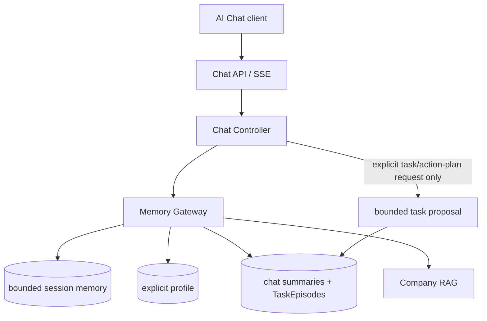

## 20.1 Chat Controller and task creation

1. Validate tenant, user, and mandatory `session_id`.
2. Assemble bounded session context, explicit profile, eligible episodes, and
   selective company-RAG context through the Memory Gateway.
3. Stream the assistant response.
4. Only after an explicit user request to create a task or action plan, render
   one bounded proposal and persist a TaskEpisode.
5. Record the chat turn and update the session buffer.

Ordinary chat, assistant suggestions, classifier output, background work, and
model-only inference must not create a TaskEpisode. The accepted request schema
has no tool field: strict deserialization rejects retired `tool_choices` as an
unexpected field, before it could select a mailbox, run Gmail work, or write a
PRD-v1 task row.

## 20.2 TaskEpisode lifecycle and access policy

```text
explicit user task request
→ system_generated / retrieval_eligible=false
→ user_approved or completed / retrieval_eligible=true
→ rejected / retrieval_eligible=false
```

Allowed transitions are:

```text
system_generated → user_approved | completed | rejected
user_approved → completed | rejected
```

Storage derives `retrieval_eligible` atomically from the resulting
`validation_status`; callers cannot supply it independently. Approval,
completion, rejection, and single-record deletion require the originating chat
session. Eligible retrieval may cross sessions only for the same tenant, user,
and `feature: ai_chat` scope. User-wide deletion spans that user's AI Chat
sessions and never deletes semantic company RAG.

## 20.3 TaskEpisode contract

```yaml
episode_id: string
record_id: string
tenant_id: string
user_id: string
chat_session_id: string
chat_turn_id: string

task_title: string
minimal_request_paraphrase: string
action_plan:
  - string
rag_citations:
  - document_id: string
    document_title: string
    section: string | null
    source_url: string
missing_information:
  - string

validation_status: system_generated | user_approved | completed | rejected
retrieval_eligible: boolean
source_type: system_generated_chat_task
creation_reason: explicit_user_task_request

created_at: datetime
updated_at: datetime
pipeline_version: string
model_id: string | null
prompt_version: string | null
confidence: number | null
```

`record_id` is an opaque, stable idempotency key derived deterministically
from tenant, user, originating chat session, and originating chat turn. The
derivation must not expose raw user text. The compact payload contains no raw
email, attachment content, full chat transcript, copied RAG chunk, run field,
tool field, Gmail field, mailbox identifier, or foreign key to a standalone
PRD-v1 task row. Optional citations are company-RAG coordinates only.

## 20.4 Four-type memory policy

| Memory type | Read policy | Write policy | Initial storage |
|---|---|---|---|
| Short-term | Bounded active context for its `session_id` | Chat turns only | Redis or in-process state |
| Long-term declarative | Compact profile per relevant turn | Explicit preference or trusted configuration only | PostgreSQL |
| Episodic | Eligible summaries and TaskEpisodes for the same tenant, user, and `feature: ai_chat` | Summaries; TaskEpisodes after explicit user request only | PostgreSQL |
| Semantic | Selective company-knowledge retrieval | No direct Chat Controller write | Company RAG |

Every memory operation carries `tenant_id`, `user_id`, `session_id`,
`feature: ai_chat`, `memory_type`, and `source_id`, and fails closed when the
namespace is missing or inconsistent. The recommended logical key is
`tenant_id / user_id / session_id / feature: ai_chat / memory_type / record_id`.

## 20.5 Privacy, observability, and implementation order

TaskEpisodes, logs, telemetry, fixtures, and semantic indexing must exclude
raw email bodies, attachment content, full chat transcripts, copied RAG chunks,
and full assembled prompts. Metadata-only safety counters for unvalidated
retrieval, cross-tenant access, raw-email violations, rejected-episode
retrieval, and expired-record retrieval must remain zero under test.

Implement the accepted target in this order:

1. Retain the completed standalone PRD-v1 Email Agent without memory changes.
2. Define Chat Controller, session, SSE, Memory Gateway, and TaskEpisode
   contracts against ADR-004.
3. Implement bounded session memory and explicit-only declarative profiles.
4. Implement body-free TaskEpisode persistence with deterministic `record_id`
   and atomic lifecycle-derived eligibility.
5. Implement originating-session mutation/deletion and same-tenant/user
   cross-session eligible retrieval.
6. Implement selective episodic and company-RAG retrieval, then evaluation,
   retention, deletion-audit, and governance gates.


---

# 21. Accepted extension — AI Chat with user documents ("chat with the PDF")

**Status:** Accepted<br>
**Decision authority:** [ADR-006 — User-document plane and classifier-gated retrieval](../../tasks/adr/ADR-006-user-document-plane-and-classifier-routing.md)<br>
**Product authority:** [PRD-v4](../../tasks/prds/PRD-v4-chat-with-user-documents.md), [SPEC](../../tasks/specs/SPEC-chat-with-user-documents.md)<br>
**Extends:** §20, the accepted ADR-004 chat-native target<br>
**Replaces:** the withdrawn project-scoped document design (Project container,
two coexisting document planes, always-on retrieval)<br>
**Does not change:** the standalone PRD-v1 Email Agent, the company RAG corpus,
the declarative profile, or the TaskEpisode trust boundary

This extension lets a user upload documents, ask grounded questions about them in
any of their chat sessions, and receive page-level citations. It adds one
semantic retrieval **plane** — not a fifth memory type — and moves per-turn
routing from cue phrases to a single intent classifier.

## 21.1 What this replaces

| Concern | Withdrawn design | Accepted here |
|---|---|---|
| Container | `Project`; every session bound to one | None. Documents belong to the user: `tenant -> user -> document` |
| Document planes in chat | Two: company and project, split by `document_scope` | One: user documents. Company RAG serves the standalone Email Agent and is disabled in chat behind a flag |
| Retrieval trigger | Deterministic: retrieve on every turn when ready documents exist | The intent classifier decides per turn |
| Routing authority | Cue phrases in `retrieval_policy` | One structured LLM call per turn |

A project container adds a key, an API surface, a migration, and a failure branch
without improving answer quality for a single user's corpus. Narrowing the search
is served by an optional `document_ids` filter on the request instead.

## 21.2 Source classes and the boundary between them

| Property | Company semantic corpus (existing) | User document (new) |
|---|---|---|
| Owner | Workspace administrator | The uploading user |
| Provenance | Curated, approved, `document_status: ready` | Self-service upload, unreviewed |
| Ingestion | Offline CLI into `data/extracted/` | Runtime ingestion job |
| Durability | Rebuildable from the repo corpus | User data; not rebuildable |
| Scope key | `tenant_id` | `tenant_id` + `user_id` + `document_id` |
| Store | Company Qdrant collection or in-repo hybrid index | Separate user-document Qdrant collection |
| Deletion | Corpus re-index | Explicit deletion plus 30-day TTL purge |
| Consumer | Standalone PRD-v1 Email Agent; AI Chat behind `CHAT_COMPANY_RAG_ENABLED` | AI Chat |

Both are `memory_type: semantic` and are read through retrieval-only ports. They
are never merged: a user upload cannot enter the company corpus, and company
documents are never re-scoped to a user. Raw email is excluded from both; a
document enters this plane only through an explicit user upload, and Gmail
attachment processing remains out of scope under ADR-003.

## 21.3 Architecture

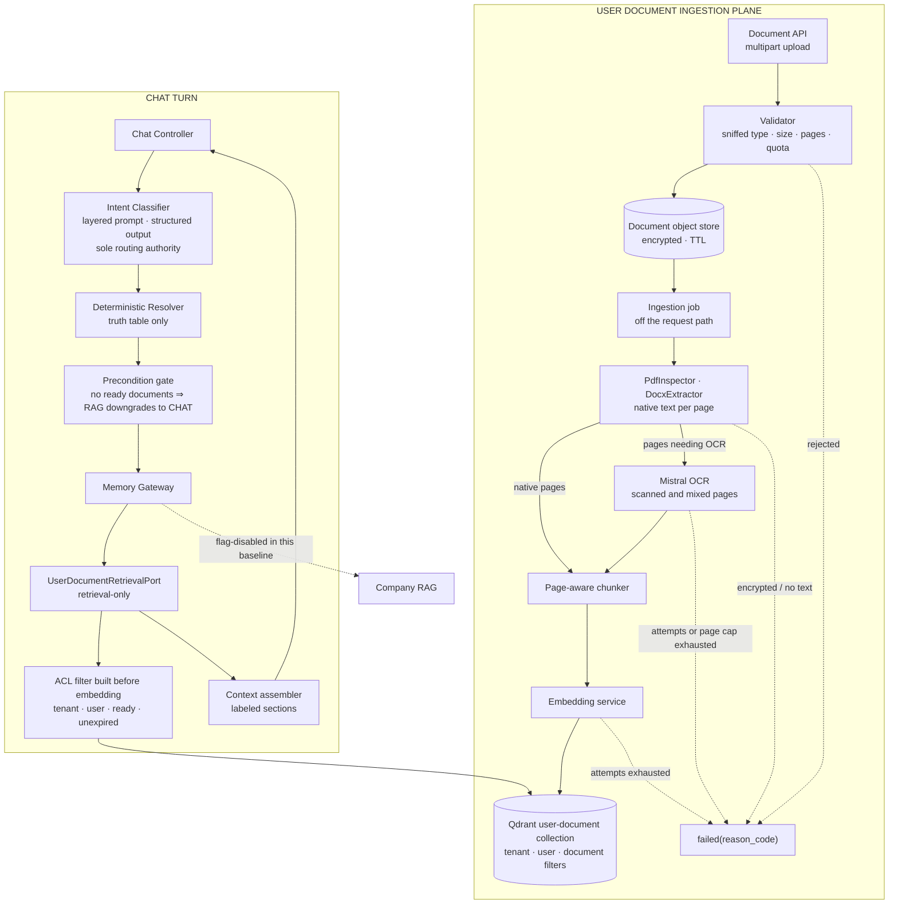

## 21.4 Ingestion contract and status machine

```text
received -> extracting -> indexing -> ready
any state -> failed(reason_code)
ready | failed -> deleted
```

```yaml
document_id: string          # opaque; derived from tenant, user, content sha256
tenant_id: string
user_id: string

filename: string
media_type: application/pdf | application/vnd.openxmlformats-officedocument.wordprocessingml.document
byte_size: integer
page_count: integer | null
ocr_page_count: integer | null
content_sha256: string

status: received | extracting | indexing | ready | failed | deleted
reason_code: string | null
chunk_count: integer | null

created_at: datetime
updated_at: datetime
expires_at: datetime         # created_at + retention, default 30 days
```

Reason codes:

```text
file_too_large · pdf_page_limit_exceeded · empty_extraction
unsupported_media_type · encrypted_document
ocr_page_limit_exceeded · ocr_failed
quota_exceeded · embedding_unavailable · index_unavailable
```

Rules:

- Validation runs on sniffed content type, not on the filename extension.
- `document_id` is derived from `tenant_id`, `user_id`, and the content digest,
  so re-uploading identical bytes returns the existing record instead of indexing
  a second copy. The derivation never encodes filename or document text.
- Extraction reuses the PRD-v1 `PdfInspector` and `DocxExtractor` and their size,
  page, and encryption guards. Because `PdfInspector` shells out to local
  commands, extraction runs inside the job, never on the request path.
- **OCR is enabled.** Pages that `PdfInspector` reports as needing OCR are sent to
  the configured Mistral OCR provider, bounded by the existing `max_ocr_pages`,
  `timeout_seconds`, and `max_attempts` settings. Native pages are never
  re-processed by OCR. Exceeding the page cap fails as
  `ocr_page_limit_exceeded`; a provider failure after bounded retries fails as
  `ocr_failed`. Partial or empty extraction output is never indexed.
- The upload responds `202` and the job runs off the request path. A chat turn
  never blocks on ingestion.
- Chunking is page-aware: every chunk carries `page_start` and `page_end` derived
  from the extractor's `<!-- Page N -->` markers, then splits on paragraph
  boundaries under the existing size cap.
- The administrator-operated `KnowledgeIngestionService` CLI is not modified; the
  two ingestion lifecycles stay separate.

## 21.5 Routing

Routing is centralized in **one structured LLM call per turn**. No keyword or
regex layer may conclude on its behalf, including concluding "yes". A rules layer
strong enough to resolve the hard cases is already a classifier — one that cannot
be improved by prompting or measured against a labeled fixture set.

### Classifier contract

```yaml
intent: chat | knowledge_query | action_request     # observability label only
needs_rag: boolean
needs_tool: boolean
tool_name: string | null
needs_clarification: boolean
retrieval_query: string | null
confidence: number
reason_codes:
  - general_chat
  - user_document_required
  - explicit_document_reference
  - external_action_requested
  - missing_information
```

### Resolver truth table

Evaluated top-down; `intent` never participates.

| Condition | Route |
|---|---|
| `needs_clarification` | `CLARIFY` |
| `needs_rag and needs_tool` | `RAG_TOOL` |
| `needs_rag` | `RAG` |
| `needs_tool` | `TOOL` |
| otherwise | `CHAT` |

This baseline executes `CHAT`, `RAG`, and `CLARIFY`. The action axis exists in
the contract but is disabled at runtime: `needs_tool` is forced to `false`, and
`TOOL` and `RAG_TOOL` are unreachable. There is still no executable in-chat tool.

### Layered prompt

Hard cases are resolved by prompt structure, not by phrase lists. The prompt is
assembled in five fixed tiers: the decision principle; precedence rules; bounded
evidence; calibrated exemplars; the output schema.

The decision principle is a single question:

> Would the quality or correctness of the requested answer depend on retrieving
> information from the user's own documents?

The precedence tier is where trap cases are settled, in order: the subject of the
final request governs; mentioning a document is not needing one; topic-shift
markers reset the subject; a bare deictic reference with no conversational
antecedent points at the documents; vague recall favours retrieval; general
knowledge is chat; an undecidable case with ready documents present resolves to
retrieval.

Evidence given to the classifier is bounded to the current message, the bounded
session turns, and the **titles** of ready documents — never document text or
chunks. Prompts are versioned; changing one requires re-running the labeled
fixture set without regressing the §21.13 thresholds.

### Deterministic layers

Three deterministic mechanisms remain, and each may only **narrow** capability.
None may originate a route:

| Mechanism | Effect |
|---|---|
| Precondition gate | no ready documents ⇒ `RAG` becomes `CHAT`; no embedding and no vector-store call |
| Schema validation | invalid structured output triggers the failure policy |
| Tool-axis downgrade | `needs_tool = true` becomes `false` while the axis is disabled |

### Failure policy

```text
classifier timeout or invalid schema
-> retry once
-> still failing: treat as needs_rag = true when ready documents exist
-> record reason_codes += classifier_unavailable
```

Retrieval routing fails **open**, because answering without evidence is the more
damaging error. The action axis fails **closed**. Stated as a rule: retrieval
routing favours recall, tool routing favours precision.

## 21.6 Retrieval contract

Qdrant is the store for this plane. Unlike the company corpus, there is no
in-repo fallback index: a user document exists only in Qdrant, so an unavailable
vector store degrades the plane explicitly rather than silently substituting
other evidence.

```yaml
# request
tenant_id: string
user_id: string
session_id: string
feature: ai_chat
document_scope: user_document

query: string
document_ids:                 # optional narrowing; default is every ready document
  - string

limits:
  top_k: integer
  min_score: number
  timeout_ms: integer
```

```yaml
# response
chunks:
  - chunk_id: string
    document_id: string
    document_title: string
    section: string | null
    page_start: integer
    page_end: integer
    text: string
    relevance_score: number
    rerank_score: number | null

retrieval_status: success | no_results | timeout | authorization_denied | partial
degraded: boolean
latency_ms: integer
```

ACL is applied first: the `tenant_id`, `user_id`, `ready`-status, and unexpired
conditions are assembled **before** the query is embedded, so a chunk belonging to
another user is never scored. A missing or inconsistent scope fails closed before
any I/O.

## 21.7 Turn orchestration and durable state

The turn is a small graph — `classify -> retrieve -> assemble -> generate ->
persist` — with conditional edges to `assemble` for `CHAT` and to `clarify` for
`CLARIFY`. Node behaviour is framework-free and unit-testable in isolation; only
the graph assembly module knows the orchestration library.

Durable turn state stays lean:

```text
messages · tenant_id · user_id · session_id · query
needs_rag · needs_tool · needs_clarification · route · retrieval_query
citation_ids · errors · final_answer
```

Document bytes, extracted text, retrieved chunks, and assembled prompts are
forbidden in this state. Retrieved chunks belong to the per-turn context plane.
The `ChatSessionBufferPort` remains the source of truth for session state; a
graph checkpointer, if enabled, is a development aid only.

## 21.8 Context assembly and conflict precedence

The assembler gains one labeled section, `user_document_evidence`:

```text
current_instruction
> user_document_evidence
> current_company_evidence
> stored_preference
> advisory_episode
```

Scope of authority is explicit, because rank alone is not the whole rule:

- A user document is authoritative for **its own content** — what it says, on
  which page.
- Company RAG remains authoritative for **company procedure and policy** wherever
  it is enabled.
- When the two contradict each other, both are surfaced with their citations and
  the conflict is stated. It is never silently resolved in favour of the higher
  rank.
- When no chunk clears the score threshold, the assistant states that the answer
  is not present in the user's documents and lists what is missing. Invention from
  parametric knowledge is a validation failure, as in §11.

## 21.9 Memory interaction

| Memory type | Change |
|---|---|
| Short-term | None |
| Long-term declarative | None. Documents are never a preference source |
| Episodic | Citations may carry document coordinates |
| Semantic (company) | None to the corpus; chat-side retrieval is flag-disabled in this baseline |
| Semantic (user document) | New plane defined here |

Episodic retrieval scope is unchanged: eligible episodes are still selected by
tenant, user, and `feature: ai_chat` as accepted in PRD-v2 FR-09.

A TaskEpisode may cite a user document as coordinates only:

```yaml
rag_citations:
  - citation_scope: company | user_document
    document_id: string
    document_title: string
    section: string | null
    page_start: integer | null
    page_end: integer | null
    source_url: string | null
```

Copied document text, extracted page text, and full chat transcripts remain
banned from episodes, logs, telemetry, and fixtures. Deleting a document does not
delete episodes that cite it; such a citation renders as unavailable.

## 21.10 Internal API surface

```text
POST   /v1/cowork/chat/documents                 multipart -> 202 {document_id, status}
GET    /v1/cowork/chat/documents                 list with status
GET    /v1/cowork/chat/documents/{document_id}   status, reason_code, counts
DELETE /v1/cowork/chat/documents/{document_id}   204; purges index, object, text
```

Chat session and message endpoints are unchanged. No new SSE event type is
introduced: document evidence is disclosed through the existing `memory_citation`
event, discriminated by `citation_scope`. Ingestion progress is polled through the
document status endpoint, not streamed.

## 21.11 Failure and fallback paths

| Failure | Behavior |
|---|---|
| Validation rejection | `failed(reason_code)` at upload; no job, no retained bytes beyond the failure record |
| Extraction failure | `failed`; the document is never indexed and chat is unaffected |
| OCR provider outage | bounded retries, then `failed(ocr_failed)`; native-text pages are not indexed alone |
| Embedding provider outage | remain `indexing`, bounded retries with backoff, then `failed(embedding_unavailable)` |
| Qdrant unavailable at query time | one retry, then an empty result with `degraded: true`; the turn states that document evidence is unavailable |
| Retrieval timeout | one retry, then `timeout` with `degraded: true` |
| Document deleted or expired mid-session | excluded by the retrieval filter; the turn proceeds without it |
| No chunk above threshold | `no_results`; the answer states the documents do not cover the question |
| Classifier unavailable | retry once, then fail open to retrieval; see §21.5 |

A degraded document plane never falls back to unsourced generation, and never
affects the standalone PRD-v1 Email Agent.

## 21.12 Privacy, retention, and deletion

- Uploaded bytes, extracted text, and OCR output are user-owned durable data:
  encrypted at rest, access-checked on every read, and excluded from logs,
  production telemetry, traces, and test fixtures.
- OCR sends page images to an external provider. That transfer is part of the
  documented upload path and must be disclosed in product copy; OCR output is
  never retained by the pipeline outside the document's own storage.
- Document text never enters the company corpus, TaskEpisodes, the declarative
  profile, or any PRD-v1 Email path.
- **Retention defaults to 30 days** from upload, configurable per tenant. Expired
  documents are excluded from retrieval before ranking and purged by the existing
  background purge mechanism.
- Deletion is supported per document, per user, and feature-wide. It purges the
  object store, the extracted text, and the Qdrant points, and is repeatable until
  every store confirms.

## 21.13 Observability and evaluation gates

Metadata-only events extend the existing vocabulary:

```text
user_document.upload.accepted · user_document.upload.rejected
user_document.ingestion.started · user_document.ocr.invoked
user_document.ingestion.completed · user_document.ingestion.failed
user_document.deleted · user_document.expired

chat.intent.classified · chat.intent.precondition_downgraded
chat.intent.classifier_retried · chat.intent.fallback_to_rag
chat.route.decided
user_document.retrieval.requested · .completed · .empty · .degraded
```

Raw query text, chunk text, page text, and assembled prompts are prohibited
telemetry fields.

Routing quality is gated on a labeled fixture set of at least 60 cases, split
evenly across obvious-RAG, obvious-chat, ambiguous, and distractor groups, with no
overlap between prompt exemplars and fixture cases:

| Metric | Threshold |
|---|---|
| Retrieval recall | >= 0.95 |
| Missed-RAG rate | <= 0.05 |
| Retrieval precision | >= 0.75 |
| Citation accuracy | >= 0.90 |
| Classifier p95 latency | <= 1500 ms |

Missed-RAG rate is the deciding metric: it measures the assistant answering
confidently without reading a document it should have read.

These metadata-only safety counters must remain zero under test: cross-tenant
document retrieval, cross-user document retrieval, retrieval of an expired or
deleted document, and document text appearing in an episode, log, or telemetry
field.

## 21.14 Implementation order

1. Contracts: document record, chunk, classifier decision, route, retrieval
   query and response, and the citation-scope extension.
2. Ingestion job: validation, extraction, Mistral OCR, page-aware chunking, and
   the status machine — no retrieval yet.
3. Qdrant user-document collection with ACL-first filtering and deletion
   propagation.
4. Classifier, layered prompt, resolver, labeled fixture set, and the §21.13
   metrics.
5. Turn graph, the `user_document_evidence` context section, and page-level
   citation rendering.
6. Retention, deletion audit, safety counters, and evaluation gates.

Steps 1 to 3 do not change chat behaviour; chat behaviour changes at step 4.

## 21.15 Out of scope for this extension

- sharing a document with another user or at workspace level;
- promoting a user document into the company corpus;
- a project or folder container for grouping documents;
- image, chart, and table-structure understanding beyond OCR text;
- document editing, annotation, or re-generation;
- scheduled or automatic re-ingestion;
- ingesting Gmail attachments, which remains out of scope under ADR-003;
- document-scoped episodic retrieval;
- any executable in-chat tool, including `@Email`.