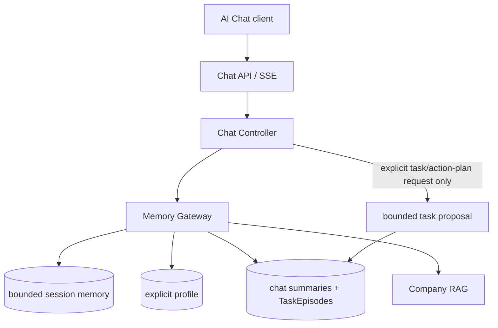
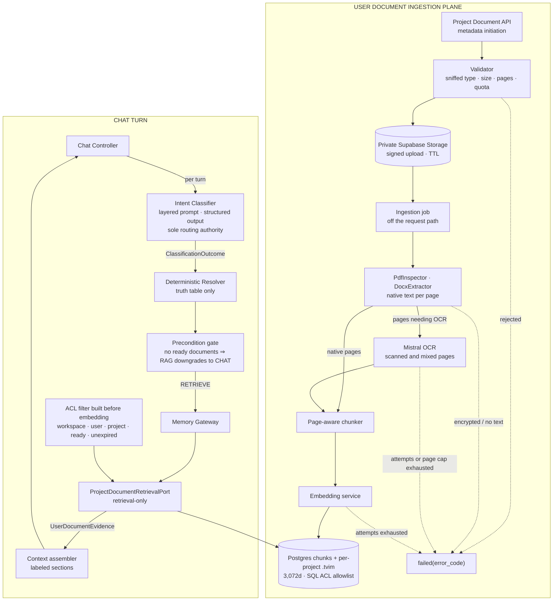

# TARGET ARCHITECTURE

## Cowork Agent — AI Chat Assistant with chat-native TaskEpisodes

**Architecture level:** Level 2 — Production Engineer<br>
**Status:** Baseline target architecture<br>
**Last aligned with implementation:** 2026-08-13<br>
**Agent pattern:** Multi-turn Chat Controller with typed memory<br>
**Memory model:** Short-term, Long-term Declarative, Episodic, Semantic<br>
**Reflexion:** Not included in this baseline<br>
**Decision authority:** [ADR-004 — Chat-native TaskEpisodes](../../tasks/adr/ADR-004-chat-native-task-episodes.md), extended by [ADR-007 — Project-scoped classifier-gated user documents](../../tasks/adr/ADR-007-project-scoped-classifier-gated-user-documents.md) (§3)<br>
**Primary use case:** Sustain grounded multi-turn chat with safe, selectively retrieved memory. The standalone PRD-v1 Email Agent remains a separate, stateless, memory-free product flow.

---

## 1. Product and Architecture Hypothesis

> Can a multi-turn Cowork Chat Assistant combine typed memory and enterprise
> knowledge while retaining only user-authorized, body-free task records?

The primary transformation is:

```text
User chat message + active session buffer
        +
Explicit profile + eligible episodes + enterprise RAG
        ↓
Streamed chat response
        ↓
If and only if explicitly requested, bounded task proposal
        ↓
Persisted chat turn and system-generated, retrieval-ineligible TaskEpisode
```

### Current workflow characteristics

- The primary product entry is a multi-turn AI Chat session.
- The Chat Controller owns session orchestration, context assembly, task-proposal production, and SSE streaming.
- A TaskEpisode can be proposed and persisted only after an explicit user request for a task or action plan; ordinary chat, background processes, and model inference alone cannot create one.
- The RAG module is a company-knowledge provider. Its citations may be stored as coordinates, but copied chunks and source text may not.
- Gmail is accessed only by the separate, standalone PRD-v1 Email Agent. AI Chat has no executable Email tool, mailbox selector, or Gmail state.
- Reflexion and multi-agent orchestration are out of scope.
- Email attachments are out of scope under ADR-003; record presence only and do not process content.
- System-generated TaskEpisodes are persisted but are not eligible for retrieval until approved or completed in their originating chat session.

---

# 2. Accepted ADR-004 chat-native target

ADR-004 replaces superseded legacy chat designs. The target has no executable in-chat tool and does not turn a standalone PRD-v1 Email run into an episode. The standalone PRD-v1 Email Agent remains available through its own APIs, is memory-free, and is not callable from AI Chat.

This section is extended by §3, which adds the user-document retrieval plane and moves per-turn retrieval routing to an intent classifier. Where the two sections differ on retrieval routing, §3 governs.



## 2.1 Chat Controller and task creation

1. Validate tenant, user, and mandatory `session_id`.
2. Assemble bounded session context, explicit profile, eligible episodes, and selective company-RAG context through the Memory Gateway.
3. Stream the assistant response.
4. Only after an explicit user request to create a task or action plan, render one bounded proposal and persist a TaskEpisode.
5. Record the chat turn and update the session buffer.

Ordinary chat, assistant suggestions, classifier output, background work, and model-only inference must not create a TaskEpisode. The accepted request schema has no tool field: strict deserialization rejects retired `tool_choices` as an unexpected field, before it could select a mailbox, run Gmail work, or write a PRD-v1 task row.

## 2.2 TaskEpisode lifecycle and access policy

```text
explicit user task request
→ system_generated / retrieval_eligible=false
→ user_approved or completed / retrieval_eligible=true
→ rejected / retrieval_eligible=false
```

Allowed transitions are:

```text
system_generated → user_approved | completed | rejected
user_approved → completed | rejected
```

Storage derives `retrieval_eligible` atomically from the resulting `validation_status`; callers cannot supply it independently. Approval, completion, rejection, and single-record deletion require the originating chat session. Eligible retrieval may cross sessions only for the same tenant, user, and `feature: ai_chat` scope. User-wide deletion spans that user's AI Chat sessions and never deletes semantic company RAG.

## 2.3 TaskEpisode contract

```yaml
episode_id: string
record_id: string
tenant_id: string
user_id: string
chat_session_id: string
chat_turn_id: string

task_title: string
minimal_request_paraphrase: string
action_plan:
  - string
rag_citations:
  - document_id: string
    document_title: string
    section: string | null
    source_url: string
missing_information:
  - string

validation_status: system_generated | user_approved | completed | rejected
retrieval_eligible: boolean
source_type: system_generated_chat_task
creation_reason: explicit_user_task_request

created_at: datetime
updated_at: datetime
pipeline_version: string
model_id: string | null
prompt_version: string | null
confidence: number | null
```

`record_id` is an opaque, stable idempotency key derived deterministically from tenant, user, originating chat session, and originating chat turn. The derivation must not expose raw user text. The compact payload contains no raw email, attachment content, full chat transcript, copied RAG chunk, run field, tool field, Gmail field, mailbox identifier, or foreign key to a standalone PRD-v1 task row. Optional citations are company-RAG coordinates only.

## 2.4 Four-type memory policy

| Memory type | Read policy | Write policy | Initial storage |
|---|---|---|---|
| Short-term | Bounded active context for its `session_id` | Chat turns only | Redis or in-process state |
| Long-term declarative | Compact profile per relevant turn | Explicit preference or trusted configuration only | PostgreSQL |
| Episodic | Eligible summaries and TaskEpisodes for the same tenant, user, and `feature: ai_chat` | Summaries; TaskEpisodes after explicit user request only | PostgreSQL |
| Semantic | Selective company-knowledge retrieval | No direct Chat Controller write | Company RAG |

Every memory operation carries `tenant_id`, `user_id`, `session_id`, `feature: ai_chat`, `memory_type`, and `source_id`, and fails closed when the namespace is missing or inconsistent. The recommended logical key is `tenant_id / user_id / session_id / feature: ai_chat / memory_type / record_id`.

## 2.5 Privacy, observability, and implementation order

TaskEpisodes, logs, telemetry, fixtures, and semantic indexing must exclude raw email bodies, attachment content, full chat transcripts, copied RAG chunks, and full assembled prompts. Metadata-only safety counters for unvalidated retrieval, cross-tenant access, raw-email violations, rejected-episode retrieval, and expired-record retrieval must remain zero under test.

Implement the accepted target in this order:

1. Retain the completed standalone PRD-v1 Email Agent without memory changes.
2. Define Chat Controller, session, SSE, Memory Gateway, and TaskEpisode contracts against ADR-004.
3. Implement bounded session memory and explicit-only declarative profiles.
4. Implement body-free TaskEpisode persistence with deterministic `record_id` and atomic lifecycle-derived eligibility.
5. Implement originating-session mutation/deletion and same-tenant/user cross-session eligible retrieval.
6. Implement selective episodic and company-RAG retrieval, then evaluation, retention, deletion-audit, and governance gates.

---

# 3. Accepted extension — AI Chat with user documents ("chat with the PDF")

**Status:** Accepted<br>
**Decision authority:** [ADR-007 — Project-scoped classifier-gated user documents](../../tasks/adr/ADR-007-project-scoped-classifier-gated-user-documents.md)<br>
**Product authority:** [PRD-v3](../../tasks/prds/PRD-v3-chat-with-user-documents.md), [SPEC](../../tasks/specs/SPEC-chat-with-user-documents.md)<br>

> ADR-007 supersedes the user-wide/no-container baseline in this section. The accepted
> hierarchy is `tenant → user → project → documents + chat sessions`; classifier-gated
> routing and the separate company/document planes remain unchanged.
**Extends:** §20, the accepted ADR-004 chat-native target<br>
**Replaces:** the withdrawn project-scoped document design (Project container,
two coexisting document planes, always-on retrieval)<br>
**Does not change:** the standalone PRD-v1 Email Agent, the company RAG corpus,
the declarative profile, or the TaskEpisode trust boundary

This extension lets a user upload documents, ask grounded questions about them in
any of their chat sessions, and receive page-level citations. It adds one
semantic retrieval **plane** — not a fifth memory type — and moves per-turn
routing from cue phrases to a single intent classifier.

## 3.1 What this replaces

| Concern | Withdrawn design | Accepted here |
|---|---|---|
| Container | `Project`; every session bound to one | None. Documents belong to the user: `tenant -> user -> document` |
| Document planes in chat | Two: company and project, split by `document_scope` | One: user documents. Company RAG serves the standalone Email Agent and is disabled in chat behind a flag |
| Retrieval trigger | Deterministic: retrieve on every turn when ready documents exist | The intent classifier decides per turn |
| Routing authority | Cue phrases in `retrieval_policy` | One structured LLM call per turn |

A project container adds a key, an API surface, a migration, and a failure branch
without improving answer quality for a single user's corpus. Narrowing the search
is served by an optional `document_ids` filter on the request instead.

## 21.2 Source classes and the boundary between them

| Property | Company semantic corpus (existing) | User document (new) |
|---|---|---|
| Owner | Workspace administrator | The uploading user |
| Provenance | Curated, approved, `document_status: ready` | Self-service upload, unreviewed |
| Ingestion | Offline CLI into `data/extracted/` | Runtime ingestion job |
| Durability | Rebuildable from the repo corpus | User data; not rebuildable |
| Scope key | `tenant_id` | `workspace_id` + `user_id` + `project_id` + `document_id` |
| Store | Company Turbovec `.tvim` + BM25 | Postgres chunks + per-project `.tvim` |
| Deletion | Corpus re-index | Explicit deletion plus 30-day TTL purge |
| Consumer | Standalone PRD-v1 Email Agent; AI Chat behind `CHAT_COMPANY_RAG_ENABLED` | AI Chat |

Both are `memory_type: semantic` and are read through retrieval-only ports. They are never merged: a user upload cannot enter the company corpus, and company documents are never re-scoped to a user. Raw email is excluded from both; a document enters this plane only through an explicit user upload, and Gmail attachment processing remains out of scope under ADR-003.

## 3.3 Architecture



## 21.4 Ingestion contract and status machine

```text
received -> extracting -> indexing -> ready
any state -> failed(reason_code)
ready | failed -> deleted
```

```yaml
document_id: string          # opaque; derived from tenant, user, content sha256
tenant_id: string
user_id: string

filename: string
media_type: application/pdf | application/vnd.openxmlformats-officedocument.wordprocessingml.document
byte_size: integer
page_count: integer | null
ocr_page_count: integer | null
content_sha256: string

status: received | extracting | indexing | ready | failed | deleted
reason_code: string | null
chunk_count: integer | null

created_at: datetime
updated_at: datetime
expires_at: datetime         # created_at + retention, default 30 days
```

Reason codes:

```text
file_too_large · pdf_page_limit_exceeded · empty_extraction
unsupported_media_type · encrypted_document
ocr_page_limit_exceeded · ocr_failed
quota_exceeded · embedding_unavailable · index_unavailable
```

Rules:

- Validation runs on sniffed content type, not on the filename extension.
- `document_id` is derived from `tenant_id`, `user_id`, and the content digest,
  so re-uploading identical bytes returns the existing record instead of indexing
  a second copy. The derivation never encodes filename or document text.
- Extraction reuses the PRD-v1 `PdfInspector` and `DocxExtractor` and their size,
  page, and encryption guards. Because `PdfInspector` shells out to local
  commands, extraction runs inside the job, never on the request path.
- **OCR is deferred in the current increment.** Pages that `PdfInspector` reports
  as needing OCR fail closed as `ocr_unavailable`; native pages from a mixed PDF
  are not indexed alone. Mistral OCR, its page cap, timeout, and retries remain a
  later increment.
- The upload responds `202` and the job runs off the request path. A chat turn
  never blocks on ingestion.
- Chunking is page-aware: every chunk carries `page_start` and `page_end` derived
  from the extractor's `<!-- Page N -->` markers, then splits on paragraph
  boundaries under the existing size cap.
- The administrator-operated `KnowledgeIngestionService` CLI is not modified; the
  two ingestion lifecycles stay separate.

## 3.5 Intent Classifier & Routing Resolver

Per-turn classification uses a lightweight LLM call (`ChatRoutingService`) to decide whether a turn requires document retrieval:

| Classifier Decision | Action |
|---|---|
| `needs_clarification` | `CLARIFY` |
| `needs_rag and needs_tool` | `RAG_TOOL` |
| `needs_rag` | `RAG` |
| `needs_tool` | `TOOL` |
| otherwise | `CHAT` |

This baseline executes `CHAT`, `RAG`, and `CLARIFY`. The action axis exists in
the contract and is **disabled by default at runtime**: with
`CHAT_TOOL_AXIS_ENABLED` off, `needs_tool` is forced to `false` and `TOOL` and
`RAG_TOOL` are unreachable.

One executable tool now exists behind that flag — `create_calendar_event`,
specified in [`SPEC-chat-tools-registry.md`](../../tasks/specs/SPEC-chat-tools-registry.md)
and gated a second time by `GOOGLE_CALENDAR_ENABLED`. Two conditions govern it,
and neither is a runtime check that can be forgotten:

- It writes **only under the turn's own user's Google Calendar grant**
  ([ADR-016](../../tasks/adr/ADR-016-executable-chat-tools-run-under-a-per-user-grant.md)).
  A signed-in user with no grant is told the calendar is not connected; no
  process-wide credential is ever substituted.
- That grant is **separate from the Gmail grant**, obtained through its own
  consent and stored in its own table
  ([ADR-017](../../tasks/adr/ADR-017-google-grants-stay-separate.md)). The
  `gmail.readonly` scope guard is untouched.

**ADR-004's prohibition is unchanged: there is no executable Email or Gmail tool
in chat, and the calendar tool does not create one.** Enabling either flag
outside local development remains a decision this document must record, not a
configuration change.

### Layered prompt

Hard cases are resolved by prompt structure, not by phrase lists. The prompt is
assembled in five fixed tiers: the decision principle; precedence rules; bounded
evidence; calibrated exemplars; the output schema.

The decision principle is a single question:

> Would the quality or correctness of the requested answer depend on retrieving
> information from the user's own documents?

The precedence tier is where trap cases are settled, in order: the subject of the
final request governs; mentioning a document is not needing one; topic-shift
markers reset the subject; a bare deictic reference with no conversational
antecedent points at the documents; vague recall favours retrieval; general
knowledge is chat; an undecidable case with ready documents present resolves to
retrieval.

Evidence given to the classifier is bounded to the current message, the bounded
session turns, and the **titles** of ready documents — never document text or
chunks. Prompts are versioned; changing one requires re-running the labeled
fixture set without regressing the §21.13 thresholds.

### Deterministic layers

Three deterministic mechanisms remain, and each may only **narrow** capability.
None may originate a route:

| Mechanism | Effect |
|---|---|
| Precondition gate | no ready documents ⇒ `RAG` becomes `CHAT`; no embedding and no vector-store call |
| Schema validation | invalid structured output triggers the failure policy |
| Tool-axis downgrade | `needs_tool = true` becomes `false` while the axis is disabled |

### Failure policy

```text
classifier timeout or invalid schema
-> retry once
-> still failing: treat as needs_rag = true when ready documents exist
-> record reason_codes += classifier_unavailable
```

Retrieval routing fails **open**, because answering without evidence is the more
damaging error. The action axis fails **closed**. Stated as a rule: retrieval
routing favours recall, tool routing favours precision.

## 21.6 Retrieval contract

Postgres FTS plus a per-project Turbovec `.tvim` is the store for this plane.
Unlike the company corpus, there is no in-repo fallback index: a user document
exists only in those two stores, so an unavailable index degrades the plane
explicitly rather than silently substituting other evidence.

```yaml
# request
tenant_id: string
user_id: string
session_id: string
feature: ai_chat
document_scope: user_document

query: string
document_ids:                 # optional narrowing; default is every ready document
  - string

limits:
  top_k: integer
  min_score: number
  timeout_ms: integer
```

```yaml
# response
chunks:
  - chunk_id: string
    document_id: string
    document_title: string
    section: string | null
    page_start: integer
    page_end: integer
    text: string
    relevance_score: number
    rerank_score: number | null

retrieval_status: success | no_results | timeout | authorization_denied | partial
degraded: boolean
latency_ms: integer
```

ACL is applied first: the `tenant_id`, `user_id`, `ready`-status, and unexpired
conditions are assembled **before** the query is embedded, so a chunk belonging to
another user is never scored. A missing or inconsistent scope fails closed before
any I/O.

## 21.7 Turn orchestration and durable state

The turn is a small graph — `classify -> retrieve -> assemble -> generate ->
persist` — with conditional edges to `assemble` for `CHAT` and to `clarify` for
`CLARIFY`. Node behaviour is framework-free and unit-testable in isolation; only
the graph assembly module knows the orchestration library.

Durable turn state stays lean:

```text
messages · tenant_id · user_id · session_id · query
needs_rag · needs_tool · needs_clarification · route · retrieval_query
citation_ids · errors · final_answer
```

Document bytes, extracted text, retrieved chunks, and assembled prompts are
forbidden in this state. Retrieved chunks belong to the per-turn context plane.
The `ChatSessionBufferPort` remains the source of truth for session state; a
graph checkpointer, if enabled, is a development aid only.

## 21.8 Context assembly and conflict precedence

The assembler gains one labeled section, `user_document_evidence`:

```text
current_instruction
> user_document_evidence
> current_company_evidence
> stored_preference
> advisory_episode
```

Scope of authority is explicit, because rank alone is not the whole rule:

- A user document is authoritative for **its own content** — what it says, on
  which page.
- Company RAG remains authoritative for **company procedure and policy** wherever
  it is enabled.
- When the two contradict each other, both are surfaced with their citations and
  the conflict is stated. It is never silently resolved in favour of the higher
  rank.
- When no chunk clears the score threshold, the assistant states that the answer
  is not present in the user's documents and lists what is missing. Invention from
  parametric knowledge is a validation failure, as in §11.

## 21.9 Memory interaction

| Memory type | Change |
|---|---|
| Short-term | None |
| Long-term declarative | None. Documents are never a preference source |
| Episodic | Citations may carry document coordinates |
| Semantic (company) | None to the corpus; chat-side retrieval is flag-disabled in this baseline |
| Semantic (user document) | New plane defined here |

Episodic retrieval scope is unchanged: eligible episodes are still selected by
tenant, user, and `feature: ai_chat` as accepted in PRD-v2 FR-09.

A TaskEpisode may cite a user document as coordinates only:

```yaml
rag_citations:
  - citation_scope: company | user_document
    document_id: string
    document_title: string
    section: string | null
    page_start: integer | null
    page_end: integer | null
    source_url: string | null
```

Copied document text, extracted page text, and full chat transcripts remain
banned from episodes, logs, telemetry, and fixtures. Deleting a document does not
delete episodes that cite it; such a citation renders as unavailable.

## 21.10 Internal API surface

```text
POST   /v1/cowork/chat/documents                 multipart -> 202 {document_id, status}
GET    /v1/cowork/chat/documents                 list with status
GET    /v1/cowork/chat/documents/{document_id}   status, reason_code, counts
DELETE /v1/cowork/chat/documents/{document_id}   204; purges index, object, text
```

Chat session and message endpoints are unchanged. No new SSE event type is
introduced: document evidence is disclosed through the existing `memory_citation`
event, discriminated by `citation_scope`. Ingestion progress is polled through the
document status endpoint, not streamed.

`USER_DOCUMENTS_ENABLED` and `CHAT_INTENT_CLASSIFIER_ENABLED` default to `true`.
When user documents are explicitly disabled, every document-specific route returns
`503` before identity, PostgreSQL, or storage I/O. Project/session/chat and the
standalone Email Agent remain available. The React client derives visibility from
`document-health`, starts fail-closed, and does not mount upload controls or the
Project Document panel while disabled.

Client polling has a five-minute default deadline and accepts an `AbortSignal`.
Removing an attachment, switching Project, or unmounting cancels timers and the
full register/PUT/complete/poll chain. The panel stops its own refresh loop at the
same deadline and allows deletion while a document is `received`, `extracting`,
or `indexing`.

`document-health` is ready only while PostgreSQL, Storage, embeddings, the
project-index cache directory, classifier, and a fresh document-worker
heartbeat are ready. A degraded response is `503`, keeps document controls
fail-closed, and is rechecked periodically. Document-plane configuration or
index-store initialization failure never blocks the core API lifespan;
`/health`, chat without document selection, and email remain available.

Canonical release defaults:

```text
USER_DOCUMENTS_ENABLED=true
CHAT_INTENT_CLASSIFIER_ENABLED=true
USER_DOCUMENTS_INDEX_ROOT=var/project-indexes
GEMINI_EMBEDDING_MODEL=gemini-embedding-2
GEMINI_EMBEDDING_DIMENSIONS=3072
USER_DOCUMENTS_RETRIEVAL_TIMEOUT_MS=3000
```

## 21.11 Failure and fallback paths

| Failure | Behavior |
|---|---|
| Validation rejection | `failed(reason_code)` at upload; no job, no retained bytes beyond the failure record |
| Extraction failure | `failed`; the document is never indexed and chat is unaffected |
| OCR-required PDF | `failed(ocr_unavailable)` until the deferred OCR increment; native-text pages are not indexed alone |
| Embedding or project-index ingestion outage | bounded durable retries with backoff, then `failed(index_unavailable)` |
| User-document feature disabled | document API returns `503` and frontend hides its document surface; chat/email continue |
| Browser processing poll stalls | abort at five minutes, display timeout, retain delete control for the processing document |
| Project index unavailable at query time | one retry, then an empty result with `degraded: true`; the turn states that document evidence is unavailable |
| Retrieval timeout | one retry, then `timeout` with `degraded: true` |
| Document deleted or expired mid-session | excluded by the retrieval filter; the turn proceeds without it |
| No chunk above threshold | `no_results`; the answer states the documents do not cover the question |
| Classifier unavailable | retry once, then fail open to retrieval; see §21.5 |

A degraded document plane never falls back to unsourced generation, and never
affects the standalone PRD-v1 Email Agent.

## 21.12 Privacy, retention, and deletion

- Uploaded bytes, extracted text, and OCR output are user-owned durable data:
  encrypted at rest, access-checked on every read, and excluded from logs,
  production telemetry, traces, and test fixtures.
- OCR sends page images to an external provider. That transfer is part of the
  documented upload path and must be disclosed in product copy; OCR output is
  never retained by the pipeline outside the document's own storage.
- Document text never enters the company corpus, TaskEpisodes, the declarative
  profile, or any PRD-v1 Email path.
- **Retention defaults to 30 days** from upload, configurable per tenant. Expired
  documents are excluded from retrieval before ranking and purged by the existing
  background purge mechanism.
- Deletion is supported per document, per user, and feature-wide. It purges the
  object store, the extracted text, chunk rows, and `.tvim` ids, and is repeatable until
  every store confirms.

## 21.13 Observability and evaluation gates

Metadata-only events extend the existing vocabulary:

```text
user_document.upload.accepted · user_document.upload.rejected
user_document.ingestion.started · user_document.ocr.invoked
user_document.ingestion.completed · user_document.ingestion.failed
user_document.deleted · user_document.expired

chat.intent.classified · chat.intent.precondition_downgraded
chat.intent.classifier_retried · chat.intent.fallback_to_rag
chat.route.decided
user_document.retrieval.requested · .completed · .empty · .degraded
```

Raw query text, chunk text, page text, and assembled prompts are prohibited
telemetry fields.

Routing quality is gated on a labeled fixture set of at least 60 cases, split
evenly across obvious-RAG, obvious-chat, ambiguous, and distractor groups, with no
overlap between prompt exemplars and fixture cases:

| Metric | Threshold |
|---|---|
| Retrieval recall | >= 0.95 |
| Missed-RAG rate | <= 0.05 |
| Retrieval precision | >= 0.75 |
| Citation accuracy | >= 0.90 |
| Classifier p95 latency | <= 1500 ms |

Missed-RAG rate is the deciding metric: it measures the assistant answering
confidently without reading a document it should have read.

These metadata-only safety counters must remain zero under test: cross-tenant
document retrieval, cross-user document retrieval, retrieval of an expired or
deleted document, and document text appearing in an episode, log, or telemetry
field.

## 21.14 Implementation order

1. Contracts: document record, chunk, classifier decision, route, retrieval
   query and response, and the citation-scope extension.
2. Ingestion job: validation, extraction, Mistral OCR, page-aware chunking, and
   the status machine — no retrieval yet.
3. Postgres chunk table plus per-project Turbovec index with ACL-first
   filtering and deletion propagation.
4. Classifier, layered prompt, resolver, labeled fixture set, and the §21.13
   metrics.
5. Turn graph, the `user_document_evidence` context section, and page-level
   citation rendering.
6. Retention, deletion audit, safety counters, and evaluation gates.

Steps 1 to 3 do not change chat behaviour; chat behaviour changes at step 4.

## 21.15 Out of scope for this extension

- sharing a document with another user or at workspace level;
- promoting a user document into the company corpus;
- a project or folder container for grouping documents;
- image, chart, and table-structure understanding beyond OCR text;
- document editing, annotation, or re-generation;
- scheduled or automatic re-ingestion;
- ingesting Gmail attachments, which remains out of scope under ADR-003;
- document-scoped episodic retrieval;
- any executable in-chat tool, including `@Email`.
