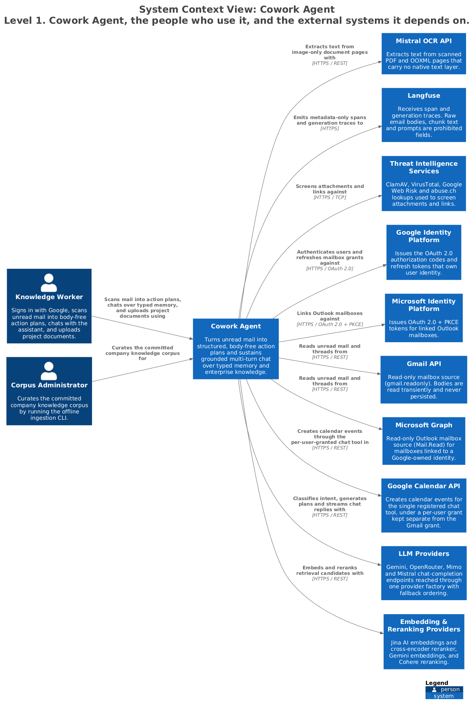

# Cowork Agent — System Context

Cowork Agent turns a knowledge worker's unread mail into structured, body-free action
plans, and sustains grounded multi-turn chat over typed memory and an enterprise
knowledge corpus. The two product flows are deliberately decoupled: mail is read
single-turn and memory-free, chat is multi-turn and never reaches a mailbox.

> Generated from [`workspace.dsl`](workspace.dsl), view `c1-system-context`.
> Do not edit the image or its `.puml`; see [README §4](README.md#4-regenerating-the-diagrams).

---

## 1. Responsibilities

- Authenticate a user through Google, and read their mail read-only.
- Turn unread mail into persisted action plans that contain no message body text.
- Answer multi-turn questions grounded in a committed company corpus and in the user's
  own project documents, keeping those two knowledge planes separate.
- Retain only user-authorised, body-free task records.
- Emit metadata-only traces for every model call and memory read.

## 2. Elements

| Element | Responsibility | Source of truth |
|---|---|---|
| **Knowledge Worker** | Signs in with Google, runs mail scans, chats, uploads project documents. | — |
| **Corpus Administrator** | Curates the committed company corpus with the offline CLI. | [`ingestion_cli.py`](../../src/cowork_agent/ingestion_cli.py) |
| **Cowork Agent** | The system documented in this directory. | [`src/cowork_agent`](../../src/cowork_agent) |
| **Google Identity Platform** | Owns user identity; issues and refreshes mailbox grants. | [`identity.py`](../../src/cowork_agent/identity.py) |
| **Microsoft Identity Platform** | Issues OAuth 2.0 + PKCE tokens for linked Outlook mailboxes. | [`api/mailboxes.py`](../../src/cowork_agent/api/mailboxes.py) |
| **Gmail API** | Read-only mailbox source (`gmail.readonly`). | [`gmail/provider.py`](../../src/cowork_agent/integrations/gmail/provider.py) |
| **Microsoft Graph** | Read-only Outlook mailbox source (`Mail.Read`). | [`outlook/provider.py`](../../src/cowork_agent/integrations/outlook/provider.py) |
| **Google Calendar API** | Target of the single registered chat tool, under a per-user grant. | [`google_calendar/provider.py`](../../src/cowork_agent/integrations/google_calendar/provider.py) |
| **LLM Providers** | Gemini, OpenRouter, Mimo and Mistral chat completions behind one factory. | [`integrations/llm`](../../src/cowork_agent/integrations/llm) |
| **Embedding & Reranking Providers** | Jina embeddings and cross-encoder, Gemini embeddings, Cohere reranking. | [`rag/embeddings.py`](../../src/cowork_agent/integrations/rag/embeddings.py) |
| **Mistral OCR API** | Extracts text from pages with no native text layer. | [`knowledge_ingestion/ocr.py`](../../src/cowork_agent/integrations/knowledge_ingestion/ocr.py) |
| **Langfuse** | Receives metadata-only spans and generation traces. | [`observability.py`](../../src/cowork_agent/observability.py) |
| **Threat Intelligence Services** | ClamAV, VirusTotal, Google Web Risk and abuse.ch lookups. | [`integrations/security`](../../src/cowork_agent/integrations/security) |

## 3. Interfaces

| Interface | Shape | Notes |
|---|---|---|
| Web UI | HTTPS | The only human-facing surface. React 19 SPA. |
| `/v1/mail-todo/*` | REST | Mail digest runs, connections, OAuth callbacks. |
| `/v1/cowork/chat/*` | REST + SSE | Chat sessions, streaming turns, projects, documents. |
| `/api/v1/reports/*`, `/api/v1/raw-documents/*` | REST | Report artifacts and the editable raw-document surface. |
| `mail-todo-ingest-knowledge` | CLI | The Corpus Administrator's only entry point. |

## 4. Invariants

| Invariant | Enforced by |
|---|---|
| Mail access is read-only (`gmail.readonly` / `Mail.Read`). | [`gmail/auth.py`](../../src/cowork_agent/integrations/gmail/auth.py), [`api/mailboxes.py`](../../src/cowork_agent/api/mailboxes.py) |
| Raw message bodies and attachment bytes are never persisted and never indexed. | [`validation.py`](../../src/cowork_agent/features/email_action_plan/validation.py), [ADR-003](../../tasks/adr/ADR-003-defer-attachment-processing.md) |
| Attachments are recorded as presence only; content is never downloaded for planning. | [ADR-003](../../tasks/adr/ADR-003-defer-attachment-processing.md) |
| Chat has no mailbox tool. Mail never enters chat except as one aggregate, body-free summary card. | [ADR-004](../../tasks/adr/ADR-004-chat-native-task-episodes.md) |
| A `TaskEpisode` is written only after an explicit user task request, and starts `retrieval_eligible=false`. | [`episode_policy.py`](../../src/cowork_agent/features/ai_chat/episode_policy.py), [ADR-004](../../tasks/adr/ADR-004-chat-native-task-episodes.md) |
| The Calendar grant is separate from the Gmail grant; consent is chained, never merged. | [ADR-020](../../tasks/adr/ADR-020-google-grants-stay-separate.md) |
| Raw query text, chunk text and assembled prompts are prohibited telemetry fields. | [`observability.py`](../../src/cowork_agent/observability.py) |

## 5. Failure and degradation

| Failure | Behaviour |
|---|---|
| Retrieval store or embedding provider unavailable | Degrades to null memory with a structured `no_results`; a mail run produces a partial plan without citations, and a chat turn states that evidence is unavailable. Neither crashes. |
| Primary LLM provider fails | The provider factory falls through its configured ordering; OpenRouter failures retry on Gemini as last resort ([ADR-012](../../tasks/adr/ADR-012-openrouter-gemini-last-resort.md)). |
| Outlook not configured, or running in a Postgres mode | `/connections` reports `not_configured` or `sqlite_only`. No user or session is created and the login cookie is untouched. |
| Google Calendar grant missing or `GOOGLE_CALENDAR_ENABLED=false` | The tool is not composed; the router's `TOOL` route downgrades and the reply is byte-identical to a tool-free turn. |
| Langfuse unreachable | Tracing is dropped. No request path blocks on it. |

## 6. Known gaps

None.

## 7. Related

- [c2-containers.md](c2-containers.md) — what is deployed inside this box
- [deployment.md](deployment.md) — where those containers run
- [`tasks/adr/`](../../tasks/adr) — decision record
- [`tasks/prds/PRD-v1-Core-Email-and-RAG.md`](../../tasks/prds/PRD-v1-Core-Email-and-RAG.md), [`PRD-v2-Memory-Extension.md`](../../tasks/prds/PRD-v2-Memory-Extension.md)
