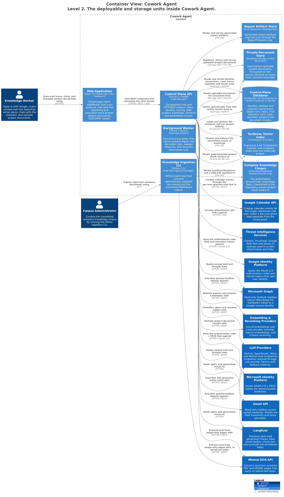
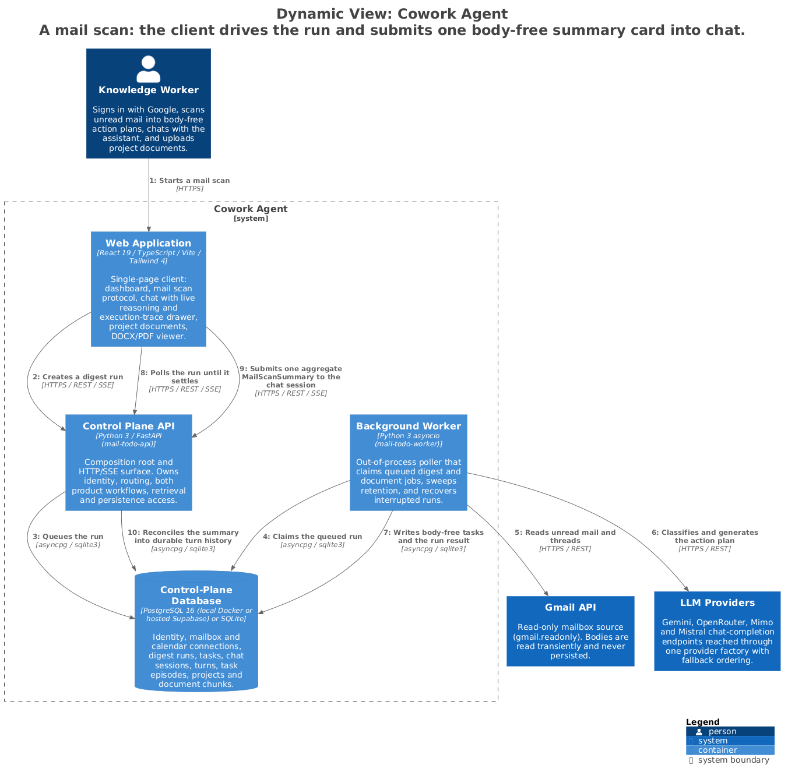
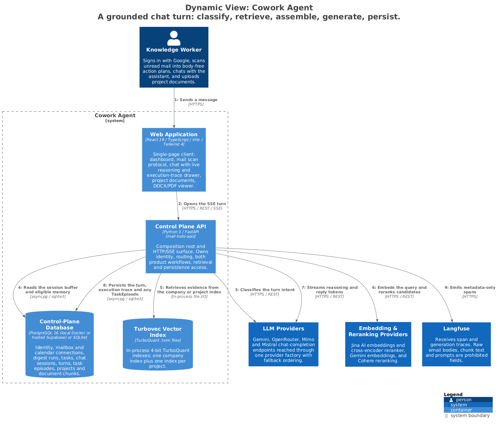

# Cowork Agent — Containers

Cowork Agent is three Python processes, one browser application, and five stores. The
Control Plane API is the composition root and the only container the browser talks to;
the Background Worker and the Ingestion CLI reach the same stores out of the request
path.

> Generated from [`workspace.dsl`](workspace.dsl), view `c2-containers`.
> Do not edit the image or its `.puml`; see [README §4](README.md#4-regenerating-the-diagrams).

---

## 1. Responsibilities

- Serve one HTTP/SSE surface and one SPA (Control Plane API, Web Application).
- Run long or retryable work outside the request path (Background Worker).
- Produce the committed company corpus offline, never at runtime (Ingestion CLI).
- Keep durable control-plane state in one database, and the two knowledge planes in
  separate indexes that never merge.

## 2. Elements

| Element | Responsibility | Source of truth |
|---|---|---|
| **Web Application** | React 19 + Vite + Tailwind 4 SPA. Owns the mail scan protocol, the SSE chat reader, the execution-trace drawer, the report viewer and the DOCX/PDF viewer. | [`frontend/`](../../frontend) |
| **Control Plane API** | `mail-todo-api`. Composition root and every HTTP/SSE route. Owns identity, both product workflows, retrieval and persistence access. | [`app.py`](../../src/cowork_agent/app.py), [`api/`](../../src/cowork_agent/api) |
| **Background Worker** | `mail-todo-worker`. Claims queued digest and document jobs, sweeps retention, recovers interrupted runs. | [`orchestration/worker.py`](../../src/cowork_agent/orchestration/worker.py) |
| **Knowledge Ingestion CLI** | `mail-todo-ingest-knowledge`. Converts administrator sources into sanitized Markdown plus a SHA-256 manifest. | [`ingestion_cli.py`](../../src/cowork_agent/ingestion_cli.py) |
| **Control-Plane Database** | Identity, mailbox and calendar connections, digest runs, tasks, chat sessions and turns, task episodes, projects, document chunks. | [`persistence/repositories`](../../src/cowork_agent/persistence/repositories) |
| **Turbovec Vector Index** | In-process 4-bit TurboQuant indexes: one company index plus one per project. | [`rag/turbovec_memory.py`](../../src/cowork_agent/integrations/rag/turbovec_memory.py) |
| **Company Knowledge Corpus** | `data/extracted/*.md`, committed to the repository. The authoritative ground truth for company RAG. | [`data/extracted`](../../data/extracted) |
| **Private Document Store** | User-owned uploads. Encrypted at rest, access-checked on every read, retention-bounded. | [`integrations/storage`](../../src/cowork_agent/integrations/storage) |
| **Report Artifact Store** | `data/reports/`, reached only through the `ReportFilename` rule. | [`persistence/report_artifacts.py`](../../src/cowork_agent/persistence/report_artifacts.py) |

## 3. Interfaces

| Interface | Shape | Notes |
|---|---|---|
| `/health` | REST | The only route `app.py` serves itself; every other route is a `create_*_router()` module ([ADR-015](../../tasks/adr/ADR-015-routers-own-their-transport.md)). |
| `/v1/mail-todo/*` | REST | Runs, connections, unread preview, Gmail and Outlook OAuth. |
| `/v1/cowork/chat/*` | REST + SSE | Sessions, streaming messages, profile, projects, documents, `document-health`, task-episode transitions, mail-scan submission. |
| `/v1/calendar/*` | REST | Per-user Google Calendar connection and OAuth callback. |
| `/api/v1/reports/*` | REST | List, save, download, PDF-export, delete, reveal folder. |
| `/api/v1/raw-documents/*` | REST | Upload, extract, edit and view raw documents. |
| `/v1/evaluation-jobs/*` | REST | Registered only when evaluation is enabled. |

## 4. Invariants

| Invariant | Enforced by |
|---|---|
| The SPA talks only to the Control Plane API. No container is reachable from the browser. | [`app.py`](../../src/cowork_agent/app.py) |
| Composition happens once, into one frozen `CoworkRuntime` value read through `runtime(request)`. | [`composition.py`](../../src/cowork_agent/composition.py), [ADR-013](../../tasks/adr/ADR-013-composition-as-typed-value.md) |
| `.env` is loaded exactly once at an executable boundary; settings parsers are pure over a supplied mapping. | [`config.py`](../../src/cowork_agent/config.py), [ADR-017](../../tasks/adr/ADR-017-settings-parsing-is-pure.md) |
| The company corpus and the per-project indexes are never merged, and project retrieval never falls back to the company index. | [`rag/project_documents.py`](../../src/cowork_agent/integrations/rag/project_documents.py), [ADR-007](../../tasks/adr/ADR-007-project-scoped-classifier-gated-user-documents.md), [ADR-008](../../tasks/adr/ADR-008-turbovec-project-document-plane.md) |
| Email content never enters the Company Knowledge Corpus or the Private Document Store. | [ADR-003](../../tasks/adr/ADR-003-defer-attachment-processing.md), [ADR-004](../../tasks/adr/ADR-004-chat-native-task-episodes.md) |
| A report is named only through `ReportFilename`; the store containment-checks every resolved target. | [`domain/report_artifacts.py`](../../src/cowork_agent/domain/report_artifacts.py), [ADR-016](../../tasks/adr/ADR-016-report-artifacts-are-validated-domain-values.md) |
| Short-term chat memory is in-process only and never durable. | [`session_buffer.py`](../../src/cowork_agent/features/ai_chat/session_buffer.py) |

## 5. Failure and degradation

| Failure | Behaviour |
|---|---|
| Worker process down | Queued runs and documents stay queued. The API stays up; `document-health` reports degraded once the worker heartbeat goes stale, and the SPA keeps document controls fail-closed. |
| Worker crashes mid-job | `Run & Document Recovery` re-queues anything left in-flight on the next boot. |
| Control-Plane Database unreachable | Requests that need durable state fail; `/health`, and chat without document selection, remain available. |
| Company index missing or unreadable at bootstrap | Retrieval degrades to null memory. Mail runs and chat turns continue without citations. |
| Per-project index unavailable at query time | One retry, then an empty result marked `degraded`; the turn says document evidence is unavailable. It never falls back to the company index. |

## 6. Known gaps

The Web Application is modelled as a single container. Its internal structure (the mail
scan protocol, the SSE adapter, the viewer modules) is not documented at Level 3 —
[`frontend/src/dashboard/hooks/mailScanProtocol.ts`](../../frontend/src/dashboard/hooks/mailScanProtocol.ts)
and [`useStreamingChat.ts`](../../frontend/src/dashboard/hooks/useStreamingChat.ts) are
the entry points a reader should start from.

## 7. Related

- [c1-system-context.md](c1-system-context.md) — the surrounding context
- [deployment.md](deployment.md) — where these containers run
- Level 3: [email action plan](c3-api-email-action-plan.md) · [AI chat](c3-api-ai-chat.md) · [retrieval](c3-api-retrieval.md) · [platform](c3-api-platform.md) · [worker](c3-worker.md) · [ingestion CLI](c3-ingestion-cli.md)

---

## Appendix A — Product flows

Both flows are generated from `workspace.dsl` as dynamic views.

### A.1 Mail scan

The client drives the run and submits **one** body-free summary card into chat. The
mail pipeline itself is memory-free; the chat session learns only the aggregate.

> Generated from [`workspace.dsl`](workspace.dsl), view `flow-mail-scan`.

`runMailScanProtocol` in the SPA owns mailbox choice, provider runs, polling, retry
tolerance, cancellation and ordered aggregation behind one snapshot interface. The
`/sessions/{session_id}/mail-scans` endpoint stays in
[`api/chat.py`](../../src/cowork_agent/api/chat.py) because it authenticates a chat
principal and chooses history or buffer storage; the transition rules live in
[`mail_scan_reconciliation.py`](../../src/cowork_agent/features/ai_chat/mail_scan_reconciliation.py),
which imports domain contracts and never transport payloads.

### A.2 Chat turn

> Generated from [`workspace.dsl`](workspace.dsl), view `flow-chat-turn`.

The sequence `classify → retrieve → assemble → generate → persist` runs inside one
function, `ChatController.stream_message`. Splitting it into staged units was reviewed
and rejected: 28 locals cross the proposed boundaries and a later stage rewrites an
earlier one's decision ([ADR-014](../../tasks/adr/ADR-014-turn-pipeline-stays-one-function.md)).
