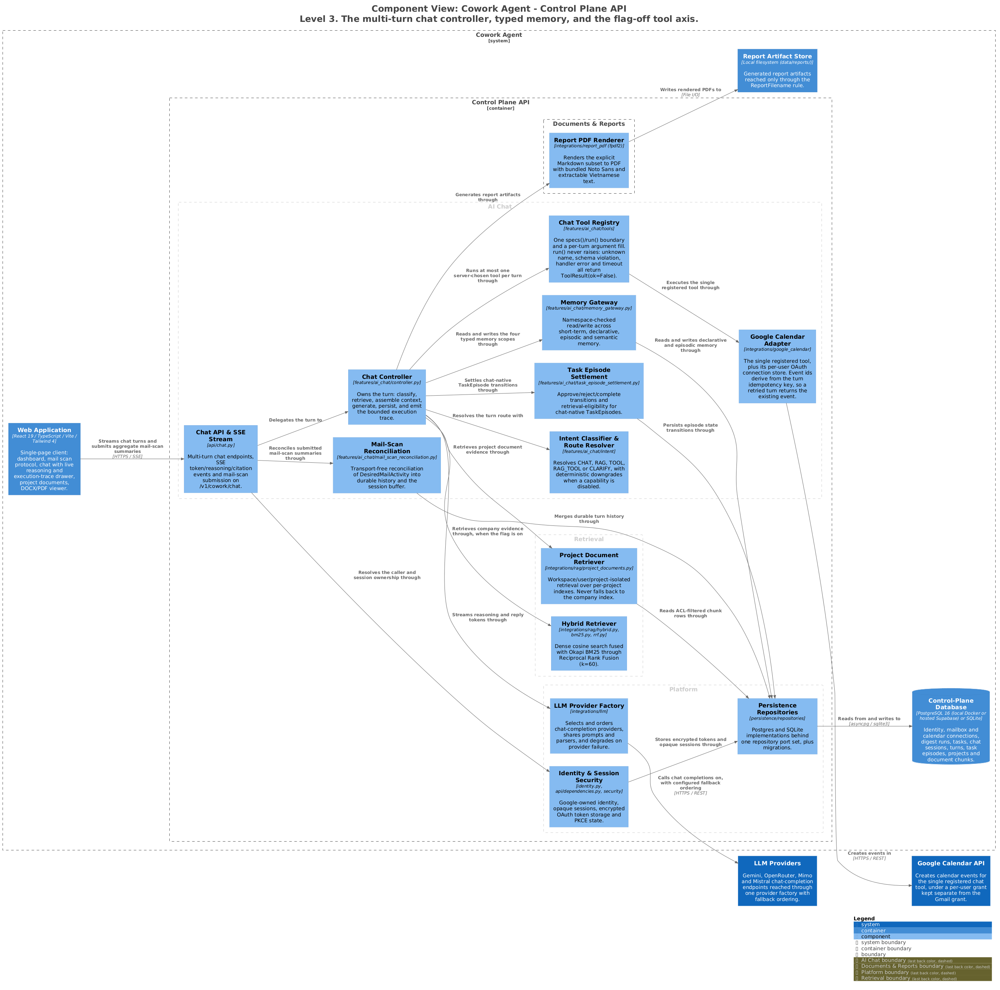

# Control Plane API — AI Chat & Typed Memory

A multi-turn assistant that streams replies, reads four typed memory scopes through one
namespaced gateway, and persists a chat-native `TaskEpisode` only after an explicit user
task request. User documents are a second semantic plane, project-scoped and never
merged with company knowledge.

> Generated from [`workspace.dsl`](workspace.dsl), view `c3-api-ai-chat`.
> Do not edit the image or its `.puml`; see [README §4](README.md#4-regenerating-the-diagrams).

---

## 1. Responsibilities

- Own one turn end to end: classify, retrieve, assemble, generate, persist.
- Stream text deltas and, in `reasoning` mode, live thinking traces over SSE.
- Read and write four memory scopes without letting one tenant see another's.
- Run at most one server-chosen tool per turn, never a client-supplied tool choice.
- Reconcile aggregate mail-scan summaries into turn history without touching mail itself.

## 2. Elements

| Element | Responsibility | Source of truth |
|---|---|---|
| **Chat API & SSE Stream** | Sessions, streaming messages, profile CRUD, mail-scan submission, task-episode transitions. | [`api/chat.py`](../../src/cowork_agent/api/chat.py) |
| **Chat Controller** | The turn, in one linear function: classify → optional retrieve → assemble → stream → report artifact → execution trace → persist. | [`controller.py`](../../src/cowork_agent/features/ai_chat/controller.py) |
| **Intent Classifier & Route Resolver** | The sole routing authority for user documents *and* tools. Resolves `CHAT`, `RAG`, `TOOL`, `RAG_TOOL`, `CLARIFY`. | [`intent/service.py`](../../src/cowork_agent/features/ai_chat/intent/service.py), [`intent/resolver.py`](../../src/cowork_agent/features/ai_chat/intent/resolver.py) |
| **Memory Gateway** | Fail-closed tenant/session namespacing across the four memory types plus a retrieval-only user-document port. | [`memory_gateway.py`](../../src/cowork_agent/features/ai_chat/memory_gateway.py) |
| **Mail-Scan Reconciliation** | Owns `DesiredMailActivity`, scan/turn validation, append-only activity reconciliation, idempotent durable-turn merge and buffer upsert. | [`mail_scan_reconciliation.py`](../../src/cowork_agent/features/ai_chat/mail_scan_reconciliation.py) |
| **Task Episode Settlement** | The first durable write with its citation and proposal events, plus the retry a later idempotent request replays around. | [`task_episode_settlement.py`](../../src/cowork_agent/features/ai_chat/task_episode_settlement.py) |
| **Chat Tool Registry** | The only tool boundary the turn knows: `specs()` renders the router's action tier, `run(name, args)` validates and executes. | [`tools/registry.py`](../../src/cowork_agent/features/ai_chat/tools/registry.py), [`tools/runner.py`](../../src/cowork_agent/features/ai_chat/tools/runner.py) |
| **Google Calendar Adapter** | The single registered tool, plus its per-user OAuth connection store. | [`tools/calendar.py`](../../src/cowork_agent/features/ai_chat/tools/calendar.py), [`google_calendar/provider.py`](../../src/cowork_agent/integrations/google_calendar/provider.py) |
| **Hybrid Retriever** | Company evidence, when `CHAT_COMPANY_RAG_ENABLED` is on and a policy cue is present. | [`rag/hybrid.py`](../../src/cowork_agent/integrations/rag/hybrid.py) |
| **Project Document Retriever** | Project-scoped evidence on the `RAG` route. | [`rag/project_documents.py`](../../src/cowork_agent/integrations/rag/project_documents.py) |
| **Report PDF Renderer** | fpdf2 with four bundled Noto Sans styles; no runtime network or OS font lookup. | [`integrations/report_pdf`](../../src/cowork_agent/integrations/report_pdf) |

## 3. Interfaces

| Interface | Shape | Notes |
|---|---|---|
| `POST /v1/cowork/chat/sessions/{id}/messages` | SSE | Text deltas, reasoning deltas, `memory_citation` (discriminated by `citation_scope`), activity snapshots. Request validation is `extra="forbid"`. |
| `POST /v1/cowork/chat/sessions/{id}/mail-scans` | REST | Accepts one aggregate `MailScanSummary`. No raw mail. |
| `.../task-episodes/{id}/{approve,reject,complete}` | REST | The only transitions that can make an episode retrieval-eligible. |
| `GET/PUT /v1/cowork/chat/profile` | REST | Declarative profile; writes require `explicit_user_config` provenance. |
| `GET /v1/cowork/chat/document-health` | REST | Ready only when Postgres, storage, embeddings, the index cache dir, the classifier and a fresh worker heartbeat are all ready. `503` when degraded. |
| `ToolRegistry` | Typed port | `specs()` / `run()`. `run` never raises; failures return `ToolResult(ok=False)`. Only `CancelledError` propagates. |

### The four memory scopes

| Scope | Storage | Rule |
|---|---|---|
| **Short-term (session buffer)** | In-process, bounded. | Never durable. [`session_buffer.py`](../../src/cowork_agent/features/ai_chat/session_buffer.py) |
| **Long-term declarative** | `chat_profiles`. | Language, timezone, persona, tone. Written only with `explicit_user_config` provenance; documents are never an inferred preference source. [`profile_policy.py`](../../src/cowork_agent/features/ai_chat/profile_policy.py) |
| **Episodic** | `task_episodes`, session summaries. | Summaries are always `retrieval_eligible=false`. Episodes support a `supersedes` pointer. [`episode_policy.py`](../../src/cowork_agent/features/ai_chat/episode_policy.py) |
| **Semantic** | Two unmerged planes. | Company RAG behind `CHAT_COMPANY_RAG_ENABLED` (default `false`) plus a cue phrase; user documents on the `RAG` route only. [`retrieval_policy.py`](../../src/cowork_agent/features/ai_chat/retrieval_policy.py) |

## 4. Invariants

| Invariant | Enforced by |
|---|---|
| A `TaskEpisode` is written only when `is_explicit_task_request` is true. Ordinary chat, classifier output and model inference alone cannot create one. | [`episode_policy.py`](../../src/cowork_agent/features/ai_chat/episode_policy.py), [ADR-004](../../tasks/adr/ADR-004-chat-native-task-episodes.md) |
| New episodes are `system_generated` / `retrieval_eligible=false`. Eligibility derives from `validation_status`: `user_approved` or `completed` → true; `rejected` stays false. | [`task_episode_settlement.py`](../../src/cowork_agent/features/ai_chat/task_episode_settlement.py) |
| There is no `@Email` tool and no Gmail access from chat. | [ADR-004](../../tasks/adr/ADR-004-chat-native-task-episodes.md) |
| Tool choice is a server-side routing decision. The request carries no `tool_choices` field. | [`intent/resolver.py`](../../src/cowork_agent/features/ai_chat/intent/resolver.py) |
| Gates only ever narrow: `RAG` → `CHAT` with no ready documents; `TOOL` → the non-tool route when the tool is not composed, with a server-owned `tool_not_available` reason code no classifier can emit. | [`intent/resolver.py`](../../src/cowork_agent/features/ai_chat/intent/resolver.py) |
| The calendar event id derives from the turn's idempotency key, so a retried turn returns the existing event rather than creating a second one. | [`tools/calendar.py`](../../src/cowork_agent/features/ai_chat/tools/calendar.py), [ADR-019](../../tasks/adr/ADR-019-executable-chat-tools-run-under-a-per-user-grant.md) |
| The Calendar grant is per-user and separate from the Gmail grant. | [ADR-020](../../tasks/adr/ADR-020-google-grants-stay-separate.md) |
| A provider-supplied report filename is not trusted; it passes through `ReportFilename.sanitize`, which never raises and degrades to a safe slug. | [`domain/report_artifacts.py`](../../src/cowork_agent/domain/report_artifacts.py), [ADR-016](../../tasks/adr/ADR-016-report-artifacts-are-validated-domain-values.md) |
| Durable activity carries stable semantic codes and aggregate counts only. Provider names, component names and model reasoning never enter the public activity contract. | [`turn_journal.py`](../../src/cowork_agent/features/ai_chat/turn_journal.py) |
| `stream_message` stays one function by decision, not neglect. | [ADR-014](../../tasks/adr/ADR-014-turn-pipeline-stays-one-function.md) |

## 5. Failure and degradation

| Failure | Behaviour |
|---|---|
| Classifier unavailable | Retry once, then fail open to retrieval. |
| Project index unavailable at query time | One retry, then an empty result with `degraded: true`; the turn states document evidence is unavailable. Never falls back to the company index. |
| Retrieval timeout | One retry, then `timeout` with `degraded: true`. Config default is `10000` ms, capped at 10 s. |
| No chunk above threshold | `no_results`; the answer states the documents do not cover the question. |
| Document deleted or expired mid-session | Excluded by the retrieval filter; the turn proceeds without it. |
| Transient `MemorySourceUnavailableError` on an episode write | The turn degrades and arms the idempotent retry. A `ValueError` is a rejected record and does not. |
| Durable turn write fails | `TurnAborted` — the one way a failed durable write ends a turn, shared by both completion paths. |
| Report artifact write fails | Caught as `(OSError, ValueError)`, logged; the turn continues. |
| PDF renderer absent from the injected runtime | `501 pdf_export_unavailable`. |
| `USER_DOCUMENTS_ENABLED=false` | Every document route returns `503` before identity, database or storage I/O. Chat and mail continue. The client derives visibility from `document-health` and starts fail-closed. |
| A degraded document plane | Never falls back to unsourced generation, and never affects the mail pipeline. |

## 6. Known gaps

- [`features/ai_chat/graph/`](../../src/cowork_agent/features/ai_chat/graph) exists but is
  not composed in `app.py`; `ChatController.stream_message` owns the turn. The module is
  not modelled as a component because no live path reaches it ([ADR-014](../../tasks/adr/ADR-014-turn-pipeline-stays-one-function.md)).
- `create_chat_session_buffer` always returns `InMemoryChatSessionBuffer`. There is no
  Redis-backed short-term store.

## 7. Related

- [c2-containers.md](c2-containers.md) — the containing view, including the chat turn flow
- [c3-api-retrieval.md](c3-api-retrieval.md) — the two semantic planes in detail
- [c3-api-platform.md](c3-api-platform.md) — how the chat group is composed
- [ADR-004](../../tasks/adr/ADR-004-chat-native-task-episodes.md) · [ADR-007](../../tasks/adr/ADR-007-project-scoped-classifier-gated-user-documents.md) · [ADR-014](../../tasks/adr/ADR-014-turn-pipeline-stays-one-function.md) · [ADR-016](../../tasks/adr/ADR-016-report-artifacts-are-validated-domain-values.md) · [ADR-019](../../tasks/adr/ADR-019-executable-chat-tools-run-under-a-per-user-grant.md) · [ADR-020](../../tasks/adr/ADR-020-google-grants-stay-separate.md)
- Evaluation: [`docs/evaluations/RAGAS.md`](../evaluations/RAGAS.md)
