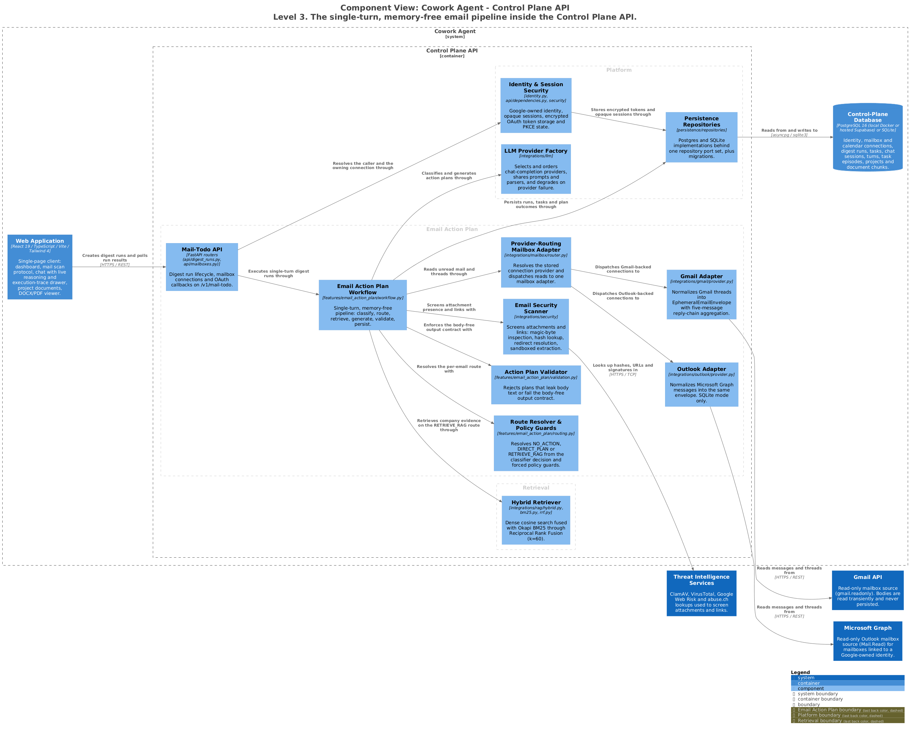

# Control Plane API — Email Action Plan

A single-turn, memory-free pipeline that turns unread mail into structured, body-free
action plans. A provider router dispatches mailbox reads to Gmail or Microsoft Graph;
from the envelope boundary onward, classification, routing, retrieval, generation,
validation and persistence are provider-independent.

> Generated from [`workspace.dsl`](workspace.dsl), view `c3-api-email-action-plan`.
> Do not edit the image or its `.puml`; see [README §4](README.md#4-regenerating-the-diagrams).

---

## 1. Responsibilities

- Read unread mail from whichever provider the stored connection names.
- Normalise every provider into one transient `EphemeralEmailEnvelope`.
- Resolve exactly one route per email: `NO_ACTION`, `DIRECT_PLAN` or `RETRIEVE_RAG`.
- Retrieve company evidence at most once per email, and gate it before generation.
- Persist structured action steps and citation coordinates — never body text.

## 2. Elements

| Element | Responsibility | Source of truth |
|---|---|---|
| **Mail-Todo API** | Digest run lifecycle, mailbox connections and OAuth callbacks on `/v1/mail-todo`. | [`api/digest_runs.py`](../../src/cowork_agent/api/digest_runs.py), [`api/mailboxes.py`](../../src/cowork_agent/api/mailboxes.py) |
| **Provider-Routing Mailbox Adapter** | Resolves the stored connection's provider and dispatches `search_unread` / `get_thread` to one adapter. | [`mailbox/router.py`](../../src/cowork_agent/integrations/mailbox/router.py) |
| **Gmail Adapter** | Normalises Gmail threads into the envelope, with five-message reply-chain aggregation ([ADR-011](../../tasks/adr/ADR-011-reply-chain-context-aggregation.md)). | [`gmail/provider.py`](../../src/cowork_agent/integrations/gmail/provider.py) |
| **Outlook Adapter** | Normalises Graph messages into the same envelope. IDs are namespaced `outlook:`. | [`outlook/provider.py`](../../src/cowork_agent/integrations/outlook/provider.py) |
| **Email Action Plan Workflow** | Fetches threads, classifies, retrieves at most once, generates, validates, deduplicates and persists, under Langfuse tracing. | [`workflow.py`](../../src/cowork_agent/features/email_action_plan/workflow.py) |
| **Route Resolver & Policy Guards** | Applies policy guards and resolves candidates by precedence `RETRIEVE_RAG > DIRECT_PLAN > NO_ACTION`. | [`routing.py`](../../src/cowork_agent/features/email_action_plan/routing.py) |
| **Action Plan Validator** | Enforces output structure, citation shape and body-leak protection. | [`validation.py`](../../src/cowork_agent/features/email_action_plan/validation.py) |
| **Email Security Scanner** | Screens attachments and links: magic-byte inspection, hash lookup, redirect resolution, sandboxed extraction. | [`integrations/security`](../../src/cowork_agent/integrations/security) |
| **Hybrid Retriever** | The one retrieval call on the `RETRIEVE_RAG` route. Detailed in [c3-api-retrieval](c3-api-retrieval.md). | [`rag/hybrid.py`](../../src/cowork_agent/integrations/rag/hybrid.py) |
| **LLM Provider Factory** | Classification and generation transports with configured fallback ordering. | [`integrations/llm`](../../src/cowork_agent/integrations/llm) |
| **Persistence Repositories** | Runs, tasks and plan outcomes. | [`persistence/repositories`](../../src/cowork_agent/persistence/repositories) |

## 3. Interfaces

| Interface | Shape | Notes |
|---|---|---|
| `POST /v1/mail-todo/runs` | REST | Creates a digest run. The worker claims it. |
| `GET /v1/mail-todo/runs/{run_id}` · `/result` · `/tasks` | REST | Run state, aggregate result, produced tasks. |
| `GET /v1/mail-todo/connections` | REST | Stable availability. Outlook reports `not_configured` or `sqlite_only`. |
| `GET /v1/mail-todo/connections/{id}/unread-preview` | REST | Transient preview; nothing is persisted. |
| `/v1/mail-todo/oauth/{gmail,outlook}/{connect,callback}` | REST | Grant flows. Outlook uses PKCE with signed one-time owner state. |
| `MailboxPort` | Typed port | `search_unread`, `get_thread`, `get_message_received_at`, `download_attachment`. Adapters ship deterministic fakes. |
| Route enum | `NO_ACTION` · `DIRECT_PLAN` · `RETRIEVE_RAG` | [`routing.py`](../../src/cowork_agent/features/email_action_plan/routing.py) |

## 4. Invariants

| Invariant | Enforced by |
|---|---|
| Raw body text lives only in `EphemeralEmailEnvelope` and the in-process short-term store, which is purged in `DigestWorker.execute`'s `finally` block. | [`short_term.py`](../../src/cowork_agent/features/email_action_plan/short_term.py) |
| Persisted tasks carry steps, title, summary, citation coordinates and message pointers — never body text or attachment bytes. | [`validation.py`](../../src/cowork_agent/features/email_action_plan/validation.py) |
| Attachment content is never downloaded for planning; only `attachments_present` is recorded. | [ADR-003](../../tasks/adr/ADR-003-defer-attachment-processing.md) |
| Retrieval happens at most once per email, before the final route is fixed. | [`workflow.py`](../../src/cowork_agent/features/email_action_plan/workflow.py) |
| Company RAG is retrieval-only here. Nothing from an email is ever written to the corpus or the index. | [ADR-004](../../tasks/adr/ADR-004-chat-native-task-episodes.md) |
| The pipeline holds no conversational memory and shares no buffer with AI Chat. | [ADR-004](../../tasks/adr/ADR-004-chat-native-task-episodes.md) |
| Outlook is available only when `POSTGRES_MODE=off`; no SQL migration or provider-specific prompt branch exists. | [`api/mailboxes.py`](../../src/cowork_agent/api/mailboxes.py) |

## 5. Failure and degradation

| Failure | Behaviour |
|---|---|
| Retrieval returns nothing on a healthy store | A direct plan is produced. A no-match is not an error. |
| Retrieval unavailable or degraded | The evidence gate downgrades to a partial direct plan without citations. The run does not fail. |
| Evidence scores below `max(min_rerank_score, top_score × relative_cutoff_ratio)` | Those chunks are dropped before generation; only accepted chunks reach the generator. |
| OpenRouter transport failure, 429, 5xx or unparseable payload | Retries on Gemini through the last-resort path with key rotation ([ADR-012](../../tasks/adr/ADR-012-openrouter-gemini-last-resort.md)). |
| Model returns an unparseable plan | Schema repair runs locally before any provider fallback is triggered. |
| Mailbox connection missing or inactive | `MailboxNotConnectedError`; the run reports the failure rather than reading another user's mailbox. |

## 6. Known gaps

Legacy `AttachmentExtractorPort` / `SafeTextAttachmentExtractor` definitions remain in
the codebase for the test harness and are discarded by `DigestWorker` at runtime. They
are not modelled as components because no live path reaches them.

## 7. Related

- [c2-containers.md](c2-containers.md) — the containing view, including the mail scan flow
- [c3-api-retrieval.md](c3-api-retrieval.md) — what the `RETRIEVE_RAG` route calls
- [c3-worker.md](c3-worker.md) — where digest runs actually execute
- [ADR-003](../../tasks/adr/ADR-003-defer-attachment-processing.md) · [ADR-011](../../tasks/adr/ADR-011-reply-chain-context-aggregation.md) · [ADR-012](../../tasks/adr/ADR-012-openrouter-gemini-last-resort.md)
- Runtime status: [`evaluations/RETRIEVAL/EMAIL-RAG-STATUS.md`](../../evaluations/RETRIEVAL/EMAIL-RAG-STATUS.md)
