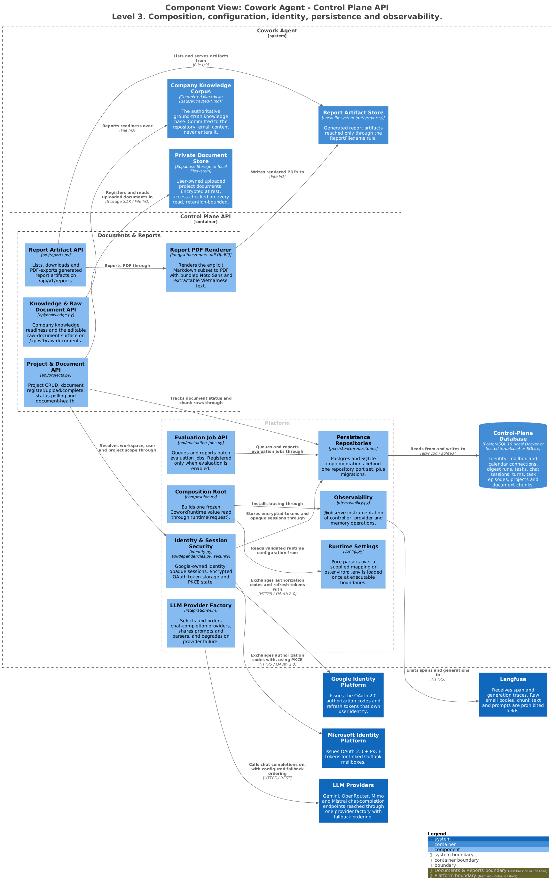

# Control Plane API — Platform

Everything both product workflows stand on: how the application is composed, how
configuration is read, who the caller is, where state goes, and what is traced. This is
the layer where a mistake is systemic rather than local.

> Generated from [`workspace.dsl`](workspace.dsl), view `c3-api-platform`.
> Do not edit the image or its `.puml`; see [README §4](README.md#4-regenerating-the-diagrams).

---

## 1. Responsibilities

- Assemble every dependency exactly once, into one typed value.
- Read the environment exactly once, at an executable boundary.
- Resolve a verified principal, and derive tenancy from it rather than from the request.
- Present one repository port set over two very different storage backends.
- Trace model and memory operations without leaking their contents.

## 2. Elements

| Element | Responsibility | Source of truth |
|---|---|---|
| **Composition Root** | Builds `CoworkRuntime` — one frozen, slotted value holding the report store, PDF renderer, and the `control_plane`, `mailbox`, `chat`, `email_rag` and `evaluation` groups. | [`composition.py`](../../src/cowork_agent/composition.py) |
| **Runtime Settings** | `load_runtime_environment()` is the single dotenv I/O seam. Parsers are pure over an explicit mapping or `os.environ`. | [`config.py`](../../src/cowork_agent/config.py) |
| **Identity & Session Security** | Resolves `VerifiedPrincipal`; opaque HttpOnly session cookies hashed at rest, guest principals, Fernet-encrypted OAuth tokens (`TokenCipher`), signed one-time PKCE state. | [`identity.py`](../../src/cowork_agent/identity.py), [`api/dependencies.py`](../../src/cowork_agent/api/dependencies.py) |
| **LLM Provider Factory** | Selects and orders chat-completion providers; shares prompts and parsers across them. | [`integrations/llm/provider_factory.py`](../../src/cowork_agent/integrations/llm/provider_factory.py) |
| **Persistence Repositories** | In-memory fakes, SQLite adapters for local mode, Postgres adapters for durable mode, plus migrations. | [`persistence/repositories`](../../src/cowork_agent/persistence/repositories) |
| **Observability** | `@observe` instrumentation across the chat controller, provider calls and memory reads. | [`observability.py`](../../src/cowork_agent/observability.py), [`llm/providers/tracing.py`](../../src/cowork_agent/integrations/llm/providers/tracing.py) |
| **Project & Document API** | Project CRUD, document register/upload/complete, status polling, `document-health`. | [`api/projects.py`](../../src/cowork_agent/api/projects.py) |
| **Knowledge & Raw Document API** | Company knowledge readiness plus the editable raw-document surface. | [`api/knowledge.py`](../../src/cowork_agent/api/knowledge.py) |
| **Report Artifact API** | List, save, download, PDF-export, delete, reveal folder. | [`api/reports.py`](../../src/cowork_agent/api/reports.py) |
| **Report PDF Renderer** | fpdf2 with four bundled Noto Sans styles. | [`integrations/report_pdf`](../../src/cowork_agent/integrations/report_pdf) |
| **Evaluation Job API** | Queues and reports batch evaluation jobs. Mounted only when evaluation is enabled. | [`api/evaluation_jobs.py`](../../src/cowork_agent/api/evaluation_jobs.py) |

## 3. Interfaces

| Interface | Shape | Notes |
|---|---|---|
| `runtime(request)` | Accessor | The way a handler reads a composed dependency. Only the request-time chat controller cache and factory remain documented app-state exceptions. |
| `create_*_router()` | Factory | One module per subject under [`api/`](../../src/cowork_agent/api). `app.py` serves exactly one route of its own, `/health` ([ADR-015](../../tasks/adr/ADR-015-routers-own-their-transport.md)). |
| `GET /api/v1/reports` · `POST` · `/{filename}/download` · `/{filename}/pdf` · `DELETE` · `POST /open-folder` | REST | Every filename passes `ReportFilename.parse`; an unusable name is `400`. |
| `/api/v1/raw-documents/*` | REST | Upload, extract, edit, view. |

### Storage modes

Selected by `POSTGRES_MODE` and `DATABASE_URL`.

| Mode | Backend | Notes |
|---|---|---|
| `off` (or no `DATABASE_URL`) | SQLite files under `.data/` | `mail_todo.db`, `runs.db`, `tasks.db`, `chat.db`, `chat_identity.db`, `projects.db`, `project_chunks.db`, `raw_documents.db`. Documents in `.data/project-documents` via `LocalPrivateStorage`. Results, outbox and working memory stay in-process. The only mode where Outlook is enabled. |
| `local` | Docker Postgres at `127.0.0.1:5432` via `DATABASE_URL_LOCAL` | Full schema fidelity and durable queue leasing on a workstation ([ADR-010](../../tasks/adr/ADR-010-local-postgres-control-plane-latency.md)). |
| `cloud` | Hosted Supabase via `DATABASE_URL_CLOUD` | `psycopg_pool.AsyncConnectionPool`. Source files and index snapshots in private Supabase Storage buckets. |

Migrations run idempotently in filename order (`001_mail_todo.sql` … `017_calendar_connections.sql`)
under a PostgreSQL advisory lock, at both API lifespan startup and worker boot.

## 4. Invariants

| Invariant | Enforced by |
|---|---|
| Composition happens once. Handlers never construct a dependency. | [`composition.py`](../../src/cowork_agent/composition.py), [ADR-013](../../tasks/adr/ADR-013-composition-as-typed-value.md) |
| Settings parsing performs no dotenv I/O, so a library read cannot silently reload credentials. | [`config.py`](../../src/cowork_agent/config.py), [ADR-017](../../tasks/adr/ADR-017-settings-parsing-is-pure.md) |
| `app.py` owns no transport but `/health`. | [ADR-015](../../tasks/adr/ADR-015-routers-own-their-transport.md) |
| Caller-supplied tenant or user identifiers are never trusted for authorization; tenancy derives from `VerifiedPrincipal`. | [`identity.py`](../../src/cowork_agent/identity.py) |
| OAuth refresh tokens are Fernet-encrypted at rest; session cookies are opaque, HttpOnly and hashed at rest. | [`identity.py`](../../src/cowork_agent/identity.py) |
| Local and cloud are separate databases. Data does not move between them. | [`config.py`](../../src/cowork_agent/config.py) |
| Both report writers share one store instance, so the folder location and filename rule cannot diverge. | [`api/reports.py`](../../src/cowork_agent/api/reports.py), [ADR-018](../../tasks/adr/ADR-018-report-pdfs-use-fpdf2-and-bundled-noto-sans.md) |
| PDF rendering performs no network or OS font lookup. | [`integrations/report_pdf`](../../src/cowork_agent/integrations/report_pdf) |

## 5. Failure and degradation

| Failure | Behaviour |
|---|---|
| Migration lock contended | The advisory lock serialises; the loser waits. Migrations are idempotent, so a double run is safe. |
| Document-plane configuration or index-store init fails | Never blocks the API lifespan. `/health`, chat without document selection, and mail stay available. |
| Injected runtime has no PDF renderer | `/pdf` returns `501 pdf_export_unavailable`. |
| `reveal_directory` fails | `500` with a Vietnamese message. |
| Langfuse unreachable | Traces are dropped; no request path blocks. |

## 6. Known gaps

None.

## 7. Related

- [c2-containers.md](c2-containers.md) · [deployment.md](deployment.md)
- [c3-api-ai-chat.md](c3-api-ai-chat.md) — the chat group this layer composes
- [ADR-010](../../tasks/adr/ADR-010-local-postgres-control-plane-latency.md) · [ADR-013](../../tasks/adr/ADR-013-composition-as-typed-value.md) · [ADR-015](../../tasks/adr/ADR-015-routers-own-their-transport.md) · [ADR-016](../../tasks/adr/ADR-016-report-artifacts-are-validated-domain-values.md) · [ADR-017](../../tasks/adr/ADR-017-settings-parsing-is-pure.md) · [ADR-018](../../tasks/adr/ADR-018-report-pdfs-use-fpdf2-and-bundled-noto-sans.md)
