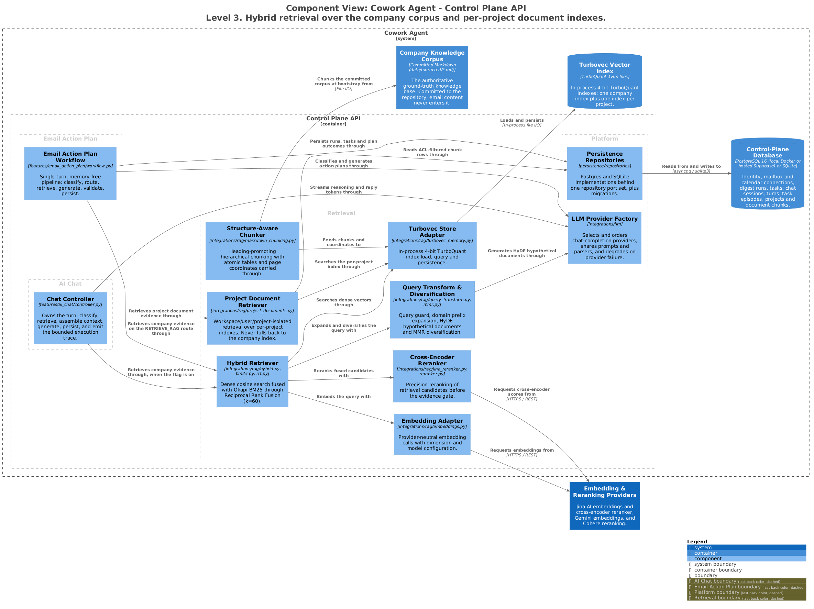

# Control Plane API — Retrieval

Hybrid semantic retrieval over two knowledge planes that never merge: the committed
company corpus, and per-project user document indexes. Both share one chunker and one
store adapter; they share no index and no fallback path.

> Generated from [`workspace.dsl`](workspace.dsl), view `c3-api-retrieval`.
> Do not edit the image or its `.puml`; see [README §4](README.md#4-regenerating-the-diagrams).

---

## 1. Responsibilities

- Serve both callers — the mail pipeline and the chat controller — through one port.
- Fuse dense and lexical ranking, then rerank and diversify.
- Carry page coordinates from chunk to citation, without carrying source text.
- Degrade to a structured empty result rather than failing a run or a turn.

## 2. Elements

| Element | Responsibility | Source of truth |
|---|---|---|
| **Hybrid Retriever** | Dense cosine search fused with Okapi BM25 through Reciprocal Rank Fusion (`k=60`). | [`hybrid.py`](../../src/cowork_agent/integrations/rag/hybrid.py), [`bm25.py`](../../src/cowork_agent/integrations/rag/bm25.py), [`rrf.py`](../../src/cowork_agent/integrations/rag/rrf.py) |
| **Query Transform & Diversification** | Query guard, domain prefix expansion, HyDE hypothetical passages, MMR diversification (`lambda=0.7`). | [`query_transform.py`](../../src/cowork_agent/integrations/rag/query_transform.py), [`query_guard.py`](../../src/cowork_agent/integrations/rag/query_guard.py), [`mmr.py`](../../src/cowork_agent/integrations/rag/mmr.py) |
| **Cross-Encoder Reranker** | Precision reranking before the evidence gate. `jina-reranker-v2-base-multilingual`. | [`jina_reranker.py`](../../src/cowork_agent/integrations/rag/jina_reranker.py), [`reranker.py`](../../src/cowork_agent/integrations/rag/reranker.py) |
| **Embedding Adapter** | Provider-neutral embedding calls. Jina Embeddings and the Gemini Embeddings API. | [`embeddings.py`](../../src/cowork_agent/integrations/rag/embeddings.py) |
| **Structure-Aware Chunker** | Promotes plain-text headings to ATX, keeps tables / fenced code / list blocks atomic, repeats the heading breadcrumb in every chunk, carries `page_start` / `page_end`. Budget: max 2000 / min 300 / overlap 180 characters. | [`markdown_chunking.py`](../../src/cowork_agent/integrations/rag/markdown_chunking.py), [`structure_normalizer.py`](../../src/cowork_agent/integrations/rag/structure_normalizer.py) |
| **Turbovec Store Adapter** | Pads embedding dimensions to multiples of 8 and builds a 4-bit TurboQuant index. | [`turbovec_memory.py`](../../src/cowork_agent/integrations/rag/turbovec_memory.py) |
| **Project Document Retriever** | Workspace/user/project-isolated retrieval over per-project indexes. | [`project_documents.py`](../../src/cowork_agent/integrations/rag/project_documents.py), [`project_index.py`](../../src/cowork_agent/integrations/rag/project_index.py) |

## 3. Interfaces

| Interface | Shape | Notes |
|---|---|---|
| `SemanticMemoryPort.retrieve()` | Typed port | `SemanticRetrievalRequest` (query, knowledge gaps, filters, `document_status`) → `SemanticRetrievalResponse` (chunks, citations, scores, status). |
| `SemanticChatMemoryAdapter` | Typed port | Wraps `SemanticMemoryPort` for the memory gateway; injects `current_company_evidence` into system instructions. |
| `RAG_STORE_PROVIDER` | Env | `turbovec` (default). Unknown, retired `qdrant` ([ADR-009](../../tasks/adr/ADR-009-qdrant-backend-retired.md)) or failed providers resolve to null memory. |
| `RetrievalStatus` | Enum | Includes `NO_RESULTS` — the structured degraded answer. |

### Store summary

| Store | Location | Used by |
|---|---|---|
| Company Turbovec 4-bit | `.data/turbovec_index.tvim` | Mail `RETRIEVE_RAG` route, and chat semantic memory when `CHAT_COMPANY_RAG_ENABLED` is on |
| Per-project hybrid | `project_document_chunks` rows + `var/project-indexes/{project_id}.tvim` | Chat `RAG` route ([ADR-008](../../tasks/adr/ADR-008-turbovec-project-document-plane.md)) |
| Null memory | — | Degraded fallback; returns structured `no_results` |

## 4. Invariants

| Invariant | Enforced by |
|---|---|
| The company index and the per-project indexes are never merged. | [`project_documents.py`](../../src/cowork_agent/integrations/rag/project_documents.py), [ADR-007](../../tasks/adr/ADR-007-project-scoped-classifier-gated-user-documents.md) |
| Project retrieval never falls back to the company index — not on miss, not on outage. | [`project_index.py`](../../src/cowork_agent/integrations/rag/project_index.py), [ADR-008](../../tasks/adr/ADR-008-turbovec-project-document-plane.md) |
| Project reads are ACL-first: a six-condition allowlist (`workspace_id`, `user_id`, `project_id`, selected ids, ready, unexpired) filters before scoring. | [`project_documents.py`](../../src/cowork_agent/integrations/rag/project_documents.py) |
| In-process retrievers honour `document_status` on the request before scoring. | [`hybrid.py`](../../src/cowork_agent/integrations/rag/hybrid.py) |
| Citations are stored as coordinates. Copied chunk text is never persisted into a task or an episode. | [`validation.py`](../../src/cowork_agent/features/email_action_plan/validation.py), [ADR-004](../../tasks/adr/ADR-004-chat-native-task-episodes.md) |
| Frontmatter is stripped at load, so its keys are never indexed as searchable chunk text. | [`knowledge_base.py`](../../src/cowork_agent/integrations/rag/knowledge_base.py) |
| The company corpus is read-only at runtime. Emails and user uploads are never written into it. | [`bootstrap.py`](../../src/cowork_agent/integrations/rag/bootstrap.py) |

## 5. Failure and degradation

| Failure | Behaviour |
|---|---|
| Query fails the guard (empty, too short, greeting) | Empty retrieval response. No provider call is made. |
| Store or upstream embedding API unavailable | `NullSemanticMemory` returns `RetrievalStatus.NO_RESULTS`. Digest runs and chat turns never crash. |
| `RAG_STORE_PROVIDER` unknown, retired or failed to initialise | Resolves to null memory at bootstrap. |
| Reranker unavailable | Fusion output is used unreranked; the evidence gate still applies its cutoff. |
| Per-project index missing | One retry, then `degraded: true` with no results. |

## 6. Known gaps

The factory-composed chat and mail path wraps dense + BM25 + RRF. Jina reranking and MMR
diversification are wired for the evaluation and advanced paths; check
[`bootstrap.py`](../../src/cowork_agent/integrations/rag/bootstrap.py) for what a given
configuration actually composes before assuming a stage is active.

## 7. Related

- [c3-api-email-action-plan.md](c3-api-email-action-plan.md) — caller on the `RETRIEVE_RAG` route
- [c3-api-ai-chat.md](c3-api-ai-chat.md) — caller on the `RAG` route
- [c3-ingestion-cli.md](c3-ingestion-cli.md) — how the company corpus is produced
- [ADR-007](../../tasks/adr/ADR-007-project-scoped-classifier-gated-user-documents.md) · [ADR-008](../../tasks/adr/ADR-008-turbovec-project-document-plane.md) · [ADR-009](../../tasks/adr/ADR-009-qdrant-backend-retired.md)
- Retrieval status: [`evaluations/RETRIEVAL/EMAIL-RAG-STATUS.md`](../../evaluations/RETRIEVAL/EMAIL-RAG-STATUS.md)
