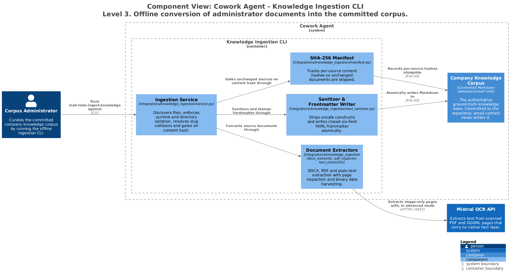

# Knowledge Ingestion CLI — Components

`mail-todo-ingest-knowledge` is a deterministic offline batch tool. It converts
administrator-supplied documents into sanitized Markdown under `data/extracted/`, plus a
SHA-256 manifest. It runs on an operator's machine, never inside a request, and its
output is committed to the repository.



> Generated from [`workspace.dsl`](workspace.dsl), view `c3-ingestion-cli`.
> Do not edit the image or its `.puml`; see [README §4](README.md#4-regenerating-the-diagrams).

---

## 1. Responsibilities

- Discover source documents safely, refusing anything that could escape the tree.
- Skip unchanged sources by content hash, so a re-run costs nothing.
- Extract DOCX, PDF, text and Markdown, escalating to OCR only when a page has no text.
- Emit sanitized Markdown with a closed frontmatter block, written atomically.

## 2. Elements

| Element | Responsibility | Source of truth |
|---|---|---|
| **Ingestion Service** | Discovery, directory and symlink isolation, slug collision resolution, hash gating, stage sequencing. | [`service.py`](../../src/cowork_agent/integrations/knowledge_ingestion/service.py) |
| **Document Extractors** | DOCX OpenXML AST parsing, PDF page classification and native text extraction, UTF-8 text, plus binary date harvesting. | [`docx_extractor.py`](../../src/cowork_agent/integrations/knowledge_ingestion/docx_extractor.py), [`pdf_inspector.py`](../../src/cowork_agent/integrations/knowledge_ingestion/pdf_inspector.py), [`text_extractor.py`](../../src/cowork_agent/integrations/knowledge_ingestion/text_extractor.py), [`date_harvest.py`](../../src/cowork_agent/integrations/knowledge_ingestion/date_harvest.py) |
| **Sanitizer & Frontmatter Writer** | NFC normalisation, control-character scrubbing, title resolution, closed six-field frontmatter, atomic write. | [`text_sanitizer.py`](../../src/cowork_agent/integrations/knowledge_ingestion/text_sanitizer.py) |
| **SHA-256 Manifest** | `ingestion-manifest.json`: source path, digest, page count, extractor type, title, harvested `document_date`, ISO timestamp. | [`manifest.py`](../../src/cowork_agent/integrations/knowledge_ingestion/manifest.py) |

## 3. Interfaces

```bash
# Ingest company knowledge documents into the extracted Markdown directory
uv run mail-todo-ingest-knowledge --source ./data/source --output ./data/extracted

# Force re-ingestion, bypassing the SHA-256 skip check
uv run mail-todo-ingest-knowledge --source ./data/source --output ./data/extracted --force

# Validate without writing files or updating the manifest
uv run mail-todo-ingest-knowledge --source ./data/source --output ./data/extracted --dry-run
```

| Environment variable | Default | Description |
|---|---|---|
| `EXTRACTION_MODE` | `adaptive` | `adaptive` uses local AST and native text with OCR escalation; `advance` routes every PDF and DOCX through Mistral OCR. |
| `KNOWLEDGE_INGEST_OCR_ENABLED` | `true` | Whether OCR fallback is available for scanned documents. |
| `MISTRAL_API_KEY` | `""` | Credential for `mistral-ocr-latest`. |
| `KNOWLEDGE_INGEST_MODEL` | `mistral-ocr-latest` | OCR model identifier. |
| `KNOWLEDGE_INGEST_TIMEOUT_SECONDS` | `60` | Timeout for external OCR calls. |
| `KNOWLEDGE_INGEST_MAX_ATTEMPTS` | `3` | Retry limit for OCR invocations. |
| `KNOWLEDGE_INGEST_MAX_BYTES` | `26214400` (25 MB) | Maximum source file size. |
| `KNOWLEDGE_INGEST_MAX_PDF_PAGES` | `100` | Maximum pages for a single PDF. |
| `KNOWLEDGE_INGEST_MAX_OCR_PAGES` | `100` | Maximum pages for a single OCR job. |

### Output contract

Closed six-field YAML frontmatter: `document_id`, `title`, `source_file`, `extractor`,
`page_count`, `processed_at`. `extractor` is one of `docx`, `pdf_native`, `mistral_ocr`,
`text`, `markdown`. Title resolution takes the first ATX H1, falling back to the filename
slug stem.

## 4. Invariants

| Invariant | Enforced by |
|---|---|
| Symlinks are rejected (`symlink_not_allowed`), so ingestion cannot disclose arbitrary files. | [`service.py`](../../src/cowork_agent/integrations/knowledge_ingestion/service.py) |
| Output may not nest inside source, nor source inside output (`source_output_nested`), preventing self-ingestion loops. | [`service.py`](../../src/cowork_agent/integrations/knowledge_ingestion/service.py) |
| Source paths normalise to lowercase ASCII slugs; two paths that collide are both blocked (`output_name_collision`). | [`service.py`](../../src/cowork_agent/integrations/knowledge_ingestion/service.py) |
| Hashing precedes extraction, so an unchanged file consumes no CPU and no external API quota. | [`manifest.py`](../../src/cowork_agent/integrations/knowledge_ingestion/manifest.py) |
| Markdown is written to a `.tmp` file, `fsync`ed, then atomically replaced — a parallel indexer never reads a partial file. | [`service.py`](../../src/cowork_agent/integrations/knowledge_ingestion/service.py) |
| Frontmatter is a closed block that the RAG loader strips, so its keys are never indexed as chunk text. | [`knowledge_base.py`](../../src/cowork_agent/integrations/rag/knowledge_base.py) |
| Date harvesting parses raw PDF `/Info` and DOCX CoreProperties bytes directly, never evaluating macros or script engines. | [`date_harvest.py`](../../src/cowork_agent/integrations/knowledge_ingestion/date_harvest.py) |
| Email bodies and attachments are never an input to this pipeline. | [ADR-003](../../tasks/adr/ADR-003-defer-attachment-processing.md), [ADR-004](../../tasks/adr/ADR-004-chat-native-task-episodes.md) |

## 5. Failure and degradation

| Failure | Behaviour |
|---|---|
| File exceeds `KNOWLEDGE_INGEST_MAX_BYTES` | `file_too_large`, before any extraction work. |
| PDF exceeds `KNOWLEDGE_INGEST_MAX_PDF_PAGES` | `pdf_page_limit_exceeded`. |
| Scanned pages found and `MISTRAL_API_KEY` unset | `mistral_not_configured`. The run halts cleanly rather than emitting corrupted text into the corpus. |
| OCR call fails after `KNOWLEDGE_INGEST_MAX_ATTEMPTS` | `ocr_extraction_failed`. Nothing is written for that source. |
| Hash matches a previous successful run, no `--force` | `outcome="skipped"`. |

## 6. Known gaps

None.

## 7. Related

- [c2-containers.md](c2-containers.md) — the containing view
- [c3-api-retrieval.md](c3-api-retrieval.md) — what consumes the corpus this produces
- [c3-worker.md](c3-worker.md) — the runtime document plane, which shares the extractor and OCR code but not the corpus
- [ADR-003](../../tasks/adr/ADR-003-defer-attachment-processing.md)
