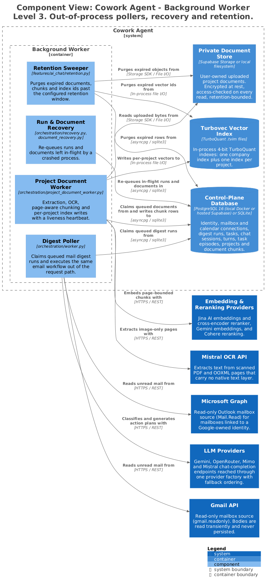

# Background Worker — Components

`mail-todo-worker` is the out-of-process half of the system. It claims queued work by
lease, executes the same feature code the API would have executed inline, and owns the
two jobs nothing in a request can own: recovery after a crash, and retention.

> Generated from [`workspace.dsl`](workspace.dsl), view `c3-worker`.
> Do not edit the image or its `.puml`; see [README §4](README.md#4-regenerating-the-diagrams).

---

## 1. Responsibilities

- Execute mail digest runs outside the request path.
- Extract, OCR, chunk and index user project documents, publishing a liveness heartbeat.
- Re-queue anything a crashed process left in flight.
- Purge documents, chunks and vector ids past their retention window.

## 2. Elements

| Element | Responsibility | Source of truth |
|---|---|---|
| **Digest Poller** | Claims queued mail digest runs and executes the email workflow. | [`orchestration/worker.py`](../../src/cowork_agent/orchestration/worker.py) |
| **Project Document Worker** | Extraction, OCR escalation, page-aware chunking and per-project index writes, with a heartbeat `document-health` reads. | [`orchestration/project_document_worker.py`](../../src/cowork_agent/orchestration/project_document_worker.py) |
| **Run & Document Recovery** | Re-queues runs and documents left in-flight by a crashed process. | [`orchestration/recovery.py`](../../src/cowork_agent/orchestration/recovery.py), [`document_recovery.py`](../../src/cowork_agent/orchestration/document_recovery.py) |
| **Retention Sweeper** | Purges expired documents, chunk rows and `.tvim` ids. | [`features/ai_chat/retention.py`](../../src/cowork_agent/features/ai_chat/retention.py) |

## 3. Interfaces

| Interface | Shape | Notes |
|---|---|---|
| `mail-todo-worker` | Entry point | `main()` runs the Postgres worker when `database_url()` is set, otherwise the SQLite worker. |
| Lease queue | Database | Jobs are claimed by lease, not by in-memory dispatch, so two workers cannot double-execute. |
| `ProjectDocumentWorkerHeartbeat` | Repository port | The liveness signal `document-health` requires to report ready. |
| `LOG_LEVEL`, `LOG_FILE` | Env | Default `INFO` and `.data/worker.log`. INFO records are dropped without a root handler, and the trace sink is INFO-only. |

### Document status machine

`received → extracting → indexing → ready`, with `failed(reason_code)` reachable from
each stage. Deletion is permitted while a document is `received`, `extracting` or
`indexing`.

## 4. Invariants

| Invariant | Enforced by |
|---|---|
| The worker runs the same feature code as the API. There is no second implementation of the mail pipeline. | [`orchestration/worker.py`](../../src/cowork_agent/orchestration/worker.py) |
| Work is claimed by durable lease; a crashed lease is recovered, never silently lost. | [`orchestration/recovery.py`](../../src/cowork_agent/orchestration/recovery.py) |
| Every project chunk carries `page_start` / `page_end`, so a citation can name a page. | [`knowledge_ingestion/project_documents.py`](../../src/cowork_agent/integrations/knowledge_ingestion/project_documents.py) |
| Extracted document text is written to the project plane only. It never reaches the company corpus, a `TaskEpisode`, or the declarative profile. | [ADR-007](../../tasks/adr/ADR-007-project-scoped-classifier-gated-user-documents.md) |
| Deletion purges the object, the extracted text, the chunk rows and the `.tvim` ids, and is repeatable until every store confirms. | [`features/ai_chat/retention.py`](../../src/cowork_agent/features/ai_chat/retention.py) |

## 5. Failure and degradation

| Failure | Behaviour |
|---|---|
| Validation rejection at upload | `failed(reason_code)`. No job is created and no bytes are retained beyond the failure record. |
| Extraction failure | `failed`. The document is never indexed; chat is unaffected. |
| OCR-required PDF with no OCR available | `failed(ocr_unavailable)`. Native-text pages of a mixed PDF are not indexed alone. `document-health` reports `ocr: optional_unavailable`. |
| Embedding or index ingestion outage | Bounded durable retries with backoff, then `failed(index_unavailable)`. |
| Worker process dies mid-job | The lease expires; recovery re-queues on the next boot. |
| Worker heartbeat goes stale | `document-health` degrades to `503`; the SPA keeps document controls fail-closed. Chat and mail continue. |

## 6. Known gaps

None.

## 7. Related

- [c2-containers.md](c2-containers.md) — the containing view
- [c3-api-email-action-plan.md](c3-api-email-action-plan.md) — the workflow the digest poller executes
- [c3-api-ai-chat.md](c3-api-ai-chat.md) — the consumer of indexed project documents
- [ADR-007](../../tasks/adr/ADR-007-project-scoped-classifier-gated-user-documents.md) · [ADR-010](../../tasks/adr/ADR-010-local-postgres-control-plane-latency.md)
