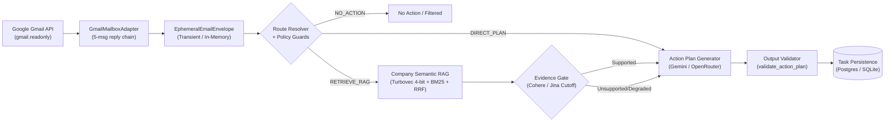

# Email Action Plan & RAG Subsystem (Level 1 Architecture)

**Architecture level:** Level 1 — High-Level Component & Data Flow  
**Status:** Live / Implemented  
**Primary Owner:** `src/cowork_agent/features/email_action_plan`  
**Target Alignment:** Fully Aligned with [TARGET-ARCHITECTURE.md §1 & §2](../TARGET-ARCHITECTURE.md)

---

## 1. Subsystem Overview

The Email Action Plan & RAG Subsystem is a single-turn, memory-isolated pipeline dedicated to transforming unread Gmail messages into structured, body-free action plans. It reads unread emails via OAuth (`gmail.readonly`), applies 5-email reply chain aggregation ([ADR-011](../../../tasks/adr/ADR-011-reply-chain-context-aggregation.md)), normalizes messages into transient [`EphemeralEmailEnvelope`](../../../src/cowork_agent/domain/target_contracts.py) records, deterministically routes each candidate, selectively queries the committed company knowledge base ([ADR-003](../../../tasks/adr/ADR-003-defer-attachment-processing.md)), and validates output plans before persisting body-free tasks.

> [!NOTE]
> Company RAG is strictly retrieval-only for this workflow. Raw email bodies and attachments are never indexed into `data/extracted/` or the Turbovec semantic store.

---

## 2. Key Components & Responsibilities

| Component | Path / Implementation | Level 1 Responsibility |
|---|---|---|
| **Mailbox Adapter & Reply Chain** | [`provider.py`](../../../src/cowork_agent/integrations/gmail/provider.py) (`GmailMailboxAdapter`) & [`workflow.py`](../../../src/cowork_agent/features/email_action_plan/workflow.py) | OAuth `gmail.readonly` access. Sorts threads chronologically, ensures latest email is `UNREAD`, aggregates up to 5 linked emails per thread ([ADR-011](../../../tasks/adr/ADR-011-reply-chain-context-aggregation.md)), and normalizes into `EphemeralEmailEnvelope`. |
| **Attachment Scope Boundary** | [`provider.py`](../../../src/cowork_agent/integrations/gmail/provider.py) (`_has_attachments`) | Implements [ADR-003](../../../tasks/adr/ADR-003-defer-attachment-processing.md): records `attachments_present` boolean counter only. Never downloads attachment content or passes attachment bytes to LLMs. |
| **Route Classifier & Intent Extraction** | [`openrouter.py`](../../../src/cowork_agent/integrations/llm/providers/openrouter.py) / [`gemini.py`](../../../src/cowork_agent/integrations/llm/providers/gemini.py) | Evaluates email batches with truncated bodies (`body[:1200]`) to classify actionability, internal terms, and knowledge sufficiency. |
| **Deterministic Route Resolver** | [`routing.py`](../../../src/cowork_agent/features/email_action_plan/routing.py) (`resolve_candidate_after_retrieval`, `apply_policy_guards`) | Table-driven resolution enforcing FR-07 policy guards (`COMPANY_POLICY`, `GOVERNANCE_DOCUMENT`, `PROCEDURE`, `TEMPLATE`). Aggregates candidate routes where highest precedence wins (`RETRIEVE_RAG` > `DIRECT_PLAN` > `NO_ACTION`). |
| **Deterministic Evidence Gate** | [`evidence.py`](../../../src/cowork_agent/features/email_action_plan/evidence.py) (`assess_retrieval_evidence`) | Filters retrieval chunks using dynamic reranker cutoff (`min_rerank_score` and `relative_cutoff_ratio`). Downgrades ungrounded retrieval to partial direct plans. |
| **Company Semantic Memory** | [`bootstrap.py`](../../../src/cowork_agent/integrations/rag/bootstrap.py), [`hybrid.py`](../../../src/cowork_agent/integrations/rag/hybrid.py), [`turbovec_memory.py`](../../../src/cowork_agent/integrations/rag/turbovec_memory.py) | Backed by `TurbovecSemanticMemory` (4-bit TurboQuant at `.data/turbovec_index.tvim`) wrapped with `BM25SearchAdapter` + RRF rank fusion + Cohere/Jina reranking over committed [`data/extracted/*.md`](../../../data/extracted) files. Gracefully degrades to [`NullSemanticMemory`](../../../src/cowork_agent/integrations/rag/null_memory.py). |
| **Action Plan Workflow Orchestrator** | [`workflow.py`](../../../src/cowork_agent/features/email_action_plan/workflow.py) (`DigestWorker`) | Orchestrates the single-turn pipeline: fetch threads → classify intent → candidate correlation → 0-or-1 retrieval + query rewrite → evidence gate → action plan generation → validation → deduplication → persistence. |
| **Action Plan Generator & Resilient LLM** | [`openrouter.py`](../../../src/cowork_agent/integrations/llm/providers/openrouter.py), [`gemini.py`](../../../src/cowork_agent/integrations/llm/providers/gemini.py), [`last_resort.py`](../../../src/cowork_agent/integrations/llm/last_resort.py) | Synthesizes full 4-block context (untrusted email data, route context, retrieved RAG context, ISO-8601 UTC+7 schema constraints). Implements [ADR-012](../../../tasks/adr/ADR-012-openrouter-gemini-last-resort.md) fallback (`models[]` fallback array + Gemini last-resort retry). |
| **Output Validator & Privacy Guard** | [`validation.py`](../../../src/cowork_agent/features/email_action_plan/validation.py) (`validate_action_plan`) | Enforces required fields, allowed actionability, step sequence renumbering, citation sanity against retrieval chunks, and substring sliding-window privacy leak checks (`RAW_BODY_LEAK`). |

---

## 3. Storage & Memory Boundaries

1. **Transient In-Memory Envelopes:** Raw email text lives exclusively in `EphemeralEmailEnvelope` dataclasses and the in-process [`ShortTermStore`](../../../src/cowork_agent/features/email_action_plan/short_term.py). The store is purged in the `finally` block of `DigestWorker.execute` upon completion or failure. Raw email bodies never reach long-term storage.
2. **Company RAG Corpus:** Curated company documents committed under [`data/extracted/*.md`](../../../data/extracted), indexed at startup by `build_semantic_memory`. The corpus is read-only during execution; incoming emails or user uploads are never written to the company index.
3. **Durable Task Output:** Persisted records in [`TaskRepository`](../../../src/cowork_agent/features/email_action_plan/ports.py) store structured action steps, title, request summary, citation coordinates, and Gmail message pointer IDs (`TaskPointer`). No raw email body text or attachment binaries are retained.

---

## 4. LLM Resilience & Multi-Provider Hierarchy

In accordance with [ADR-012](../../../tasks/adr/ADR-012-openrouter-gemini-last-resort.md):
- When `LLM_PROVIDER=openrouter`, requests dispatch with native `models[]` fallback lists configured via `OPENROUTER_ALLOWED_MODELS`.
- On `OpenRouterAPIError` (transport/network failure, 429 rate limit, 5xx upstream, or unparseable payload), the call automatically retries via [`last_resort.py`](../../../src/cowork_agent/integrations/llm/last_resort.py) on Google Gemini using key rotation.
- Schema repair loops run locally before triggering provider fallbacks.

---

## 5. Alignment & Diff vs Target Architecture

- **Target Alignment:** Fully aligned with [TARGET-ARCHITECTURE.md §1 & §2](../TARGET-ARCHITECTURE.md). The email action plan pipeline operates with strict privacy boundaries, stateless execution, presence-only attachment tracking ([ADR-003](../../../tasks/adr/ADR-003-defer-attachment-processing.md)), and complete retrieval evidence gating.
- **Workflow Isolation:** Follows [ADR-004](../../../tasks/adr/ADR-004-chat-native-task-episodes.md) principles, keeping email ingestion isolated from conversational memory buffers while enabling flexible system integration.
- **Implementation Residue:** Legacy `AttachmentExtractorPort` / `SafeTextAttachmentExtractor` definitions remain in codebase for compatibility/test harness purposes, but are discarded by `DigestWorker` at runtime.
- **Architecture Diff:** **0 Product Diff — 100% Aligned with Target Architecture**.
