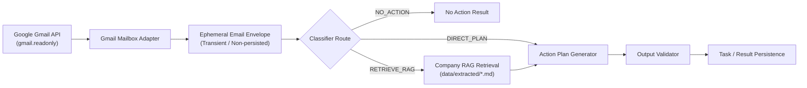

# Email Action Plan & RAG Subsystem (Level 1 Architecture)

**Architecture level:** Level 1 — High-Level Component & Data Flow  
**Status:** Live / Implemented  
**Primary Owner:** `src/cowork_agent/features/email_action_plan` & `src/cowork_agent/integrations/rag`  
**Target Alignment:** Fully Aligned with [TARGET-ARCHITECTURE.md §20](file:///e:/VIN-INTERNSHIP/EMAIL-AGENT-v1/docs/architectures/TARGET-ARCHITECTURE.md) (Stateless, standalone Email Agent)

---

## 1. Subsystem Overview

The Email Action Plan & RAG Subsystem is a single-turn, stateless execution pipeline. It ingests unread Gmail messages, normalizes them into transient envelopes, classifies actionability and knowledge sufficiency, performs optional enterprise RAG retrieval from committed company documents, and generates structured Action Plans.

---

## 2. Key Components & Responsibilities

| Component | Path / Implementation | Level 1 Responsibility |
|---|---|---|
| **Mailbox Adapter** | `src/cowork_agent/integrations/gmail/provider.py` | Connects via OAuth `gmail.readonly`, searches unread inbox messages, and normalizes metadata & body text. |
| **Attachment Extractor** | `src/cowork_agent/integrations/gmail/fakes.py` | Extracts bounded UTF-8 text from `.txt`, `.csv`, `.json` attachments without persisting raw binaries. |
| **Route Classifier** | `src/cowork_agent/features/email_action_plan/routing.py` | Classifies email intent into `NO_ACTION`, `DIRECT_PLAN`, or `RETRIEVE_RAG`. |
| **Semantic RAG Store** | `src/cowork_agent/integrations/rag/` | Provides zero-or-one vector/hybrid retrieval from `data/extracted/*.md` (Turbovec, Qdrant, or BM25/Hybrid). |
| **Action Plan Generator** | `src/cowork_agent/features/email_action_plan/workflow.py` | Calls structured LLM provider (Gemini / Groq / Faucet) to construct actionable steps and next actions. |
| **Output Validator** | `src/cowork_agent/features/email_action_plan/validation.py` | Enforces strict schema, citation grounding, and priority rules before result persistence. |

---

## 3. Storage & Memory Boundaries

1. **Transient Email Data:** Raw email contents and attachments exist only in memory during the execution turn (`EphemeralEmailEnvelope`). They are **never** stored in vector indices or long-term databases.
2. **Company RAG Corpus:** Standardized company Markdown documentation committed in `data/extracted/*.md`. Indexed via `mail-todo-ingest-knowledge` into Turbovec (`turbovec_memory.py`) or Qdrant (`qdrant.py`).
3. **Durable Output:** Minimal task summaries, title, priority, and citation metadata stored in SQLite/Postgres.

---

## 4. Alignment & Diff vs Target Architecture

- **Alignment:** 100% aligned with target principles. The Email Agent operates in complete isolation from multi-turn AI Chat session memory.
- **Decoupled Architecture:** Adheres strictly to [ADR-004](file:///e:/VIN-INTERNSHIP/EMAIL-AGENT-v1/tasks/adr/ADR-004-chat-native-task-episodes.md); the Email Action Plan workflow is a standalone product flow operating independently of AI Chat context.
