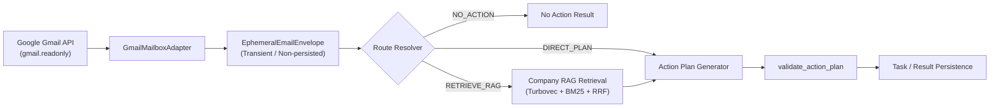

# Email Action Plan & RAG Subsystem (Level 1 Architecture)

**Architecture level:** Level 1 — High-Level Component & Data Flow  
**Status:** Live / Implemented  
**Primary Owner:** `src/cowork_agent/features/email_action_plan` & `src/cowork_agent/integrations/rag`  
**Target Alignment:** Fully Aligned with [TARGET-ARCHITECTURE.md §1 & §2](file:///e:/VIN-INTERNSHIP/EMAIL-AGENT-v1/docs/architectures/TARGET-ARCHITECTURE.md) (Stateless, standalone Email Agent)

---

## 1. Subsystem Overview

The Email Action Plan & RAG Subsystem is a **standalone, single-turn, memory-free** PRD-v1 pipeline. It is **not** an in-chat `@Email` tool ([ADR-004](file:///e:/VIN-INTERNSHIP/EMAIL-AGENT-v1/tasks/adr/ADR-004-chat-native-task-episodes.md)). It reads unread Gmail (`gmail.readonly`), normalizes messages into transient `EphemeralEmailEnvelope`s, resolves a route, optionally retrieves from the committed company corpus, and persists body-free Action Plans.

> [!NOTE]
> Company RAG is retrieval-only for this workflow. Raw email and attachment bytes are never written to `data/extracted/` or the Turbovec index.

---

## 2. Key Components & Responsibilities

| Component | Path / Implementation | Level 1 Responsibility |
|---|---|---|
| **Mailbox Adapter** | [provider.py](file:///e:/VIN-INTERNSHIP/EMAIL-AGENT-v1/src/cowork_agent/integrations/gmail/provider.py) `GmailMailboxAdapter` | OAuth `gmail.readonly` only. `search_unread` / `get_thread` normalize metadata and body into `EphemeralEmailEnvelope`. |
| **Attachment Presence** | [provider.py](file:///e:/VIN-INTERNSHIP/EMAIL-AGENT-v1/src/cowork_agent/integrations/gmail/provider.py) `_has_attachments` | ADR-003: record `attachments_present` only. Digest path does **not** download or extract attachment content. |
| **Route Resolver** | [routing.py](file:///e:/VIN-INTERNSHIP/EMAIL-AGENT-v1/src/cowork_agent/features/email_action_plan/routing.py) `resolve_route` / `resolve_candidate_route` | Deterministic ladder to `NO_ACTION` \| `DIRECT_PLAN` \| `RETRIEVE_RAG`. The LLM classifier proposes; the resolver owns the final route. |
| **Company Semantic RAG** | [bootstrap.py](file:///e:/VIN-INTERNSHIP/EMAIL-AGENT-v1/src/cowork_agent/integrations/rag/bootstrap.py) `build_semantic_memory` | Default `RAG_STORE_PROVIDER=turbovec`: [HybridSemanticMemory](file:///e:/VIN-INTERNSHIP/EMAIL-AGENT-v1/src/cowork_agent/integrations/rag/hybrid.py) wraps [TurbovecSemanticMemory](file:///e:/VIN-INTERNSHIP/EMAIL-AGENT-v1/src/cowork_agent/integrations/rag/turbovec_memory.py) + BM25 + RRF over committed `data/extracted/*.md` (`load_corpus`). Unknown, retired (`qdrant` — no live module), disabled, or failed setup degrades to [NullSemanticMemory](file:///e:/VIN-INTERNSHIP/EMAIL-AGENT-v1/src/cowork_agent/integrations/rag/null_memory.py). |
| **Action Plan Workflow** | [workflow.py](file:///e:/VIN-INTERNSHIP/EMAIL-AGENT-v1/src/cowork_agent/features/email_action_plan/workflow.py) `DigestWorker` | Single-turn orchestration: fetch → classify → resolve → zero-or-one retrieve → one Gemini / Groq / Faucet generation call per non-`NO_ACTION` candidate. |
| **Output Validator** | [validation.py](file:///e:/VIN-INTERNSHIP/EMAIL-AGENT-v1/src/cowork_agent/features/email_action_plan/validation.py) `validate_action_plan` | Enforces schema, citation grounding, and no raw-body leak before `TaskRepository.save_task`. |

---

## 3. Storage & Memory Boundaries

1. **Transient Email Data:** Raw bodies live only in `EphemeralEmailEnvelope` and the in-process [ShortTermStore](file:///e:/VIN-INTERNSHIP/EMAIL-AGENT-v1/src/cowork_agent/features/email_action_plan/short_term.py) (run-local TTL; cleared by the run finalizer). They are **never** persisted and **never** ingested into company RAG. Attachment **content** is out of scope (ADR-003); only `attachments_present` is counted.
2. **Company RAG Corpus:** Committed `data/extracted/*.md` only, loaded by `load_corpus` in [knowledge_base.py](file:///e:/VIN-INTERNSHIP/EMAIL-AGENT-v1/src/cowork_agent/integrations/rag/knowledge_base.py) and indexed at process start by `build_semantic_memory` into Turbovec (`.data/turbovec_index.tvim`) + BM25. Offline Markdown is produced by `mail-todo-ingest-knowledge` (see 06). There is no live `qdrant` module.
3. **Durable Output:** Run metadata, body-free `Task` rows (title, action plan, citation coordinates), and Gmail pointer metadata (sender, subject, thread, deep link). No raw email body or attachment bytes.

---

## 4. Alignment & Diff vs Target Architecture

- **Alignment:** Matches [TARGET-ARCHITECTURE.md §1 & §2](file:///e:/VIN-INTERNSHIP/EMAIL-AGENT-v1/docs/architectures/TARGET-ARCHITECTURE.md): standalone PRD-v1 Email Agent, single-turn, no typed chat memory, not callable from AI Chat, company RAG retrieval-only, Gmail `gmail.readonly`, attachments presence-only (ADR-003).
- **Decoupled Architecture:** [ADR-004](file:///e:/VIN-INTERNSHIP/EMAIL-AGENT-v1/tasks/adr/ADR-004-chat-native-task-episodes.md) — this workflow is a separate product API, not an in-chat `@Email` tool.
- **Remaining vs TARGET:** 0 product Diff. Implementation leftover only: `AttachmentExtractorPort` / `SafeTextAttachmentExtractor` are still constructed for callers/tests; `DigestWorker` discards them and never downloads attachments.

