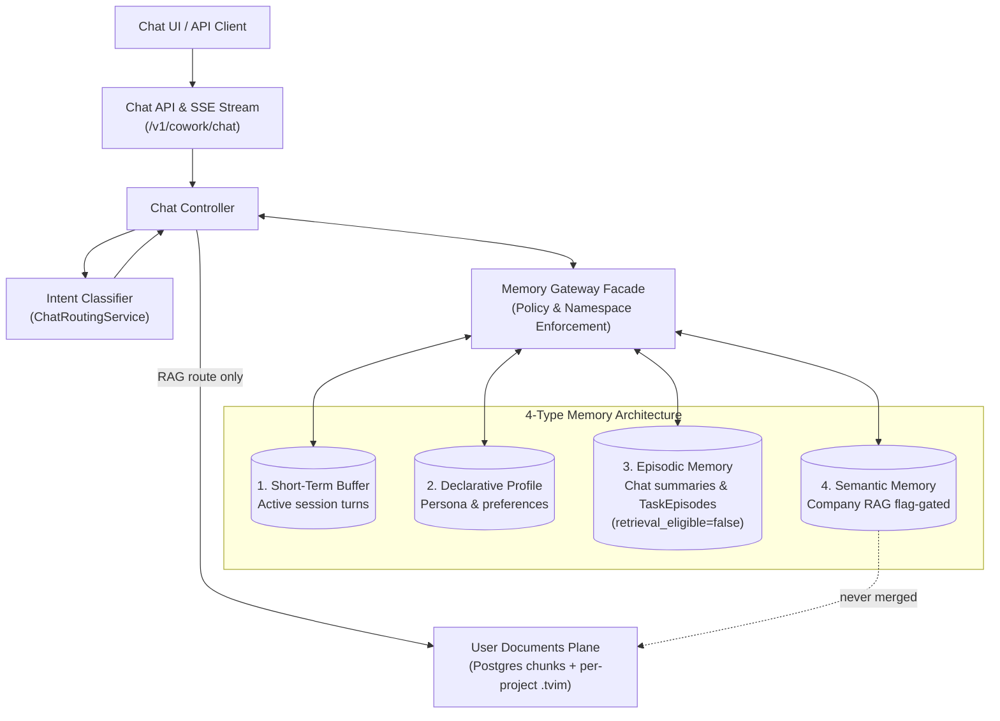

# AI Chat & Typed Memory Core (Level 1 Architecture)

**Architecture level:** Level 1 — High-Level Component & Data Flow  
**Status:** Live / Implemented  
**Primary Owner:** `src/cowork_agent/features/ai_chat`  
**Target Alignment:** Mostly Aligned with [TARGET-ARCHITECTURE.md §2 & §3](file:///C:/WORK/EMAIL-AGENT-v1/docs/architectures/TARGET-ARCHITECTURE.md) ([ADR-004](file:///C:/WORK/EMAIL-AGENT-v1/tasks/adr/ADR-004-chat-native-task-episodes.md), [ADR-007](file:///C:/WORK/EMAIL-AGENT-v1/tasks/adr/ADR-007-project-scoped-classifier-gated-user-documents.md))

---

## 1. Subsystem Overview

The AI Chat Subsystem is a multi-turn assistant: it streams replies, reads four typed memory scopes through the Memory Gateway, and persists a chat-native `TaskEpisode` only after an explicit user task request ([ADR-004](file:///C:/WORK/EMAIL-AGENT-v1/tasks/adr/ADR-004-chat-native-task-episodes.md)). User documents represent a secondary semantic **plane** (project-scoped), never merged with company RAG ([ADR-007](file:///C:/WORK/EMAIL-AGENT-v1/tasks/adr/ADR-007-project-scoped-classifier-gated-user-documents.md)).

For standard chat turns, request validation strictly checks fields (`extra="forbid"` on `_ChatMessagePayload` and `ChatMessageRequest.from_dict`). Dedicated mail scan results are captured through the `/sessions/{session_id}/mail-scans` endpoint as aggregate `MailScanSummary` records without storing raw email content.

---

## 2. Key Components & Responsibilities

| Component | Path / Implementation | Level 1 Responsibility |
|---|---|---|
| **Chat API Router** | [chat.py](file:///C:/WORK/EMAIL-AGENT-v1/src/cowork_agent/api/chat.py) | Exposes `/v1/cowork/chat/sessions`, `/messages` SSE, profile CRUD, mail scan recording, and TaskEpisode lifecycle (approve/complete/reject). |
| **Chat Controller** | [controller.py](file:///C:/WORK/EMAIL-AGENT-v1/src/cowork_agent/features/ai_chat/controller.py) | Orchestrates one turn in-process: classify → optional user-doc retrieve → assemble → stream → persist. Writes a `TaskEpisode` only when `is_explicit_task_request` is true. |
| **Memory Gateway** | [memory_gateway.py](file:///C:/WORK/EMAIL-AGENT-v1/src/cowork_agent/features/ai_chat/memory_gateway.py) | Fail-closed facade for tenant/session namespacing across the four memory types plus a retrieval-only user-document port. |
| **Intent Classifier & Resolver** | [service.py](file:///C:/WORK/EMAIL-AGENT-v1/src/cowork_agent/features/ai_chat/intent/service.py) & [resolver.py](file:///C:/WORK/EMAIL-AGENT-v1/src/cowork_agent/features/ai_chat/intent/resolver.py) | Sole user-document routing authority (`ChatRoutingService`). Executes `CHAT` / `RAG` / `CLARIFY`. The precondition gate narrows `RAG` → `CHAT` when no ready documents exist in the project catalog. |
| **Retrieval / Episode Policy** | [retrieval_policy.py](file:///C:/WORK/EMAIL-AGENT-v1/src/cowork_agent/features/ai_chat/retrieval_policy.py) & [episode_policy.py](file:///C:/WORK/EMAIL-AGENT-v1/src/cowork_agent/features/ai_chat/episode_policy.py) | Cue-gated company-RAG and episodic reads; TaskEpisode writes must be `system_generated` / `retrieval_eligible=false` / `explicit_user_task_request`. |
| **User Documents Plane** | [ports.py](file:///C:/WORK/EMAIL-AGENT-v1/src/cowork_agent/features/user_documents/ports.py), [project_documents.py](file:///C:/WORK/EMAIL-AGENT-v1/src/cowork_agent/integrations/rag/project_documents.py), [project_index.py](file:///C:/WORK/EMAIL-AGENT-v1/src/cowork_agent/integrations/rag/project_index.py), [projects.py](file:///C:/WORK/EMAIL-AGENT-v1/src/cowork_agent/api/projects.py) | Project-scoped upload/list/delete under `/v1/cowork/chat/projects/{id}/documents`. Hybrid store is Postgres chunks + per-project `.tvim` with no company-index fallback. Gated by `USER_DOCUMENTS_ENABLED` and `CHAT_INTENT_CLASSIFIER_ENABLED`. |

---

## 3. The 4 Typed Memory System

1. **Short-Term Memory (Session Buffer):** Bounded in-process store ([session_buffer.py](file:///C:/WORK/EMAIL-AGENT-v1/src/cowork_agent/features/ai_chat/session_buffer.py) — `InMemoryChatSessionBuffer`). Postgres/SQLite `chat_turns` owns durable session turn metadata and replay history.
2. **Long-Term Declarative Memory:** Compact profile (language, timezone, persona, tone) written only with `explicit_user_config` provenance ([profile_policy.py](file:///C:/WORK/EMAIL-AGENT-v1/src/cowork_agent/features/ai_chat/profile_policy.py)). User documents are never an inferred preference source.
3. **Episodic Memory:** Chat-session summaries (always `retrieval_eligible=false`) and chat-native `TaskEpisode` records ([episode_policy.py](file:///C:/WORK/EMAIL-AGENT-v1/src/cowork_agent/features/ai_chat/episode_policy.py)).
   - *Key Rule ([ADR-004](file:///C:/WORK/EMAIL-AGENT-v1/tasks/adr/ADR-004-chat-native-task-episodes.md)):* A TaskEpisode is created only after an explicit user request (`is_explicit_task_request`). New writes are `system_generated` / `retrieval_eligible=false`. Eligibility is derived from `validation_status` (`user_approved` or `completed` → true; `rejected` stays false). Ordinary chat, classifier output, and model-only inference cannot create an episode.
4. **Semantic Memory (two unmerged planes):**
   - **Company RAG:** Optional chat-side read of `data/extracted/*.md` through the Memory Gateway. Gated by `CHAT_COMPANY_RAG_ENABLED` (env default `false`). When enabled, [retrieval_policy.py](file:///C:/WORK/EMAIL-AGENT-v1/src/cowork_agent/features/ai_chat/retrieval_policy.py) requires an explicit company-policy cue phrase.
   - **User Documents:** Separate project-scoped plane (Postgres or SQLite chunks + per-project Turbovec `.tvim`). Retrieved only on classifier route `RAG`. An unavailable project index degrades gracefully; it never falls back to the company index.

---

## 4. Alignment & Diff vs Target Architecture

- **TaskEpisode lifecycle:** Aligned with [ADR-004](file:///C:/WORK/EMAIL-AGENT-v1/tasks/adr/ADR-004-chat-native-task-episodes.md). Explicit request only; new episodes start `retrieval_eligible=false`; eligibility atomically updated on approval/completion/rejection.
- **Company RAG in chat:** Aligned with TARGET §3. Consumer is the standalone Email Agent plus AI Chat behind `CHAT_COMPANY_RAG_ENABLED` (env default `false`).
- **User-document gating:** Aligned with [ADR-007](file:///C:/WORK/EMAIL-AGENT-v1/tasks/adr/ADR-007-project-scoped-classifier-gated-user-documents.md). Hierarchy is `tenant → user → project → documents + sessions`. Classifier is the sole route origin; the readiness gate only narrows. Feature flags `USER_DOCUMENTS_ENABLED` and `CHAT_INTENT_CLASSIFIER_ENABLED` default true.
- **User-document store:** Aligned with [ADR-008](file:///C:/WORK/EMAIL-AGENT-v1/tasks/adr/ADR-008-turbovec-project-document-plane.md). Postgres or SQLite chunks ([sqlite_project_document_chunks.py](file:///C:/WORK/EMAIL-AGENT-v1/src/cowork_agent/persistence/repositories/sqlite_project_document_chunks.py)) plus per-project `.tvim` ([project_index.py](file:///C:/WORK/EMAIL-AGENT-v1/src/cowork_agent/integrations/rag/project_index.py)); no silent company-index fallback.
- **Email Capability Integration:** Standalone Email Agent runs independently for email action planning. AI Chat persists aggregate mail scan results (`MailScanSummary` via `/sessions/{session_id}/mail-scans`), keeping chat memory free of raw email bodies or attachment contents.
- **OCR on the user-document plane:** Aligned with TARGET §3.4. Pages needing OCR fail closed as `ocr_unavailable`; mixed-PDF native pages are not indexed alone. `document-health` reports `ocr: optional_unavailable`.
- **Local fallback:** With `POSTGRES_MODE=off`, chat sessions, history, profile memory, task episodic memory, projects, document jobs, and document chunks persist in SQLite. The bounded working-memory buffer stays in-process.

Remaining drift vs TARGET:

| Concern | TARGET §2 / §3 | Live |
|---|---|---|
| Turn orchestration | Small graph `classify → retrieve → assemble → generate → persist` | Graph module exists ([graph/runner.py](file:///C:/WORK/EMAIL-AGENT-v1/src/cowork_agent/features/ai_chat/graph/runner.py)) but is not composed in `app.py`; `ChatController.stream_message` owns the turn. |
| Document HTTP surface | §21.10 user-wide `/v1/cowork/chat/documents` | ADR-007 project-scoped `/v1/cowork/chat/projects/{project_id}/documents` (+ `document-health`). |
| Short-term store | Redis or in-process | In-process only (`create_chat_session_buffer` always returns `InMemoryChatSessionBuffer`). |
| Retrieval timeout default | `USER_DOCUMENTS_RETRIEVAL_TIMEOUT_MS=3000` | Config default is `10000` (capped at 10s). |

