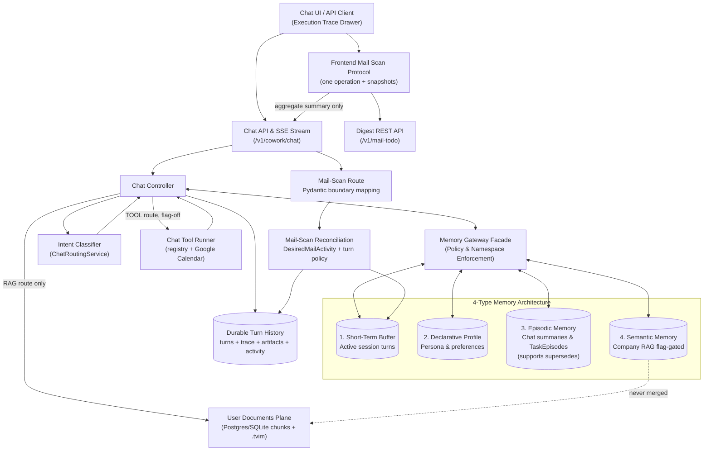

# AI Chat & Typed Memory Core (Level 1 Architecture)

**Architecture level:** Level 1 — High-Level Component & Data Flow  
**Status:** Live / Implemented  
**Last Updated:** 2026-08-26
**Primary Owner:** `src/cowork_agent/features/ai_chat`  
**Target Alignment:** Mostly Aligned with [TARGET-ARCHITECTURE.md §2 & §3](../TARGET-ARCHITECTURE.md) ([ADR-004](../../../tasks/adr/ADR-004-chat-native-task-episodes.md), [ADR-007](../../../tasks/adr/ADR-007-project-scoped-classifier-gated-user-documents.md))

---

## 1. Subsystem Overview

The AI Chat Subsystem is a multi-turn assistant: it streams replies, reads four typed memory scopes through the Memory Gateway, and persists a chat-native `TaskEpisode` only after an explicit user task request ([ADR-004](../../../tasks/adr/ADR-004-chat-native-task-episodes.md)). User documents represent a secondary semantic **plane** (project-scoped), never merged with company RAG ([ADR-007](../../../tasks/adr/ADR-007-project-scoped-classifier-gated-user-documents.md)).

For standard chat turns, request validation strictly checks fields (`extra="forbid"` on `_ChatMessagePayload` and `ChatMessageRequest.from_dict`). Turns support `reasoning_mode` (`fast` | `reasoning`), streaming live thinking traces alongside text deltas. The controller records a bounded execution trace (`ChatExecutionTrace`), auto-generates report artifacts (`GeneratedReportArtifact` scoped to the `reports/` folder), and emits a bounded, server-stamped user-facing activity snapshot that is streamed over SSE and stored with chat history. End-to-end LLM calls and memory operations are instrumented with Langfuse (`@observe`). Dedicated mail scans run in the frontend through `runMailScanProtocol`, separate from the SSE reader; the React adapter captures their aggregate result through `/sessions/{session_id}/mail-scans` as `MailScanSummary` plus the same safe activity metadata, without storing raw email content. The route maps its private Pydantic activity payload once into `DesiredMailActivity`; transport-free reconciliation then applies the same validation and transition rules to durable history and the short-term buffer.

A fourth route, `TOOL`, executes one server-chosen action before the reply is generated. The router picks the tool, a per-turn argument fill resolves its arguments from the conversation, and the registry runs it; the outcome reaches the model as `GenerationContext.tool_result`, never as a client-supplied tool choice. The only registered tool creates a Google Calendar event. **The whole path is off by default and unconfigured in every deployed environment** — `GOOGLE_CALENDAR_ENABLED` and `CHAT_TOOL_AXIS_ENABLED` both default false, and with either off the reply payload is byte-identical to a tool-free turn.

---

## 2. Key Components & Responsibilities

| Component | Path / Implementation | Level 1 Responsibility |
|---|---|---|
| **Chat API Router** | [`chat.py`](../../../src/cowork_agent/api/chat.py) | Exposes `/v1/cowork/chat/sessions`, `/messages` SSE, profile CRUD, aggregate mail-scan lifecycle recording, and TaskEpisode lifecycle (approve/complete/reject). |
| **Mail-Scan Turn Reconciliation** | [`mail_scan_reconciliation.py`](../../../src/cowork_agent/features/ai_chat/mail_scan_reconciliation.py) | Owns `DesiredMailActivity`, scan/turn status validation, append-only activity reconciliation, idempotent durable-turn merge, and short-term buffer upsert. It imports domain contracts and the buffer port, never transport payloads; `chat.py` converts Pydantic detail/activity values once through `_desired_mail_activity`. |
| **Frontend Mail Scan Protocol** | [`mailScanProtocol.ts`](../../../frontend/src/dashboard/hooks/mailScanProtocol.ts), [`useStreamingChat.ts`](../../../frontend/src/dashboard/hooks/useStreamingChat.ts) | `runMailScanProtocol` owns mailbox choice, provider runs, polling, retry tolerance, cancellation, ordered aggregation, and snapshots. `useStreamingChat` remains the React adapter that maps snapshots to messages/activities and persists deduped aggregate lifecycle updates. |
| **Chat Runtime Group** | [`composition.py`](../../../src/cowork_agent/composition.py) (`build_chat`) | Composes the chat group once into the typed `CoworkRuntime` ([ADR-013](../../../tasks/adr/ADR-013-composition-as-typed-value.md)): reply provider, intent settings, routing classifier, session registry, the ready-document catalog, and the optional `chat_tool_runner`. The runner is a provider-upgrade slot like `chat_reply`: it boots `None` and is set in the same `replace` once the chat providers resolve, because filling tool arguments needs them. Its calendar settings are read from the environment once in `create_app` and captured, never re-read per turn. Handlers read it through `runtime(request).chat`; per-session controllers stay request-time growth, created by a factory that reads the assembled runtime. |
| **Chat Controller** | [`controller.py`](../../../src/cowork_agent/features/ai_chat/controller.py) | Orchestrates one turn in-process: classify → optional user-doc retrieve → assemble → stream (with reasoning trace & text delta) → auto report artifact generation → execution trace capture → persist turn with activities. Emits bounded semantic activity snapshots at real workflow boundaries and writes a `TaskEpisode` only when `is_explicit_task_request` is true. `stream_message` stays one linear function by decision, not by neglect — [ADR-014](../../../tasks/adr/ADR-014-turn-pipeline-stays-one-function.md) records the evidence that rejected splitting it into stages. |
| **Turn Journal & Cancellation Guard** | [`turn_journal.py`](../../../src/cowork_agent/features/ai_chat/turn_journal.py) | `TurnJournal` owns the evolving `ChatTurn` for the length of one turn: `record()` transitions the activity snapshot, persists it, refreshes the live-turn registry and returns the event to yield, so no phase threads the turn forward by hand. `CancellationGuard` answers "must this turn stop?" once — an explicit `cancel_turn` on this turn id short-circuits before the client-disconnect check ([ADR-014](../../../tasks/adr/ADR-014-turn-pipeline-stays-one-function.md)). |
| **Task Episode Settlement** | [`task_episode_settlement.py`](../../../src/cowork_agent/features/ai_chat/task_episode_settlement.py) | Both halves of landing a `TaskEpisode` on a turn: the first write with its citation/proposal events, and the retry that a later request with the same idempotency key replays around. Owns the pending-write cache; a transient `MemorySourceUnavailableError` degrades the turn and arms the retry, a `ValueError` is a rejected record and does not. `TurnAborted` is the one way a failed durable write ends a turn, shared by both completion paths ([ADR-014](../../../tasks/adr/ADR-014-turn-pipeline-stays-one-function.md)). |
| **Memory Gateway** | [`memory_gateway.py`](../../../src/cowork_agent/features/ai_chat/memory_gateway.py) | Fail-closed facade for tenant/session namespacing across the four memory types plus a retrieval-only user-document port. |
| **Intent Classifier & Resolver** | [`service.py`](../../../src/cowork_agent/features/ai_chat/intent/service.py) & [`resolver.py`](../../../src/cowork_agent/features/ai_chat/intent/resolver.py) | Sole user-document *and* tool routing authority (`ChatRoutingService`). Executes `CHAT` / `RAG` / `CLARIFY` / `TOOL`. Gates only ever narrow: `RAG` → `CHAT` when no ready documents exist in the project catalog, and `TOOL` → the non-tool route when the named tool is not in the composed runner, recording the server-owned `tool_not_available` reason code that no classifier can emit. |
| **Chat Tool Registry & Runner** | [`tools/registry.py`](../../../src/cowork_agent/features/ai_chat/tools/registry.py), [`tools/runner.py`](../../../src/cowork_agent/features/ai_chat/tools/runner.py), [`tools/arguments.py`](../../../src/cowork_agent/features/ai_chat/tools/arguments.py) | `ToolRegistry` is the only tool boundary the turn knows: `specs()` renders the router's action tier, `run(name, arguments)` validates against the tool's JSON schema and executes it. `run` never raises — unknown name, schema violation, handler exception and timeout all return `ToolResult(ok=False)`; only `CancelledError` propagates, because a caller going away is not a failure to report to a model. `ChatToolRunner` binds a tool per turn (it needs that turn's idempotency key and clock) and fills its arguments through a provider call whose response schema is widened with an `error` field, so a model with no date can refuse instead of inventing one. |
| **Google Calendar Tool** | [`tools/calendar.py`](../../../src/cowork_agent/features/ai_chat/tools/calendar.py), [`google_calendar/provider.py`](../../../src/cowork_agent/integrations/google_calendar/provider.py) | `CalendarPort` plus a deterministic `InMemoryCalendar` fake and the Google adapter. The event id is derived from the turn's idempotency key, so a retried turn returns the existing event's link instead of creating a second one; a 409 whose event was since cancelled raises rather than reporting a success the user cannot see. Composed only when `GOOGLE_CALENDAR_*` credentials exist **and** `GOOGLE_CALENDAR_ENABLED` is true. |
| **Retrieval / Episode Policy** | [`retrieval_policy.py`](../../../src/cowork_agent/features/ai_chat/retrieval_policy.py) & [`episode_policy.py`](../../../src/cowork_agent/features/ai_chat/episode_policy.py) | Cue-gated company-RAG and episodic reads; TaskEpisode writes must be `system_generated` / `retrieval_eligible=false` / `explicit_user_task_request` with optional `supersedes` linking to prior episodes. |
| **Report Artifact Port** | [`report_artifacts.py`](../../../src/cowork_agent/domain/report_artifacts.py) & [`report_artifacts.py`](../../../src/cowork_agent/persistence/report_artifacts.py) | Injected `ReportArtifactStore` (`ChatController(reports=...)`). When a turn produces a `GeneratedReportArtifact`, the controller names it with `ReportFilename.sanitize` and hands it to the store; it never resolves `data/reports` itself. |
| **User Documents Plane** | [`ports.py`](../../../src/cowork_agent/features/user_documents/ports.py), [`project_documents.py`](../../../src/cowork_agent/integrations/rag/project_documents.py), [`project_index.py`](../../../src/cowork_agent/integrations/rag/project_index.py), [`projects.py`](../../../src/cowork_agent/api/projects.py) | Project-scoped upload/list/delete under `/v1/cowork/chat/projects/{id}/documents`. Hybrid store is Postgres chunks + per-project `.tvim` with no company-index fallback. Gated by `USER_DOCUMENTS_ENABLED` and `CHAT_INTENT_CLASSIFIER_ENABLED`. |
| **Observability & Tracing** | [`tracing.py`](../../../src/cowork_agent/integrations/llm/providers/tracing.py) & [`memory_observability.py`](../../../src/cowork_agent/features/ai_chat/memory_observability.py) | Langfuse `@observe` spans tracking LLM generation, chat turns, token usage, classifier decisions, and memory retrieval operations. |

---

## 3. The 4 Typed Memory System

1. **Short-Term Memory (Session Buffer):** Bounded in-process store ([`session_buffer.py`](../../../src/cowork_agent/features/ai_chat/session_buffer.py) — `InMemoryChatSessionBuffer`). Postgres/SQLite `chat_turns` owns durable session turn metadata, execution traces, report artifact references, user-facing activity timelines, and replay history.
2. **Long-Term Declarative Memory:** Compact profile (language, timezone, persona, tone) written only with `explicit_user_config` provenance ([`profile_policy.py`](../../../src/cowork_agent/features/ai_chat/profile_policy.py)). User documents are never an inferred preference source.
3. **Episodic Memory:** Chat-session summaries (always `retrieval_eligible=false`) and chat-native `TaskEpisode` records ([`episode_policy.py`](../../../src/cowork_agent/features/ai_chat/episode_policy.py)).
   - *Key Rule ([ADR-004](../../../tasks/adr/ADR-004-chat-native-task-episodes.md)):* A TaskEpisode is created only after an explicit user request (`is_explicit_task_request`). New writes are `system_generated` / `retrieval_eligible=false`. Eligibility is derived from `validation_status` (`user_approved` or `completed` → true; `rejected` stays false). Ordinary chat, classifier output, and model-only inference cannot create an episode.
   - *Supersedes Linking:* TaskEpisodes support a `supersedes` pointer (`015_episode_supersedes.sql`) referencing prior episodes replaced or refined by a new plan proposal.
4. **Semantic Memory (two unmerged planes):**
   - **Company RAG:** Optional chat-side read of `data/extracted/*.md` through the Memory Gateway. Gated by `CHAT_COMPANY_RAG_ENABLED` (env default `false`). When enabled, [`retrieval_policy.py`](../../../src/cowork_agent/features/ai_chat/retrieval_policy.py) requires an explicit company-policy cue phrase.
   - **User Documents:** Separate project-scoped plane (Postgres or SQLite chunks + per-project Turbovec `.tvim`). Retrieved only on classifier route `RAG`. An unavailable project index degrades gracefully; it never falls back to the company index.

---

## 4. Alignment & Diff vs Target Architecture

- **TaskEpisode lifecycle:** Aligned with [ADR-004](../../../tasks/adr/ADR-004-chat-native-task-episodes.md). Explicit request only; new episodes start `retrieval_eligible=false`; eligibility atomically updated on approval/completion/rejection; optional `supersedes` support for evolutionary task updates.
- **Company RAG in chat:** Aligned with TARGET §3. Consumer is the standalone Email Agent plus AI Chat behind `CHAT_COMPANY_RAG_ENABLED` (env default `false`).
- **User-document gating:** Aligned with [ADR-007](../../../tasks/adr/ADR-007-project-scoped-classifier-gated-user-documents.md). Hierarchy is `tenant → user → project → documents + sessions`. Classifier is the sole route origin; the readiness gate only narrows. Feature flags `USER_DOCUMENTS_ENABLED` and `CHAT_INTENT_CLASSIFIER_ENABLED` default true.
- **User-document store:** Aligned with [ADR-008](../../../tasks/adr/ADR-008-turbovec-project-document-plane.md). Postgres or SQLite chunks ([`sqlite_project_document_chunks.py`](../../../src/cowork_agent/persistence/repositories/sqlite_project_document_chunks.py)) plus per-project `.tvim` ([`project_index.py`](../../../src/cowork_agent/integrations/rag/project_index.py)); no silent company-index fallback.
- **Reasoning Trace & Execution Inspector:** User-toggleable `reasoning_mode` captures model reasoning stream in real-time and persists structured execution trace (`ChatExecutionTrace`) inside the turn for UI inspection.
- **Generated report artifacts:** A turn that produces a report writes it through the injected `ReportArtifactStore` port ([`domain/report_artifacts.py`](../../../src/cowork_agent/domain/report_artifacts.py)) composed once at startup as a field of the typed `CoworkRuntime` ([ADR-013](../../../tasks/adr/ADR-013-composition-as-typed-value.md)); the controller no longer resolves `data/reports` for itself. The provider-supplied filename is not trusted: it passes through `ReportFilename.sanitize`, which never raises and degrades an unusable name to a safe slug (default stem `bao-cao-tong-hop`), so the name reaching the store cannot address anything outside the report folder. A failed write is caught as `(OSError, ValueError)`, logged, and the turn continues. `_fallback_report_filename` delegates its slug rule to the same `ReportFilename.sanitize`. The saved report is surfaced to the client as a generated artifact reference; it is not a memory write.
- **Executable chat tools:** **Drift, deliberately staged.** TARGET §21.5 says "There is still no executable in-chat tool" and §21.15 lists one as out of scope. That statement remains true of every *running* system — both flags are false everywhere — but it is no longer true of the code. Turning `GOOGLE_CALENDAR_ENABLED` or `CHAT_TOOL_AXIS_ENABLED` on outside a developer's machine requires a new executable-chat-tool ADR amending the target first. [ADR-013](../../../tasks/adr/ADR-013-composition-as-typed-value.md) is the composition decision and must not be overloaded with this product-capability decision. [ADR-004](../../../tasks/adr/ADR-004-chat-native-task-episodes.md)'s constraint is untouched: no `@Email`, no Gmail from chat, no client-supplied `tool_choices`. Tool selection stays a server-side routing decision, and a shared single-user Calendar OAuth refresh token is dev-only debt that cannot ship to real users.
- **Observability:** Full Langfuse tracing instrumentation across chat turns, LLM provider calls, and memory gateway queries.
- **User-facing progress:** Durable activity uses stable semantic codes and aggregate counts only. Vietnamese labels are owned by the React presentation layer; provider/component names and model reasoning never enter the public activity contract.
- **Email Capability Integration:** Standalone Email Agent runs independently for email action planning. The deep `runMailScanProtocol` frontend module owns provider polling behind one snapshot interface; `useStreamingChat` maps snapshots into the shared activity view and persists aggregate mail scan results (`MailScanSummary` via `/sessions/{session_id}/mail-scans`), keeping raw email bodies and attachment contents out of chat history and memory. The endpoint remains in `api/chat.py` because it authenticates a chat principal, requires a chat session, and chooses chat history or buffer storage; only reconciliation policy moved into `features/ai_chat`.
- **OCR on the user-document plane:** Aligned with TARGET §3.4. Pages needing OCR fail closed as `ocr_unavailable`; mixed-PDF native pages are not indexed alone. `document-health` reports `ocr: optional_unavailable`.
- **Local fallback:** With `POSTGRES_MODE=off`, chat sessions, history, profile memory, task episodic memory, projects, document jobs, and document chunks persist in SQLite. The bounded working-memory buffer stays in-process.

Remaining drift vs TARGET:

| Concern | TARGET §2 / §3 | Live |
|---|---|---|
| Turn orchestration | Small graph `classify → retrieve → assemble → generate → persist` | Graph module exists ([`graph/runner.py`](../../../src/cowork_agent/features/ai_chat/graph/runner.py)) but is not composed in `app.py`; `ChatController.stream_message` owns the turn. Staging that function was reviewed and rejected — 28 locals cross the proposed boundaries and a later stage rewrites an earlier one's decision ([ADR-014](../../../tasks/adr/ADR-014-turn-pipeline-stays-one-function.md)). |
| Document HTTP surface | §21.10 user-wide `/v1/cowork/chat/documents` | ADR-007 project-scoped `/v1/cowork/chat/projects/{project_id}/documents` (+ `document-health`). |
| Short-term store | Redis or in-process | In-process only (`create_chat_session_buffer` always returns `InMemoryChatSessionBuffer`). |
| Retrieval timeout default | `USER_DOCUMENTS_RETRIEVAL_TIMEOUT_MS=3000` | Config default is `10000` (capped at 10s). |
