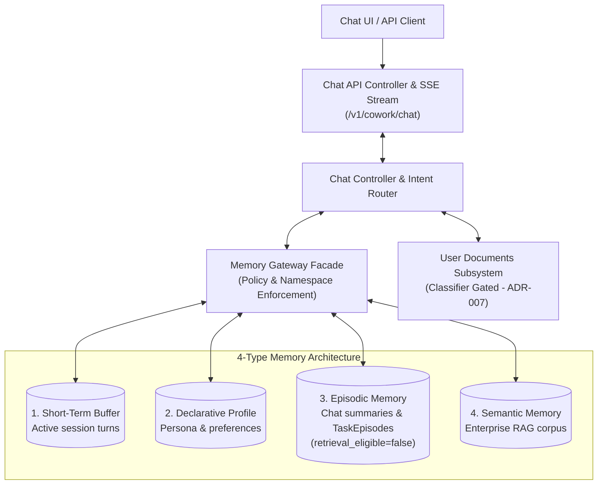

# AI Chat & Typed Memory Subsystem (Level 1 Architecture)

**Architecture level:** Level 1 — High-Level Component & Data Flow  
**Status:** Live / Implemented  
**Primary Owner:** `src/cowork_agent/features/ai_chat` & `src/cowork_agent/integrations/rag/project_documents.py`  
**Target Alignment:** Fully Aligned with [TARGET-ARCHITECTURE.md §2 & §3](file:///e:/VIN-INTERNSHIP/EMAIL-AGENT-v1/docs/architectures/TARGET-ARCHITECTURE.md), [ADR-004](file:///e:/VIN-INTERNSHIP/EMAIL-AGENT-v1/tasks/adr/ADR-004-chat-native-task-episodes.md), and [ADR-007](file:///e:/VIN-INTERNSHIP/EMAIL-AGENT-v1/tasks/adr/ADR-007-project-scoped-classifier-gated-user-documents.md)

---

## 1. Subsystem Overview

The AI Chat Subsystem powers a multi-turn assistant capable of streaming contextual replies, consulting four distinct memory scopes, and proposing chat-native `TaskEpisode` records upon explicit user request.

---

## 2. Key Components & Responsibilities

| Component | Path / Implementation | Level 1 Responsibility |
|---|---|---|
| **Chat API Router** | [chat.py](file:///e:/VIN-INTERNSHIP/EMAIL-AGENT-v1/src/cowork_agent/api/chat.py) | Exposes `/v1/cowork/chat/sessions`, `/messages`, `/stream`, handling principal validation and SSE framing. |
| **Chat Controller** | [controller.py](file:///e:/VIN-INTERNSHIP/EMAIL-AGENT-v1/src/cowork_agent/features/ai_chat/controller.py) | Orchestrates context assembly, memory queries, LLM reply generation, and task proposal creation. |
| **Memory Gateway** | [memory_gateway.py](file:///e:/VIN-INTERNSHIP/EMAIL-AGENT-v1/src/cowork_agent/features/ai_chat/memory_gateway.py) | Fail-closed facade managing tenant/session namespacing and reading across all four memory types. |
| **Intent Classifier** | [service.py](file:///e:/VIN-INTERNSHIP/EMAIL-AGENT-v1/src/cowork_agent/features/ai_chat/intent/service.py) | Routes incoming messages (`ChatRoutingService`) to determine tool relevance and user document query eligibility. |
| **User Documents RAG Engine** | [project_documents.py](file:///e:/VIN-INTERNSHIP/EMAIL-AGENT-v1/src/cowork_agent/integrations/rag/project_documents.py) & [projects.py](file:///e:/VIN-INTERNSHIP/EMAIL-AGENT-v1/src/cowork_agent/api/projects.py) | Manages project-scoped user document uploads, extraction/OCR, vector indexing, and retrieval ([ADR-007](file:///e:/VIN-INTERNSHIP/EMAIL-AGENT-v1/tasks/adr/ADR-007-project-scoped-classifier-gated-user-documents.md)). |

---

## 3. The 4 Typed Memory System

1. **Short-Term Memory (Session Buffer):** Fast transient store ([session_buffer.py](file:///e:/VIN-INTERNSHIP/EMAIL-AGENT-v1/src/cowork_agent/features/ai_chat/session_buffer.py) - `InMemoryChatSessionBuffer` or Redis). Maintains active conversation window per session.
2. **Long-Term Declarative Memory:** Stores user preferences, explicit instructions, and profile attributes across sessions ([profile_policy.py](file:///e:/VIN-INTERNSHIP/EMAIL-AGENT-v1/src/cowork_agent/features/ai_chat/profile_policy.py)).
3. **Episodic Memory:** Stores chat session summaries and system-generated `TaskEpisode` records ([episode_policy.py](file:///e:/VIN-INTERNSHIP/EMAIL-AGENT-v1/src/cowork_agent/features/ai_chat/episode_policy.py)).  
   - *Key Rule ([ADR-004](file:///e:/VIN-INTERNSHIP/EMAIL-AGENT-v1/tasks/adr/ADR-004-chat-native-task-episodes.md)):* Newly proposed tasks start as `retrieval_eligible=false`. They become eligible for semantic retrieval only after explicit user approval or completion.
4. **Semantic Memory:** Queries company-wide knowledge base (`data/extracted/*.md`) to cite verified background facts in chat responses ([retrieval_policy.py](file:///e:/VIN-INTERNSHIP/EMAIL-AGENT-v1/src/cowork_agent/features/ai_chat/retrieval_policy.py)).

---

## 4. Alignment & Diff vs Target Architecture

- **Task Episode Lifecycle:** Aligned with [ADR-004](file:///e:/VIN-INTERNSHIP/EMAIL-AGENT-v1/tasks/adr/ADR-004-chat-native-task-episodes.md). Tasks are proposed in chat and kept retrieval-ineligible until approved.
- **User Document Gating:** Aligned with [ADR-007](file:///e:/VIN-INTERNSHIP/EMAIL-AGENT-v1/tasks/adr/ADR-007-project-scoped-classifier-gated-user-documents.md). User documents are project-isolated and gated behind `USER_DOCUMENTS_ENABLED`.
- **Local Fallback:** In non-Postgres environments (`DATABASE_URL` absent), session state and declarative memory utilize in-memory/SQLite fallbacks gracefully.

