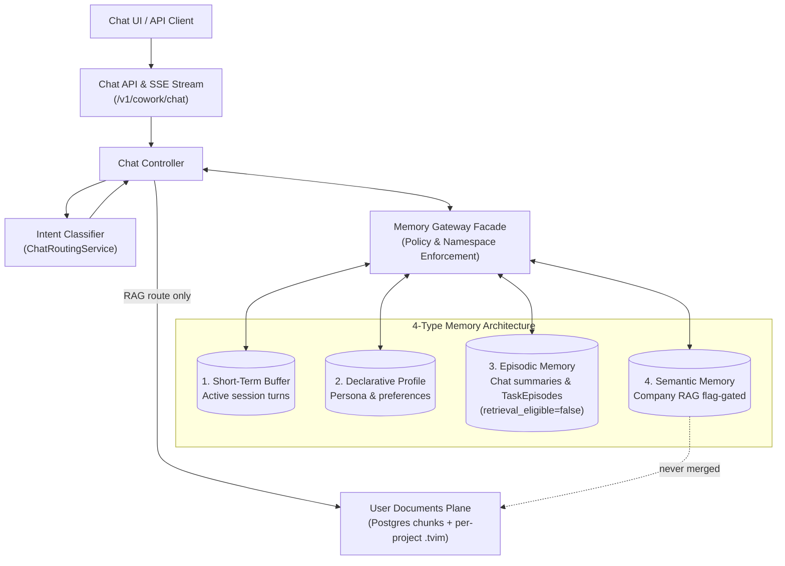

# AI Chat & Typed Memory Subsystem (Level 1 Architecture)

**Architecture level:** Level 1 — High-Level Component & Data Flow  
**Status:** Live / Implemented  
**Primary Owner:** `src/cowork_agent/features/ai_chat` & `src/cowork_agent/integrations/rag/project_documents.py`  
**Target Alignment:** Mostly Aligned with [TARGET-ARCHITECTURE.md §2 & §3](../TARGET-ARCHITECTURE.md), [ADR-004](../../../tasks/adr/ADR-004-chat-native-task-episodes.md), and [ADR-007](../../../tasks/adr/ADR-007-project-scoped-classifier-gated-user-documents.md) — remaining drift in §4

---

## 1. Subsystem Overview

The AI Chat Subsystem is a multi-turn assistant: it streams replies, reads four typed memory scopes through the Memory Gateway, and persists a chat-native `TaskEpisode` only after an explicit user task request. User documents are a second semantic **plane**, not a fifth memory type. Company RAG and user documents are never merged.

There is no executable in-chat tool. The accepted request body has no tool field; Pydantic `extra="forbid"` and `ChatMessageRequest.from_dict` reject retired `tool_choices` before any mailbox or Gmail work could run ([ADR-004](../../../tasks/adr/ADR-004-chat-native-task-episodes.md)).

---

## 2. Key Components & Responsibilities

| Component | Path / Implementation | Level 1 Responsibility |
|---|---|---|
| **Chat API Router** | [chat.py](../../../src/cowork_agent/api/chat.py) | Exposes `/v1/cowork/chat/sessions`, `/messages` SSE, profile, and TaskEpisode approve/complete/reject. Forbids unexpected request fields. |
| **Chat Controller** | [controller.py](../../../src/cowork_agent/features/ai_chat/controller.py) | Orchestrates one turn in-process: classify → optional user-doc retrieve → assemble → stream → persist. Writes a `TaskEpisode` only when `is_explicit_task_request` is true. |
| **Memory Gateway** | [memory_gateway.py](../../../src/cowork_agent/features/ai_chat/memory_gateway.py) | Fail-closed facade for tenant/session namespacing across the four memory types plus a retrieval-only user-document port. |
| **Intent Classifier** | [service.py](../../../src/cowork_agent/features/ai_chat/intent/service.py) & [resolver.py](../../../src/cowork_agent/features/ai_chat/intent/resolver.py) | Sole user-document routing authority (`ChatRoutingService`). Executes `CHAT` / `RAG` / `CLARIFY`. `TOOL` / `RAG_TOOL` exist in the contract; `needs_tool` is forced false (`USER_DOCUMENTS_TOOL_AXIS_ENABLED` defaults false). The precondition gate only narrows `RAG` → `CHAT` when no ready documents exist. |
| **Retrieval / Episode Policy** | [retrieval_policy.py](../../../src/cowork_agent/features/ai_chat/retrieval_policy.py) & [episode_policy.py](../../../src/cowork_agent/features/ai_chat/episode_policy.py) | Cue-gated company-RAG and episodic reads; TaskEpisode writes must be `system_generated` / `retrieval_eligible=false` / `explicit_user_task_request`. |
| **User Documents Plane** | [ports.py](../../../src/cowork_agent/features/user_documents/ports.py), [project_documents.py](../../../src/cowork_agent/integrations/rag/project_documents.py), [project_index.py](../../../src/cowork_agent/integrations/rag/project_index.py), [projects.py](../../../src/cowork_agent/api/projects.py) | Project-scoped upload/list/delete under `/v1/cowork/chat/projects/{id}/documents`. Hybrid store is Postgres chunks + per-project `.tvim` with no company-index fallback. Gated by `USER_DOCUMENTS_ENABLED` and `CHAT_INTENT_CLASSIFIER_ENABLED`. |

---

## 3. The 4 Typed Memory System

1. **Short-Term Memory (Session Buffer):** Bounded in-process store ([session_buffer.py](../../../src/cowork_agent/features/ai_chat/session_buffer.py) — `InMemoryChatSessionBuffer`). Live composition does not attach Redis to working turns; Postgres owns durable session metadata.
2. **Long-Term Declarative Memory:** Compact profile (language, timezone, persona, tone) written only with `explicit_user_config` provenance ([profile_policy.py](../../../src/cowork_agent/features/ai_chat/profile_policy.py)). User documents are never a preference source.
3. **Episodic Memory:** Chat-session summaries (always `retrieval_eligible=false`) and chat-native `TaskEpisode` records ([episode_policy.py](../../../src/cowork_agent/features/ai_chat/episode_policy.py)).
   - *Key Rule ([ADR-004](../../../tasks/adr/ADR-004-chat-native-task-episodes.md)):* A TaskEpisode is created only after an explicit user request (`is_explicit_task_request`). New writes are `system_generated` / `retrieval_eligible=false`. Eligibility is derived from `validation_status` (`user_approved` or `completed` → true; `rejected` stays false). Ordinary chat, classifier output, and model-only inference must not create an episode.
4. **Semantic Memory (two unmerged planes):**
   - **Company RAG:** Optional chat-side read of `data/extracted/*.md` through the Memory Gateway. Gated by `CHAT_COMPANY_RAG_ENABLED` (default **false**). When the flag is on, [retrieval_policy.py](../../../src/cowork_agent/features/ai_chat/retrieval_policy.py) still requires a company-policy cue. Chat does **not** always query the company corpus.
   - **User documents:** Separate plane (Postgres chunks + per-project Turbovec `.tvim`). Retrieved only on classifier route `RAG`. An unavailable project index degrades that plane; it never falls back to the company index.

---

## 4. Alignment & Diff vs Target Architecture

- **TaskEpisode lifecycle:** Aligned with [ADR-004](../../../tasks/adr/ADR-004-chat-native-task-episodes.md). Explicit request only; new episodes start `retrieval_eligible=false`; no in-chat tool; `tool_choices` rejected as an unexpected field.
- **Company RAG in chat:** Aligned with TARGET §3. Consumer is the standalone Email Agent plus AI Chat **behind** `CHAT_COMPANY_RAG_ENABLED` (env default `false`). Not always-on.
- **User-document gating:** Aligned with [ADR-007](../../../tasks/adr/ADR-007-project-scoped-classifier-gated-user-documents.md). Hierarchy is `tenant → user → project → documents + sessions`. Classifier is the sole route origin; the readiness gate only narrows. Feature flags `USER_DOCUMENTS_ENABLED` and `CHAT_INTENT_CLASSIFIER_ENABLED` default true; both must be on (and a ready catalog present) before `ChatRoutingService` is composed.
- **User-document store:** Aligned. Postgres chunks + per-project `.tvim`; no silent company-index fallback. Live paths are [integrations/rag/project_documents.py](../../../src/cowork_agent/integrations/rag/project_documents.py) and [features/user_documents/ports.py](../../../src/cowork_agent/features/user_documents/ports.py) — there is no `src/cowork_agent/integrations/project_documents/` package.
- **OCR on the user-document plane:** Aligned with TARGET §3.4 / §21.11. The ingestion worker constructs `ProjectDocumentExtractor()` with no OCR adapter. Pages that need OCR fail closed as `ocr_unavailable`; mixed-PDF native pages are not indexed alone. `document-health` reports `ocr: optional_unavailable`. Mistral OCR exists on the **company** knowledge-ingest CLI, not on this plane.
- **Local fallback:** When `DATABASE_URL` is absent, chat working memory stays in-process; durable chat/control-plane rows require Postgres. The durable local MVP uses localhost Postgres (`docker compose up -d postgres`) rather than extending SQLite to history/memory ([ADR-010](../../../tasks/adr/ADR-010-local-postgres-control-plane-latency.md)).

Remaining drift vs TARGET:

| Concern | TARGET §2 / §3 | Live |
|---|---|---|
| Turn orchestration | Small graph `classify → retrieve → assemble → generate → persist` | Graph module exists ([graph/runner.py](../../../src/cowork_agent/features/ai_chat/graph/runner.py)) but is **not** composed in `app.py`; `ChatController.stream_message` owns the turn. |
| Document HTTP surface | §21.10 user-wide `/v1/cowork/chat/documents` | ADR-007 project-scoped `/v1/cowork/chat/projects/{project_id}/documents` (+ `document-health`). |
| Short-term store | Redis or in-process | In-process only (`create_chat_session_buffer` always returns `InMemoryChatSessionBuffer`). |
| Retrieval timeout default | `USER_DOCUMENTS_RETRIEVAL_TIMEOUT_MS=3000` | Config default is `10000` (still capped at 10s). |

