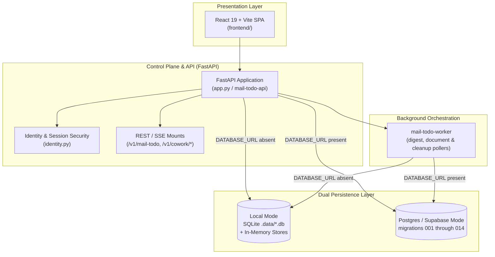

# Control Plane, Persistence & Presentation UIs (Level 1 Architecture)

**Architecture level:** Level 1 — High-Level Component & Data Flow  
**Status:** Live / Implemented  
**Primary Owner:** `src/cowork_agent/persistence` & `src/cowork_agent/app.py`  
**Target Alignment:** Fully Aligned with [TARGET-ARCHITECTURE.md §1 & §2](file:///C:/WORK/EMAIL-AGENT-v1/docs/architectures/TARGET-ARCHITECTURE.md)

---

## 1. Subsystem Overview

The Control Plane orchestrates HTTP and SSE request routes, manages tenant/user identity and opaque session security, provides dual-mode data persistence (SQLite/Local vs Supabase Postgres), dispatches background digest and document workers, and serves the React 19 web application. Email operations are served on `/v1/mail-todo`, while AI Chat and Project Document operations are served on `/v1/cowork/*`.

---

## 2. Key Components & Responsibilities

| Component | Path / Implementation | Level 1 Responsibility |
|---|---|---|
| **FastAPI App** | [app.py](file:///C:/WORK/EMAIL-AGENT-v1/src/cowork_agent/app.py) (`mail-todo-api`) | Composition root: lifespan wiring (Postgres connection pool or local SQLite repositories, LLM provider routing, semantic indices, private storage clients), mounting `/v1/mail-todo/*`, `/v1/cowork/chat/*`, `/v1/cowork/projects/*`, `/api/v1/raw-documents/*`, and `/api/v1/reports/*`. |
| **Identity & Security** | [identity.py](file:///C:/WORK/EMAIL-AGENT-v1/src/cowork_agent/identity.py) & [config.py](file:///C:/WORK/EMAIL-AGENT-v1/src/cowork_agent/config.py) | Resolves `VerifiedPrincipal` (`tenant_id` / `user_id`; `workspace_id` aliases tenant). Local MVP uses `LOCAL_TENANT_ID = "local"`. Postgres mode and SQLite chat identity issue hashed opaque session tokens on an HttpOnly cookie (`APP_SESSION_COOKIE_NAME`, default `cowork_session`). Central ownership guard enforces authorization. |
| **Persistence Repositories** | [repositories](file:///C:/WORK/EMAIL-AGENT-v1/src/cowork_agent/persistence/repositories) | Dual storage adapters: In-memory test fakes in [local.py](file:///C:/WORK/EMAIL-AGENT-v1/src/cowork_agent/persistence/repositories/local.py); SQLite adapters for connections ([mailbox_connections.py](file:///C:/WORK/EMAIL-AGENT-v1/src/cowork_agent/persistence/repositories/mailbox_connections.py)), runs ([runs.py](file:///C:/WORK/EMAIL-AGENT-v1/src/cowork_agent/persistence/repositories/runs.py)), tasks ([tasks.py](file:///C:/WORK/EMAIL-AGENT-v1/src/cowork_agent/persistence/repositories/tasks.py)), chat history & memory ([sqlite_chat.py](file:///C:/WORK/EMAIL-AGENT-v1/src/cowork_agent/persistence/repositories/sqlite_chat.py)), guest identity ([sqlite_chat_identity.py](file:///C:/WORK/EMAIL-AGENT-v1/src/cowork_agent/persistence/repositories/sqlite_chat_identity.py)), projects ([sqlite_projects.py](file:///C:/WORK/EMAIL-AGENT-v1/src/cowork_agent/persistence/repositories/sqlite_projects.py)), document chunks ([sqlite_project_document_chunks.py](file:///C:/WORK/EMAIL-AGENT-v1/src/cowork_agent/persistence/repositories/sqlite_project_document_chunks.py)), and raw documents ([sqlite_raw_documents.py](file:///C:/WORK/EMAIL-AGENT-v1/src/cowork_agent/persistence/repositories/sqlite_raw_documents.py)); Postgres adapters in [postgres.py](file:///C:/WORK/EMAIL-AGENT-v1/src/cowork_agent/persistence/repositories/postgres.py), [identity.py](file:///C:/WORK/EMAIL-AGENT-v1/src/cowork_agent/persistence/repositories/identity.py), [chat_sessions.py](file:///C:/WORK/EMAIL-AGENT-v1/src/cowork_agent/persistence/repositories/chat_sessions.py), [chat_history.py](file:///C:/WORK/EMAIL-AGENT-v1/src/cowork_agent/persistence/repositories/chat_history.py), [projects.py](file:///C:/WORK/EMAIL-AGENT-v1/src/cowork_agent/persistence/repositories/projects.py), and [project_document_chunks.py](file:///C:/WORK/EMAIL-AGENT-v1/src/cowork_agent/persistence/repositories/project_document_chunks.py). |
| **Orchestration Workers** | [orchestration](file:///C:/WORK/EMAIL-AGENT-v1/src/cowork_agent/orchestration) | In-process `DigestWorker` via FastAPI `BackgroundTasks` when no database queue is configured. `mail-todo-worker` ([worker.py](file:///C:/WORK/EMAIL-AGENT-v1/src/cowork_agent/orchestration/worker.py)) polls durable Postgres jobs (email digest runs, project document extraction/indexing via [project_document_worker.py](file:///C:/WORK/EMAIL-AGENT-v1/src/cowork_agent/orchestration/project_document_worker.py), and document cleanup), executes recovery sweeps ([recovery.py](file:///C:/WORK/EMAIL-AGENT-v1/src/cowork_agent/orchestration/recovery.py), [document_recovery.py](file:///C:/WORK/EMAIL-AGENT-v1/src/cowork_agent/orchestration/document_recovery.py)), and publishes outbox lifecycle events. In SQLite mode, `run_sqlite_worker()` polls the local project document queue. |
| **React 19 Web SPA** | [frontend/](file:///C:/WORK/EMAIL-AGENT-v1/frontend) | Modern React 19 + Vite + Tailwind 4 Single-Page Application providing responsive interfaces for Gmail mailbox management, multi-turn AI Chat with SSE streaming, mail scan summaries, TaskEpisode proposal cards, raw document / OnlyOffice editing, and markdown reports. |

---

## 3. Storage Mode Switching & Dual Persistence

The application dynamically selects storage backends based on `POSTGRES_MODE` and database configuration:

- **Local Fallback Mode (`POSTGRES_MODE=off` or absent `DATABASE_URL`):**
  Uses SQLite database files under `.data/`:
  - `mail_todo.db` (OAuth / mailbox connections, configured by `GMAIL_CONNECTION_DB_PATH`)
  - `runs.db` (digest run state, progress counters, error tracking)
  - `tasks.db` (synthesized action plans)
  - `chat.db` (chat session registry, turns/history, declarative profiles, summaries, and TaskEpisodes)
  - `chat_identity.db` (guest principal resolution and hashed opaque browser sessions)
  - `projects.db` (project metadata, document catalog, and ingestion/cleanup lease queues)
  - `project_chunks.db` (private document chunk text and full-text search index)
  - `raw_documents.db` (raw document metadata, versioning, and OnlyOffice document keys)
  - Local document files are saved in `.data/project-documents` via `LocalPrivateStorage`. Results, outbox events, and active working memory stay in-process (`InMemoryResultRepository`, `InMemoryOutbox`, `InMemoryChatSessionBuffer`).

- **Cloud Mode (`POSTGRES_MODE=cloud`):**
  Uses `psycopg_pool.AsyncConnectionPool` to connect to hosted Supabase PostgreSQL via `DATABASE_URL_CLOUD` (session or direct `:5432`). Lifespan startup and `mail-todo-worker` boot run idempotent migrations in filename order from `001_mail_todo.sql` through `014_project_chunk_fts_simple.sql` using PostgreSQL advisory locks (`pg_advisory_lock`). Source files and index snapshots are stored in private Supabase Storage buckets.

- **Durable Local MVP (`POSTGRES_MODE=local`, [ADR-010](file:///C:/WORK/EMAIL-AGENT-v1/tasks/adr/ADR-010-local-postgres-control-plane-latency.md)):**
  Connects to a local Docker PostgreSQL container at `127.0.0.1:5432/cowork` via `DATABASE_URL_LOCAL`. Provides full multi-user Postgres schema fidelity and durable queue leasing on developer workstations.

---

## 4. Alignment & Diff vs Target Architecture

- **Clean API & Product Surfaces:** Presentation layers consume REST and SSE endpoints exclusively. Standalone Email digest workflow operates on `/v1/mail-todo`; AI Chat and Project Document features operate on `/v1/cowork/*` ([TARGET §1 & §2](file:///C:/WORK/EMAIL-AGENT-v1/docs/architectures/TARGET-ARCHITECTURE.md)).
- **Email & Chat Capabilities:** Email RAG operates as a standalone pipeline while AI Chat supports rich multi-turn interactions, inline citation tracking, TaskEpisode proposals, and mail scan execution summaries (`MailScanCard` and turn `mail_scan` metadata).
- **Security & Identity Isolation:** OAuth tokens are stored encrypted using Fernet (`TokenCipher`). Session cookies are opaque, HttpOnly, and hashed at rest. Caller-supplied tenant/user identifiers are never trusted for authorization; all operations derive tenancy from `VerifiedPrincipal`.
- **Memory & Durability Alignment:** Bounded short-term chat context resides in-process (`InMemoryChatSessionBuffer`), while durable long-term declarative profiles, episodic TaskEpisodes, chat turns, and document chunks are persisted in PostgreSQL (or isolated local SQLite files).
- **Presentation Layer:** Production React 19 + Vite + Tailwind 4 web application is the authoritative user interface. Legacy Streamlit developer GUI has been retired.
