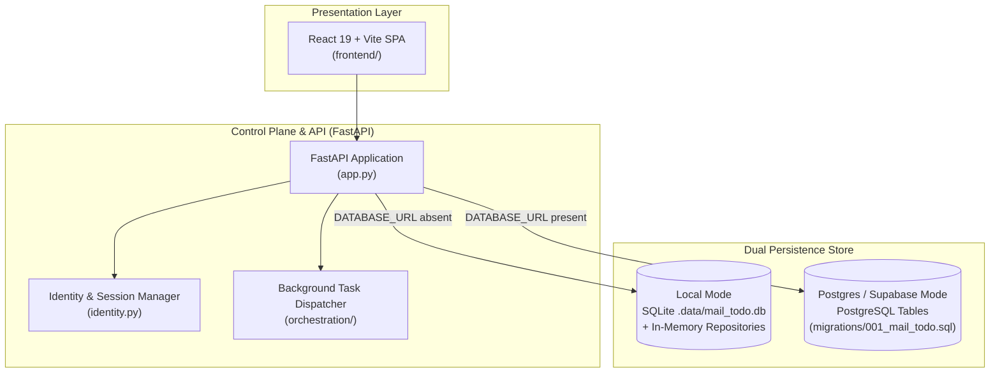

# Control Plane, Persistence & Presentation UIs (Level 1 Architecture)

**Architecture level:** Level 1 — High-Level Component & Data Flow  
**Status:** Live / Implemented  
**Primary Owner:** `src/cowork_agent/app.py`, `src/cowork_agent/persistence/`, `src/cowork_agent/orchestration/`, `frontend/`  
**Target Alignment:** Fully Aligned with [TARGET-ARCHITECTURE.md §1, §2 & §3](file:///e:/VIN-INTERNSHIP/EMAIL-AGENT-v1/docs/architectures/TARGET-ARCHITECTURE.md) (Dual storage modes & presentation layers)

---

## 1. Subsystem Overview

The Control Plane orchestrates HTTP/SSE request routes, manages user identity & session security, provides dual-mode data persistence (SQLite/Local vs Supabase Postgres), dispatches asynchronous background workers, and serves the React 19 web application.

---

## 2. Key Components & Responsibilities

| Component | Path / Implementation | Level 1 Responsibility |
|---|---|---|
| **FastAPI App** | [app.py](file:///e:/VIN-INTERNSHIP/EMAIL-AGENT-v1/src/cowork_agent/app.py) | Configures dependency injection, lifespan resource setup (DB pools, LLM clients, vector indices), and mounts REST/SSE routes. |
| **Identity Service** | [identity.py](file:///e:/VIN-INTERNSHIP/EMAIL-AGENT-v1/src/cowork_agent/identity.py) | Resolves `VerifiedPrincipal`, handles tenant boundaries (`LOCAL_TENANT_ID`), and validates opaque session tokens. |
| **Persistence Repositories** | [repositories](file:///e:/VIN-INTERNSHIP/EMAIL-AGENT-v1/src/cowork_agent/persistence/repositories) | Provides repository implementations: [local.py](file:///e:/VIN-INTERNSHIP/EMAIL-AGENT-v1/src/cowork_agent/persistence/repositories/local.py) (In-Memory fallback) and [postgres.py](file:///e:/VIN-INTERNSHIP/EMAIL-AGENT-v1/src/cowork_agent/persistence/repositories/postgres.py) / [projects.py](file:///e:/VIN-INTERNSHIP/EMAIL-AGENT-v1/src/cowork_agent/persistence/repositories/projects.py) (PostgreSQL / Supabase connection pool). |
| **Orchestration Workers** | [orchestration](file:///e:/VIN-INTERNSHIP/EMAIL-AGENT-v1/src/cowork_agent/orchestration) | Background workers ([worker.py](file:///e:/VIN-INTERNSHIP/EMAIL-AGENT-v1/src/cowork_agent/orchestration/worker.py), [project_document_worker.py](file:///e:/VIN-INTERNSHIP/EMAIL-AGENT-v1/src/cowork_agent/orchestration/project_document_worker.py)) processing Email digests and user document parsing asynchronously. |
| **React 19 Web SPA** | [frontend/](file:///e:/VIN-INTERNSHIP/EMAIL-AGENT-v1/frontend) | Production React 19 + Vite + Tailwind 4 frontend application for end-user Chat and Email Action Plan management. |

---

## 3. Storage Mode Switching

The application dynamically selects storage backends based on environment configuration:

- **Local Fallback Mode (`DATABASE_URL` absent):** Uses SQLite at `.data/mail_todo.db` for OAuth credentials and process-local memory dictionaries for runs, results, and chat session buffers.
- **Production Mode (`DATABASE_URL` present):** Uses a PostgreSQL connection pool (`psycopg_pool`) connecting to Supabase Postgres. Executes database schemas defined in [migrations](file:///e:/VIN-INTERNSHIP/EMAIL-AGENT-v1/src/cowork_agent/persistence/migrations) (`001_mail_todo.sql` through `010_service_heartbeats.sql`).

---

## 4. Alignment & Diff vs Target Architecture

- **Clean Decoupling:** Presentation layers consume pure REST/SSE APIs without importing domain or database internals.
- **Security Boundaries:** Gmail OAuth refresh tokens are stored encrypted via AES-GCM (`TokenCipher`). Session tokens are passed via secure headers/cookies.

