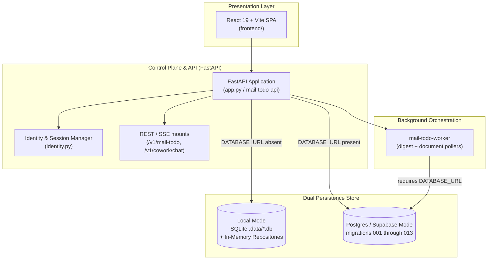

# Control Plane, Persistence & Presentation UIs (Level 1 Architecture)

**Architecture level:** Level 1 — High-Level Component & Data Flow  
**Status:** Live / Implemented  
**Primary Owner:** `src/cowork_agent/app.py`, `src/cowork_agent/persistence/`, `src/cowork_agent/orchestration/`, `frontend/`  
**Target Alignment:** Aligned with [TARGET-ARCHITECTURE.md §1 & §2](../TARGET-ARCHITECTURE.md) on dual product surfaces, tenant-scoped identity, and dual storage; remaining drift in §4

---

## 1. Subsystem Overview

The Control Plane orchestrates HTTP/SSE request routes, manages user identity & session security, provides dual-mode data persistence (SQLite/Local vs Supabase Postgres), dispatches background digest and document workers, and serves the React 19 web application. Email stays on `/v1/mail-todo`; AI Chat is a separate `/v1/cowork/chat` surface (no in-chat Email tool).

---

## 2. Key Components & Responsibilities

| Component | Path / Implementation | Level 1 Responsibility |
|---|---|---|
| **FastAPI App** | [app.py](../../../src/cowork_agent/app.py) (`mail-todo-api`) | Composition root: lifespan wiring (DB pool or local adapters, LLM clients, RAG indices), mounts `/v1/mail-todo/*` plus chat/project routers under `/v1/cowork/chat`. |
| **Identity Service** | [identity.py](../../../src/cowork_agent/identity.py) | Resolves `VerifiedPrincipal` (`tenant_id` / `user_id`; `workspace_id` aliases tenant). Local MVP uses `LOCAL_TENANT_ID`. Postgres mode issues hashed opaque session tokens on an HttpOnly cookie. |
| **Persistence Repositories** | [repositories](../../../src/cowork_agent/persistence/repositories) | Dual adapters: [local.py](../../../src/cowork_agent/persistence/repositories/local.py) in-memory fakes; SQLite [mailbox_connections](../../../src/cowork_agent/persistence/repositories/mailbox_connections.py) / [runs](../../../src/cowork_agent/persistence/repositories/runs.py) / [tasks](../../../src/cowork_agent/persistence/repositories/tasks.py); Postgres [postgres.py](../../../src/cowork_agent/persistence/repositories/postgres.py) plus [identity](../../../src/cowork_agent/persistence/repositories/identity.py), [chat_sessions](../../../src/cowork_agent/persistence/repositories/chat_sessions.py), [chat_history](../../../src/cowork_agent/persistence/repositories/chat_history.py), [projects](../../../src/cowork_agent/persistence/repositories/projects.py), [project_document_chunks](../../../src/cowork_agent/persistence/repositories/project_document_chunks.py). |
| **Orchestration Workers** | [orchestration](../../../src/cowork_agent/orchestration) | In-process `DigestWorker` via FastAPI `BackgroundTasks` when no run queue is bound. Durable `mail-todo-worker` ([worker.py](../../../src/cowork_agent/orchestration/worker.py)) polls digest jobs, project-document ingest/cleanup ([project_document_worker.py](../../../src/cowork_agent/orchestration/project_document_worker.py)), and recovery ([recovery.py](../../../src/cowork_agent/orchestration/recovery.py), [document_recovery.py](../../../src/cowork_agent/orchestration/document_recovery.py)). |
| **React 19 Web SPA** | [frontend/](../../../frontend) | Production React 19 + Vite + Tailwind 4 SPA for Chat and Email Action Plan management. No Streamlit developer GUI is present. |

---

## 3. Storage Mode Switching

The application dynamically selects storage backends based on environment configuration:

- **Local Fallback Mode (`DATABASE_URL` absent):** SQLite at `.data/mail_todo.db` (OAuth / mailbox connections; path from `GMAIL_CONNECTION_DB_PATH`) plus sibling `runs.db` and `tasks.db`. Results, outbox, and chat session registry stay in-process. Identity/session repositories and durable chat profile / TaskEpisode / history stores are not bound.
- **Production Mode (`DATABASE_URL` present):** `psycopg_pool.AsyncConnectionPool` to Supabase Postgres. Lifespan (and `mail-todo-worker` boot) apply [migrations](../../../src/cowork_agent/persistence/migrations) in filename order from `001_mail_todo.sql` through `013_digest_run_filtered_summary.sql`. `mail-todo-worker` refuses to start without `DATABASE_URL`.

---

## 4. Alignment & Diff vs Target Architecture

- **Clean Decoupling:** Presentation layers consume REST/SSE only. Email remains a standalone `/v1/mail-todo` product flow; AI Chat has no executable Email tool ([TARGET §1 & §2](../TARGET-ARCHITECTURE.md)).
- **Security Boundaries:** Gmail OAuth refresh tokens are stored encrypted via Fernet (`TokenCipher`). In Postgres mode, opaque session tokens are hashed at rest and sent once in an HttpOnly cookie (`APP_SESSION_COOKIE_NAME`, default `cowork_session`). Caller-supplied identifiers are not used for authorization.
- **Remaining drift vs TARGET §1 & §2:** TARGET short-term memory allows Redis or in-process state; live composition root always sets `redis_client` / `run_queue` to `None` (in-process buffer and `BackgroundTasks`). TARGET durable chat memory is PostgreSQL; local mode does not persist profiles, TaskEpisodes, or chat history. Streamlit developer GUI (`src/cowork_agent/gui/`, `scripts/run_gui.py`) is absent — React 19 SPA is the only presentation client.

