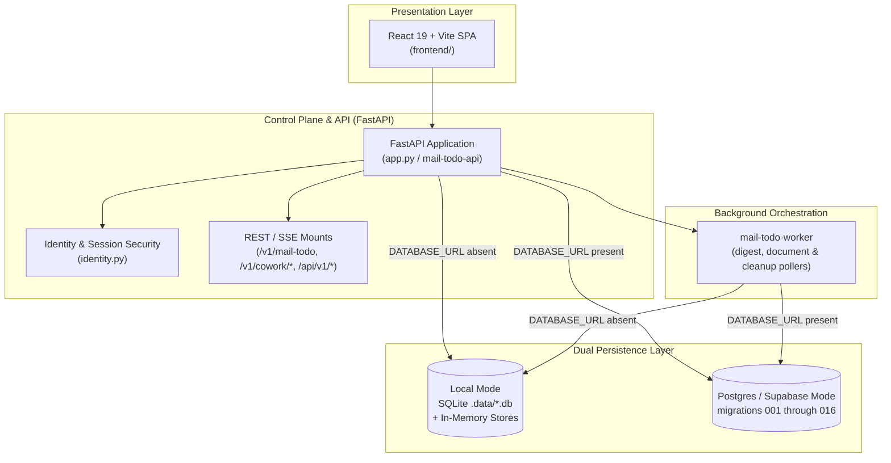

# Control Plane, Persistence & Presentation UIs (Level 1 Architecture)

**Architecture level:** Level 1 — High-Level Component & Data Flow  
**Status:** Live / Implemented  
**Primary Owner:** `src/cowork_agent/persistence` & `src/cowork_agent/app.py`  
**Target Alignment:** Core control plane is aligned with [TARGET-ARCHITECTURE.md §1 & §2](../TARGET-ARCHITECTURE.md); linked Outlook is an additive SQLite-only provider variance.

---

## 1. Subsystem Overview

The Control Plane orchestrates HTTP and SSE request routes, manages tenant/user identity and opaque session security, provides dual-mode data persistence (SQLite/Local vs Supabase Postgres), dispatches background digest and document workers, and serves the React 19 web application. Email operations are served on `/v1/mail-todo`; Gmail remains the identity owner and an optional Outlook mailbox is linked to that owner in SQLite mode. AI Chat and Project Document operations remain on `/v1/cowork/*`, accompanied by dedicated endpoints for saved report artifacts (`/api/v1/reports`) and editable raw documents (`/api/v1/raw-documents`).

---

## 2. Key Components & Responsibilities

| Component | Path / Implementation | Level 1 Responsibility |
|---|---|---|
| **FastAPI App** | [`app.py`](../../../src/cowork_agent/app.py) (`mail-todo-api`) | Composition root for persistence, LLM routing, semantic indexes, storage, Langfuse bootstrap, and the mail/chat/project/document/report APIs. |
| **Identity & Security** | [`identity.py`](../../../src/cowork_agent/identity.py) & [`config.py`](../../../src/cowork_agent/config.py) | Resolves `VerifiedPrincipal`; opaque session cookies, guest principals, and central ownership guards enforce authorization. |
| **Mailbox OAuth & Availability** | [`app.py`](../../../src/cowork_agent/app.py), [`outlook/provider.py`](../../../src/cowork_agent/integrations/outlook/provider.py) | Gmail OAuth plus optional Microsoft OAuth with PKCE, signed one-time owner state, encrypted rotating refresh tokens, and `Mail.Read` only. `/connections` exposes stable availability; Outlook is `not_configured` or `sqlite_only` when unavailable and never creates a user/session or changes the login cookie. |
| **Persistence Repositories** | [`repositories`](../../../src/cowork_agent/persistence/repositories) | In-memory test fakes, SQLite adapters for local mode, and Postgres adapters for durable cloud/local control-plane mode. |
| **Orchestration Workers** | [`worker.py`](../../../src/cowork_agent/orchestration/worker.py) & [`project_document_worker.py`](../../../src/cowork_agent/orchestration/project_document_worker.py) | In-process digest worker and durable recovery, document ingestion, chunking, and cleanup workers. |
| **Reports & Raw Documents Subsystem** | [`app.py`](../../../src/cowork_agent/app.py) & [`sqlite_raw_documents.py`](../../../src/cowork_agent/persistence/repositories/sqlite_raw_documents.py) | Manages saved report artifacts (`/api/v1/reports`) with folder navigation and raw document upload/extraction/editing/viewing (`/api/v1/raw-documents`). |
| **React 19 Web SPA** | [`frontend/`](../../../frontend) | Manages multi-turn AI Chat, execution trace drawer, live reasoning UI, report artifact rendering, document viewing/editing, Gmail/Outlook connections, and project navigation without persisting raw mail into chat memory. |
| **LLM Tracing & Observability** | [`langfuse_bootstrap.py`](../../../src/cowork_agent/integrations/llm/langfuse_bootstrap.py) & [`tracing.py`](../../../src/cowork_agent/integrations/llm/providers/tracing.py) | Bootstraps and routes Langfuse tracing across provider adapters, chat turns, classifier runs, and background workers. |

---

## 3. Storage Mode Switching & Dual Persistence

The application dynamically selects storage backends based on `POSTGRES_MODE` and database configuration:

- **Local Fallback Mode (`POSTGRES_MODE=off` or absent `DATABASE_URL`):**
  Uses SQLite database files under `.data/`:
  - `mail_todo.db` (OAuth / mailbox connections, configured by `GMAIL_CONNECTION_DB_PATH`)
  - `runs.db` (digest run state, progress counters, error tracking)
  - `tasks.db` (synthesized action plans)
  - `chat.db` (chat session registry, turns with execution trace and artifact refs, turn lifecycle, declarative profiles, summaries, and TaskEpisodes with `supersedes`)
  - `chat_identity.db` (guest principal resolution and hashed opaque browser sessions)
  - `projects.db` (project metadata, document catalog, and ingestion/cleanup lease queues)
  - `project_chunks.db` (private document chunk text and full-text search index)
  - `raw_documents.db` (raw document metadata, versioning, and save history)
  - Local document files are saved in `.data/project-documents` via `LocalPrivateStorage` and report files in project report folders. Results, outbox events, and active working memory stay in-process (`InMemoryResultRepository`, `InMemoryOutbox`, `InMemoryChatSessionBuffer`).
  - Outlook connections share the mailbox-connection repository with their Gmail owner. This is the only mode in which the Outlook adapter and OAuth routes are enabled.

- **Cloud Mode (`POSTGRES_MODE=cloud`):**
  Uses `psycopg_pool.AsyncConnectionPool` to connect to hosted Supabase PostgreSQL via `DATABASE_URL_CLOUD` (session or direct `:5432`). Lifespan startup and `mail-todo-worker` boot run idempotent migrations in filename order from `001_mail_todo.sql` through `016_chat_turn_activity.sql` using PostgreSQL advisory locks (`pg_advisory_lock`). Source files and index snapshots are stored in private Supabase Storage buckets.

- **Durable Local MVP (`POSTGRES_MODE=local`, [ADR-010](../../../tasks/adr/ADR-010-local-postgres-control-plane-latency.md)):**
  Connects to a local Docker PostgreSQL container at `127.0.0.1:5432/cowork` via `DATABASE_URL_LOCAL`. Provides full multi-user Postgres schema fidelity and durable queue leasing on developer workstations.

---

## 4. Alignment & Diff vs Target Architecture

- **Clean API & Product Surfaces:** Presentation layers consume REST and SSE endpoints exclusively. Standalone Email digest workflow operates on `/v1/mail-todo`; AI Chat and Project Document features operate on `/v1/cowork/*` ([TARGET §1 & §2](../TARGET-ARCHITECTURE.md)); report artifacts and raw document editing operate on `/api/v1/*`.
- **Email & Chat Capabilities:** Email RAG remains a standalone pipeline while AI Chat streams and persists bounded semantic turn activity. The React client projects polled mail progress into that shared user-facing timeline and stores only aggregate `mail_scan` metadata with the turn.
- **Security & Identity Isolation:** OAuth tokens are stored encrypted using Fernet (`TokenCipher`). Session cookies are opaque, HttpOnly, and hashed at rest. Caller-supplied tenant/user identifiers are never trusted for authorization; all operations derive tenancy from `VerifiedPrincipal`.
- **Memory & Durability Alignment:** Bounded short-term chat context resides in-process (`InMemoryChatSessionBuffer`), while durable long-term declarative profiles, episodic TaskEpisodes (with `supersedes`), chat turns, and document chunks are persisted in PostgreSQL (or isolated local SQLite files).
- **Presentation Layer:** Production React 19 + Vite + Tailwind 4 web application is the authoritative user interface, including Execution Trace Drawer, Live Reasoning stream, Report Artifact Viewer, and Document Viewer/Editor. Legacy Streamlit developer GUI has been retired.
- **Provider Variance:** PostgreSQL modes remain Gmail-only because the existing SQL provider constraint was deliberately left unchanged. Outlook reports `sqlite_only`; this implementation contains no SQL migration.
- **Observability:** Centralized Langfuse tracing provides span-level and generation-level observability across chat controller, LLM provider calls, and memory retrieval without leaking raw email bodies.
