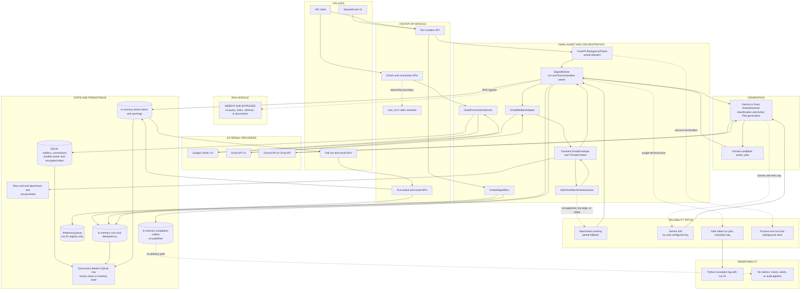

# Current Overall Architecture

## Extraction status

This document describes the implementation in commit `cf2fd49801d5932b26de82af9d104d730cf58271` on branch `main`. It was extracted on 2026-08-06 and corrected against live source during an adversarial review on 2026-08-07. Runtime source and composition are authoritative here. `docs/references/ARCHITECHTURE.md` and the PostgreSQL tables in `src/cowork_agent/persistence/migrations/001_mail_todo.sql` describe capabilities or storage not wired by the current application.

**Current architecture in one sentence:** a caller starts and polls an in-process FastAPI email-digest run; the application reads Gmail, extracts bounded attachment text, calls Gemini or Groq directly for structured action extraction, stores the run and results in memory, and returns Action Items whose Action Plans were generated inside the Email workflow.

**RAG status:** no RAG component, retrieval decision, knowledge query, ingestion path, index, or retrieved context exists in the live runtime. The requested `Trigger -> Gmail -> Agent -> RAG -> Generation -> Persistence -> Output` flow therefore bypasses an explicitly absent RAG stage.

## 1. System inventory

### 1.1 Services and modules

| Category | Implemented component | Runtime responsibility |
|---|---|---|
| API service | FastAPI app in `cowork_agent.app` | Gmail OAuth/connection endpoints, unread preview, run creation, polling, and result delivery. |
| Test UI | Streamlit app launched by `scripts/run_gui.py` | Human-facing client for exercising the API; not a separate backend. |
| Application services | `GmailConnectionService`, `CreateDigestRun`, `DigestWorker`, `GetDigestResult` | Connection lifecycle, run creation, digest orchestration, and result assembly. |
| Email adapter | `GmailMailboxAdapter` | Builds a Gmail v1 client, searches unread inbox messages, fetches threads and attachments, and normalizes messages. |
| Attachment adapter | `SafeTextAttachmentExtractor` | Extracts bounded UTF-8 text from text, CSV, and JSON attachments in process. |
| Generation adapters | `GeminiActionExtractor` or `GroqActionExtractor` | Builds provider prompts, requests structured extraction, parses classifications and Action Plans, and merges correlated email results. The two are not independent: `groq.py` imports the schema, system instruction, batching, prompt builder, parser, and merge helpers from `gemini.py`, so only the transport and error mapping differ. |
| Domain policy | `cowork_agent.features.email_action_plan.policies` | Normalizes Gmail queries, validates limits, fingerprints/deduplicates actions, and calculates priority. |
| RAG module | **Absent** | No ingestion, retrieval, knowledge context, or RAG generation is composed. |

The source package has `domain`, `features`, `runtime`, `integrations`, `memory`, `rag`, `persistence`, `orchestration`, and `ops` areas, plus retained `api` and `gui` presentation adapters. It has no independently deployed internal service boundary; these components run in the API process except for calls to external providers.

### 1.2 State, queues, workers, and scheduling

| Category | Current implementation | Boundary |
|---|---|---|
| Database | SQLite `mailbox_connections`, default `.data/mail_todo.db` | Durable mailbox ownership and encrypted refresh tokens only. |
| Run store | `InMemoryRunRepository` in `src/cowork_agent/persistence/repositories/local.py` | Process-local run state and idempotency map. |
| Result store | `InMemoryResultRepository` in `src/cowork_agent/persistence/repositories/local.py` | Process-local Action Items, attachment warnings, and processed-email metadata. |
| Queue-shaped adapter | `InMemoryQueue` in `src/cowork_agent/orchestration/local.py` | Records unique run IDs during creation; nothing consumes this list. It does not dispatch work. |
| Completion outbox | `InMemoryOutbox` in `src/cowork_agent/orchestration/local.py` | Records one completion event per run; no publisher or consumer is wired. |
| Actual worker dispatch | FastAPI `BackgroundTasks` | Calls `DigestWorker.execute` after the run-creation response; not durable and not a broker. |
| Scheduler | **Absent** | No cron, scheduled-job loop, schedule repository, or scheduler entry point is composed. |
| Cache | **Absent** | No explicit cache exists. Process-local repositories are operational state, not caches in front of durable stores. |
| PostgreSQL schema | `src/cowork_agent/persistence/migrations/001_mail_todo.sql` | Not current runtime storage because `create_app()` wires no PostgreSQL adapter. |

### 1.3 APIs

| Method and path | Purpose |
|---|---|
| `GET /health` | Liveness response. |
| `GET /v1/mail-todo/oauth/gmail/connect` | Starts Google OAuth for caller-supplied query-string `user_id`. |
| `GET /v1/mail-todo/oauth/gmail/callback` | Exchanges the OAuth response and persists the mailbox connection. |
| `GET /v1/mail-todo/connections` | Lists connections for caller-supplied `user_id`. |
| `DELETE /v1/mail-todo/connections/{connection_id}` | Deletes an owned SQLite connection record. |
| `GET /v1/mail-todo/connections/{connection_id}/unread-preview` | Reads a bounded Gmail preview synchronously. |
| `POST /v1/mail-todo/runs` | Creates an idempotent process-local run and registers background execution. |
| `GET /v1/mail-todo/runs/{run_id}` | Returns process-local run progress and safe error state. |
| `GET /v1/mail-todo/runs/{run_id}/result` | Returns terminal Action Items, next actions, and warnings. |

There is no ingestion, retrieval, knowledge, chat, notification, or outbox-publication API.

### 1.4 External providers and LLM calls

| Provider | Use | Current controls |
|---|---|---|
| Google OAuth 2.0 | Consent, authorization-code exchange, refresh-token grant | PKCE plus signed, expiring, single-use, process-local OAuth state. Gmail scope is read-only. |
| Gmail API v1 | Search messages, fetch threads, download attachments, fetch Gmail profile | 401/403 and refresh errors request reauthorization; other Gmail HTTP errors become temporary failures. No application retry/backoff or explicit timeout is configured. |
| Gemini API | Default structured email classification and action extraction | Request timeout, JSON schema, batching, and immediate API-key rotation on HTTP 429. Attempts are capped at `min(GEMINI_MAX_ATTEMPTS_PER_REQUEST, number of configured keys)`, so a single-key deployment gets no retry at all, and rotation is skipped entirely when `GEMINI_ROTATE_ON_RATE_LIMIT=false`. |
| Groq Chat Completions API | Optional structured email classification and action extraction | Request timeout and JSON parsing/schema checks; no retry or key rotation. Called over `urllib`, with no Groq SDK dependency. |

Only one LLM provider is selected at startup through `LLM_PROVIDER`. The same provider response supplies email classification and candidate Action Plans; there is no separate classifier or planning service.

### 1.5 Observability systems

- The only explicit application log statement is `logger.exception("Digest run %s failed", run.id)` for an unexpected worker failure. A `DigestCompletedEvent` is also emitted to the in-memory outbox on every run, but nothing consumes or exports it.
- Safe error codes/messages are stored on the in-memory run and returned by polling.
- Processed email metadata is exposed in API responses only in development-like environments.
- No metrics, distributed traces, correlation IDs, audit-event pipeline, dashboards, alerts, or external observability backend are implemented.
- Log destination, retention, and redaction by downstream libraries are not determined by this repository.

## 2. End-to-end workflow

### 2.1 Connection prerequisite

1. A caller starts Gmail OAuth with a query-string `user_id`.
2. `OAuthStateManager` signs state and holds the PKCE verifier in process memory.
3. Google returns to the callback; the application exchanges the code, compares the granted scopes with the configured read-only scope, and fetches the Gmail account identity. That comparison is exact tuple equality and falls back to the configured value when the token response carries no scopes, so it does not independently prove what Google granted (`src/cowork_agent/integrations/gmail/provider.py:85`, `:133-134`).
4. `GmailConnectionService` encrypts the refresh token and upserts the mailbox connection in SQLite.

The application checks later requests against the supplied `user_id`, but it does not authenticate that value through a session or JWT. Identity is caller-asserted.

### 2.2 Digest feature flow

```text
Trigger: POST /v1/mail-todo/runs
-> validate caller-supplied user_id owns the SQLite mailbox connection
-> CreateDigestRun creates or reuses a process-local idempotent run
-> InMemoryQueue records the run ID, but only when the run was newly created, not on idempotent replay
-> FastAPI BackgroundTasks invokes DigestWorker.execute
-> GmailMailboxAdapter searches unread inbox messages, fetches selected threads, and parses each
   Gmail message into a transient EmailEnvelope
-> DigestWorker extracts supported attachments and assembles ThreadContext from envelopes plus attachments
-> Agent/orchestrator: DigestWorker builds ThreadContext and calls ActionExtractorPort
-> RAG: ABSENT/BYPASSED; no retrieval query, index, or retrieved documents
-> Generation: configured Gemini or Groq adapter classifies emails and generates candidate Action Plans
-> DigestWorker filters candidates lacking evidence or with low confidence, fingerprints,
   deduplicates, prioritizes, assigns the adapter-shaped action_plan unchanged, and sorts results
-> Persistence: run/results/warnings/processed metadata and completion event remain in memory;
   raw bodies and attachment text are not persisted
-> Output: caller polls run and result endpoints for Action Items and the first three next actions
```

The `InMemoryQueue` is not on the execution path after it records the run ID. FastAPI `BackgroundTasks`, not the queue, starts the worker.

## 3. State ownership

| State object requested by the extraction contract | Current owner and lifetime |
|---|---|
| Raw email | Gmail is the system of record. Fetched content is held transiently by `GmailMailboxAdapter`/`DigestWorker` and is not persisted locally. |
| Normalized email | Transient `EmailEnvelope` and `ThreadContext` objects owned by the Email workflow for one worker call. |
| Current run state | `InMemoryRunRepository` (`src/cowork_agent/persistence/repositories/local.py`); process lifetime only. |
| User profile | No application user-profile model or store exists. Only caller-supplied `user_id` and Gmail account identity on the mailbox connection are present. |
| Retrieved documents | None; no RAG retrieval occurs. |
| Action Item | Constructed by `DigestWorker` from provider candidates and owned by `InMemoryResultRepository` (`src/cowork_agent/persistence/repositories/local.py`) for the process lifetime. |
| Action Plan | Generated in the configured Gemini/Groq Email action extractor, parsed into candidate steps, then assigned to final `ActionItem.action_plan` by `DigestWorker`. |
| Citations | No RAG citations exist. `ActionItem.evidence` is email/attachment evidence owned with the in-memory Action Item. |
| Task history | No durable task-history model exists. Prior in-process Action Items are scanned only for fingerprint freshness until restart. |
| Traces | No trace state or trace store exists. |

Additional owned state:

| State | Owner and lifetime |
|---|---|
| Mailbox connection and encrypted refresh token | `SQLiteMailboxConnectionRepository` (`src/cowork_agent/persistence/repositories/mailbox_connections.py`); durable until explicit disconnect or database removal. |
| OAuth pending nonce and PKCE verifier | `OAuthStateManager` (`src/cowork_agent/integrations/gmail/auth.py`); unusable after its TTL, but only evicted from memory by a later consume sweep, its own consumption, or process restart. |
| Extracted attachment text | Transient `SafeTextAttachmentExtractor` result passed into the LLM prompt, then discarded after the run. |
| Attachment warnings and processed metadata | `InMemoryResultRepository` (`src/cowork_agent/persistence/repositories/local.py`); process lifetime. |
| Completion event | `InMemoryOutbox` (`src/cowork_agent/orchestration/local.py`); process lifetime, with no publisher. |

## 4. Control ownership

| Decision | Current owner |
|---|---|
| Whether an email is actionable | Gemini/Groq returns the classification; `DigestWorker` accepts only `classification == "actionable"` and additionally requires evidence and non-low confidence for each candidate. |
| Whether RAG is needed | No component decides this. RAG is not represented in the runtime or contract. |
| Which retrieval query to use | Not applicable. No knowledge retrieval query exists. Gmail query normalization belongs to Email retrieval and enforces unread inbox constraints. |
| How the Action Plan is generated | Split between the LLM and the adapter. The selected Gemini/Groq Email adapter builds the prompt; the LLM authors candidate `actionPlan` steps; `_parse_action_plan` then drops empty, over-long, duplicate, and prompt-leak steps and caps the plan at 5 steps; `_merge_correlated_emails`/`_select_merged_steps` rebuild the plan by interleaving member plans for any group of two or more actions sharing a normalized `incidentKey` — including two actions from the same email — keeping at most 5 steps distinct on the exact `(instruction, basis)` pair. `DigestWorker` owns orchestration and constructs the final `ActionItem`, but assigns the adapter-shaped `action_plan` unchanged. |
| What gets persisted | Hard-wired application composition: mailbox connections go to SQLite; run/result/outbox state goes to in-memory adapters; raw email and attachment text are not stored. |
| When data is deleted | Mailbox connections are deleted only through the disconnect endpoint. OAuth pending state expires or is consumed. In-memory state disappears on restart and has no explicit per-run TTL/deletion. Transient email/attachment objects become unreachable after worker completion. |

## 5. Failure paths

| Failure requested by the extraction contract | Implemented behavior |
|---|---|
| Gmail failure | Refresh errors and Gmail 401/403 map to reauthorization. Other Gmail HTTP failures map to temporary failure. Preview returns 409/503; during a digest, the worker catches the exception, marks the run failed, stores a safe error, logs the traceback, and records a completion event. No Gmail retry/backoff is implemented. |
| Classifier failure | Classification is part of the same provider request and parsed response as Action Plan extraction. A provider/network/parse failure fails the whole run; there is no independent classifier retry or fallback provider. Non-actionable classifications are normal filtered results. |
| RAG timeout | Not applicable because no RAG call exists. There is no RAG timeout path. |
| No RAG result | Not applicable. The Email flow always bypasses RAG and sends email context directly to the configured LLM. |
| LLM generation failure | Gemini rotates configured keys only on rate limit; other Gemini errors and all Groq failures escape to `DigestWorker`, which marks the run failed. Earlier successful batches are not saved as partial results. |
| Schema validation failure | The two providers behave differently. Groq wraps parse/schema failures in `GroqAPIError`, so the run reports error code `GROQ_API_ERROR` with a specific safe message. Gemini does **not** wrap `_parse_batch`; a malformed structured response raises a bare `ValueError`/`KeyError` that `_safe_run_error` cannot classify, so the run reports the generic `RUN_PROCESSING_FAILED` fallback. Invalid/unsupported candidate details may also be filtered by worker policy. |
| Database failure | SQLite initialization failure prevents application startup. Connection-operation failures have no repository-level retry/fallback and propagate through the request. In-memory repository operations have no external database failure mode but lose all state on restart. |
| Notification failure | No notification integration, event publisher, or outbox consumer is wired. The completion event is only added to `InMemoryOutbox`, so there is no implemented delivery attempt or delivery-failure path. |
| Attachment failure | Unsupported, oversized, or failed extraction creates a warning and allows a `partial` run with usable Action Items. |
| Worker/process failure | An in-process exception is converted to failed state when caught. Process termination can lose the background job, run, results, idempotency record, and completion event without recovery. |
| Provider misconfiguration | A `ValueError` from `GeminiSettings.from_env()`/`GroqSettings.from_env()` or an unrecognised `LLM_PROVIDER` is caught during startup and leaves the app serving with no worker. `POST /runs` then returns 503, but the message is hard-coded to `"Gemini is not configured: ..."` even when Groq or the provider selector caused the failure. Every other endpoint keeps working. |

## 6. Mermaid architecture diagram



Diagram notes:

- `QUEUE` records run IDs but has no consumer; the `RUN_API -> BG -> WORKER` edge is the actual dispatch path.
- The dotted RAG edge documents an absent/bypassed stage rather than a call.
- `DELETE` combines two distinct current behaviors: explicit connection deletion and incidental clearing of process-local state on restart. It is not a retention policy.

## 7. Architecture gaps and not-determined areas

Only gaps evidenced by the current checkout are listed:

- No RAG ingestion, retrieval, knowledge store, retrieval provenance, or RAG failure contract exists.
- No verified application identity is bound to query-string `user_id`.
- Run, result, idempotency, queue, and outbox state are not durable and do not coordinate across replicas.
- No durable worker, broker consumer, lease, retry schedule, dead-letter path, or crash recovery exists.
- No scheduler is implemented despite schedule tables in the unused migration.
- Completion events have no publisher or consumer, and no notification integration exists.
- Gmail has no application timeout, retry, backoff, or explicit rate-limit strategy.
- Groq has no retry; Gemini retry behavior is limited to immediate key rotation on HTTP 429.
- LLM batch progress is not checkpointed, so a later batch failure discards earlier successful extraction output.
- Attachment extraction defines a timeout setting but does not enforce it.
- No metrics, tracing, alerts, durable audit trail, or configured external observability backend exists.
- Data retention for durable mailbox connections is explicit-disconnect only; per-run cleanup policy does not exist because run data is process-local.
- Deployment replica count, log destination/retention, external authentication layer, and any RAG system in another repository or branch are **Not determined**.

## Source evidence

- Runtime composition, dispatch, and endpoints: `src/cowork_agent/app.py:49-297`
- API result serialization: `src/cowork_agent/api/handlers.py:11-65`
- Run creation, orchestration, filtering, final Action Item construction, and failure handling: `src/cowork_agent/features/email_action_plan/workflow.py:48-347`
- Application ports: `src/cowork_agent/features/email_action_plan/ports.py:20-88`
- Email, attachment, and provider contracts: `src/cowork_agent/features/email_action_plan/schemas.py:16-71`
- Run, Action Item, evidence, and completion-event models: `src/cowork_agent/domain/models.py:47-196`
- Gmail OAuth, retrieval, and error mapping: `src/cowork_agent/integrations/gmail/provider.py:42-384`
- Durable mailbox connection store: `src/cowork_agent/persistence/repositories/mailbox_connections.py:11-112`
- In-memory repositories: `src/cowork_agent/persistence/repositories/local.py:11-90`
- Queue and outbox adapters: `src/cowork_agent/orchestration/local.py:11-60`
- Attachment extraction fake and text extractor: `src/cowork_agent/integrations/gmail/fakes.py:11-80`
- OAuth state and token encryption: `src/cowork_agent/integrations/gmail/auth.py:14-97`
- Gemini generation, key rotation, and retry loop: `src/cowork_agent/integrations/llm/providers/gemini.py:26-152`
- Provider JSON parsed into application `ExtractionBatch` contracts by the adapter, not the provider: `src/cowork_agent/integrations/llm/providers/gemini.py:366-419`
- Action Plan sanitization, capping, and cross-email merge: `src/cowork_agent/integrations/llm/providers/gemini.py:431-466`, `:469-535`, `:548-570`
- Groq generation and error mapping: `src/cowork_agent/integrations/llm/providers/groq.py:27-137`
- Groq reuses the Gemini prompt, schema, parser, and merge helpers by direct import: `src/cowork_agent/integrations/llm/providers/groq.py:14-21`
- Runtime settings and dependency inventory: `src/cowork_agent/config.py`, `pyproject.toml`
- Unused target/different-runtime tables: `src/cowork_agent/persistence/migrations/001_mail_todo.sql`

