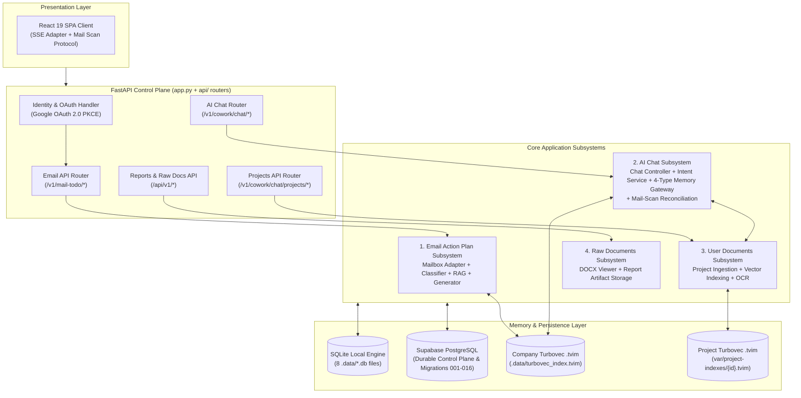

# Overall System Architecture (Level 1 Architecture)

**Architecture level:** Level 1 — Comprehensive High-Level System Overview  
**Status:** Live / Implemented  
**Last Updated:** 2026-08-26
**Primary Owner:** [`src/cowork_agent/`](../../../src/cowork_agent)  
**Target Alignment:** Fully Aligned with [TARGET-ARCHITECTURE.md](../TARGET-ARCHITECTURE.md)

---

## 1. System Inventory

### 1.1 Services and Subsystems

| Category | Implemented Component | Runtime Responsibility | Authoritative Code Location |
|---|---|---|---|
| **Control Plane API** | FastAPI Application (`app.py`) | Service composition root, Langfuse bootstrap, and router mounts. Composed dependencies live in one typed `CoworkRuntime` value built by [`composition.py`](../../../src/cowork_agent/composition.py) and read through the `runtime(request)` accessor; the untyped `app.state` sprawl is retired ([ADR-013](../../../tasks/adr/ADR-013-composition-as-typed-value.md)). Transport lives in the routers, not here: `app.py` serves only `/health`, and OAuth, connections, digest runs and the document surfaces are `create_*_router()` modules under `api/` ([ADR-015](../../../tasks/adr/ADR-015-routers-own-their-transport.md)). | [`src/cowork_agent/app.py`](../../../src/cowork_agent/app.py), [`src/cowork_agent/api/`](../../../src/cowork_agent/api) |
| **Runtime Configuration** | Pure Settings Parsers + Explicit Loaders | `config.py` parses only an explicit mapping or `os.environ`; the FastAPI app, worker, ingestion CLI, and live commands load `.env` at their executable boundary through one seam ([ADR-017](../../../tasks/adr/ADR-017-settings-parsing-is-pure.md)). | [`config.py`](../../../src/cowork_agent/config.py) |
| **Email Action Plan & RAG** | Single-turn Digest Workflow | Connects to Gmail, extracts bounded text attachments, classifies intent (`NO_ACTION`, `DIRECT_PLAN`, `RETRIEVE_RAG`), and generates structured Action Plans. | [`features/email_action_plan`](../../../src/cowork_agent/features/email_action_plan) |
| **AI Chat & 4-Type Memory** | Multi-turn Chat Controller | Streaming SSE chat assistant backed by Short-term, Declarative, Episodic (`TaskEpisodes` with `supersedes`), and Semantic memory scopes, with live reasoning, report artifact generation, and transport-free mail-scan turn reconciliation. | [`features/ai_chat`](../../../src/cowork_agent/features/ai_chat) |
| **Chat Tool Registry** | Server-Routed Tool Execution (flag-off) | One `ToolRegistry` boundary — `specs()` renders the router's action tier, `run()` validates arguments against the tool's schema and executes it, and never raises. The router picks the tool; there is no client `tool_choices` field. One tool is registered, creating a Google Calendar event. Off in every deployed environment and blocked on a new executable-chat-tool ADR before that changes. | [`features/ai_chat/tools`](../../../src/cowork_agent/features/ai_chat/tools), [`integrations/google_calendar`](../../../src/cowork_agent/integrations/google_calendar) |
| **User Documents Subsystem** | Project-Scoped Document RAG | Uploads, extracts, indexes, and retrieves user project documents behind classifier gating ([ADR-007](../../../tasks/adr/ADR-007-project-scoped-classifier-gated-user-documents.md)). | [`integrations/rag/project_documents.py`](../../../src/cowork_agent/integrations/rag/project_documents.py) |
| **Report Artifacts & PDF Export** | Report Folder Owner + fpdf2 Adapter | Single naming rule (`ReportFilename`) and store port behind `/api/v1/reports`, shared by the artifacts view and AI Chat. A separate typed renderer converts the explicit Markdown subset to extractable Vietnamese PDF text with bundled Noto Sans ([ADR-018](../../../tasks/adr/ADR-018-report-pdfs-use-fpdf2-and-bundled-noto-sans.md)). | [`domain/report_artifacts.py`](../../../src/cowork_agent/domain/report_artifacts.py), [`persistence/report_artifacts.py`](../../../src/cowork_agent/persistence/report_artifacts.py), [`integrations/report_pdf`](../../../src/cowork_agent/integrations/report_pdf), [`api/reports.py`](../../../src/cowork_agent/api/reports.py) |
| **Document Ingestion Pipeline** | Offline Knowledge CLI & Ingestion Service | Converts DOCX/PDF source files into standardized Markdown (`data/extracted/*.md`) with SHA-256 hash manifest tracking and atomic persistence. | [`knowledge_ingestion`](../../../src/cowork_agent/integrations/knowledge_ingestion) & [`ingestion_cli.py`](../../../src/cowork_agent/ingestion_cli.py) |
| **Enterprise RAG Engine** | Vector & Hybrid Knowledge Memory | Turbovec 4-bit + BM25 + RRF over committed Markdown (`data/extracted/*.md`). | [`integrations/rag`](../../../src/cowork_agent/integrations/rag) |
| **Dual Persistence Engine** | Repositories & Migrations | Dynamic persistence layer supporting process-local SQLite fallback or durable Supabase PostgreSQL when `DATABASE_URL` is set (migrations 001–016). | [`persistence/repositories`](../../../src/cowork_agent/persistence/repositories) |
| **Presentation Clients** | React 19 Web SPA | Production React 19 + Vite + Tailwind SPA. `useStreamingChat` adapts React state, SSE, and persistence; `runMailScanProtocol` independently owns concurrent Gmail/Outlook digest polling and ordered snapshots. | [`useStreamingChat.ts`](../../../frontend/src/dashboard/hooks/useStreamingChat.ts), [`mailScanProtocol.ts`](../../../frontend/src/dashboard/hooks/mailScanProtocol.ts) |

### 1.2 State, Queues, Workers, and Persistence

| Component | Live Implementation | Operational Boundary |
|---|---|---|
| **Dual Persistence Engine** | SQLite (8 `.data/*.db` files: `mail_todo.db`, `runs.db`, `tasks.db`, `chat.db`, `chat_identity.db`, `projects.db`, `project_chunks.db`, `raw_documents.db`) or Supabase PostgreSQL (`AsyncConnectionPool`) | With `POSTGRES_MODE=off`, local SQLite owns mailbox, runs, tasks, chat sessions/history/traces/artifacts, durable profile/episodic memory, projects, document jobs, and document chunks. With `DATABASE_URL`, Supabase PostgreSQL owns the durable control plane. |
| **Run & Task Store** | `SQLiteRunRepository` / `PostgresRunRepository` & `SQLiteTaskRepository` / `PostgresTaskRepository` | Persists execution run history, idempotent tokens, and finalized Action Items / TaskEpisodes. |
| **Background Dispatch** | FastAPI `BackgroundTasks` + `InMemoryOutbox` / `PostgresOutboxRepository` | Triggers background digest execution (`DigestWorker.execute`) and project document indexing without blocking HTTP responses. |
| **Session & Profile Store** | `InMemoryChatSessionBuffer` & SQLite/Postgres chat repositories | Session window turns kept in-memory for zero latency; long-term user profile preferences persist to SQLite locally or Postgres when configured. |

### 1.3 Endpoints & API Inventory

| HTTP Method and Path | Purpose | Subsystem Owner |
|---|---|---|
| `GET /health` | Liveness check | Control Plane |
| `GET /v1/mail-todo/oauth/gmail/connect` | Initiates Google OAuth PKCE flow | Email Subsystem |
| `GET /v1/mail-todo/oauth/gmail/callback` | Exchanges OAuth code, upserts mailbox connection, sets session cookie | Email Subsystem |
| `GET /v1/mail-todo/connections` | Lists active mailbox connections for user | Email Subsystem |
| `DELETE /v1/mail-todo/connections/{connection_id}` | Disconnects owned mailbox connection | Email Subsystem |
| `GET /v1/mail-todo/connections/{id}/unread-preview` | Synchronous preview of unread Gmail messages | Email Subsystem |
| `POST /v1/mail-todo/runs` | Creates idempotent digest run & enqueues worker execution | Email Subsystem |
| `GET /v1/mail-todo/runs/{run_id}` | Polls digest run execution status | Email Subsystem |
| `GET /v1/mail-todo/runs/{run_id}/result` | Retrieves finalized Action Items and next action plans | Email Subsystem |
| `POST /v1/cowork/chat/sessions` | Creates or retrieves multi-turn chat session | AI Chat Subsystem |
| `POST /v1/cowork/chat/sessions/{id}/messages` | SSE streaming chat completions with live reasoning & 4-type memory context | AI Chat Subsystem |
| `POST /v1/cowork/chat/sessions/{id}/mail-scans` | Maps aggregate scan/activity payloads into domain values and reconciles the chat turn into durable history or the short-term buffer | AI Chat Subsystem |
| `GET /v1/cowork/chat/document-health` | Diagnostic health endpoint for User Document RAG stack | User Documents Subsystem |
| `POST /v1/cowork/chat/projects` & `POST /v1/cowork/chat/projects/{id}/documents` | Project workspace management & document ingestion | User Documents Subsystem |
| `GET/POST /api/v1/raw-documents/*` | Raw DOCX/PDF viewing, editing, and save history | Raw Documents Subsystem |
| `GET/POST /api/v1/reports`, `POST /api/v1/reports/open-folder`, `GET /api/v1/reports/{filename}/download`, `GET /api/v1/reports/{filename}/pdf`, `DELETE /api/v1/reports/{filename}` | Lists, saves, reveals, downloads, exports, and deletes report artifacts in `data/reports/`. Production PDF export uses the typed fpdf2/Noto Sans adapter; the `501 pdf_export_unavailable` response remains only for an injected runtime without that capability. | Report Artifact Store |

### 1.4 External Providers & Services

| Provider / Integration | Usage in Architecture | Resilience & Fallback Controls |
|---|---|---|
| **Google OAuth 2.0 & Gmail API** | Mailbox authorization and unread thread retrieval. | Read-only scope (`gmail.readonly`). Ephemeral signed OAuth state with PKCE. |
| **Google Calendar API v3** | Creating an event or todo from a chat turn, through the `TOOL` route. | **Off by default and unconfigured in every deployed environment** (`GOOGLE_CALENDAR_ENABLED`, `CHAT_TOOL_AXIS_ENABLED` both default false). Write scope. The event id derives from the turn's idempotency key, so a retried turn cannot create a duplicate. The shared single-user OAuth refresh token is dev-only debt: per-user OAuth is the one thing that must land before real users. Enabling either flag outside local development requires a new executable-chat-tool ADR amending TARGET §21.5/§21.15. |
| **Gemini API / Vyce API / Mistral API / OpenRouter** | Structured email classification, action plan generation, and multi-turn chat replies. | Configured via `LLM_PROVIDER` and resolved once in [`provider_factory.py`](../../../src/cowork_agent/integrations/llm/provider_factory.py). Email Action Plan workflow lives in `ConfiguredRouteClassifier` / `ConfiguredActionPlanGenerator`; providers supply transport. Gemini & Vyce: key rotation on HTTP 429. OpenRouter: native `models[]` from `OPENROUTER_ALLOWED_MODELS`, then Google Gemini last-resort on `OpenRouterAPIError` when Gemini keys exist ([ADR-012](../../../tasks/adr/ADR-012-openrouter-gemini-last-resort.md)). Schema-invalid JSON after repair does not hop. Both-fail keeps conservative `RETRIEVE_RAG` / unavailable errors. |
| **Langfuse** | LLM observability, span tracing, and token metrics. | `@observe` wrappers on chat controllers, prompt generators, routing classifiers, and memory operations without logging raw email contents. |
| **Jina AI API** | Text embeddings (`v5`) & cross-encoder reranking (`jina-reranker-v2-base-multilingual`). | Used for company RAG ingestion and hybrid reranking. Fallbacks to dense matrix/BM25 if unconfigured. |
| **Turbovec + Postgres FTS** | Company knowledge is a local `.tvim`; project documents are Postgres chunks + per-project `.tvim`. | Company RAG degrades to `NullSemanticMemory` if Turbovec setup fails. |
| **Turbovec (TurboQuant 4-bit)** | Quantized in-process vector memory store (`.data/turbovec_index.tvim`). | Fast 4-bit quantized local vector search enabled via `RAG_STORE_PROVIDER=turbovec`. |

---

## 2. High-Level Architecture Diagram

---

## 3. End-to-End Product Workflows

### 3.1 Email Action Plan & RAG Workflow (Single-Turn)

1. **Trigger:** User dispatches `POST /v1/mail-todo/runs` with `mailboxConnectionId`.
2. **Fetch:** `GmailMailboxAdapter` reads unread threads from Gmail and parses messages into transient `EphemeralEmailEnvelope` objects.
3. **Classification:** `RouteClassifierPort` evaluates email intent:
   - `NO_ACTION`: Skips plan generation and marks email as processed.
   - `DIRECT_PLAN`: Generates Action Plan directly from email text.
   - `RETRIEVE_RAG`: Triggers `SemanticMemoryPort.retrieve()` over company corpus (`data/extracted/*.md`) before plan generation.
4. **Generation & Validation:** Action Plan generator constructs steps; `validation.py` enforces schema, priorities, and grounding with Langfuse tracing.
5. **Persistence:** Action Items saved to SQLite/Postgres; raw emails and attachment contents are **never** persisted.

### 3.2 AI Chat & 4-Type Memory Workflow (Multi-Turn)

1. **Trigger:** User sends prompt via `POST /v1/cowork/chat/sessions/{id}/messages` with optional `reasoning_mode` (`fast` | `reasoning`).
2. **Context Assembly:** `ChatController` requests memory context via `MemoryGateway`:
   - **Short-Term:** Fetches active conversation turns from `InMemoryChatSessionBuffer`.
   - **Declarative:** Loads user preferences and persona attributes.
   - **Episodic:** Fetches recent chat session summaries and task episodes (with `supersedes` support; `retrieval_eligible=false` until explicit user approval per [ADR-004](../../../tasks/adr/ADR-004-chat-native-task-episodes.md)).
   - **Semantic:** Retrieves verified facts from enterprise company RAG.
3. **Intent Routing & User Documents:** If enabled, `ChatRoutingService` evaluates prompt intent to query project-scoped user documents ([ADR-007](../../../tasks/adr/ADR-007-project-scoped-classifier-gated-user-documents.md)).
4. **Streaming Reply & Artifact Generation:** `ChatReplyPort` streams response chunks and live reasoning over SSE. The controller auto-generates report artifacts saved into `reports/` and records `ChatExecutionTrace` for drawer inspection.
5. **Turn Persistence:** Complete turn, execution trace, report artifact refs, activity timeline, and deduped citations are stored atomically.
6. **Aggregate Mail Cards:** `POST /sessions/{id}/mail-scans` maps its Pydantic activity payloads once into `DesiredMailActivity`. Feature policy validates scan/turn status and reconciles append-only activities before the route writes the turn to durable history or the in-process buffer.

### 3.3 In-Chat Mail Scan Workflow (Client-Orchestrated)

1. **Trigger:** `@email`, `@outlook`, or `@mail` is recognized by the React hook without entering the AI Chat tool loop.
2. **Protocol:** `runMailScanProtocol` selects remembered active connections, creates Gmail/Outlook digest runs concurrently, and polls each run every 1.5 seconds with abort propagation and five-consecutive-error tolerance.
3. **Projection:** Ordered snapshots aggregate provider progress and counts; `useStreamingChat` maps them into the assistant message and semantic mail activities.
4. **Persistence:** The React adapter dedupes and sequences aggregate `MailScanSummary` lifecycle writes to `/sessions/{id}/mail-scans`. Raw email bodies and attachment contents never enter chat history or memory.

---

## 4. Architectural Boundaries & Decoupling Compliance

1. **Email & Chat Decoupling ([ADR-004](../../../tasks/adr/ADR-004-chat-native-task-episodes.md)):** AI Chat operates independently from the standalone Email digest workflow. The frontend mail protocol calls the digest REST surface directly, and the React adapter persists only high-level `MailScanSummary` cards (`POST /sessions/{id}/mail-scans`) without injecting raw email bodies into conversational memory. The chat router keeps transport and its six request-scoped seams; `features/ai_chat/mail_scan_reconciliation.py` owns the transport-free activity and turn rules.
2. **TaskEpisode Security:** System-proposed tasks created during chat interactions are marked `retrieval_eligible=false` to prevent unverified tasks from contaminating semantic memory context.
3. **Transient Data Isolation:** Gmail contents and user attachments are processed ephemerally in-memory and are never stored in company vector indices or long-term databases.
4. **Dual Persistence Strategy:** Zero-friction local development using SQLite plus an in-process bounded working-memory buffer; seamless production scaling using Supabase PostgreSQL when `DATABASE_URL` is supplied.
