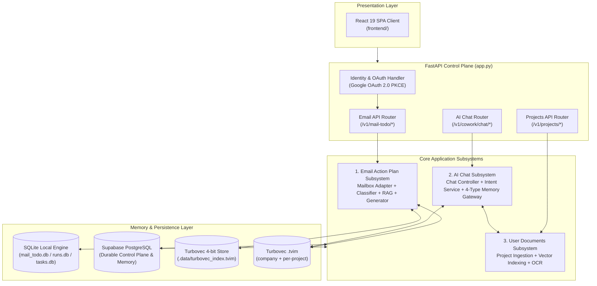

# Overall System Architecture (Level 1 Architecture)

**Architecture level:** Level 1 — Comprehensive High-Level System Overview  
**Status:** Live / Implemented  
**Primary Owner:** `src/cowork_agent/`  
**Target Alignment:** Fully Aligned with [TARGET-ARCHITECTURE.md](../TARGET-ARCHITECTURE.md)

---

## 1. System Inventory

### 1.1 Services and Subsystems

| Category | Implemented Component | Runtime Responsibility | Authoritative Code Location |
|---|---|---|---|
| **Control Plane API** | FastAPI Application (`app.py`) | Service composition root, OAuth 2.0 lifecycle, security principal resolution, and API route mounts. | [src/cowork_agent/app.py](../../../src/cowork_agent/app.py) |
| **Email Action Plan & RAG** | Single-turn Digest Workflow | Connects to Gmail, extracts bounded text attachments, classifies intent (`NO_ACTION`, `DIRECT_PLAN`, `RETRIEVE_RAG`), and generates structured Action Plans. | [features/email_action_plan](../../../src/cowork_agent/features/email_action_plan) |
| **AI Chat & 4-Type Memory** | Multi-turn Chat Controller | Streaming SSE chat assistant backed by Short-term, Declarative, Episodic (`TaskEpisodes`), and Semantic memory scopes. | [features/ai_chat](../../../src/cowork_agent/features/ai_chat) |
| **User Documents Subsystem** | Project-Scoped Document RAG | Uploads, extracts, indexes, and retrieves user project documents behind classifier gating ([ADR-007](../../../tasks/adr/ADR-007-project-scoped-classifier-gated-user-documents.md)). | [integrations/rag/project_documents.py](../../../src/cowork_agent/integrations/rag/project_documents.py) |
| **Document Ingestion Pipeline** | Offline Knowledge CLI & Ingestion Service | Converts DOCX/PDF source files into standardized Markdown (`data/extracted/*.md`) with SHA-256 hash manifest tracking and atomic persistence. | [knowledge_ingestion](../../../src/cowork_agent/integrations/knowledge_ingestion) & [ingestion_cli.py](../../../src/cowork_agent/ingestion_cli.py) |
| **Enterprise RAG Engine** | Vector & Hybrid Knowledge Memory | Turbovec 4-bit + BM25 + RRF over committed Markdown (`data/extracted/*.md`). | [integrations/rag](../../../src/cowork_agent/integrations/rag) |
| **Dual Persistence Engine** | Repositories & Migrations | Dynamic persistence layer supporting process-local SQLite fallback or durable Supabase PostgreSQL when `DATABASE_URL` is set. | [persistence/repositories](../../../src/cowork_agent/persistence/repositories) |
| **Presentation Clients** | React 19 Web SPA | Production React 19 + Vite + Tailwind SPA frontend application. | [frontend/](../../../frontend) |

### 1.2 State, Queues, Workers, and Persistence

| Component | Live Implementation | Operational Boundary |
|---|---|---|
| **Dual Persistence Engine** | SQLite (`mail_todo.db`, `runs.db`, `tasks.db`) or Supabase PostgreSQL (`AsyncConnectionPool`) | Without `DATABASE_URL`, uses local SQLite and in-memory repositories. With `DATABASE_URL`, connects to Supabase PostgreSQL for runs, tasks, outbox, identity, and chat memory. |
| **Run & Task Store** | `SQLiteRunRepository` / `PostgresRunRepository` & `SQLiteTaskRepository` / `PostgresTaskRepository` | Persists execution run history, idempotent tokens, and finalized Action Items / TaskEpisodes. |
| **Background Dispatch** | FastAPI `BackgroundTasks` + `InMemoryOutbox` / `PostgresOutboxRepository` | Triggers background digest execution (`DigestWorker.execute`) and project document indexing without blocking HTTP responses. |
| **Session & Profile Store** | `InMemoryChatSessionBuffer` & `PostgresChatProfileRepository` | Session window turns kept in-memory for zero latency; long-term user profile preferences persisted to Postgres when available. |

### 1.3 Endpoints & API Inventory

| HTTP Method and Path | Purpose | Subsystem Owner |
|---|---|---|
| `GET /health` | Liveness check | Control Plane |
| `GET /v1/mail-todo/oauth/gmail/connect` | Initiates Google OAuth PKCE flow | Email Subsystem |
| `GET /v1/mail-todo/oauth/gmail/callback` | Exchanges OAuth code, upserts mailbox connection, sets session cookie | Email Subsystem |
| `GET /v1/mail-todo/connections` | Lists active mailbox connections for user | Email Subsystem |
| `DELETE /v1/mail-todo/connections/{connection_id}` | Disconnects owned mailbox connection | Email Subsystem |
| `GET /v1/mail-todo/connections/{id}/unread-preview` | Synchronous preview of unread Gmail messages | Email Subsystem |
| `POST /v1/mail-todo/runs` | Creates idempotent digest run & enqueues worker execution | Email Subsystem |
| `GET /v1/mail-todo/runs/{run_id}` | Polls digest run execution status | Email Subsystem |
| `GET /v1/mail-todo/runs/{run_id}/result` | Retrieves finalized Action Items and next action plans | Email Subsystem |
| `POST /v1/cowork/chat/sessions` | Creates or retrieves multi-turn chat session | AI Chat Subsystem |
| `POST /v1/cowork/chat/sessions/{id}/stream` | SSE streaming chat completions with 4-type memory context | AI Chat Subsystem |
| `GET /v1/cowork/chat/document-health` | Diagnostic health endpoint for User Document RAG stack | User Documents Subsystem |
| `POST /v1/projects` & `POST /v1/projects/{id}/documents` | Project workspace management & document ingestion | User Documents Subsystem |

### 1.4 External Providers & Services

| Provider / Integration | Usage in Architecture | Resilience & Fallback Controls |
|---|---|---|
| **Google OAuth 2.0 & Gmail API** | Mailbox authorization and unread thread retrieval. | Read-only scope (`gmail.readonly`). Ephemeral signed OAuth state with PKCE. |
| **Gemini API / Groq API / Faucet API** | Structured email classification, action plan generation, and multi-turn chat replies. | Configured via `LLM_PROVIDER`. Automatic key rotation on HTTP 429 for Gemini. Fallback to unavailable error response if provider fails. |
| **Jina AI API** | Text embeddings (`v5`) & cross-encoder reranking (`jina-reranker-v2-base-multilingual`). | Used for company RAG ingestion and hybrid reranking. Fallbacks to dense matrix/BM25 if unconfigured. |
| **Turbovec + Postgres FTS** | Company knowledge is a local `.tvim`; project documents are Postgres chunks + per-project `.tvim`. | Company RAG degrades to `NullSemanticMemory` if Turbovec setup fails. |
| **Turbovec (TurboQuant 4-bit)** | Quantized in-process vector memory store (`.data/turbovec_index.tvim`). | Fast 4-bit quantized local vector search enabled via `RAG_STORE_PROVIDER=turbovec`. |

---

## 2. High-Level Architecture Diagram

---

## 3. End-to-End Product Workflows

### 3.1 Email Action Plan & RAG Workflow (Single-Turn)

1. **Trigger:** User dispatches `POST /v1/mail-todo/runs` with `mailboxConnectionId`.
2. **Fetch:** `GmailMailboxAdapter` reads unread threads from Gmail and parses messages into transient `EmailEnvelope` objects.
3. **Classification:** `RouteClassifierPort` evaluates email intent:
   - `NO_ACTION`: Skips plan generation and marks email as processed.
   - `DIRECT_PLAN`: Generates Action Plan directly from email text.
   - `RETRIEVE_RAG`: Triggers `SemanticMemoryPort.retrieve()` over company corpus (`data/extracted/*.md`) before plan generation.
4. **Generation & Validation:** Action Plan generator constructs steps; `validation.py` enforces schema, priorities, and grounding.
5. **Persistence:** Action Items saved to SQLite/Postgres; raw emails and attachment contents are **never** persisted.

### 3.2 AI Chat & 4-Type Memory Workflow (Multi-Turn)

1. **Trigger:** User sends prompt via `POST /v1/cowork/chat/sessions/{id}/stream`.
2. **Context Assembly:** `ChatController` requests memory context via `MemoryGateway`:
   - **Short-Term:** Fetches active conversation turns from `InMemoryChatSessionBuffer`.
   - **Declarative:** Loads user preferences and persona attributes.
   - **Episodic:** Fetches recent chat session summaries and task episodes (`retrieval_eligible=false` until explicit user approval per [ADR-004](../../../tasks/adr/ADR-004-chat-native-task-episodes.md)).
   - **Semantic:** Retrieves verified facts from enterprise company RAG.
3. **Intent Routing & User Documents:** If enabled, `ChatRoutingService` evaluates prompt intent to query project-scoped user documents ([ADR-007](../../../tasks/adr/ADR-007-project-scoped-classifier-gated-user-documents.md)).
4. **Streaming Reply:** `ChatReplyPort` streams response chunks over SSE while managing working memory updates.

---

## 4. Architectural Boundaries & Decoupling Compliance

1. **Email & Chat Decoupling ([ADR-004](../../../tasks/adr/ADR-004-chat-native-task-episodes.md)):** AI Chat operates completely independently from the Email digest workflow. Chat has no `@Email` tools or direct access to inbox contents.
2. **TaskEpisode Security:** System-proposed tasks created during chat interactions are marked `retrieval_eligible=false` to prevent unverified tasks from contaminating semantic memory context.
3. **Transient Data Isolation:** Gmail contents and user attachments are processed ephemerally in-memory and are never stored in company vector indices or long-term databases.
4. **Dual Persistence Strategy:** Zero-friction local development using SQLite and in-memory repositories; seamless production scaling using Supabase PostgreSQL when `DATABASE_URL` is supplied.

