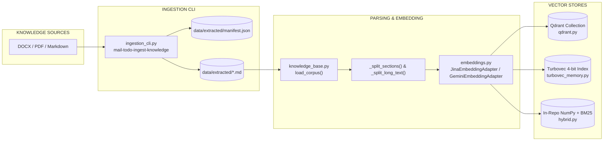
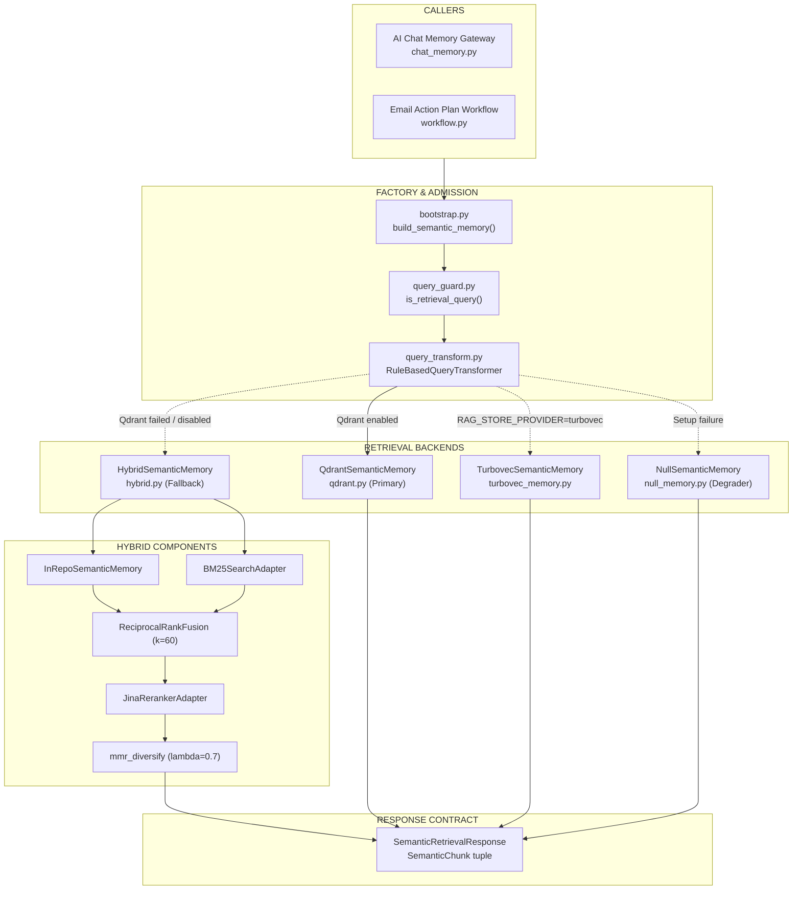

# Current RAG Architecture

> **Extraction status notice:** This document describes the live RAG implementation in the codebase as of commit `cf2fd49801d5932b26de82af9d104d730cf58271` (updated with V1-M3 hybrid retrieval and multi-backend vector memory capabilities). See [`../TARGET-ARCHITECTURE.md`](../TARGET-ARCHITECTURE.md) for target specifications and [`../master-comparison.md`](../master-comparison.md) for full implementation status versus target architecture.

## Extraction status

This document describes the live implementation in `src/cowork_agent/integrations/rag/`.

**Finding:** The RAG module is fully implemented in Python source, providing corpus-backed semantic search via `SemanticMemoryPort`, multi-backend vector/hybrid indexing (Qdrant, Turbovec 4-bit, and in-repo Hybrid/BM25), query transformation/HyDE, cross-encoder reranking, and a dedicated project-documents vector store.

**Generation ownership:** Final Action Plan generation occurs in the Email Action Plan workflow (`workflow.py`). `DigestWorker` orchestrates retrieval via `SemanticMemoryPort` when candidate emails require knowledge context (`RETRIEVE_RAG`), and passes retrieved chunks to Gemini/Groq LLM extractors.

---

## 1. RAG module purpose

The module provides semantic retrieval over company knowledge documents and user-uploaded project documents:

| Capability | Current implementation status | Key files |
|---|---|---|
| Ingestion | Implemented (Offline CLI for Markdown/DOCX/PDF extraction, whole-corpus collection creation) | `ingestion_cli.py`, `knowledge_base.py`, `qdrant.py` |
| Parsing/chunking | Implemented (Heading H1/H2 splitting + 1200-char paragraph chunking, page-aware for project docs) | `knowledge_base.py`, `project_documents.py` |
| Embedding/indexing | Implemented (Jina v5 & Gemini embeddings; Qdrant vector DB, Turbovec 4-bit quantized, and In-repo NumPy index) | `embeddings.py`, `qdrant.py`, `turbovec_memory.py` |
| Vector search | Implemented (Qdrant `COSINE` search, Turbovec 4-bit search, In-repo cosine similarity) | `qdrant.py`, `turbovec_memory.py`, `memory.py` |
| Keyword/BM25 search | Implemented (Okapi BM25 lexical search adapter in fallback engine) | `bm25.py`, `hybrid.py` |
| Reranking | Implemented (Jina cross-encoder reranker `jina-reranker-v2-base-multilingual`) | `jina_reranker.py`, `reranker.py` |
| Result Fusion & Diversity | Implemented (Reciprocal Rank Fusion `k=60` and MMR diversification `lambda_mult=0.7`) | `rrf.py`, `mmr.py` |
| Context retrieval/assembly | Implemented (`SemanticMemoryPort`, `SemanticChatMemoryAdapter`, `ActionPlanWorkflow`) | `bootstrap.py`, `chat_memory.py`, `workflow.py` |
| Provenance & Citations | Implemented (`SemanticChunk` carrying `chunk_id`, `document_id`, `document_title`, `section`, `source_url`, `relevance_score`) | `target_contracts.py`, `qdrant.py` |
| Tenant & ACL filtering | Implemented (Server-side payload filter `tenant_id` & `document_status` before vector search; `workspace_id`/`user_id`/`project_id` for project docs) | `qdrant.py`, `project_documents.py` |

---

## 2. Ingestion architecture

```text
Source files (DOCX/PDF/MD)
-> Knowledge Ingestion CLI (mail-todo-ingest-knowledge)
-> Markdown extraction in data/extracted/*.md with hash manifest
-> Corpus loader (load_corpus) & Chunker (_split_sections, _split_long_text)
-> EmbeddingPort (Jina / Gemini embeddings)
-> Qdrant / Turbovec / In-repo Store (ingest_corpus / build_index)
```

- **Offline CLI (`ingestion_cli.py`)**: `mail-todo-ingest-knowledge` converts local binary DOCX and native-text PDF sources to Markdown in `data/extracted/` and writes hash manifest entries. Scanned/mixed PDFs requiring OCR fail with `mistral_not_configured` if Mistral is unconfigured.
- **Corpus Loading (`knowledge_base.py`)**: `load_corpus()` deterministically reads Markdown documents, parses section titles, and produces `KnowledgeChunk` instances bounded to 1200 characters.
- **Qdrant Ingestion (`qdrant.py`)**: `ingest_corpus()` embeds all chunks using `EmbeddingPort`, recreates the collection, builds keyword payload indexes for `tenant_id` and `document_status`, and upserts points in 128-item batches.
- **Turbovec Ingestion (`turbovec_memory.py`)**: `build_index()` pads embedding feature dimensions to a multiple of 8 and builds a 4-bit quantized TurboQuant `IdMapIndex` persisted to `.data/turbovec_index.tvim`.

---

## 3. Retrieval architecture

Retrieval is initiated via `SemanticMemoryPort.retrieve(request)` with a multi-backend fallback ladder:

```text
SemanticRetrievalRequest
-> Tenant & ACL Scope Validation (refuse if tenant_id != tenant_scope or status != 'ready')
-> Query Guard (is_retrieval_query: filter out short greetings)
-> RuleBasedQueryTransformer (domain expansion + optional HyDE)
-> Backend Selection (RAG_STORE_PROVIDER / Qdrant / Turbovec / Hybrid / Null)
    ├─> Primary: QdrantSemanticMemory (Server-side payload filter + Cosine query)
    ├─> Provider "turbovec": TurbovecSemanticMemory (4-bit TurboQuant search)
    ├─> Fallback: HybridSemanticMemory (Dense NumPy + BM25 + RRF + Jina Reranker + MMR)
    └─> Degrader: NullSemanticMemory (Returns RetrievalStatus.NO_RESULTS)
-> SemanticRetrievalResponse (chunks, status, latency_ms)
```

- **ACL Guard (`qdrant.py:86-107`)**: Server-side payload filter matching `tenant_id == tenant_scope` and `document_status == 'ready'` is constructed *before* embedding or vector scoring.
- **Query Transformation (`query_transform.py`)**: Adds Vietnamese domain prefixes ("Quy trình thủ tục...", "Hướng dẫn quy định...") and generates HyDE hypothetical passages.
- **Hybrid Search Engine (`hybrid.py`)**: Combines in-repo dense matrix cosine similarity (`InRepoSemanticMemory`) and Okapi BM25 lexical search (`BM25SearchAdapter`), fuses ranks using unweighted Reciprocal Rank Fusion (`ReciprocalRankFusion`, `k=60`), reranks via Jina API (`JinaRerankerAdapter`), and applies MMR diversification (`mmr_diversify`, `lambda_mult=0.7`).

---

## 4. Generation ownership & caller integration

- **Email Action Plan Workflow (`workflow.py`)**: When an email is classified as `RETRIEVE_RAG`, `ActionPlanWorkflow._retrieve_if_needed()` calls `SemanticMemoryPort.retrieve()`. Retrieved chunks are passed into the structured prompt for `GeminiActionExtractor` or `GroqActionExtractor`.
- **AI Chat Memory Gateway (`chat_memory.py`)**: `SemanticChatMemoryAdapter.read_semantic_context()` delegates query retrieval to `SemanticMemoryPort` and formats results as `current_company_evidence` context for chat turns.
- **Project Document Plane (`project_documents.py`)**: `ProjectDocumentVectorStore` manages a private Qdrant collection for user-uploaded project documents with page-level coordinates (`page_start`, `page_end`) and workspace/user/project scoping.

---

## 5. Data stores

| Store category | Current implementation | Configuration / Path |
|---|---|---|
| Vector database | Qdrant (primary serving store) | `QDRANT_URL`, `QDRANT_COLLECTION_NAME` (default: `cowork_knowledge_v1`) |
| Quantized vector store | Turbovec 4-bit TurboQuant index | `RAG_STORE_PROVIDER=turbovec`, `.data/turbovec_index.tvim` |
| In-repo vector index | NumPy cosine similarity matrix (fallback/eval) | In-memory during process runtime |
| Lexical / Keyword index | Okapi BM25 (fallback/eval) | In-memory `BM25SearchAdapter` |
| Metadata store | Qdrant point payloads / manifest file | `data/extracted/manifest.json` |
| Document storage | Local Markdown files | `data/extracted/*.md` |
| Cross-Encoder Reranker | Jina Reranker API v2 | `JINA_API_KEY`, `https://api.jina.ai/v1/rerank` |
| Embedding Provider | Jina v5 API / Gemini Embeddings | `JinaEmbeddingAdapter`, `GeminiEmbeddingAdapter` |

---

## 6. API contracts & domain models

Authoritative domain contracts are defined in `src/cowork_agent/domain/target_contracts.py`:

### SemanticRetrievalRequest

```python
@dataclass(frozen=True, slots=True)
class SemanticRetrievalRequest:
    query: str
    tenant_id: str
    knowledge_gaps: tuple[str, ...] = ()
    filters: SemanticRetrievalFilters = SemanticRetrievalFilters()
    limits: RetrievalLimits = RetrievalLimits()
```

### SemanticRetrievalResponse & SemanticChunk

```python
@dataclass(frozen=True, slots=True)
class SemanticChunk:
    chunk_id: str
    document_id: str
    document_title: str
    section: str | null
    text: str
    source_url: str
    document_version: str | null
    relevance_score: float
    rerank_score: float | null

@dataclass(frozen=True, slots=True)
class SemanticRetrievalResponse:
    query_id: str
    tenant_id: str
    chunks: tuple[SemanticChunk, ...]
    retrieval_status: RetrievalStatus  # SUCCESS, NO_RESULTS, TIMEOUT, AUTHORIZATION_DENIED, PARTIAL
    latency_ms: int
```

---

## 7. Provenance and citations

Retrieved knowledge chunks carry formal provenance fields returned in `SemanticChunk`:

- `chunk_id`: Unique chunk UUID.
- `document_id`: Source document identifier.
- `document_title`: Title extracted from Markdown H1 header.
- `section`: Heading/section hierarchy path.
- `source_url`: Document source pointer/path.
- `relevance_score`: Dense vector cosine similarity score.
- `rerank_score`: Cross-encoder reranker score (when reranking is applied).

---

## 8. Tenant and ACL isolation

- **Company Corpus Isolation (`qdrant.py`)**: Enforces `tenant_id == tenant_scope` and `document_status == ('ready',)` in server-side payload filters before running vector search. Inconsistent tenant parameters cause immediate refusal with `RetrievalStatus.AUTHORIZATION_DENIED`.
- **Project Document Isolation (`project_documents.py`)**: Uses compound payload filter requiring exact matches on `workspace_id`, `user_id`, `project_id`, `document_id`, and `document_status` before embedding or querying.

---

## 9. Reliability & fallback ladder

The RAG bootstrap factory (`bootstrap.py:build_semantic_memory`) implements a robust degradation ladder:

1. **Provider Check**: If `RAG_STORE_PROVIDER == "turbovec"`, attempts `TurbovecSemanticMemory`. On failure, logs warning and proceeds.
2. **Primary Qdrant**: If `QdrantSettings.enabled` is True, attempts connecting to Qdrant and verifying/ingesting corpus. On failure/timeout, logs warning and falls back.
3. **In-Repo Hybrid Fallback**: Builds `HybridSemanticMemory` with local corpus loading, Jina embeddings, Jina reranker, and BM25.
4. **Null Degrader**: If hybrid setup fails, returns `NullSemanticMemory`, returning structured `RetrievalStatus.NO_RESULTS` so digest and chat flows never crash due to RAG store unavailability.

---

## 10. Mermaid diagrams

### Diagram A — Corpus Ingestion Flow



### Diagram B — Retrieval Runtime and Fallback Ladder



---

## 11. Known limits and missing capabilities vs target

Comparing live implementation to target architecture (`TARGET-ARCHITECTURE.md` §6.2 & §21):

| Target Requirement | Live State | Gap |
|---|---|---|
| Incremental Document Update | Whole-corpus collection recreation (`ingest_corpus` deletes and recreates collection) | Needs registry-backed incremental upsert by `document_id` |
| Document Registry | Hash manifest in JSON file (`manifest.json`) | Needs database registry tracking document status, version, and failure reason codes |
| OCR Pipeline | Mistral OCR placeholder returning `mistral_not_configured` | Needs fully configured OCR integration for scanned PDFs |
| Single End-to-End Retrieval Budget | Separate timeouts in Qdrant, Jina, and asyncio wrappers | Needs single unified timeout budget wrapping embed, search, and rerank stages |
| Calibrated Abstention Margin | Raw `min_score` threshold filtering | Needs calibrated score margin policy for negative Vietnamese query evaluation |
| Reranker Failure Visibility | Silent fallback on reranker error | Needs explicit reporting of rerank status (`applied`, `bypassed`, `failed`) and `degraded` flag in response |

---

## Source evidence

- Bootstrap factory and fallback ladder: `src/cowork_agent/integrations/rag/bootstrap.py:38-128`.
- Qdrant primary adapter and ACL filter: `src/cowork_agent/integrations/rag/qdrant.py:60-147`, `:149-202`.
- Turbovec 4-bit quantized adapter: `src/cowork_agent/integrations/rag/turbovec_memory.py:45-193`.
- In-repo hybrid retrieval (Dense + BM25 + RRF + Jina + MMR): `src/cowork_agent/integrations/rag/hybrid.py:45-210`.
- Jina embeddings adapter: `src/cowork_agent/integrations/rag/embeddings.py:81-120`.
- Gemini embeddings adapter: `src/cowork_agent/integrations/rag/embeddings.py:122-186`.
- Jina cross-encoder reranker adapter: `src/cowork_agent/integrations/rag/jina_reranker.py:40-150` & `reranker.py:40-140`.
- Okapi BM25 lexical search adapter: `src/cowork_agent/integrations/rag/bm25.py:20-95`.
- Query guard & transformer: `src/cowork_agent/integrations/rag/query_guard.py:10-25` & `query_transform.py:20-110`.
- Project documents vector store: `src/cowork_agent/integrations/rag/project_documents.py:70-240`.
- Offline knowledge ingestion CLI: `src/cowork_agent/ingestion_cli.py:15-50`.
- Corpus loader & chunker: `src/cowork_agent/integrations/rag/knowledge_base.py:30-130`.
- Domain contracts: `src/cowork_agent/domain/target_contracts.py:120-220`.


