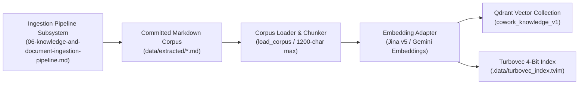
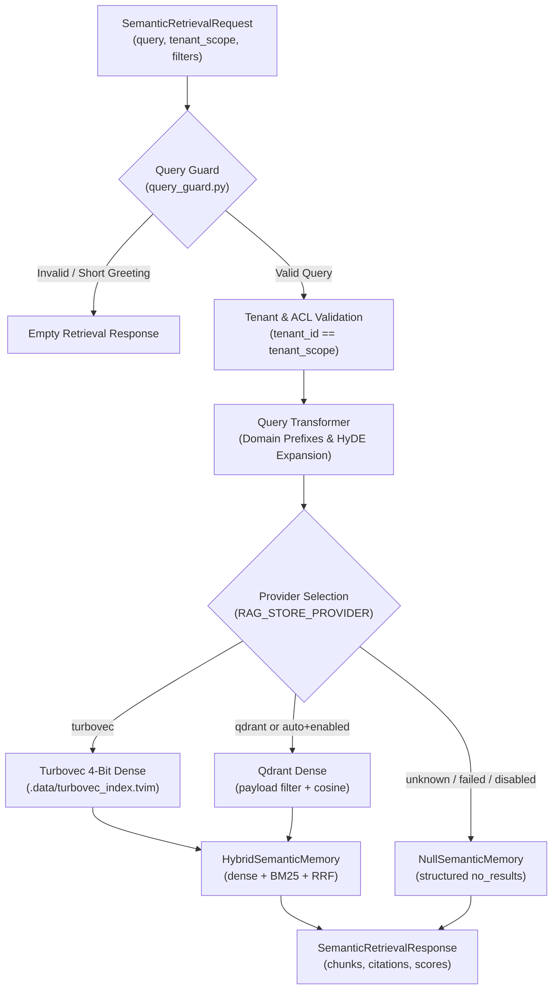

# Enterprise RAG & Vector Memory Subsystem (Level 1 Architecture)

**Architecture level:** Level 1 — Deep-Dive RAG & Vector Memory Subsystem  
**Status:** Live / Implemented  
**Primary Owner:** `src/cowork_agent/integrations/rag`  
**Target Alignment:** Fully Aligned with [TARGET-ARCHITECTURE.md §1, §2 & §3](file:///e:/VIN-INTERNSHIP/EMAIL-AGENT-v1/docs/architectures/TARGET-ARCHITECTURE.md), [ADR-004](file:///e:/VIN-INTERNSHIP/EMAIL-AGENT-v1/tasks/adr/ADR-004-chat-native-task-episodes.md), and [ADR-007](file:///e:/VIN-INTERNSHIP/EMAIL-AGENT-v1/tasks/adr/ADR-007-project-scoped-classifier-gated-user-documents.md)

---

## 1. Subsystem Purpose & Capabilities Matrix

The Enterprise RAG & Vector Memory Subsystem provides high-precision, low-latency semantic retrieval over committed enterprise knowledge documents (`data/extracted/*.md`) and classifier-gated user project documents.

| RAG Capability | Live Implementation | Authoritative Module Location |
|---|---|---|
| **Corpus Ingestion** | Offline CLI for Markdown, DOCX, and PDF extraction with SHA-256 hash manifest verification. | [ingestion_cli.py](file:///e:/VIN-INTERNSHIP/EMAIL-AGENT-v1/src/cowork_agent/integrations/rag/ingestion_cli.py) & [knowledge_base.py](file:///e:/VIN-INTERNSHIP/EMAIL-AGENT-v1/src/cowork_agent/integrations/rag/knowledge_base.py) |
| **Parsing & Chunking** | Heading-aware section splitting bounded to 1200 characters; page-aware chunking for user documents. | [markdown_chunking.py](file:///e:/VIN-INTERNSHIP/EMAIL-AGENT-v1/src/cowork_agent/integrations/rag/markdown_chunking.py) |
| **Embedding Adapters** | Dual embedding support for Jina AI Embeddings (`v5`) and Gemini Embeddings API. | [embeddings.py](file:///e:/VIN-INTERNSHIP/EMAIL-AGENT-v1/src/cowork_agent/integrations/rag/embeddings.py) |
| **Primary Vector Database** | Server-side payload filtering (`tenant_id`, `document_status`) with cosine vector search in Qdrant. | [qdrant.py](file:///e:/VIN-INTERNSHIP/EMAIL-AGENT-v1/src/cowork_agent/integrations/rag/qdrant.py) |
| **Quantized Memory Store** | In-process 4-bit TurboQuant index (`.data/turbovec_index.tvim`) for low-footprint local vector search. | [turbovec_memory.py](file:///e:/VIN-INTERNSHIP/EMAIL-AGENT-v1/src/cowork_agent/integrations/rag/turbovec_memory.py) |
| **Hybrid & Lexical Search** | Dense matrix cosine search + Okapi BM25 lexical search adapter fused via Reciprocal Rank Fusion (`k=60`). | [hybrid.py](file:///e:/VIN-INTERNSHIP/EMAIL-AGENT-v1/src/cowork_agent/integrations/rag/hybrid.py) & [bm25.py](file:///e:/VIN-INTERNSHIP/EMAIL-AGENT-v1/src/cowork_agent/integrations/rag/bm25.py) |
| **Cross-Encoder Reranking** | Jina Cross-Encoder Reranker (`jina-reranker-v2-base-multilingual`) for precision candidate reranking. | [jina_reranker.py](file:///e:/VIN-INTERNSHIP/EMAIL-AGENT-v1/src/cowork_agent/integrations/rag/jina_reranker.py) |
| **Diversity & Query HyDE** | Query guard, domain prefix expansion, HyDE hypothetical document generation, and MMR diversification (`lambda=0.7`). | [query_transform.py](file:///e:/VIN-INTERNSHIP/EMAIL-AGENT-v1/src/cowork_agent/integrations/rag/query_transform.py) & [mmr.py](file:///e:/VIN-INTERNSHIP/EMAIL-AGENT-v1/src/cowork_agent/integrations/rag/mmr.py) |
| **User Project Docs RAG** | Dedicated vector store for uploaded user files with workspace/user/project isolation and classifier gating. | [project_documents.py](file:///e:/VIN-INTERNSHIP/EMAIL-AGENT-v1/src/cowork_agent/integrations/rag/project_documents.py) |

---

## 2. Corpus Ingestion Interface & Indexing Boundary

The document ingestion pipeline (DOCX/PDF conversion, SHA-256 manifest tracking, atomic Markdown generation) operates as a standalone subsystem. For the full ingestion pipeline architecture, see **[06-knowledge-and-document-ingestion-pipeline.md](file:///e:/VIN-INTERNSHIP/EMAIL-AGENT-v1/docs/architectures/current-architectures/06-knowledge-and-document-ingestion-pipeline.md)**.

1. **Corpus Interface (`knowledge_base.py`):** `load_corpus()` deterministically reads the committed Markdown documents from `data/extracted/*.md`, parses section headings (H1/H2), and emits `KnowledgeChunk` instances bounded to 1200 characters.
2. **Qdrant Vector Indexing (`qdrant.py`):** Embeds chunks via `EmbeddingPort`, verifies payload indexes for `tenant_id` and `document_status`, and upserts points in 128-item batches.
3. **Turbovec Quantized Indexing (`turbovec_memory.py`):** When `RAG_STORE_PROVIDER=turbovec`, pads embedding dimensions to multiples of 8 and builds a 4-bit TurboQuant quantized index saved to `.data/turbovec_index.tvim`.

---

## 3. Multi-Backend Retrieval Architecture

### Retrieval Execution Ladder:

1. **ACL & Security Filter:** `QdrantSemanticMemory` enforces a server-side payload filter matching `tenant_id == tenant_scope` and `document_status == 'ready'` prior to vector scoring.
2. **Query Transformation (`query_transform.py`):** Applies domain prefixes ("Quy trình thủ tục...", "Hướng dẫn quy định...") and generates hypothetical passages via HyDE.
3. **Hybrid wrapper (`hybrid.py`):**
   - Accepts an injected dense `SemanticMemoryPort` (Turbovec or Qdrant) from `build_semantic_memory()`.
   - Executes lexical keyword search via `BM25SearchAdapter` over the same company corpus.
   - Fuses dense and lexical ranks with Reciprocal Rank Fusion (`ReciprocalRankFusion`, `k=60`).
   - Optionally reranks with Jina and diversifies with MMR (eval / advanced path; factory wrap is dense + BM25 + RRF).
4. **Graceful Degrader (`null_memory.py`):** Returns `RetrievalStatus.NO_RESULTS` if stores or upstream embedding APIs are unavailable, ensuring digest runs and chat turns never crash.

---

## 4. User Project Documents Subsystem RAG Engine

In addition to enterprise company knowledge, the project provides a dedicated vector store for user-uploaded project documents ([ADR-007](file:///e:/VIN-INTERNSHIP/EMAIL-AGENT-v1/tasks/adr/ADR-007-project-scoped-classifier-gated-user-documents.md)):

| Aspect | Technical Implementation |
|---|---|
| **Authoritative File** | [project_documents.py](file:///e:/VIN-INTERNSHIP/EMAIL-AGENT-v1/src/cowork_agent/integrations/rag/project_documents.py) |
| **Storage & Extraction** | Private Supabase Storage bucket + page-aware chunking (`page_start`, `page_end`) for PDF/DOCX documents. |
| **Vector Isolation** | Dedicated Qdrant collection (`cowork_project_documents_v1`) filtered strictly by `workspace_id`, `user_id`, and `project_id`. |
| **Classifier Gating** | Access is gated behind `USER_DOCUMENTS_ENABLED=true` and evaluated by `ChatRoutingService` intent classification prior to search execution. |

---

## 5. Caller Integrations

### 5.1 Email Action Plan Subsystem Integration

When an incoming email is classified as `RETRIEVE_RAG` by `routing.py`, `ActionPlanWorkflow` invokes `SemanticMemoryPort.retrieve()`. Retrieved chunks carrying provenance citations (`document_id`, `section`, `relevance_score`) are injected into the Gemini/Groq LLM prompt to ground the generated Action Plan.

### 5.2 AI Chat Subsystem Integration

`SemanticChatMemoryAdapter` wraps `SemanticMemoryPort` for the 4-Type Memory Gateway. During chat turns, `read_semantic_context()` retrieves background facts and injects them as verified `current_company_evidence` into the system instructions for the LLM chat reply generator.

---

## 6. Vector Stores & Configuration Summary

| Store Engine | Provider Value | Index Location / Address | Primary Use Case |
|---|---|---|---|
| **Turbovec 4-bit** | `turbovec` (default) | `.data/turbovec_index.tvim` | Default company RAG for Email + Chat Type 4 (Hybrid dense + BM25 + RRF). |
| **Qdrant Vector DB** | `qdrant` | `QDRANT_URL` / collection `cowork_knowledge_v1` | Optional company RAG backend, and isolated project-document search. |
| **Hybrid In-Repo** | `hybrid` | In-process NumPy + BM25 | Local fallback and evaluation benchmark engine. |
| **Null Memory** | `null` | N/A | Degraded state fallback preventing application crashes. |
