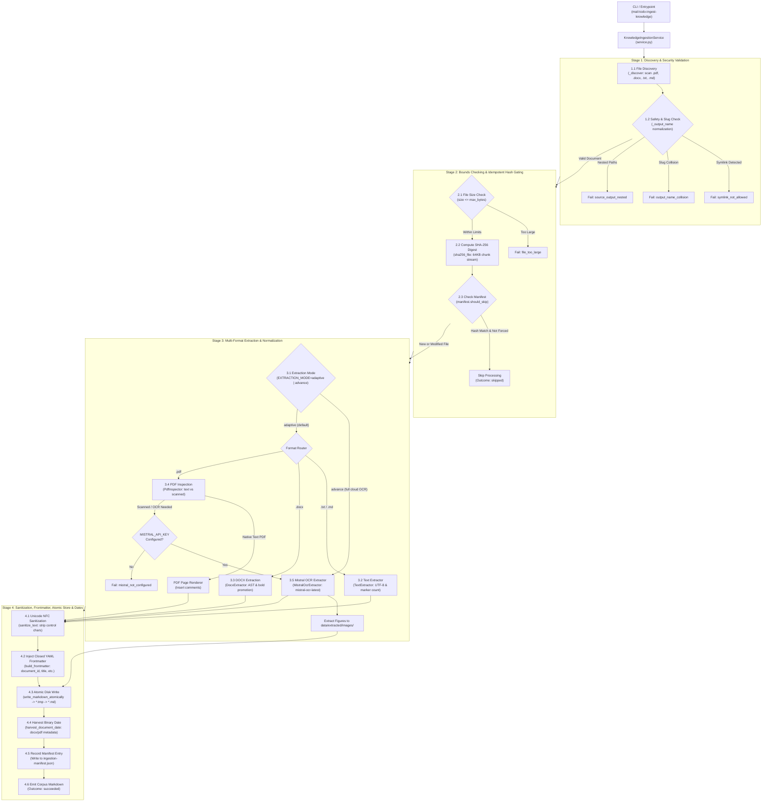
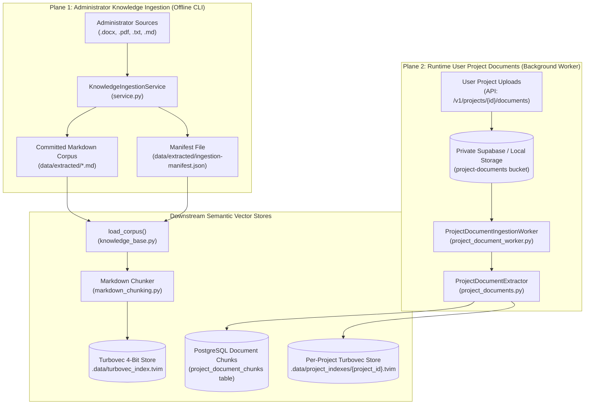

# Knowledge & Document Ingestion Pipeline (Level 1 Architecture)

**Architecture level:** Level 1 — Deep-Dive Ingestion Pipeline Architecture  
**Status:** Live / Implemented  
**Primary Owner:** `src/cowork_agent/integrations/knowledge_ingestion` & `src/cowork_agent/ingestion_cli.py`  
**Target Alignment:** Fully Aligned with [TARGET-ARCHITECTURE.md §1 & §3](../TARGET-ARCHITECTURE.md)

---

## 1. Subsystem Overview

The Knowledge & Document Ingestion Pipeline is an independent, deterministic processing subsystem responsible for document transformation across two decoupled ingestion planes:

1. **Administrator Company Knowledge Ingestion (Offline Batch Plane):** Converts administrator-supplied source documents (`.docx`, `.pdf`, `.txt`, `.md`) into standardized, sanitized Markdown files stored in `data/extracted/*.md` with closed 6-field YAML frontmatter, binary date harvesting, SHA-256 manifest tracking, and atomic persistence.
2. **User Project Document Ingestion (Runtime Plane):** Guarded runtime extraction for private user project uploads (`.docx`, `.pdf`) via [project_documents.py](../../../src/cowork_agent/integrations/knowledge_ingestion/project_documents.py) and [project_document_worker.py](../../../src/cowork_agent/orchestration/project_document_worker.py), producing page-bounded chunks (`page_start`, `page_end`) indexed into PostgreSQL and per-project Turbovec vector indexes ([ADR-007](../../../tasks/adr/ADR-007-project-scoped-classifier-gated-user-documents.md)).

> [!IMPORTANT]
> **Corpus Privacy & Decoupling Invariants:**
> - Email bodies and Gmail attachments are **never** ingested into knowledge stores ([ADR-003](../../../tasks/adr/ADR-003-defer-attachment-processing.md), [ADR-004](../../../tasks/adr/ADR-004-chat-native-task-episodes.md)).
> - The output Markdown corpus (`data/extracted/*.md`) serves as the authoritative, ground-truth knowledge base for Enterprise Semantic RAG (Turbovec).
> - User documents remain isolated in private storage and per-project vector stores, never entering the company corpus.

---

## 2. Key Components & Implementation Matrix

| Component | Path / Implementation | Level 1 Responsibility |
|---|---|---|
| **Ingestion CLI Entrypoint** | [ingestion_cli.py](../../../src/cowork_agent/ingestion_cli.py) | Exposes `mail-todo-ingest-knowledge` CLI for offline batch ingestion of company documents with `--source`, `--output`, `--force`, and `--dry-run` options. |
| **Ingestion Service Orchestrator** | [service.py](../../../src/cowork_agent/integrations/knowledge_ingestion/service.py) | `KnowledgeIngestionService`: Discovers files, enforces symlink & directory isolation, resolves slug collisions, coordinates hash gating, extraction, sanitization, frontmatter, and manifest records. |
| **DOCX Extractor** | [docx_extractor.py](../../../src/cowork_agent/integrations/knowledge_ingestion/docx_extractor.py) | `DocxExtractor`: Converts `.docx` headings, paragraphs, bullet/numbered lists, and tables to Markdown. Supports bold paragraph heading promotion via `StructureProfile`. |
| **PDF Inspector & Extractor** | [pdf_inspector.py](../../../src/cowork_agent/integrations/knowledge_ingestion/pdf_inspector.py) | `PdfInspector`: Classifies PDFs (`text_based`, `scanned`, `image_based`, `mixed`), extracts native text with `<!-- Page N -->` markers, and detects pages requiring OCR. |
| **Mistral OCR Extractor** | [ocr.py](../../../src/cowork_agent/integrations/knowledge_ingestion/ocr.py) | `MistralOcrExtractor`: Cloud OCR adapter using Mistral OCR API (`mistral-ocr-latest`). Handles OOXML zip header normalization (`normalize_ooxml`) and extracts figures to `images/`. |
| **Text & Markdown Extractor** | [text_extractor.py](../../../src/cowork_agent/integrations/knowledge_ingestion/text_extractor.py) | `TextExtractor`: Reads UTF-8 `.txt` and `.md` files, separates existing frontmatter, and calculates page counts from `<!-- Page N -->` markers. |
| **Text Sanitizer & Frontmatter** | [text_sanitizer.py](../../../src/cowork_agent/integrations/knowledge_ingestion/text_sanitizer.py) | `sanitize_text`, `build_frontmatter`, `split_frontmatter`, `resolve_title`: Unicode NFC normalization, control character stripping, closed 6-field YAML frontmatter encapsulation, and ATX H1 extraction. |
| **Date Harvester** | [date_harvest.py](../../../src/cowork_agent/integrations/knowledge_ingestion/date_harvest.py) | `harvest_document_date`: Extracts binary metadata creation/modification dates from `.docx` (CoreProperties) and `.pdf` (`/Info` dictionary `CreationDate`/`ModDate`) for RAG temporal filters. |
| **Manifest & Atomic Store** | [manifest.py](../../../src/cowork_agent/integrations/knowledge_ingestion/manifest.py) | `ManifestStore`: Tracks SHA-256 hashes, status, title, and dates in `ingestion-manifest.json`; guarantees atomic persistence via `.tmp` file writes and `fsync`. |
| **Project Document Extractor** | [project_documents.py](../../../src/cowork_agent/integrations/knowledge_ingestion/project_documents.py) | `ProjectDocumentExtractor`: Guarded extractor for private user project uploads, producing `ExtractedProjectDocumentChunk` with `page_start`, `page_end`, and `section`. |
| **Ingestion Domain Contracts** | [models.py](../../../src/cowork_agent/integrations/knowledge_ingestion/models.py) | Immutable data contracts: `IngestionOutcome`, `ManifestEntry`, `PdfInspection`, `PdfKind`, `OcrPage`, `ExtractionResult`. |

---

## 3. Ingestion Pipeline Execution Flow (AI Engineering View)

The offline ingestion pipeline processes unstructured documents through four deterministic execution stages:



---

### Core Execution Stage Breakdown

#### 1. Stage 1: Discovery & Security Validation
- **Path & Directory Verification:** `_validate_directories()` verifies that source and destination directories exist and prevents path traversal (ensuring output does not nest inside source or vice versa with `source_output_nested`).
- **Symlink Defense:** Discovered symlinks are rejected with `reason_code="symlink_not_allowed"` to prevent arbitrary file disclosure.
- **Slug Normalization & Collision Guard:** Relative file paths are normalized to lowercase ASCII slugs (`_output_name`). Any naming collisions across nested folders are detected early and rejected with `output_name_collision`.

#### 2. Stage 2: Bounds Checking & Idempotent Hash Gating (Incremental Sync)
- **Size Bounds:** Files exceeding `KNOWLEDGE_INGEST_MAX_BYTES` (default: 25 MB / 26,214,400 bytes) fail immediately with `file_too_large`.
- **Content Hashing:** Computes a streaming SHA-256 fingerprint (`sha256_file`) in 64 KB memory blocks.
- **Skip Evaluation:** Queries `ManifestStore` (`ingestion-manifest.json`). If the SHA-256 matches a previous successful run and `--force` is not set, processing is skipped (`outcome="skipped"`), avoiding redundant CPU and API calls.

#### 3. Stage 3: Multi-Format Extraction & Text Normalization
- **Adaptive Mode (`adaptive`, default):** Optimal blend of speed, $0 cost, and accuracy.
  - **Plain Text / Markdown (`.txt`, `.md`):** Extracted via [text_extractor.py](../../../src/cowork_agent/integrations/knowledge_ingestion/text_extractor.py). Drops any existing frontmatter and counts `<!-- Page N -->` markers.
  - **DOCX (`.docx`):** Local OpenXML AST parsing via [docx_extractor.py](../../../src/cowork_agent/integrations/knowledge_ingestion/docx_extractor.py). Headings with explicit styles (`Heading 1-3`), list items (`List Bullet`, `List Number`), and fully bold paragraphs matching legal structure profiles are converted to `#` ATX headings (< 15 ms). Tables are converted to standard Markdown grid tables.
  - **Digital PDF (`.pdf`):** Classified via [pdf_inspector.py](../../../src/cowork_agent/integrations/knowledge_ingestion/pdf_inspector.py) and native text is extracted per page. If page count exceeds `KNOWLEDGE_INGEST_MAX_PDF_PAGES` (default: 100), fails with `pdf_page_limit_exceeded`.
  - **Scanned / Mixed PDF:** Automatically escalated to `MistralOcrExtractor` when `MISTRAL_API_KEY` is configured (falls back to `mistral_not_configured` if unconfigured).
- **Advance Mode (`advance`):** Routes all PDF and DOCX files through Mistral OCR ([ocr.py](../../../src/cowork_agent/integrations/knowledge_ingestion/ocr.py)). Handles OOXML zip header normalization (`normalize_ooxml`), executes `mistral-ocr-latest`, and writes figure assets to `data/extracted/images/`.

#### 4. Stage 4: Sanitization, Frontmatter Wrapping, Atomic Persistence & Date Harvesting
- **NFC Body Sanitization:** [text_sanitizer.py](../../../src/cowork_agent/integrations/knowledge_ingestion/text_sanitizer.py) `sanitize_text` NFC-normalizes Unicode, strips non-whitelisted control characters (retaining `\n` and `\t`), and collapses 3+ consecutive newlines.
- **Title Resolution & YAML Frontmatter:** `resolve_title` finds the first ATX H1 (fallback: filename slug stem). `build_frontmatter` emits a closed 6-field header (`document_id`, `title`, `source_file`, `extractor`, `page_count`, `processed_at`).
- **Atomic File Writes:** Writes Markdown to a `.tmp` file, calls `fsync`, and atomically replaces the destination `.md` file, preventing partial/dirty reads by parallel vector indexers.
- **Binary Date Harvesting:** [date_harvest.py](../../../src/cowork_agent/integrations/knowledge_ingestion/date_harvest.py) `harvest_document_date` parses binary metadata creation/modification dates from `.docx` (CoreProperties) and `.pdf` (`/Info` dictionary `CreationDate`/`ModDate`) without executing untrusted macros.
- **Manifest Commit:** Updates `ingestion-manifest.json` with source path, SHA-256 digest, page count, extractor type (`docx`, `pdf_native`, `mistral_ocr`, `text`, `markdown`), title, harvested `document_date`, and ISO-8601 timestamp.

---

## 4. Pipeline Guardrails & Security Policies

1. **Symlink Rejection:** Any discovered symlink file is rejected immediately with `reason_code="symlink_not_allowed"` to prevent arbitrary file disclosure.
2. **Directory Boundary Validation:** `_validate_directories` blocks execution if output is inside source or source is inside output (`source_output_nested`), preventing infinite self-ingestion loops.
3. **Output Slug Normalization & Collision Guard:** Source paths are normalized to lowercase ASCII slugs (`_output_name`). If two distinct source paths collide, both are blocked with `output_name_collision`.
4. **File Size & Page Bound Limits:** Enforces `KNOWLEDGE_INGEST_MAX_BYTES` (25 MB) and `KNOWLEDGE_INGEST_MAX_PDF_PAGES` (100 pages) before heavy processing.
5. **Incremental SHA-256 Skipping:** Hashing before extraction skips unmutated files, preventing redundant external API quota consumption.
6. **Unicode NFC Normalization & Control Character Scrubbing:** `sanitize_text` scrubs malicious or malformed control characters while preserving Markdown formatting.
7. **Closed Frontmatter Isolation:** `build_frontmatter` wraps metadata in a closed 6-field block that [knowledge_base.py](../../../src/cowork_agent/integrations/rag/knowledge_base.py) `split_frontmatter` strips during RAG loading, ensuring frontmatter keys are never indexed as searchable chunk text.
8. **Atomic Write Guarantee:** Markdown content is written to `.tmp` files and flushed to disk before renaming, ensuring zero corrupt reads.
9. **OCR Guard & Auto-Escalation:** In `adaptive` mode, `PdfInspector` identifies scanned pages and escalates to Mistral OCR when credentials exist, or halts cleanly with `mistral_not_configured` without emitting corrupted text to the corpus.
10. **Isolated Binary Date Harvesting:** Metadata extraction in `date_harvest.py` parses raw PDF/DOCX bytes directly without evaluating document script engines or macros.

---

## 5. Dual Ingestion Planes & Downstream Vector RAG Integration



- **Plane 1 (Company Knowledge):** `load_corpus()` in [knowledge_base.py](../../../src/cowork_agent/integrations/rag/knowledge_base.py) reads `data/extracted/*.md`, strips frontmatter, parses `document_date` from `ingestion-manifest.json`, chunks text with [markdown_chunking.py](../../../src/cowork_agent/integrations/rag/markdown_chunking.py), and indexes into the 4-bit company Turbovec store ([turbovec_memory.py](../../../src/cowork_agent/integrations/rag/turbovec_memory.py)).
- **Plane 2 (User Documents):** [ProjectDocumentExtractor](../../../src/cowork_agent/integrations/knowledge_ingestion/project_documents.py) and [ProjectDocumentIngestionWorker](../../../src/cowork_agent/orchestration/project_document_worker.py) process private user uploads into page-bounded chunks, writing chunk text to PostgreSQL and publishing project `.tvim` vector snapshots to Supabase Private Storage.

---

## 6. CLI & Environment Configuration Reference

### CLI Command Options

```bash
# Ingest company knowledge documents into extracted markdown directory
uv run mail-todo-ingest-knowledge --source ./data/source --output ./data/extracted

# Force re-ingestion of all documents (bypassing SHA-256 skip check)
uv run mail-todo-ingest-knowledge --source ./data/source --output ./data/extracted --force

# Dry-run validation without writing files or updating manifest
uv run mail-todo-ingest-knowledge --source ./data/source --output ./data/extracted --dry-run
```

### Configuration Parameters ([config.py](../../../src/cowork_agent/config.py))

| Environment Variable | Default | Type | Description |
|---|---|---|---|
| `EXTRACTION_MODE` | `adaptive` | `str` | Mode selection: `adaptive` (fast local AST/native text with OCR escalation) or `advance` (all docs via Mistral OCR). |
| `KNOWLEDGE_INGEST_OCR_ENABLED` | `True` | `bool` | Whether OCR fallback is enabled for scanned documents. |
| `MISTRAL_API_KEY` | `""` | `str` | API key for Mistral AI OCR (`mistral-ocr-latest`). |
| `KNOWLEDGE_INGEST_MODEL` | `mistral-ocr-latest` | `str` | Model identifier for Mistral OCR extraction. |
| `KNOWLEDGE_INGEST_TIMEOUT_SECONDS` | `60` | `int` | Timeout in seconds for external OCR calls. |
| `KNOWLEDGE_INGEST_MAX_ATTEMPTS` | `3` | `int` | Retry limit for OCR API invocations. |
| `KNOWLEDGE_INGEST_MAX_BYTES` | `26214400` (25 MB) | `int` | Maximum allowed source file size in bytes. |
| `KNOWLEDGE_INGEST_MAX_PDF_PAGES` | `100` | `int` | Maximum page limit for single PDF ingestion. |
| `KNOWLEDGE_INGEST_MAX_OCR_PAGES` | `100` | `int` | Maximum page limit for single OCR job. |

---

## 7. Alignment & Diff vs Target Architecture

| System Aspect | Target Specification ([TARGET-ARCHITECTURE.md §1 & §3](../TARGET-ARCHITECTURE.md)) | Current Live Implementation | Diff / Variance Status |
|---|---|---|---|
| **Corpus Ingestion** | Offline CLI into `data/extracted/` with hash verification | `mail-todo-ingest-knowledge` CLI with SHA-256 manifest tracking and atomic persistence | **0 Diff — 100% Aligned** |
| **Supported Formats** | DOCX, PDF, Plain Text, and Markdown | AST DOCX parser with legal bold promotion, native PDF inspection, Mistral OCR fallback, UTF-8 text extractor | **0 Diff — 100% Aligned** |
| **User Document Extraction** | Shared native PDF/DOCX guards with page bounds | `ProjectDocumentExtractor` shared with `ProjectDocumentIngestionWorker` producing page-bounded chunks | **0 Diff — 100% Aligned** |
| **Corpus Privacy Boundary** | Raw email and attachments excluded from knowledge | Strictly enforced: email pipeline is stateless; attachment content is never ingested (ADR-003, ADR-004) | **0 Diff — 100% Aligned** |
| **Metadata & Date Filtering** | Binary date harvesting for temporal query filtering | `date_harvest.py` extracts ISO creation/modification dates recorded in manifest for RAG year/month filters | **0 Diff — 100% Aligned** |

