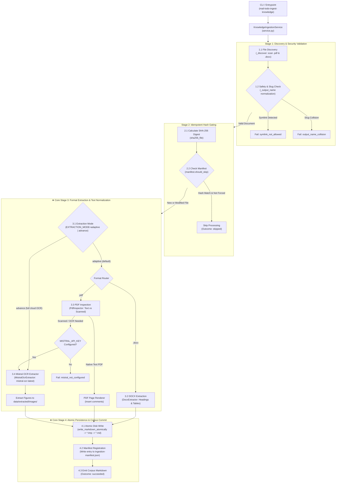
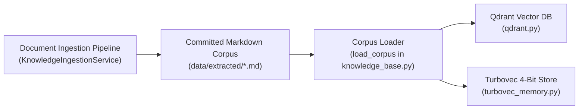

# Knowledge & Document Ingestion Pipeline (Level 1 Architecture)

**Architecture level:** Level 1 — Deep-Dive Ingestion Pipeline Architecture  
**Status:** Live / Implemented  
**Primary Owner:** `src/cowork_agent/integrations/knowledge_ingestion` & `src/cowork_agent/ingestion_cli.py`  
**Target Alignment:** Fully Aligned with [TARGET-ARCHITECTURE.md §1 & §3](file:///e:/VIN-INTERNSHIP/EMAIL-AGENT-v1/docs/architectures/TARGET-ARCHITECTURE.md)

---

## 1. Subsystem Overview

The Knowledge & Document Ingestion Pipeline is an independent, deterministic processing subsystem. It converts administrator-supplied source documents (`.docx`, `.pdf`) and user-uploaded project files into standardized, safe Markdown files with SHA-256 manifest tracking, atomic writes, and page-aware metadata.

The output Markdown corpus (`data/extracted/*.md`) serves as the authoritative ground-truth source for enterprise RAG vector stores (Qdrant and Turbovec).

---

## 2. Key Components & Implementation Matrix

| Component | Path / Implementation | Level 1 Responsibility |
|---|---|---|
| **Ingestion CLI Entrypoint** | [ingestion_cli.py](file:///e:/VIN-INTERNSHIP/EMAIL-AGENT-v1/src/cowork_agent/ingestion_cli.py) | Exposes `mail-todo-ingest-knowledge` CLI for offline batch ingestion of company documents. |
| **Ingestion Service Orchestrator** | [service.py](file:///e:/VIN-INTERNSHIP/EMAIL-AGENT-v1/src/cowork_agent/integrations/knowledge_ingestion/service.py) | `KnowledgeIngestionService`: Discovers files, checks symlinks, detects filename collisions, and manages extraction outcomes. |
| **DOCX Extractor** | [docx_extractor.py](file:///e:/VIN-INTERNSHIP/EMAIL-AGENT-v1/src/cowork_agent/integrations/knowledge_ingestion/docx_extractor.py) | `DocxExtractor`: Converts `.docx` headings, paragraphs, and tables into structured Markdown formatting. |
| **PDF Inspector & Extractor** | [pdf_inspector.py](file:///e:/VIN-INTERNSHIP/EMAIL-AGENT-v1/src/cowork_agent/integrations/knowledge_ingestion/pdf_inspector.py) | `PdfInspector`: Inspects PDF pages, extracts native text, detects scanned image pages, and enforces page bounds. |
| **Mistral OCR Extractor** | [ocr.py](file:///e:/VIN-INTERNSHIP/EMAIL-AGENT-v1/src/cowork_agent/integrations/knowledge_ingestion/ocr.py) | `MistralOcrExtractor`: Advanced mode extractor using Mistral OCR API (`mistral-ocr-latest`), normalizing OOXML archives and extracting figure assets. |
| **Manifest & Atomic Store** | [manifest.py](file:///e:/VIN-INTERNSHIP/EMAIL-AGENT-v1/src/cowork_agent/integrations/knowledge_ingestion/manifest.py) | `ManifestStore`: Tracks SHA-256 hashes in `ingestion-manifest.json`; performs atomic `.tmp` file writes. |
| **Project Document Extractor** | [project_documents.py](file:///e:/VIN-INTERNSHIP/EMAIL-AGENT-v1/src/cowork_agent/integrations/knowledge_ingestion/project_documents.py) | `ProjectDocumentExtractor`: Extracts user project upload files into page-bounded chunks (`page_start`, `page_end`). |
| **Ingestion Models** | [models.py](file:///e:/VIN-INTERNSHIP/EMAIL-AGENT-v1/src/cowork_agent/integrations/knowledge_ingestion/models.py) | Standardized domain models: `IngestionOutcome`, `ManifestEntry`, `PdfInspection`. |

---

## 3. Ingestion Pipeline Execution Flow (AI Engineering View)

The ingestion pipeline processes unstructured documents through four deterministic execution stages:

---

### Core Execution Stage Breakdown

#### 1. Stage 1: Discovery & Security Validation
- **Path Verification:** `_validate_directories()` prevents path traversal and ensures output directories do not nest within source directories.
- **Symlink Defense:** Discovered symlinks are rejected with `reason_code="symlink_not_allowed"` to prevent arbitrary file disclosure.
- **Slug Normalization & Collision Guard:** Source paths are slugified into standard ASCII filenames (`_output_name`). Duplicate slugs fail cleanly with `output_name_collision`.

#### 2. Stage 2: Idempotent Hash Gating (Incremental Sync)
- **Content Hashing:** Calculates SHA-256 fingerprint (`sha256_file`) of the raw source file.
- **Skip Evaluation:** Queries `ManifestStore` (`ingestion-manifest.json`). If the SHA-256 matches a previous run and `--force` is not set, processing is skipped (`outcome="skipped"`), avoiding redundant LLM/extraction calls.

#### 3. ★ Core Stage 3: Format Extraction & Text Normalization
- **Dual Extraction Modes (`EXTRACTION_MODE=adaptive|advance`):**
  - **Adaptive Mode (`adaptive`, default):** Optimal blend of speed, $0 cost, and accuracy.
    - DOCX: Local AST parsing ([docx_extractor.py](file:///e:/VIN-INTERNSHIP/EMAIL-AGENT-v1/src/cowork_agent/integrations/knowledge_ingestion/docx_extractor.py)) converting Word OpenXML headings and tables into Markdown (< 15 ms).
    - Digital PDF: Local native text extraction ([pdf_inspector.py](file:///e:/VIN-INTERNSHIP/EMAIL-AGENT-v1/src/cowork_agent/integrations/knowledge_ingestion/pdf_inspector.py)).
    - Scanned / Mixed PDF: Detected by `PdfInspector` and **automatically escalated** to `MistralOcrExtractor` when `MISTRAL_API_KEY` is configured (falls back to `mistral_not_configured` if unconfigured).
  - **Advance Mode (`advance`):** Routes all PDF and DOCX files through Mistral OCR ([ocr.py](file:///e:/VIN-INTERNSHIP/EMAIL-AGENT-v1/src/cowork_agent/integrations/knowledge_ingestion/ocr.py)). Handles OOXML zip header normalization (`normalize_ooxml`), calls `mistral-ocr-latest`, and writes figure assets to `data/extracted/images/`.

#### 4. ★ Core Stage 4: Atomic Persistence & Corpus Commit
- **Atomic File Writes:** Writes normalized Markdown to a `.tmp` file before renaming to the final `.md` file, guaranteeing zero dirty reads by parallel vector indexers.
- **Manifest Commit:** Updates `ingestion-manifest.json` with source path, SHA-256 digest, page count, extractor type (`docx`, `pdf_native`, or `mistral_ocr`), and ISO-8601 processing timestamp.
- **Corpus Output:** Generates clean Markdown files in `data/extracted/*.md` ready for chunking and vector embedding by Qdrant/Turbovec.

---

## 4. Pipeline Guardrails & Security Policies

1. **Symlink Rejection:** Any discovered symlink file is rejected immediately with `reason_code="symlink_not_allowed"` to prevent arbitrary file disclosure.
2. **Output Slug Normalization:** Source file paths are slugified into safe ASCII filenames (`_output_name`). If two input paths map to the same slug, both are blocked with `output_name_collision`.
3. **Incremental SHA-256 Skipping:** Before processing, source files are hashed (`sha256_file`). If `ingestion-manifest.json` contains a matching entry and `--force` is not set, extraction is skipped cleanly.
4. **Atomic Write Guarantee:** Markdown content is written to a `.tmp` file before being atomically renamed to the target filename, preventing partial reads by vector indexers.
5. **OCR Guard & Auto-Escalation:** In `adaptive` mode, `PdfInspector` identifies scanned pages and escalates to Mistral OCR when credentials exist, or halts with `mistral_not_configured` without emitting corrupted text to the corpus. In `advance` mode, Mistral OCR processes all files.

---

## 5. Downstream Integration with RAG Vector Stores

The output of the ingestion pipeline (`data/extracted/*.md`) is read by `load_corpus()` in `knowledge_base.py`. The resulting `KnowledgeChunk` records are indexed into Qdrant (`qdrant.py`) or Turbovec (`turbovec_memory.py`), establishing the complete ground-truth knowledge base for semantic RAG queries.
