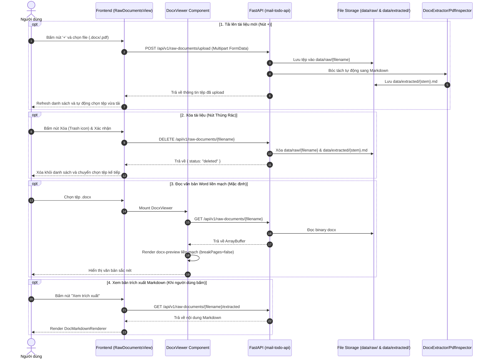

# DOCX Document Viewing Subsystem (Level 1 Architecture)

**Architecture level:** Level 1 — High-Level Component & Integration Flow  
**Status:** Live / Implemented (Lightweight Continuous In-Browser Viewer with Direct Upload & Delete)  
**Primary Owners:** [`frontend/src/dashboard/components/RawDocumentsView.tsx`](../../../frontend/src/dashboard/components/RawDocumentsView.tsx), [`frontend/src/dashboard/components/DocxViewer.tsx`](../../../frontend/src/dashboard/components/DocxViewer.tsx), [`src/cowork_agent/app.py`](../../../src/cowork_agent/app.py)  
**Target Alignment:** Fully Aligned with [TARGET-ARCHITECTURE.md](../TARGET-ARCHITECTURE.md)

---

## 1. Subsystem Overview & Mục Tiêu

Hệ thống **Hiển thị Tài liệu DOCX & Quản lý Tệp Thô** (DOCX Viewing & Raw Ingestion Subsystem) phục vụ việc tải lên, xóa, đọc và xem trước các văn bản quy trình định dạng Word (`.docx`, `.doc`) và `.pdf` lưu trữ tại `data/raw/` và trích xuất sang `data/extracted/`.

### Các đặc điểm chính:
1. **Nút Tải Lên `+` Tại Tiêu Đề Sidebar:** Cho phép tải trực tiếp tệp `.pdf`, `.docx`, `.doc` vào thư mục `data/raw/` qua API `POST /api/v1/raw-documents/upload`, tự động kích hoạt pipeline bóc tách sang Markdown tại `data/extracted/{filename}.md`.
2. **Nút Xóa Tài Liệu (Trash Icon):** Hiển thị nút xóa nhanh khi hover trên từng item tài liệu ở sidebar (chuẩn phong cách Artifacts) và trên thanh tiêu đề chính. API `DELETE /api/v1/raw-documents/{filename}` sẽ xóa tệp thô trong `data/raw/` và xóa tệp Markdown liên kết trong `data/extracted/`.
3. **Hiển Thị Mặc Định Liền Mạch (Continuous Scroll View):** Khi chọn tệp, hệ thống luôn mở chế độ xem trước (DocxViewer hoặc PDF iframe). Chỉ khi người dùng chủ động bấm **"Xem trích xuất"**, nội dung Markdown mới được tải và hiển thị.
4. **Hiệu Năng Vượt Trội:** Chi phí RAM **< 5 MB**, nạp tức thì **< 50ms**, 60 FPS mượt mà.

---

## 2. Kiến Trúc Luồng Dữ Liệu (Data Flow)

---

## 3. Các Thành Phần Chính & Mã Nguồn

| Thành phần | Vị trí mã nguồn | Trách nhiệm |
|---|---|---|
| **View Hub & Top Header** | [`RawDocumentsView.tsx`](../../../frontend/src/dashboard/components/RawDocumentsView.tsx) | Quản lý nút `+` upload tệp thô, nút xóa tệp thô, danh sách tệp `data/raw/`, điều phối on-demand giữa Preview và Markdown. |
| **Docx Viewer** | [`DocxViewer.tsx`](../../../frontend/src/dashboard/components/DocxViewer.tsx) | Component hiển thị DOCX liền mạch với thanh điều khiển tinh gọn (Zoom in/out, 100%, Khớp, Toàn màn hình). |
| **Upload & Delete Endpoints** | [`src/cowork_agent/app.py`](../../../src/cowork_agent/app.py) | `POST /api/v1/raw-documents/upload` và `DELETE /api/v1/raw-documents/{filename}`. |
| **Binary Stream Endpoints** | [`src/cowork_agent/app.py`](../../../src/cowork_agent/app.py) | `GET /api/v1/raw-documents/{filename}`, `GET /api/v1/raw-documents/{filename}/extracted`. |
