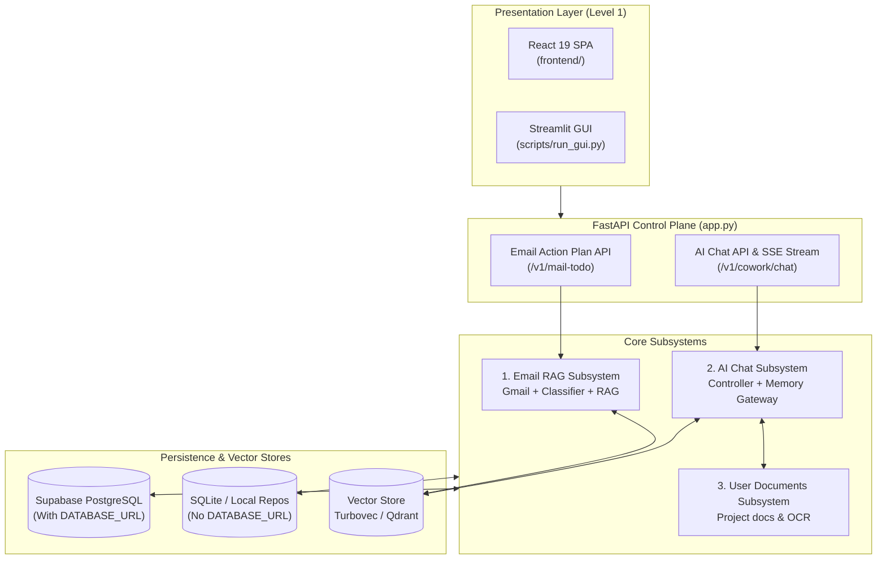

# System Architecture Dashboard & Status Tracker

**Architecture level:** Level 1 — High-Level Component & System Overview (Least Complexity)  
**Last Updated:** 2026-08-13  
**Target Reference:** [TARGET-ARCHITECTURE.md](file:///e:/VIN-INTERNSHIP/EMAIL-AGENT-v1/docs/architectures/TARGET-ARCHITECTURE.md)

---

## 1. System Overview Dashboard

The Cowork Agent project consists of two decoupled primary product flows operating over a unified control plane and persistence engine:
1. **Email Action Plan & RAG Subsystem (PRD-v1):** Stateless, single-turn digest pipeline extracting actionable items from unread Gmail messages, enriched by enterprise company knowledge RAG.
2. **AI Chat Assistant with Typed Memory (V2):** Multi-turn conversational interface backed by four distinct memory scopes (Short-term, Declarative Profile, Episodic, Semantic), chat-native task proposals ([ADR-004](file:///e:/VIN-INTERNSHIP/EMAIL-AGENT-v1/tasks/adr/ADR-004-chat-native-task-episodes.md)), and classifier-gated user project documents ([ADR-007](file:///e:/VIN-INTERNSHIP/EMAIL-AGENT-v1/tasks/adr/ADR-007-project-scoped-classifier-gated-user-documents.md)).

---

## 2. Live Module Status Matrix

| Module / Component | Implemented Scope | Status | Target Architecture Alignment | Authoritative Code Location |
|---|---|---|---|---|
| **Email Action Plan & RAG** | Single-turn Gmail extraction, route classification (`NO_ACTION`, `DIRECT_PLAN`, `RETRIEVE_RAG`), output validation | **Live / Implemented** | Fully Aligned ([TARGET-ARCHITECTURE.md §1 & §2](file:///e:/VIN-INTERNSHIP/EMAIL-AGENT-v1/docs/architectures/TARGET-ARCHITECTURE.md)) | [features/email_action_plan](file:///e:/VIN-INTERNSHIP/EMAIL-AGENT-v1/src/cowork_agent/features/email_action_plan) |
| **Enterprise RAG Store** | Vector & Hybrid retrieval over committed Markdown corpus (`data/extracted/*.md`) using Turbovec or Qdrant | **Live / Implemented** | Fully Aligned | [integrations/rag](file:///e:/VIN-INTERNSHIP/EMAIL-AGENT-v1/src/cowork_agent/integrations/rag) |
| **AI Chat Controller** | Multi-turn streaming chat, context assembly, intent classifier, chat reply generation | **Live / Implemented** | Fully Aligned ([TARGET-ARCHITECTURE.md §2](file:///e:/VIN-INTERNSHIP/EMAIL-AGENT-v1/docs/architectures/TARGET-ARCHITECTURE.md)) | [controller.py](file:///e:/VIN-INTERNSHIP/EMAIL-AGENT-v1/src/cowork_agent/features/ai_chat/controller.py) |
| **4-Type Memory Gateway** | Short-term buffer, Long-term profile, Episodic memory (`TaskEpisodes`), Semantic company memory | **Live / Implemented** | Fully Aligned ([ADR-004](file:///e:/VIN-INTERNSHIP/EMAIL-AGENT-v1/tasks/adr/ADR-004-chat-native-task-episodes.md)) | [memory_gateway.py](file:///e:/VIN-INTERNSHIP/EMAIL-AGENT-v1/src/cowork_agent/features/ai_chat/memory_gateway.py) |
| **User Documents Subsystem** | Project document upload, extraction/OCR, vector indexing, classifier gating | **Live / Implemented** | Fully Aligned ([TARGET-ARCHITECTURE.md §3](file:///e:/VIN-INTERNSHIP/EMAIL-AGENT-v1/docs/architectures/TARGET-ARCHITECTURE.md) & [ADR-007](file:///e:/VIN-INTERNSHIP/EMAIL-AGENT-v1/tasks/adr/ADR-007-project-scoped-classifier-gated-user-documents.md)) | [project_documents.py](file:///e:/VIN-INTERNSHIP/EMAIL-AGENT-v1/src/cowork_agent/integrations/rag/project_documents.py) |
| **Control Plane & Auth** | FastAPI app lifespans, Google OAuth flow, `VerifiedPrincipal`, security policies | **Live / Implemented** | Fully Aligned | [app.py](file:///e:/VIN-INTERNSHIP/EMAIL-AGENT-v1/src/cowork_agent/app.py) & [identity.py](file:///e:/VIN-INTERNSHIP/EMAIL-AGENT-v1/src/cowork_agent/identity.py) |
| **Dual Persistence Engine** | Dynamic switching between SQLite/In-memory local mode and Supabase Postgres mode | **Live / Implemented** | Fully Aligned | [repositories](file:///e:/VIN-INTERNSHIP/EMAIL-AGENT-v1/src/cowork_agent/persistence/repositories) |
| **Presentation Layers** | Production React 19 Vite SPA & Developer Streamlit GUI | **Live / Implemented** | Fully Aligned | [frontend/](file:///e:/VIN-INTERNSHIP/EMAIL-AGENT-v1/frontend) & [gui/](file:///e:/VIN-INTERNSHIP/EMAIL-AGENT-v1/src/cowork_agent/gui) |

---

## 3. Architecture Diff Matrix (Current Implementation vs TARGET-ARCHITECTURE.md)

| System Aspect | Target Specification ([TARGET-ARCHITECTURE.md](file:///e:/VIN-INTERNSHIP/EMAIL-AGENT-v1/docs/architectures/TARGET-ARCHITECTURE.md)) | Current Live Implementation | Diff / Variance Status |
|---|---|---|---|
| **Email & Chat Decoupling** | Standalone stateless Email Agent; AI Chat has no email tool interface | Standalone Email Agent; AI Chat has no email tool interface. Email & Chat are strictly decoupled. | **0 Diff — 100% Aligned** |
| **TaskEpisode Lifecycle** | Tasks proposed in chat start `retrieval_eligible=false` until explicit user approval | `episode_policy.py` sets `retrieval_eligible=false` for system-generated TaskEpisodes. | **0 Diff — 100% Aligned ([ADR-004](file:///e:/VIN-INTERNSHIP/EMAIL-AGENT-v1/tasks/adr/ADR-004-chat-native-task-episodes.md))** |
| **Company RAG Corpus** | Knowledge provider reading company corpus; copied chunks forbidden in persistent task outputs | Company RAG reads `data/extracted/*.md` via Turbovec/Qdrant; citations stored as coordinates only. | **0 Diff — 100% Aligned** |
| **User Document Security** | Project-scoped user documents gated behind intent classifier | User documents subsystem gated under `USER_DOCUMENTS_ENABLED` with classifier service. | **0 Diff — 100% Aligned ([ADR-007](file:///e:/VIN-INTERNSHIP/EMAIL-AGENT-v1/tasks/adr/ADR-007-project-scoped-classifier-gated-user-documents.md))** |
| **Persistence Flexibility** | Production Supabase Postgres with robust local development fallback | Supports local SQLite + In-Memory repositories when `DATABASE_URL` is absent; Postgres when present. | **0 Diff — 100% Aligned** |
| **Architecture Documentation** | Level 1 & Level 2 live architecture docs reflect actual running system | Dashboard & sub-module docs updated to cover live Email RAG, Chat, Memory, and UIs. | **Documentation Up-to-Date** |

---

## 4. Sub-Module Level 1 Architecture References

For detailed Level 1 component boundaries, sequence flows, and data contracts, refer to the individual module documents:

1. **[01-email-action-plan-and-rag.md](file:///e:/VIN-INTERNSHIP/EMAIL-AGENT-v1/docs/architectures/current-architectures/01-email-action-plan-and-rag.md):** Single-turn Email Action Plan workflow, Gmail OAuth adapter, classification routing, and enterprise RAG memory integration.
2. **[02-ai-chat-and-typed-memory.md](file:///e:/VIN-INTERNSHIP/EMAIL-AGENT-v1/docs/architectures/current-architectures/02-ai-chat-and-typed-memory.md):** Multi-turn AI Chat Controller, 4 typed memory subsystems (`MemoryGateway`), chat-native `TaskEpisode` lifecycle, and classifier-gated User Documents.
3. **[03-control-plane-persistence-and-uis.md](file:///e:/VIN-INTERNSHIP/EMAIL-AGENT-v1/docs/architectures/current-architectures/03-control-plane-persistence-and-uis.md):** FastAPI control plane, identity resolution, SQLite vs Supabase PostgreSQL persistence, background worker orchestration, and React 19 / Streamlit UIs.
4. **[04-historical-overall-architecture.md](file:///e:/VIN-INTERNSHIP/EMAIL-AGENT-v1/docs/architectures/current-architectures/04-historical-overall-architecture.md):** Historical pre-RAG extraction snapshot (commit `cf2fd498`).
5. **[05-historical-rag-architecture.md](file:///e:/VIN-INTERNSHIP/EMAIL-AGENT-v1/docs/architectures/current-architectures/05-historical-rag-architecture.md):** Historical RAG component evaluation snapshot.

> [!NOTE]
> Historical extraction files ([04-historical-overall-architecture.md](file:///e:/VIN-INTERNSHIP/EMAIL-AGENT-v1/docs/architectures/current-architectures/04-historical-overall-architecture.md) and [05-historical-rag-architecture.md](file:///e:/VIN-INTERNSHIP/EMAIL-AGENT-v1/docs/architectures/current-architectures/05-historical-rag-architecture.md)) are retained for audit trail but are superseded by this Dashboard and sub-module documents 01–03.

