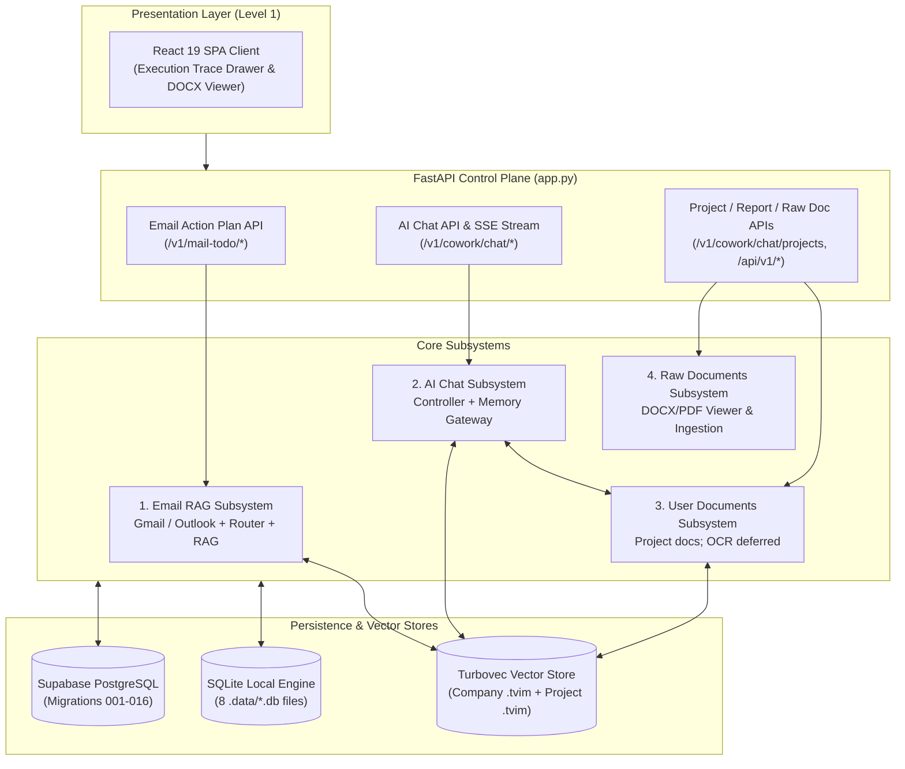

# System Architecture Dashboard & Status Tracker

**Architecture level:** Level 1 — High-Level Component & System Overview (Least Complexity)  
**Last Updated:** 2026-08-25  
**Target Reference:** [TARGET-ARCHITECTURE.md](../TARGET-ARCHITECTURE.md)

---

## 1. System Overview Dashboard

The Cowork Agent project consists of two primary product flows operating over a unified control plane and persistence engine:
1. **Email Action Plan & RAG Subsystem (PRD-v1):** Standalone, single-turn, memory-free digest over unread Gmail (`gmail.readonly`) or SQLite-linked Outlook (`Mail.Read`), with one provider-neutral route resolver (`NO_ACTION` / `DIRECT_PLAN` / `RETRIEVE_RAG`) and optional company RAG. The React UI dispatches mail scans and persists one `MailScanSummary` card; mail is not an AI Chat tool.
2. **AI Chat Assistant with Typed Memory (V2):** Multi-turn SSE chat with four memory scopes, live reasoning streaming, execution trace inspector, report artifact generation, chat-native `TaskEpisode` proposals (with `supersedes` support, [ADR-004](../../../tasks/adr/ADR-004-chat-native-task-episodes.md)), and classifier-gated project documents ([ADR-007](../../../tasks/adr/ADR-007-project-scoped-classifier-gated-user-documents.md)). Company RAG in chat is flag-gated (`CHAT_COMPANY_RAG_ENABLED`, default false).

---

## 2. Live Module Status Matrix

| Module / Component | Implemented Scope | Status | Target Architecture Alignment | Authoritative Code Location |
|---|---|---|---|---|
| **Email Action Plan & RAG** | Unread Gmail or SQLite-linked Outlook; provider-neutral route resolver, attachment presence only, body-free plans | **Live / Implemented** | Aligned; Outlook is an additive variance | [`features/email_action_plan`](../../../src/cowork_agent/features/email_action_plan) |
| **Enterprise RAG Store** | Hybrid Turbovec + BM25 + RRF over committed `data/extracted/*.md` | **Live / Implemented** | Fully Aligned | [`integrations/rag`](../../../src/cowork_agent/integrations/rag) |
| **AI Chat Controller** | Multi-turn SSE chat with reasoning traces, report artifacts, and `MailScanSummary` cards | **Live / Implemented** | Mostly Aligned | [`controller.py`](../../../src/cowork_agent/features/ai_chat/controller.py) |
| **4-Type Memory Gateway** | Short-term, declarative, episodic (with `supersedes`), and flag-gated semantic memory | **Live / Implemented** | Mostly Aligned | [`memory_gateway.py`](../../../src/cowork_agent/features/ai_chat/memory_gateway.py) |
| **User Documents Subsystem** | Project-scoped upload, index, and retrieval | **Live / Implemented** | Mostly Aligned | [`project_documents.py`](../../../src/cowork_agent/integrations/rag/project_documents.py) |
| **Document Ingestion Pipeline** | Offline document conversion and committed Markdown generation | **Live / Implemented** | Fully Aligned | [`knowledge_ingestion`](../../../src/cowork_agent/integrations/knowledge_ingestion) |
| **DOCX Viewing & Raw Ingestion** | In-browser Word/PDF viewer and direct upload | **Live / Implemented** | Fully Aligned | [`frontend/`](../../../frontend) |
| **Control Plane & Auth** | Google identity plus linked Microsoft OAuth with PKCE; Langfuse tracing; Outlook is SQLite-only | **Live / Implemented** | Aligned on identity and decoupling | [`app.py`](../../../src/cowork_agent/app.py) |
| **Dual Persistence Engine** | SQLite local mode and Supabase Postgres mode (migrations 001–016) | **Live / Implemented** | Fully Aligned | [`repositories`](../../../src/cowork_agent/persistence/repositories) |
| **Presentation Layers** | React 19 + Vite + Tailwind 4 SPA (Execution Trace Drawer, Live Reasoning, Report Artifacts, DOCX Viewer/Editor) | **Live / Implemented** | Fully Aligned | [`frontend/`](../../../frontend) |

---

## 3. Architecture Diff Matrix (Current Implementation vs TARGET-ARCHITECTURE.md)

| System Aspect | Target Specification ([TARGET-ARCHITECTURE.md](../TARGET-ARCHITECTURE.md)) | Current Live Implementation | Diff / Variance Status |
|---|---|---|---|
| **Email & Chat Decoupling** | Standalone stateless Email Agent; AI Chat remains decoupled | The frontend recognizes `@email`, `@outlook`, and `@mail`, starts provider runs outside the AI Chat tool loop, and persists one body-free summary card. | **0 workflow-boundary diff** |
| **Mailbox providers** | Gmail is the documented source | Gmail plus linked Microsoft Graph mailboxes share an envelope and workflow. Outlook is disabled in both Postgres modes and requires no migration. | **Additive variance — Outlook is SQLite-only** |
| **TaskEpisode Lifecycle** | Tasks proposed in chat start `retrieval_eligible=false` until explicit user approval | Created only on explicit task requests; eligibility follows validation; supports `supersedes` linking. | **0 Diff — aligned with [ADR-004](../../../tasks/adr/ADR-004-chat-native-task-episodes.md)** |
| **Company RAG Corpus** | Knowledge provider; copied chunks forbidden in persistent task outputs; chat retrieval flag-gated | Turbovec hybrid over `data/extracted/*.md`; citations are coordinates. Chat-side read gated by `CHAT_COMPANY_RAG_ENABLED` (default false). Retired `qdrant` degrades to null memory. | **0 Diff — 100% Aligned** |
| **User Document Security** | Project-scoped documents; classifier is sole route origin; OCR deferred | Project API + classifier + readiness gate. OCR-required PDFs fail `ocr_unavailable`. Store is Postgres chunks + per-project `.tvim` with no company-index fallback. | **Mostly Aligned ([ADR-007](../../../tasks/adr/ADR-007-project-scoped-classifier-gated-user-documents.md))** — live path is `/v1/cowork/chat/projects/{project_id}/documents` |
| **Turn orchestration** | Small graph `classify → retrieve → assemble → generate → persist` | Same sequence lives in `ChatController.stream_message`. `features/ai_chat/graph/` exists but is not composed in `app.py`. | **Implementation variance — graph unused** |
| **Persistence Flexibility** | Production Postgres; Redis or in-process short-term | SQLite persists local chat sessions/history/profile/task episodes and project-document metadata/chunks across 8 local `.db` files; short-term remains in-process. Durable cloud Postgres uses migrations 001–016. | **Mostly Aligned** — Redis unused; local and cloud data are separate |
| **Observability & Tracing** | Standard application logging | Centralized Langfuse tracing provides span-level and generation-level observability across chat controller, LLM provider calls, and memory retrieval without leaking raw email bodies. | **Additive capability — fully instrumented** |
| **Architecture Documentation** | Level 1 docs reflect the running system | All 7 subsystem modules (01–07) and dashboard audited and synchronized on 2026-08-25. | **0 Diff — 100% Synced** |

---

## 4. Sub-Module Level 1 Architecture References

For detailed Level 1 component boundaries, sequence flows, and data contracts, refer to the individual module documents:

1. **[01-email-action-plan-and-rag.md](01-email-action-plan-and-rag.md):** Provider-neutral Email Action Plan workflow, Gmail/Outlook adapters, route resolver, and company Turbovec hybrid RAG.
2. **[02-ai-chat-and-typed-memory.md](02-ai-chat-and-typed-memory.md):** Multi-turn Chat Controller, typed memories, chat-native task lifecycle, reasoning trace inspector, and classifier-gated project documents.
3. **[03-control-plane-persistence-and-uis.md](03-control-plane-persistence-and-uis.md):** FastAPI control plane, identity, SQLite versus Supabase Postgres (migrations 001–016), mail worker, and React SPA.
4. **[04-overall-architecture.md](04-overall-architecture.md):** Overall system architecture, product flows, and state/control ownership.
5. **[05-rag-architecture.md](05-rag-architecture.md):** Enterprise RAG and vector-memory architecture.
6. **[06-knowledge-and-document-ingestion-pipeline.md](06-knowledge-and-document-ingestion-pipeline.md):** Document ingestion pipeline.
7. **[07-docx-document-viewing-and-editing.md](07-docx-document-viewing-and-editing.md):** DOCX viewing and editing subsystem.

> [!NOTE]
> All architecture modules in `docs/architectures/current-architectures/` are verified against live code and synchronized with [TARGET-ARCHITECTURE.md](../TARGET-ARCHITECTURE.md).
